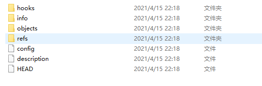
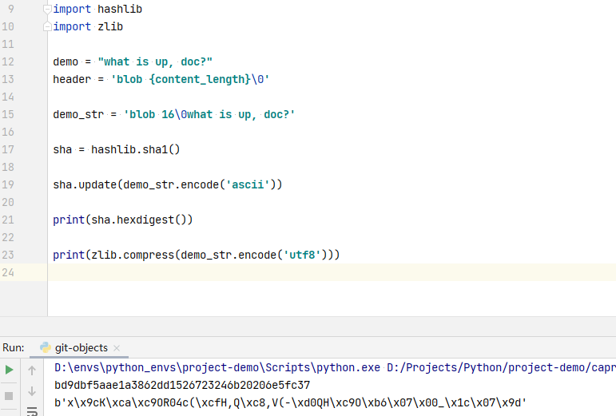

## 1. FQA ##

### 查看已暂存和未暂存的修改 ###

查看未暂存的文件的修改(不包括未跟踪的文件)：

```shell
$ git diff
diff --git a/file1.txt b/file1.txt
index f164b71..808cf05 100644
--- a/file1.txt
+++ b/file1.txt
@@ -1,3 +1,4 @@
 hello world
 hello world
+hello world
```

 `git diff --staged`   `git diff --cached` 这条命令将比对已暂存文件与最后一次提交的文件差异：

```shell
$ git diff --staged
diff --git a/file1.txt b/file1.txt
new file mode 100644
index 0000000..f164b71
--- /dev/null
+++ b/file1.txt
@@ -0,0 +1,3 @@
+hello world
+hello world
+

```

### 移除文件 ###

从暂存区移除文件： `git rm`

```shell
Liberty@LAPTOP-P85CKKBA MINGW64 ~/Downloads/packages/timeline-20210414/git-demo (master)
$ git rm file1.txt
rm 'file1.txt'

Liberty@LAPTOP-P85CKKBA MINGW64 ~/Downloads/packages/timeline-20210414/git-demo (master)
$ git status
On branch master
Changes to be committed:
  (use "git restore --staged <file>..." to unstage)
        deleted:    file1.txt


Liberty@LAPTOP-P85CKKBA MINGW64 ~/Downloads/packages/timeline-20210414/git-demo (master)
$ git diff

Liberty@LAPTOP-P85CKKBA MINGW64 ~/Downloads/packages/timeline-20210414/git-demo (master)
$ git diff --cached
diff --git a/file1.txt b/file1.txt
deleted file mode 100644
index 808cf05..0000000
--- a/file1.txt
+++ /dev/null
@@ -1,4 +0,0 @@
-hello world
-hello world
-hello world
-
```

**另一种情况：把文件从git仓库中删除，但仍然希望保留在当前工作目录中** `git rm --cached [filename]`

### git log 的用法 ###

```shell
Liberty@LAPTOP-P85CKKBA MINGW64 ~/Downloads/packages/timeline-20210414/git-demo (master)
$ git log -p -2
commit fe2ddd087ee22c4ab3a58eff4c1e27b5c4bfa5a2 (HEAD -> master)
Author: yunk <1052433260@qq.com>
Date:   Wed Apr 14 20:05:15 2021 +0800

    update gitignore

diff --git a/.gitignore b/.gitignore
index f7b7d41..9230a88 100644
--- a/.gitignore
+++ b/.gitignore
@@ -141,3 +141,5 @@ cython_debug/

 .idea/
 *.iml
+
+BigFile.txt

commit 403566622121ba571ca3b49823fafe9e0a0d1b91
Author: yunk <1052433260@qq.com>
Date:   Wed Apr 14 20:03:38 2021 +0800

    not track Bigfile

diff --git a/BigFile.txt b/BigFile.txt
deleted file mode 100644
index 6907c67..0000000
--- a/BigFile.txt
+++ /dev/null
@@ -1 +0,0 @@
-a big file

Liberty@LAPTOP-P85CKKBA MINGW64 ~/Downloads/packages/timeline-20210414/git-demo (master)
$ git log --stat -2
commit fe2ddd087ee22c4ab3a58eff4c1e27b5c4bfa5a2 (HEAD -> master)
Author: yunk <1052433260@qq.com>
Date:   Wed Apr 14 20:05:15 2021 +0800

    update gitignore

 .gitignore | 2 ++
 1 file changed, 2 insertions(+)

commit 403566622121ba571ca3b49823fafe9e0a0d1b91
Author: yunk <1052433260@qq.com>
Date:   Wed Apr 14 20:03:38 2021 +0800

    not track Bigfile

 BigFile.txt | 1 -
 1 file changed, 1 deletion(-)

Liberty@LAPTOP-P85CKKBA MINGW64 ~/Downloads/packages/timeline-20210414/git-demo (master)
$ git log --pretty=oneline -2
fe2ddd087ee22c4ab3a58eff4c1e27b5c4bfa5a2 (HEAD -> master) update gitignore
403566622121ba571ca3b49823fafe9e0a0d1b91 not track Bigfile

Liberty@LAPTOP-P85CKKBA MINGW64 ~/Downloads/packages/timeline-20210414/git-demo (master)
$ git log --pretty=format:"%h - %an, %ar : %s"
fe2ddd0 - yunk, 3 minutes ago : update gitignore
4035666 - yunk, 5 minutes ago : not track Bigfile
455b35d - yunk, 6 minutes ago : add a big file
8d4fa5f - yunk, 14 minutes ago : this is a commit for something
676fa8d - yunk, 25 minutes ago : init project

Liberty@LAPTOP-P85CKKBA MINGW64 ~/Downloads/packages/timeline-20210414/git-demo (master)
$ git log --pretty=format:"%h %s" --graph
* fe2ddd0 update gitignore
* 4035666 not track Bigfile
* 455b35d add a big file
* 8d4fa5f this is a commit for something
* 676fa8d init project
```

### 撤销操作 ###

撤销暂存的文件: `git reset HEAD <file>...`

撤销对文件的修改： `git checkout -- <file>`

### 远程仓库 ###

查看远程仓库： `git remote -v`

添加远程仓库： `git remote add <shortname> <url>`

从远程仓库中抓取： `git fetch <remote>`

推送到远程仓库： `git push <remote> <branch>`

查看某个远程仓库的详细信息： `git remote show origin`

### 文件标注 ###

```shell
$ git blame -L 1,2 file1.txt
980d2569 (yunk 2021-04-14 21:18:46 +0800 1) 在进行提交操作时，Git 会保存一个提交对象（commit object）。
980d2569 (yunk 2021-04-14 21:18:46 +0800 2) 知道了 Git 保存数据的方式，我们可以很自然的想到——该提交对象会包含一个指向暂存内容快照的指针。

```

## 2. 分支 ##

当提交三个文件时，且文件都在根路径下面时，git中对象的结构为：

五个对象：三个 *blob* 对象（保存着文件快照）、一个 **树** 对象 （记录着目录结构和 blob 对象索引）以及一个 **提交** 对象（包含着指向前述树对象的指针和所有提交信息）。


Git 的分支，其实本质上仅仅是指向提交对象的可变指针。 Git 的默认分支名字是 `master`。 在多次提交操作之后，你其实已经有一个指向最后那个提交对象的 `master` 分支。 `master` 分支会在每次提交时自动向前移动。


### 分支的创建 ###

`git branch <branch_name>`

当执行该命令时，git会在当前的提交对象上创建一个指针，指向该提交对象。


那么，Git 又是怎么知道当前在哪一个分支上呢？ 也很简单，它有一个名为 `HEAD` 的特殊指针。 请注意它和许多其它版本控制系统（如 Subversion 或 CVS）里的 `HEAD` 概念完全不同。 在 Git 中，它是一个指针，指向当前所在的本地分支（译注：将 `HEAD` 想象为当前分支的别名）。 


使用 `git log` 命令查看各个分支当前所指的对象。 

```shell
$ git log --oneline --decorate
8002d09 (HEAD -> dev1) update file1
980d256 (master) add new files
fe2ddd0 (origin/master) update gitignore
4035666 not track Bigfile
455b35d add a big file
8d4fa5f this is a commit for something
676fa8d init project
```

### 分支切换 ###

`git checkout  <branch_name>`

移动 `HEAD` 指针的指向。HEAD会随着提交操作自动向前移动。

**查看分叉历史**

```shell
$ git log --oneline --decorate --graph --all
* 71ab65a (HEAD -> master) modify file2
| * 8002d09 (dev1) update file1
|/
* 980d256 add new files
* fe2ddd0 (origin/master) update gitignore
* 4035666 not track Bigfile
* 455b35d add a big file
* 8d4fa5f this is a commit for something
* 676fa8d init project
```

创建新分支并切换过去： `git checkout  -b <new_branch>`

### 分支的合并 ###

```shell
$ git merge hotfix
Updating 763b82c..1428611
Fast-forward
 file1.txt | 2 ++
 1 file changed, 2 insertions(+)
```

1.当你试图合并两个分支时， 如果顺着一个分支走下去能够到达另一个分支，那么 Git 在合并两者的时候， 只会简单的将指针向前推进（指针右移），因为这种情况下的合并操作没有需要解决的分歧——这就叫做 “**快进（fast-forward）**”。

2.另一种种情况下，你的开发历史从一个更早的地方开始**分叉开来（diverged）**。 因为，`master` 分支所在提交并不是 `iss53` 分支所在提交的直接祖先，Git 不得不做一些额外的工作。 出现这种情况的时候，Git 会使用两个分支的末端所指的快照（`C4` 和 `C5`）以及这两个分支的公共祖先（`C2`），做一个简单的三方合并。


Figure 24. 一次典型合并中所用到的三个快照

和之前将分支指针向前推进所不同的是，Git 将此次三方合并的结果做了一个新的快照并且自动创建一个新的提交指向它。 这个被称作一次合并提交，它的特别之处在于他有不止一个父提交。


**冲突问题**：如果你在两个不同的分支中，对同一个文件的同一个部分进行了不同的修改，Git 就没法干净的合并它们。 

### 分支管理 ###

查看分支的最后一次提交：

```shell
$ git branch -v
* master f37a8a4 Merge branch 'dev1'
```

`--merged` 与 `--no-merged` 这两个有用的选项可以过滤这个列表中已经合并或尚未合并到当前分支的分支。

```shell
Liberty@LAPTOP-P85CKKBA MINGW64 ~/Downloads/packages/timeline-20210414/git-demo (master)
$ git branch --merged
  dev1
* master

Liberty@LAPTOP-P85CKKBA MINGW64 ~/Downloads/packages/timeline-20210414/git-demo (master)
$ git branch --no-merged
  dev2
```

 `-D` 强制删除分支。

### 远程分支 ###

可以通过 `git ls-remote <remote>` 来显式地获得远程引用的完整列表， 或者通过 `git remote show <remote>` 获得远程分支的更多信息。

**远程跟踪分支是远程分支状态的引用**。它们是你**无法移动的本地引用**。一旦你进行了网络通信， Git 就会为你移动它们以精确反映远程仓库的状态。请将它们看做书签， 这样可以提醒你该分支在远程仓库中的位置就是你**最后一次连接到它们的位置**。以 `remote/branch` 的形式命名。


```shell
Liberty@LAPTOP-P85CKKBA MINGW64 ~/Downloads/packages/timeline-20210414/git-demo (master)
$ git fetch origin
remote: Enumerating objects: 4, done.
remote: Counting objects: 100% (4/4), done.
remote: Compressing objects: 100% (2/2), done.
remote: Total 3 (delta 1), reused 0 (delta 0), pack-reused 0
Unpacking objects: 100% (3/3), 281 bytes | 40.00 KiB/s, done.
From https://gitee.com/libyao/git-demo
   55e9325..640d785  master     -> origin/master

Liberty@LAPTOP-P85CKKBA MINGW64 ~/Downloads/packages/timeline-20210414/git-demo (master)
$ git merge origin/master
Updating 55e9325..640d785
Fast-forward
 file_demo.txt | 1 +
 1 file changed, 1 insertion(+)
 create mode 100644 file_demo.txt

```

**推送分支**

`git push <remote> <branch>`

**远程分支的相关操作**

创建远程跟踪分支： 

`git checkout -b serverfix origin/serverfix`

`git checkout --track origin/serverfix`

从一个远程跟踪分支检出一个本地分支会自动创建所谓的“跟踪分支”（它跟踪的分支叫做“上游分支”）。 跟踪分支是与远程分支有直接关系的本地分支。 如果在一个跟踪分支上输入 `git pull`，Git 能自动地识别去哪个服务器上抓取、合并到哪个分支。

设置已有的本地分支跟踪一个刚刚拉取下来的远程分支，或者想要修改正在跟踪的上游分支， 你可以在任意时间使用 `-u` 或 `--set-upstream-to` 选项运行 `git branch` 来显式地设置。

**更改本地对远程分支的追踪**

`git branch -u origin/serverfix`

```shell
$ git branch -a
  dev1
  dev2
* master
  remotes/origin/dev1
  remotes/origin/dev2
  remotes/origin/feature/demo1
  remotes/origin/master

Liberty@LAPTOP-P85CKKBA MINGW64 ~/Downloads/packages/timeline-20210414/git-demo (master)
$ git checkout dev1
Switched to branch 'dev1'

Liberty@LAPTOP-P85CKKBA MINGW64 ~/Downloads/packages/timeline-20210414/git-demo (dev1)
$ git branch -u origin/dev1
Branch 'dev1' set up to track remote branch 'dev1' from 'origin'.
```

### 分支变基 rebase ###


其实，还有一种方法：你可以提取在 `C4` 中引入的补丁和修改，然后在 `C3` 的基础上应用一次。 在 Git 中，这种操作就叫做 **变基（rebase）**。 你可以使用 `rebase` 命令将提交到某一分支上的所有修改都移至另一分支上，就好像“重新播放”一样。

在这个例子中，你可以检出 `experiment` 分支，然后将它变基到 `master` 分支上：

```console
$ git checkout experiment
$ git rebase master
First, rewinding head to replay your work on top of it...
Applying: added staged command
```

它的原理是首先找到这两个分支（即当前分支 `experiment`、变基操作的目标基底分支 `master`） 的最近共同祖先 `C2`，然后对比当前分支相对于该祖先的历次提交，提取相应的修改并存为临时文件， 然后将当前分支指向目标基底 `C3`, 最后以此将之前另存为临时文件的修改依序应用。 （译注：写明了 commit id，以便理解，下同）


现在回到 `master` 分支，进行一次快进合并。

```console
$ git checkout master
$ git merge experiment
```


## 3. git 工具 ##

### 选择修订版本 ###

```shell
$ git show c69643a0c4915
commit c69643a0c49150cb89544bf5d0853cfc66bdf06a
Author: yunk <1052433260@qq.com>
Date:   Wed Apr 14 21:54:15 2021 +0800

    add file5

diff --git a/file5.txt b/file5.txt
new file mode 100644
index 0000000..a1a1a7b
--- /dev/null
+++ b/file5.txt
@@ -0,0 +1 @@
+this is file5
\ No newline at end of file

```

```shell
$ git log --abbrev-commit --pretty=oneline
5ed11c3 (HEAD -> master, origin/master, fix1) add dir fix
3be60b8 add files
640d785 (origin/feature/demo1) add file_demo.txt
55e9325 (origin/dev1, dev1) add file6
f37a8a4 Merge branch 'dev1'
63bf5b0 udpate
c69643a add file5
626deea update
1aed0ed merge
d9c0ad9 add file3
1428611 update file1.txt
763b82c update file1 content
71ab65a modify file2
8002d09 update file1
980d256 add new files
fe2ddd0 update gitignore
4035666 not track Bigfile
455b35d add a big file
8d4fa5f this is a commit for something
676fa8d init project

```

**分支引用**

```shell
$ git show master
commit 5ed11c39a6665211351e9550c22328cd8e629757 (HEAD -> master, origin/master, fix1)
Author: yunk <1052433260@qq.com>
Date:   Wed Apr 14 22:31:23 2021 +0800

    add dir fix

diff --git a/fix/demo1.txt b/fix/demo1.txt
new file mode 100644
index 0000000..f09cf38
--- /dev/null
+++ b/fix/demo1.txt
@@ -0,0 +1 @@
+xxxxxxxxxxxxxxxxxxxxxxxxxxxxx
\ No newline at end of file

```

git 探测工具：

```shell
Liberty@LAPTOP-P85CKKBA MINGW64 ~/Downloads/packages/timeline-20210414/git-demo (master)
$ git rev-parse master
5ed11c39a6665211351e9550c22328cd8e629757

Liberty@LAPTOP-P85CKKBA MINGW64 ~/Downloads/packages/timeline-20210414/git-demo (master)
$ git rev-parse 5ed11c39a666
5ed11c39a6665211351e9550c22328cd8e629757

```

**引用日志**

引用日志记录了最近几个月你的 HEAD 和分支引用所指向的历史。

HEAD 所指向的提交记录的位置。

引用日志只会记录本地的仓库的变更

```shell
$ git reflog
5ed11c3 (HEAD -> master, origin/master, fix1) HEAD@{0}: merge fix1: Fast-forward
3be60b8 HEAD@{1}: checkout: moving from fix1 to master
5ed11c3 (HEAD -> master, origin/master, fix1) HEAD@{2}: rebase (finish): returning to refs/heads/fix1
5ed11c3 (HEAD -> master, origin/master, fix1) HEAD@{3}: rebase (pick): add dir fix
3be60b8 HEAD@{4}: rebase (start): checkout master
7587a5b HEAD@{5}: checkout: moving from master to fix1
3be60b8 HEAD@{6}: commit: add files
640d785 (origin/feature/demo1) HEAD@{7}: checkout: moving from fix1 to master
7587a5b HEAD@{8}: commit: add dir fix
640d785 (origin/feature/demo1) HEAD@{9}: checkout: moving from master to fix1
640d785 (origin/feature/demo1) HEAD@{10}: checkout: moving from dev2 to master
d83e7d8 (origin/dev2, dev2) HEAD@{11}: checkout: moving from dev1 to dev2
55e9325 (origin/dev1, dev1) HEAD@{12}: checkout: moving from master to dev1
640d785 (origin/feature/demo1) HEAD@{13}: merge origin/master: Fast-forward
55e9325 (origin/dev1, dev1) HEAD@{14}: checkout: moving from dev1 to master
55e9325 (origin/dev1, dev1) HEAD@{15}: checkout: moving from master to dev1
55e9325 (origin/dev1, dev1) HEAD@{16}: merge dev1: Fast-forward
f37a8a4 HEAD@{17}: checkout: moving from dev2 to master
d83e7d8 (origin/dev2, dev2) HEAD@{18}: commit: add file7
f37a8a4 HEAD@{19}: checkout: moving from master to dev2
f37a8a4 HEAD@{20}: checkout: moving from dev1 to master
55e9325 (origin/dev1, dev1) HEAD@{21}: commit: add file6
f37a8a4 HEAD@{22}: checkout: moving from master to dev1
f37a8a4 HEAD@{23}: merge dev1: Merge made by the 'recursive' strategy.
c69643a HEAD@{24}: checkout: moving from dev1 to master
63bf5b0 HEAD@{25}: commit: udpate
626deea HEAD@{26}: checkout: moving from master to dev1
c69643a HEAD@{27}: commit: add file5
1aed0ed HEAD@{28}: checkout: moving from dev1 to master
626deea HEAD@{29}: commit: update
1aed0ed HEAD@{30}: checkout: moving from master to dev1
1aed0ed HEAD@{31}: commit (merge): merge
1428611 HEAD@{32}: checkout: moving from dev1 to master
d9c0ad9 HEAD@{33}: commit: add file3
8002d09 HEAD@{34}: checkout: moving from master to dev1
1428611 HEAD@{35}: merge hotfix: Fast-forward
763b82c HEAD@{36}: checkout: moving from hotfix to master
1428611 HEAD@{37}: commit: update file1.txt
763b82c HEAD@{38}: checkout: moving from master to hotfix
763b82c HEAD@{39}: merge hotfix: Fast-forward
71ab65a HEAD@{40}: checkout: moving from hotfix to master
763b82c HEAD@{41}: commit: update file1 content
71ab65a HEAD@{42}: checkout: moving from master to hotfix
71ab65a HEAD@{43}: commit: modify file2
980d256 HEAD@{44}: checkout: moving from dev1 to master
8002d09 HEAD@{45}: commit: update file1
980d256 HEAD@{46}: checkout: moving from master to dev1
980d256 HEAD@{47}: commit: add new files
fe2ddd0 HEAD@{48}: commit: update gitignore
4035666 HEAD@{49}: commit: not track Bigfile
455b35d HEAD@{50}: commit: add a big file
8d4fa5f HEAD@{51}: commit: this is a commit for something
676fa8d HEAD@{52}: commit (initial): init project
```

```shell
$ git show HEAD@{50}
commit 455b35d070bc03de6743c9f3190f92fdf6102f73
Author: yunk <1052433260@qq.com>
Date:   Wed Apr 14 20:02:49 2021 +0800

    add a big file

diff --git a/BigFile.txt b/BigFile.txt
new file mode 100644
index 0000000..6907c67
--- /dev/null
+++ b/BigFile.txt
@@ -0,0 +1 @@
+a big file
diff --git a/file1.txt b/file1.txt
deleted file mode 100644
index 808cf05..0000000
--- a/file1.txt
+++ /dev/null
@@ -1,4 +0,0 @@
-hello world
-hello world
-hello world
-

```

同样可以使用这个语法来查看某个分支在一定时间前的位置。

```shell
$ git show master@{yesterday}
commit fe2ddd087ee22c4ab3a58eff4c1e27b5c4bfa5a2
Author: yunk <1052433260@qq.com>
Date:   Wed Apr 14 20:05:15 2021 +0800

    update gitignore

diff --git a/.gitignore b/.gitignore
index f7b7d41..9230a88 100644
--- a/.gitignore
+++ b/.gitignore
@@ -141,3 +141,5 @@ cython_debug/

 .idea/
 *.iml
+
+BigFile.txt
```

**祖先引用**

祖先引用是另一种指明一个提交的方式。 如果你在引用的尾部加上一个 `^`（脱字符）， Git 会将其解析为该引用的上一个提交。 

```shell
Liberty@LAPTOP-P85CKKBA MINGW64 ~/Downloads/packages/timeline-20210414/git-demo (master)
$ git show HEAD^
commit 3be60b8799d1355d98e9c94646633df7fef78637
Author: yunk <1052433260@qq.com>
Date:   Wed Apr 14 22:32:04 2021 +0800

    add files

diff --git a/demo/demo1.txt b/demo/demo1.txt
new file mode 100644
index 0000000..b833bab
--- /dev/null
+++ b/demo/demo1.txt
@@ -0,0 +1 @@
+xxxxxxxxxxxccccccccccccccccccccccc
\ No newline at end of file

Liberty@LAPTOP-P85CKKBA MINGW64 ~/Downloads/packages/timeline-20210414/git-demo (master)
$ git show HEAD^^
commit 640d785f49bdf6c903699f9447b9fee1ccff9157 (origin/feature/demo1)
Author: libyao <1052433260@qq.com>
Date:   Wed Apr 14 22:14:07 2021 +0800

    add file_demo.txt

diff --git a/file_demo.txt b/file_demo.txt
new file mode 100644
index 0000000..95d09f2
--- /dev/null
+++ b/file_demo.txt
@@ -0,0 +1 @@
+hello world
\ No newline at end of file

Liberty@LAPTOP-P85CKKBA MINGW64 ~/Downloads/packages/timeline-20210414/git-demo (master)
$ git show HEAD^^^^^^
commit 1aed0ed69a2cf4d8600b34ff8827b06db781d935
Merge: 1428611 d9c0ad9
Author: yunk <1052433260@qq.com>
Date:   Wed Apr 14 21:47:51 2021 +0800

    merge

```

**提交区间**

让 Git 选出在一个分支中而不在另一个分支中的提交。

查看在A分支中哪些提交不在B分支中的区间: `git log A..B`

### Git工具 - 搜索 ###

`git grep` 从提交历史、工作目录、甚至索引中查找一个字符串或者正则表达式。 

**Git 日志搜索**

查找 hello world 的引入时间：

```shell
$ git log -S "hello world" --oneline
640d785 (origin/feature/demo1) add file_demo.txt
455b35d add a big file
8d4fa5f this is a commit for something
```

### Git工具-git的重置 ###

有两种方式： reset 和 checkout

Git 作为一个系统，是以它的一般操作来管理并操纵这三棵树的：

| 树                | 用途                                 |
| :---------------- | :----------------------------------- |
| HEAD              | 上一次提交的快照，下一次提交的父结点 |
| Index             | 预期的下一次提交的快照               |
| Working Directory | 沙盒                                 |

HEAD 是当前分支引用的指针，它总是指向该分支上的最后一次提交。 这表示 HEAD 将是下一次提交的父结点。

```shell
$ git cat-file -p HEAD
tree 9970ceae80093187d71f2388395af2497d22f4c4
parent 3be60b8799d1355d98e9c94646633df7fef78637
author yunk <1052433260@qq.com> 1618410683 +0800
committer yunk <1052433260@qq.com> 1618410772 +0800

add dir fix

Liberty@LAPTOP-P85CKKBA MINGW64 ~/Downloads/packages/timeline-20210414/git-demo (master)
$ git ls-tree -r HEAD
100644 blob 9230a880d8d2fc8951deeeaaafe4f7a1c4006d54    .gitignore
100644 blob b833babe0f87ecfce6398b04974c9dc126e8c6d5    demo/demo1.txt
100644 blob 2935d2329026cb4e6b135850f67c994178b148f6    file1.txt
100644 blob 3ede15276bf95dd5e80633c04dc01bb6b5a88169    file2.txt
100644 blob e6b0197df442c1791e041fb5b66498f3d26f1a89    file3.txt
100644 blob 595e1351f13daeb8614fd03461693b9ef55a71ef    file4.txt
100644 blob a1a1a7ba4ab0c141583eee2919a5c346595f9e75    file5.txt
100644 blob 6adf47ea56c68e571a39c4bdf8731a4a9630edee    file6.txt
100644 blob 95d09f2b10159347eece71399a7e2e907ea3df4f    file_demo.txt
100644 blob f09cf387a0e4cb7f23f791c482981cfcc9b17e3d    fix/demo1.txt
100644 blob 5596b44786f04e4810aefe9f8d712f08ed310f71    main.py
```

**工作流程**

经典的 Git 工作流程是通过操纵这三个区域来以更加连续的状态记录项目快照的。


**soft**

这个模式只会移动HEAD，工作区和暂存区保持不变，所有表现出**所有文件都被暂存，待提交**

```shell
$ git reset --soft 54848da54ecfdcb

Liberty@LAPTOP-P85CKKBA MINGW64 ~/Downloads/packages/timeline-20210414/git-demo (master)
$ git status
On branch master
Your branch is ahead of 'origin/master' by 2 commits.
  (use "git push" to publish your local commits)

Changes to be committed:
  (use "git restore --staged <file>..." to unstage)
        modified:   demo/demo2.txt
```

**mixed**

这个模式向后移动HEAD，然后再用HEAD指向的当前快照内容来更新索引。也就是退回到了 `git commit` `git add` 之前。

```shell
Liberty@LAPTOP-P85CKKBA MINGW64 ~/Downloads/packages/timeline-20210414/git-demo (master)
$ git reset --mixed  54848da54e
Unstaged changes after reset:
M       demo/demo2.txt

Liberty@LAPTOP-P85CKKBA MINGW64 ~/Downloads/packages/timeline-20210414/git-demo (master)
$ git status
On branch master
Your branch is ahead of 'origin/master' by 2 commits.
  (use "git push" to publish your local commits)

Changes not staged for commit:
  (use "git add <file>..." to update what will be committed)
  (use "git restore <file>..." to discard changes in working directory)
        modified:   demo/demo2.txt

no changes added to commit (use "git add" and/or "git commit -a")
```

**hard**

这个模式会移动HEAD，然后再用HEAD指向的当前快照内容来更新索引，再用索引覆盖当前工作区的文件。

```shell
$ git log -3
commit c83fdda9b1b5e128e4d65a09c7e8b4de5a54529b (HEAD -> master)
Author: yunk <1052433260@qq.com>
Date:   Thu Apr 15 21:32:41 2021 +0800

    v3

commit 54848da54ecfdcb281e3401eeb43bd5647f7b94c
Author: yunk <1052433260@qq.com>
Date:   Thu Apr 15 21:32:21 2021 +0800

    v2

commit cc3d19cf253f0f7ce43a904e869a0cff837d9bf4
Author: yunk <1052433260@qq.com>
Date:   Thu Apr 15 21:32:06 2021 +0800

    v1

Liberty@LAPTOP-P85CKKBA MINGW64 ~/Downloads/packages/timeline-20210414/git-demo (master)
$ git reset --hard 54848da54ecfdcb281
HEAD is now at 54848da v2

Liberty@LAPTOP-P85CKKBA MINGW64 ~/Downloads/packages/timeline-20210414/git-demo (master)
$ git status
On branch master
Your branch is ahead of 'origin/master' by 2 commits.
  (use "git push" to publish your local commits)

nothing to commit, working tree clean

Liberty@LAPTOP-P85CKKBA MINGW64 ~/Downloads/packages/timeline-20210414/git-demo (master)
$ git reset --hard c83fdda9b1b5e128
HEAD is now at c83fdda v3
```

`reset` 命令会以特定的顺序重写这三棵树，在你指定以下选项时停止：

1. 移动 HEAD 分支的指向 *（若指定了 `--soft`，则到此停止）*
2. 使索引看起来像 HEAD *（若未指定 `--hard`，则到此停止）*
3. 使工作目录看起来像索引

前面讲述了 `reset` 基本形式的行为，不过你还可以给它提供一个作用路径。 若指定了一个路径，`reset` 将会跳过第 1 步，并且将它的作用范围限定为指定的文件或文件集合。

**git reset 与 git checkout 的区别**

`git reset master` 如果当前在dev，那么意思找到master分支指向的sha-1，然后把当期的分支dev重置为该sha-1 值的样子。

`git checkout master` : 仅移动HEAD的指向，让其指向master


`git checkout <file_path>` 用该次提交中的内容来更新索引，更新工作区。

### Git 高级合并 ###

中断一次合并： `git merge --abort`

### Git: 替换 ###

## 4. Git 内部原理 ##

当使用 `git init` 初始化目录时，列出 `.git` 目录的结构



- description: GitWeb 使用
- config: 包含特有的配置文件
- info：包含一个全局性排除文件 global exclude
- hooks: 包含钩子脚本
- HEAD:指向目前被检出的分支
- index: 保存暂存区信息
- objects目录：存储所有的数据内容
- refs目录：存储指向数据 (分支，远程仓库 标签)

### git对象 ###

在git仓库初始化完成之后，objects目录为空。

我们用 `git hash-object` 创建一个新的数据对象并将它手动存入你的新 Git 数据库中：

```shell
$ echo 'test content' | git hash-object -w --stdin
d670460b4b4aece5915caf5c68d12f560a9fe3e4

$ find .git/objects/ -type f
.git/objects/d6/70460b4b4aece5915caf5c68d12f560a9fe3e4
```

git存储数据的方式: 将sha-1的前两个字符用于文件夹命令，后38位字符用于文件命令。

使用 `git cat-file` 取回数据， `-p` 选项自动判断内容的类型，并显示大致的内容。

```shell
$ git cat-file -p d670460b4b4aece5915caf5c68d12f560a9fe3e4
test content
```

使用 `git cat-file -t` 让 Git 告诉我们其内部存储的任何对象类型.

```shell
$ git cat-file -t 83baae61804e65cc73a7201a7252750c76066a30
blob
```

#### >> 树对象 ####

Git 以一种类似于 UNIX 文件系统的方式存储内容，但作了些许简化。 

所有内容均以树对象和数据对象的形式存储，其中树对象对应了 UNIX 中的目录项，数据对象则大致上对应了 inodes 或文件内容。 

一个树对象包含了一条或多条树对象记录（tree entry），每条记录含有一个指向数据对象或者子树对象的 SHA-1 指针，以及相应的模式、类型、文件名信息。


通过 `git update-index` **创建一个暂存区**

其中： `--add` 表示新建暂存， `--cacheinfo` 表示数据在git数据库中，而不是当前目录下面。

`100644` 表示 普通文件

```shell
$  git update-index --add --cacheinfo 100644 \
>   83baae61804e65cc73a7201a7252750c76066a30 test.txt

Liberty@LAPTOP-P85CKKBA MINGW64 ~/Downloads/packages/timeline-20210414/git-source (master)
$ git status
On branch master

No commits yet

Changes to be committed:
  (use "git rm --cached <file>..." to unstage)
        new file:   test.txt

```

**写入一个树对象：**

```shell
$ git write-tree
d8329fc1cc938780ffdd9f94e0d364e0ea74f579

Liberty@LAPTOP-P85CKKBA MINGW64 ~/Downloads/packages/timeline-20210414/git-source (master)
$ git cat-file -p d8329fc1cc938780
100644 blob 83baae61804e65cc73a7201a7252750c76066a30    test.txt

```

**查看git object的类型**

```shell
$ git cat-file -t d8329fc1cc93878
tree

```

#### >>> 制作一个新的暂存区，并且创建一个树对象 ####

```shell
Liberty@LAPTOP-P85CKKBA MINGW64 ~/Downloads/packages/timeline-20210414/git-source (master)
$ echo 'new file' > new.txt

Liberty@LAPTOP-P85CKKBA MINGW64 ~/Downloads/packages/timeline-20210414/git-source (master)
$ git update-index --add --cacheinfo 10064 1f7a7a472abf3dd9643fd615f6da379c4acb3e3a test.txt

Liberty@LAPTOP-P85CKKBA MINGW64 ~/Downloads/packages/timeline-20210414/git-source (master)
$ git update-index --add new.txt
warning: LF will be replaced by CRLF in new.txt.
The file will have its original line endings in your working directory

Liberty@LAPTOP-P85CKKBA MINGW64 ~/Downloads/packages/timeline-20210414/git-source (master)
$ git write-tree
0155eb4229851634a0f03eb265b69f5a2d56f341

Liberty@LAPTOP-P85CKKBA MINGW64 ~/Downloads/packages/timeline-20210414/git-source (master)
$ git cat-file -p 0155eb42298516
100644 blob fa49b077972391ad58037050f2a75f74e3671e92    new.txt
100644 blob 1f7a7a472abf3dd9643fd615f6da379c4acb3e3a    test.txt

```

**>>>> 使用 git read-tree 把树对象读入暂存区中。**

```shell
$ git read-tree --prefix=bak d8329fc1cc938780ffdd9f94e0d364e0ea74f579

Liberty@LAPTOP-P85CKKBA MINGW64 ~/Downloads/packages/timeline-20210414/git-source (master)
$ git write-tree
3c4e9cd789d88d8d89c1073707c3585e41b0e614

Liberty@LAPTOP-P85CKKBA MINGW64 ~/Downloads/packages/timeline-20210414/git-source (master)
$ git cat-file -p 3c4e9cd789d88d
040000 tree d8329fc1cc938780ffdd9f94e0d364e0ea74f579    bak
100644 blob fa49b077972391ad58037050f2a75f74e3671e92    new.txt
100644 blob 1f7a7a472abf3dd9643fd615f6da379c4acb3e3a    test.txt
```


#### >>>>>> 提交对象 ####

若想重用这些快照，你必须记住所有三个 SHA-1 哈希值。 并且，你也完全不知道是谁保存了这些快照，在什么时刻保存的，以及为什么保存这些快照。 而以上这些，正是提交对象（commit object）能为你保存的基本信息。

```shell
$ echo "first commit" | git commit-tree d8329fc1cc9387
0742688a09afd8824304ea14f21245b164ef3243

$ git cat-file -p 0742688a
tree d8329fc1cc938780ffdd9f94e0d364e0ea74f579
author yunk <1052433260@qq.com> 1618578472 +0800
committer yunk <1052433260@qq.com> 1618578472 +0800

first commit

```

当我们进行第二次提交时，需要位提交对象指定一个父对象：

```shell
$ git cat-file -p 0742688a
tree d8329fc1cc938780ffdd9f94e0d364e0ea74f579
author yunk <1052433260@qq.com> 1618578472 +0800
committer yunk <1052433260@qq.com> 1618578472 +0800

first commit

Liberty@LAPTOP-P85CKKBA MINGW64 ~/Downloads/packages/timeline-20210414/git-source (master)
$ echo 'second commit' | git commit-tree 0155eb -p 0742688a
3650ce6899bba7cb96021d8014be808636a30d2f

Liberty@LAPTOP-P85CKKBA MINGW64 ~/Downloads/packages/timeline-20210414/git-source (master)
$ echo 'third commit' | git commit-tree 3c4e9c -p 3650ce6899b
69d94a6b0ecfbf267adc2f76aeb5ff24db26cb84

Liberty@LAPTOP-P85CKKBA MINGW64 ~/Downloads/packages/timeline-20210414/git-source (master)
$ git log --stat 69d94a
commit 69d94a6b0ecfbf267adc2f76aeb5ff24db26cb84
Author: yunk <1052433260@qq.com>
Date:   Fri Apr 16 21:11:04 2021 +0800

    third commit

 bak/test.txt | 1 +
 1 file changed, 1 insertion(+)

commit 3650ce6899bba7cb96021d8014be808636a30d2f
Author: yunk <1052433260@qq.com>
Date:   Fri Apr 16 21:10:34 2021 +0800

    second commit

 new.txt  | 1 +
 test.txt | 2 +-
 2 files changed, 2 insertions(+), 1 deletion(-)

commit 0742688a09afd8824304ea14f21245b164ef3243
Author: yunk <1052433260@qq.com>
Date:   Fri Apr 16 21:07:52 2021 +0800

    first commit

 test.txt | 1 +
 1 file changed, 1 insertion(+)

```

如果跟踪所有的内部指针，将得到一个类似下面的对象关系图：


#### 对象存储 ####

git objects中的每个对象会包括一个头部信息。

头部信息包括： 对象的类型 + 空格 + 对象内容的字节数 + 一个空字节

Sha-1 是通过头部内容+实际内容拼接在一起计算SHA-1得出。

然后实际存储的内容是：zlib 压缩之后的数据



### Git 引用 ###

如果我们有一个文件来保存 SHA-1 值，而该文件有一个简单的名字， 然后用这个名字指针来替代原始的 SHA-1 值的话会更加简单。在 Git 中，这种简单的名字被称为 引用（references，或简写为 refs）。可以在 `.git/refs` 目录下找到这类含有 SHA-1 值的文件。

```shell
Liberty@LAPTOP-P85CKKBA MINGW64 ~/Downloads/packages/timeline-20210414/git-source (master)
$ echo 69d94a6b0ecfbf267adc2f76aeb5ff24db26cb84 > .git/refs/heads/master

Liberty@LAPTOP-P85CKKBA MINGW64 ~/Downloads/packages/timeline-20210414/git-source (master)
$ git log --pretty=oneline master
69d94a6b0ecfbf267adc2f76aeb5ff24db26cb84 (HEAD -> master) third commit
3650ce6899bba7cb96021d8014be808636a30d2f second commit
0742688a09afd8824304ea14f21245b164ef3243 first commit

```

使用 `git update-ref ` 更新引用

```shell
Liberty@LAPTOP-P85CKKBA MINGW64 ~/Downloads/packages/timeline-20210414/git-source (master)
$ git update-ref refs/heads/master 69d94a6b0ecfbf267adc2f76aeb5ff24db26cb84

Liberty@LAPTOP-P85CKKBA MINGW64 ~/Downloads/packages/timeline-20210414/git-source (master)
$ git update-ref refs/heads/test 3650ce6899bba7

Liberty@LAPTOP-P85CKKBA MINGW64 ~/Downloads/packages/timeline-20210414/git-source (master)
$ git log --pretty=oneline test
3650ce6899bba7cb96021d8014be808636a30d2f (test) second commit
0742688a09afd8824304ea14f21245b164ef3243 first commit
```


当运行类似于 `git branch <branch>` 这样的命令时，Git 实际上会运行 `update-ref` 命令， 取得当前所在分支最新提交对应的 SHA-1 值，并将其加入你想要创建的任何新引用中。

#### HEAD 引用 ####

当你执行 `git branch <branch>` 时，Git 如何知道最新提交的 SHA-1 值呢？ 答案是 HEAD 文件。

HEAD 文件通常是一个符号引用（symbolic reference），指向目前所在的分支。 所谓符号引用，表示它是一个指向其他引用的指针。

如果查看 HEAD 文件的内容，通常我们看到类似这样的内容：

```shell
$ cat .git/HEAD
ref: refs/heads/master
```

如果执行 `git checkout test`，Git 会像这样更新 HEAD 文件：

```shell
$ cat .git/HEAD
ref: refs/heads/test
```

当我们执行 `git commit` 时，该命令会创建一个提交对象，并用 HEAD 文件中那个引用所指向的 SHA-1 值设置其父提交字段。

#### 标签引用 ####

三种主要的对象类型（**数据对象**、**树对象** 和 **提交对象** ），然而实际上还有第四种。 **标签对象（tag object）** 非常类似于一个提交对象——它包含一个标签创建者信息、一个日期、一段注释信息，以及一个指针。 主要的区别在于，标签对象通常指向一个提交对象，而不是一个树对象。 

存在两种类型的标签：附注标签和轻量标签。 

创建一个轻量标签：

```console
# 第二次提交对象
$ git update-ref refs/tags/v1.0 3650ce6899bba7cb96021d8014be808636a30d2f
```

创建一个附注标签，Git 会创建一个标签对象，并记录一个引用来指向该标签对象:

```console
$ git tag -a v1.1 69d94a6b0ecfbf267adc2f76aeb5ff24db26cb84 -m 'test tag'
```

#### 远程引用 ####

Git 会记录下最近一次推送操作时每一个分支所对应的值，并保存在 `refs/remotes` 目录下。 

远程引用和分支（位于 `refs/heads` 目录下的引用）之间最主要的区别在于，远程引用是只读的。 虽然可以 `git checkout` 到某个远程引用，但是 Git 并不会将 HEAD 引用指向该远程引用。因此，你永远不能通过 `commit` 命令来更新远程引用。

### git 包文件 ###

```console
$ git cat-file -p master^{tree}
040000 tree d8329fc1cc938780ffdd9f94e0d364e0ea74f579    bak
100644 blob 0534f3ef0fca206b522a2350e6c046d52fc2a8c4    git-objects.py
100644 blob fa49b077972391ad58037050f2a75f74e3671e92    new.txt
100644 blob 1f7a7a472abf3dd9643fd615f6da379c4acb3e3a    test.txt

Liberty@LAPTOP-P85CKKBA MINGW64 ~/Downloads/packages/timeline-20210414/git-source (master)
$ git cat-file -s 0534f3ef0fca206b
507

Liberty@LAPTOP-P85CKKBA MINGW64 ~/Downloads/packages/timeline-20210414/git-source (master)
$ git cat-file -p master^{tree}
100644 blob ef091af433c12bd9b305a1bb57693219b9d09a4c    git-objects.py
100644 blob fa49b077972391ad58037050f2a75f74e3671e92    new.txt
100644 blob 83baae61804e65cc73a7201a7252750c76066a30    test.txt

Liberty@LAPTOP-P85CKKBA MINGW64 ~/Downloads/packages/timeline-20210414/git-source (master)
$ git cat-file -s ef091af433c12b
513
```

执行 `git gc` 命令让 Git 对对象进行打包

```console
$ git gc
Enumerating objects: 16, done.
Counting objects: 100% (16/16), done.
Delta compression using up to 12 threads
Compressing objects: 100% (12/12), done.
Writing objects: 100% (16/16), done.
Total 16 (delta 2), reused 0 (delta 0), pack-reused 0
```

