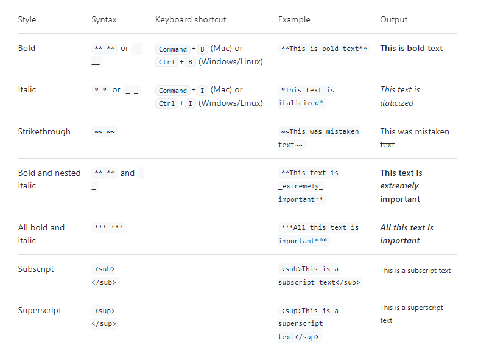
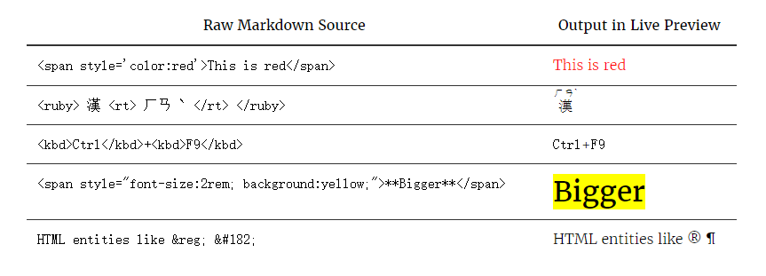

# Markdown 使用说明 #

**Typora** 正在使用 [GitHub Flavored Markdown](https://help.github.com/articles/github-flavored-markdown/)。

## 块元素 ##

### 段落和换行符 ###

段落只是一行或多行连续的文本。在 markdown 源代码中，段落由多个空行分隔。在Typora中，您只需按下 `Return` 即可创建新段落。

按 `Shift` + `Return` 可创建单个换行符。但是，大多数 markdown 解析器将忽略单行中断，要使其他 markdown 解析器识别您的换行符，可以在行尾留下两个空格，或者插入 `<br/>`.

### 标题 ###

标题在行的开头使用1-6个＃字符，对应于标题级别1-6。

### 引用文字 ###

Markdown 使用电子邮件样式>字符进行块引用。

### 列表 ###

输入 `* list item 1` 将创建一个无序列表，该 `*` 符号可以替换为 `+` 或 `-`.

输入 `1. list item 1` 将创建一个有序列表，其 markdown 源代码如下：

```
## 无序列表
*   红色
*   绿色
*   蓝色

## 有序列表
1.  红色
2. 	绿色
3.	蓝色
```

### 任务列表 ###

任务列表是标记为[ ]或[x]（未完成或完成）的项目的列表。

### 代码块 ###

Typora仅支持 Github Flavored Markdown 中的栅栏式代码块。

### 数学公式块 ###

您可以使用 **MathJax** 渲染 *LaTeX* 数学表达式。

输入 `$$`, 然后按“return”键将触发一个接受*Tex / LaTex*源代码的输入区域。
$$
\mathbf{V}_1 \times \mathbf{V}_2 =  \begin{vmatrix} 
\mathbf{i} & \mathbf{j} & \mathbf{k} \\
\frac{\partial X}{\partial u} &  \frac{\partial Y}{\partial u} & 0 \\
\frac{\partial X}{\partial v} &  \frac{\partial Y}{\partial v} & 0 \\
\end{vmatrix}
$$

```
$$
\mathbf{V}_1 \times \mathbf{V}_2 =  \begin{vmatrix} 
\mathbf{i} & \mathbf{j} & \mathbf{k} \\
\frac{\partial X}{\partial u} &  \frac{\partial Y}{\partial u} & 0 \\
\frac{\partial X}{\partial v} &  \frac{\partial Y}{\partial v} & 0 \\
\end{vmatrix}
$$
```

### 表格 ###

输入 `| First Header | Second Header |` 并按下 `return` 键将创建一个包含两列的表。

### 脚注 ###

```
您可以像这样创建脚注[^footnote].

[^footnote]: Here is the *text* of the **footnote**.
```

这是一个脚注[^1]

### 水平线 ###

输入 `***` 或 `---` 在空行上按 `return` 键将绘制一条水平线。

### YAML Front Matter ###

Typora 现在支持 [YAML Front Matter](http://jekyllrb.com/docs/frontmatter/) 。 在文章顶部输入 `---` 然后按 `Enter` 键将引入一个，或者从菜单中插入一个元数据块。

### 目录 (TOC) ###

输入 `[toc]` 然后按 `Return` 键将创建一个“目录”部分，自动从文档内容中提取所有标题，其内容会自动更新。

### 图表

> (Sequence, Flowchart and Mermaid)

Typora 支持, [sequence](https://bramp.github.io/js-sequence-diagrams/), [flowchart](http://flowchart.js.org/) and [mermaid](https://knsv.github.io/mermaid/#mermaid), 使用前要先从偏好设置面板启用该功能。

such as:

```sequence
Alice->Bob: Hello Bob, how are you?
Note right of Bob: Bob thinks
Bob-->Alice: I am good thanks!
```

## Span元素 ##

在您输入后Span元素会被立即解析并呈现。在这些span元素上移动光标会将这些元素扩展为markdown源代码。以下将解释这些span元素的语法。

### 链接

Markdown 支持两种类型的链接：内联和引用。

在这两种样式中，链接文本都写在[方括号]内。

要创建内联链接，请在链接文本的结束方括号后立即使用一组常规括号。在常规括号内，输入URL地址，以及可选的用引号括起来的链接标题。

```
This is [an example](http://example.com/ "Title") inline link.

[This link](http://example.net/) has no title attribute.
```

This is [an example](http://example.com/ "Title") inline link.

[This link](http://example.net/) has no title attribute.

#### 内部链接

**您可以将常规括号内的 href 设置为文档内的某一个标题**，这将创建一个书签，允许您在单击后跳转到该部分。

Command(在Windows上：Ctrl) + 单击 [此链接](##块元素) 将跳转到标题 `块元素`处。

#### 参考链接

参考样式链接使用第二组方括号，在其中放置您选择的标签以标识链接：

```
This is [an example][id] reference-style link.

然后，在文档中的任何位置，您可以单独定义链接标签，如下所示：

[id]: http://example.com/  "Optional Title Here"
```

This is [an example][id] reference-style link.

this is local file ref: [demo1][demo1]

### URL网址

Typora允许您将 URL 作为链接插入，用 `<`括号括起来`>`。

`<i@typora.io>` 成为 [i@typora.io](mailto:i@typora.io).

Typora也将自动链接标准URL。例如： www.google.com.

### 图片

图像与链接类似， 但在链接语法之前需要添加额外的 `!` 字符。 图像语法如下所示：

```


```

您可以使用拖放操作从图像文件或浏览器来插入图像。并通过单击图像修改 markdown 源代码。如果图像在拖放时与当前编辑文档位于同一目录或子目录中，则将使用相对路径。

### Styling text

您可以在注释字段和.md文件中使用粗体、斜体、删除线、下标或上标文本来表示强调。



---

## HTML ##

您可以使用HTML来设置纯 Markdown 不支持的内容，例如， `<span style="color:red">this text is red</span>` 用于添加红色文本。

demo: <span style="color:red">this text is red</span>

### 嵌入内容

有些网站提供基于iframe的嵌入代码，您也可以将其粘贴到Typora中，例如：

<iframe height='265' scrolling='no' title='Fancy Animated SVG Menu' src='http://codepen.io/jeangontijo/embed/OxVywj/?height=265&theme-id=0&default-tab=css,result&embed-version=2' frameborder='no' allowtransparency='true' allowfullscreen='true' style='width: 100%;'></iframe>

### 视频

您可以使用` <video>` HTML标记嵌入视频

### inline HTML

Typora now can render inline HTML just as normal inline Markdown styles, for example:



---

### 创建折叠部分

可创建带 `<details>` 标记的折叠部分来简化Markdown

````
<details><summary>CLICK ME</summary>
<p>

#### We can hide anything, even code!

```ruby
   puts "Hello World"
```

</p>
</details>
````


<details>     <summary>I have keys but no locks. I have space but no room. You can enter but can't leave. What am I?</summary>     A keyboard. </details>


---


[^1]: Here is the *text* of the **footnote**.

[id]: http://example.com/  "Optional Title Here"

[demo1]: ./demo/demo1.md  "This is a ref to demo1"

