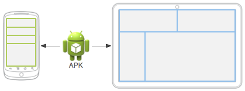

# 官方指南 #

## 应用基础知识 ##

### 构建首个应用 ###

。。。。

### 应用基础知识 ###

每个 Android 应用都处于各自的安全沙盒中，并受以下 Android 安全功能的保护：

- Android 操作系统是一种多用户 Linux 系统，其中的每个应用都是一个不同的用户；
- 默认情况下，系统会为每个应用分配一个唯一的 Linux 用户 ID（该 ID 仅由系统使用，应用并不知晓）。系统会为应用中的所有文件设置权限，使得只有分配给该应用的用户 ID 才能访问这些文件；
- 每个进程都拥有自己的虚拟机 (VM)，因此应用代码独立于其他应用而运行。
- 默认情况下，每个应用都在其自己的 Linux 进程内运行。Android 系统会在需要执行任何应用组件时启动该进程，然后当不再需要该进程或系统必须为其他应用恢复内存时，其便会关闭该进程。

Android 系统实现了*最小权限原则*。换言之，默认情况下，每个应用只能访问执行其工作所需的组件，而不能访问其他组件。这样便能创建非常安全的环境，在此环境中，应用无法访问其未获得权限的系统部分。不过，应用仍可通过一些途径与其他应用共享数据以及访问系统服务：

- 可以安排两个应用共享同一 Linux 用户 ID，在此情况下，二者便能访问彼此的文件。为节省系统资源，也可安排拥有相同用户 ID 的应用在同一 Linux 进程中运行，并共享同一 VM。应用还必须使用相同的证书进行签名。
- 应用可以请求访问设备数据（如用户的联系人、短信消息、可装载存储装置（SD 卡）、相机、蓝牙等）的权限。用户必须明确授予这些权限。如需了解详细信息，请参阅[使用系统权限](https://developer.android.google.cn/training/permissions)。

#### 应用组件 ####

共有四种不同的应用组件类型：

- Activity
- 服务
- 广播接收器
- 内容提供程序

每种类型都有不同的用途和生命周期，后者会定义如何创建和销毁组件。以下部分将介绍应用组件的四种类型。

**Activity**

*Activity* 是与用户交互的入口点。它表示拥有界面的单个屏幕。Activity 有助于完成系统和应用程序之间的以下重要交互：

- 追踪用户当前关心的内容（屏幕上显示的内容），以确保系统继续运行托管 Activity 的进程。
- 了解先前使用的进程包含用户可能返回的内容（已停止的 Activity），从而更优先保留这些进程。
- 帮助应用处理终止其进程的情况，以便用户可以返回已恢复其先前状态的 Activity。
- 提供一种途径，让应用实现彼此之间的用户流，并让系统协调这些用户流。（此处最经典的示例是共享。）

**Service**

*服务*是一个通用入口点，用于因各种原因使应用在后台保持运行状态。它是一种在后台运行的组件，用于执行长时间运行的操作或为远程进程执行作业。服务不提供界面。

事实上，有两种截然不同的语义服务可以告知系统如何管理应用：已启动服务会告知系统使其运行至工作完毕。此类工作可以是在后台同步一些数据，或者在用户离开应用后继续播放音乐。在后台同步数据或播放音乐也代表了两种不同类型的已启动服务，而这些服务可以修改系统处理它们的方式：

- 音乐播放是用户可直接感知的服务，因此，应用会向用户发送通知，表明其希望成为前台，从而告诉系统此消息；在此情况下，系统明白它应尽全力维持该服务进程运行，因为进程消失会令用户感到不快。
- 通常，用户不会意识到常规后台服务正处于运行状态，因此系统可以更自由地管理其进程。如果系统需要使用 RAM 来处理用户更迫切关注的内容，则其可能允许终止服务（然后在稍后的某个时刻重启服务）。

**BroadcastReceiver**

借助*广播接收器*组件，系统能够在常规用户流之外向应用传递事件，从而允许应用响应系统范围内的广播通知。由于广播接收器是另一个明确定义的应用入口，因此系统甚至可以向当前未运行的应用传递广播。

许多广播均由系统发起，例如，通知屏幕已关闭、电池电量不足或已拍摄照片的广播。应用也可发起广播，例如，通知其他应用某些数据已下载至设备，并且可供其使用。

**ContentProvider**

*内容提供程序*管理一组共享的应用数据，您可以将这些数据存储在文件系统、SQLite 数据库、网络中或者您的应用可访问的任何其他持久化存储位置。其他应用可通过内容提供程序查询或修改数据（如果内容提供程序允许）。

我们很容易将内容提供程序看作数据库上的抽象，因为其内置的大量 API 和支持时常适用于这一情况。但从系统设计的角度看，二者的核心目的不同。对系统而言，内容提供程序是应用的入口点，用于发布由 URI 架构识别的已命名数据项。因此，应用可以决定如何将其包含的数据映射到 URI 命名空间，进而将这些 URI 分发给其他实体。反之，这些实体也可使用分发的 URI 来访问数据。在管理应用的过程中，系统可以执行以下特殊操作：

- 分配 URI 无需应用保持运行状态，因此 URI 可在其所属的应用退出后继续保留。当系统必须从相应的 URI 检索应用数据时，系统只需确保所属应用仍处于运行状态。
- 这些 URI 还会提供重要的细粒度安全模型。例如，应用可将其所拥有图像的 URI 放到剪贴板上，但将其内容提供程序锁定，以便其他应用程序无法随意访问它。当第二个应用尝试访问剪贴板上的 URI 时，系统可允许该应用通过临时的 *URI 授权*来访问数据，这样便只能访问 URI 后面的数据，而非第二个应用中的其他任何内容。

内容提供程序也适用于读取和写入您的应用不共享的私有数据。

当系统启动某个组件时，它会启动该应用的进程（如果尚未运行），并实例化该组件所需的类。例如，如果您的应用启动相机应用中拍摄照片的 Activity，则该 Activity 会在属于相机应用的进程（而非您的应用进程）中运行。因此，与大多数其他系统上的应用不同，Android 应用并没有单个入口点（即没有 `main()` 函数）。

##### 启动组件 #####

在四种组件类型中，有三种（Activity、Service和BroadcastReceiver）均通过异步消息 *Intent* 进行启动。

对于acitivity和service，Intent 会定义要执行的操作（例如，*查看*或*发送*某内容），并且可指定待操作数据的 URI，以及正在启动的组件可能需要了解的信息。

对于广播接收器，Intent 只会定义待广播的通知。例如，指示设备电池电量不足的广播只包含指示*“电池电量不足”*的已知操作字符串。

ContentProvider并非由 Intent 启动，它们会在成为 `ContentResolver` 的请求目标时启动。

每种组件都有不同的启动方法：

- Activity： `startActivity()` 或 `startActivityForResult()` 
- JobScheduler / startService bindService
- 您可以通过向 `sendBroadcast()`、`sendOrderedBroadcast()` 或 `sendStickyBroadcast()` 等方法传递 `Intent` 来发起广播。
- 您可以通过在 `ContentResolver` 上调用 `query()`，对ContentProvider执行查询。

#### 清单文件 ####

在 Android 系统启动应用组件之前，系统必须通过读取应用的*清单*文件 (`AndroidManifest.xml`) 确认组件存在。

除了声明应用的组件外，清单文件还有许多其他作用，如：

- 确定应用需要的任何用户权限，如互联网访问权限或对用户联系人的读取权限。
- 根据应用使用的 API，声明应用所需的最低 [API 级别](https://developer.android.google.cn/guide/topics/manifest/uses-sdk-element#ApiLevels)。
- 声明应用使用或需要的硬件和软件功能，如相机、蓝牙服务或多点触摸屏幕。
- 声明应用需要链接的 API 库（Android 框架 API 除外），如 [Google 地图库](http://code.google.com/android/add-ons/google-apis/maps-overview.html)。

##### 声明组件 #####

```xml
<?xml version="1.0" encoding="utf-8"?>
<manifest ... >
    <application android:icon="@drawable/app_icon.png" ... >
        <activity android:name="com.example.project.ExampleActivity"
                  android:label="@string/example_label" ... >
        </activity>
        ...
    </application>
</manifest>
```

application:

- `android:icon` 属性指向标识应用的图标所对应的资源。

activity:

- `android:name` 属性指定 `Activity` 子类的完全限定类名
- `android:label` 属性指定用作 Activity 的用户可见标签的字符串。

您必须使用以下元素声明所有应用组件：

- Activity 的 `<activity>` 元素。
- 服务的 `<service>` 元素。
- 广播接收器的 `<receiver>` 元素。
- 内容提供程序的 `<provider>` 元素。

如果未在清单文件中声明源代码中包含的 Activity、服务和内容提供程序，则这些组件对系统不可见，因此也永远不会运行。

##### 声明组件功能 #####

在应用的清单文件中声明 Activity 时，您可以选择性地加入声明 Activity 功能的 Intent 过滤器，以便响应来自其他应用的 Intent。您可以将 [`<intent-filter>`](https://developer.android.google.cn/guide/topics/manifest/intent-filter-element) 元素作为组件声明元素的子项进行添加，从而为您的组件声明 Intent 过滤器。

```xml
<manifest ... >
    ...
    <application ... >
        <activity android:name="com.example.project.ComposeEmailActivity">
            <intent-filter>
                <action android:name="android.intent.action.SEND" />
                <data android:type="*/*" />
                <category android:name="android.intent.category.DEFAULT" />
            </intent-filter>
        </activity>
    </application>
</manifest>
```

##### 声明应用要求 #####

```xml
<manifest ... >
    <uses-feature android:name="android.hardware.camera.any"
                  android:required="true" />
    <uses-sdk android:minSdkVersion="7" android:targetSdkVersion="19" />
    ...
</manifest>
```

#### 应用资源 ####

对于您在 Android 项目中加入的每一项资源，SDK 构建工具均会定义唯一的整型 ID，您可以利用此 ID 来引用资源，这些资源或来自应用代码，或来自 XML 中定义的其他资源。例如，如果您的应用包含名为 `logo.png` 的图像文件（保存在 `res/drawable/` 目录中），则 SDK 工具会生成名为 `R.drawable.logo` 的资源 ID。此 ID 映射到应用特定的整型数，您可以利用它来引用该图像，并将其插入您的界面。

#### 其他资源 ####

请继续阅读以下内容：

- [Intent 和 Intent 过滤器](https://developer.android.google.cn/guide/components/intents-filters)

  如何使用 `Intent` API 来启动应用组件（如 Activity 和服务），以及如何使您的应用组件可供其他应用使用。

- [Activity](https://developer.android.google.cn/guide/components/activities)

  如何创建 `Activity` 类的实例，该类可在您的应用内提供具有界面的独立屏幕。

- [提供资源](https://developer.android.google.cn/guide/topics/resources/providing-resources)

  如何通过构建 Android 应用将应用资源与应用代码分离，包括如何针对特定设备配置提供备用资源。

- [设备兼容性](https://developer.android.google.cn/guide/practices/compatibility)

  Android 如何在不同类型的设备上运行，并介绍如何针对不同设备优化应用，或如何限制应用在不同设备上的可用性。

- [系统权限](https://developer.android.google.cn/guide/topics/permissions)

  Android 如何通过权限系统来限制应用访问某些 API，该系统要求应用必须先征得用户同意，才能使用这些 API。

### 应用资源 ###

资源是指代码使用的附加文件和静态内容，例如位图、布局定义、界面字符串、动画说明等。

外部化应用资源后，您便可使用在项目 `R` 类中生成的资源 ID 来访问这些资源。

#### 分组资源类型 ####

应将各类资源放入项目 `res/` 目录的特定子目录中。

```
MyProject/
    src/
        MyActivity.java
    res/
        drawable/
            graphic.png
        layout/
            main.xml
            info.xml
        mipmap/
            icon.png
        values/
            strings.xml
```

> 如需了解有关使用 mipmap 文件夹的详细信息，请参阅[管理项目概览](https://developer.android.google.cn/tools/projects#mipmap)。

项目 `res/` 目录中支持的资源目录。

| 目录        | 资源类型                                                     |
| :---------- | :----------------------------------------------------------- |
| `animator/` | 用于定义[属性动画](https://developer.android.google.cn/guide/topics/graphics/prop-animation)的 XML 文件。 |
| `anim/`     | 用于定义[渐变动画](https://developer.android.google.cn/guide/topics/graphics/view-animation#tween-animation)的 XML 文件。（属性动画也可保存在此目录中，但为了区分这两种类型，属性动画首选 `animator/` 目录。） |
| `color/`    | 用于定义颜色状态列表的 XML 文件。请参阅[颜色状态列表资源](https://developer.android.google.cn/guide/topics/resources/color-list-resource) |
| `drawable/` | 位图文件（`.png`、`.9.png`、`.jpg`、`.gif`）或编译为以下可绘制对象资源子类型的 XML 文件：<br />位图文件<br />九宫格（可调整大小的位图）<br />状态列表<br />形状<br />动画可绘制对象<br />其他可绘制对象<br />请参阅 [Drawable 资源](https://developer.android.google.cn/guide/topics/resources/drawable-resource)。 |
| `mipmap/`   | 适用于不同启动器图标密度的可绘制对象文件。如需了解有关使用 `mipmap/` 文件夹管理启动器图标的详细信息，请参阅[管理项目概览](https://developer.android.google.cn/tools/projects#mipmap)。 |
| `layout/`   | 用于定义用户界面布局的 XML 文件。请参阅[布局资源](https://developer.android.google.cn/guide/topics/resources/layout-resource)。 |
| `menu/`     | 用于定义应用菜单（如选项菜单、上下文菜单或子菜单）的 XML 文件。请参阅[菜单资源](https://developer.android.google.cn/guide/topics/resources/menu-resource)。 |
| `raw/`      | 需以原始形式保存的任意文件。如要使用原始 `InputStream` 打开这些资源，请使用资源 ID（即 `R.raw.filename`）调用 `Resources.openRawResource()`。<br /><br />但是，如需访问原始文件名和文件层次结构，则可以考虑将某些资源保存在 `assets/` 目录（而非 `res/raw/`）下。`assets/` 中的文件没有资源 ID，因此您只能使用 `AssetManager` 读取这些文件。 |
| `values/`   | 包含字符串、整型数和颜色等简单值的 XML 文件。<br /><br />其他 `res/` 子目录中的 XML 资源文件会根据 XML 文件名定义单个资源，而 `values/` 目录中的文件可描述多个资源。对于此目录中的文件，`<resources>` 元素的每个子元素均会定义一个资源。例如，`<string>` 元素会创建 `R.string` 资源，`<color>` 元素会创建 `R.color` 资源。<br /><br />由于每个资源均使用自己的 XML 元素进行定义，因此您可以随意命名文件，并在某个文件中放入不同的资源类型。但是，您可能需要将独特的资源类型放在不同的文件中，使其一目了然。例如，对于可在此目录中创建的资源，下面给出了相应的文件名约定：<br /><br />arrays.xml：资源数组（[类型数组](https://developer.android.google.cn/guide/topics/resources/more-resources#TypedArray)）。<br />colors.xml：[颜色值](https://developer.android.google.cn/guide/topics/resources/more-resources#Color)。<br />dimens.xml：[尺寸值](https://developer.android.google.cn/guide/topics/resources/more-resources#Dimension)。<br />strings.xml：[字符串值](https://developer.android.google.cn/guide/topics/resources/string-resource)。<br />styles.xml：[样式](https://developer.android.google.cn/guide/topics/resources/style-resource)。<br /><br />请参阅[字符串资源](https://developer.android.google.cn/guide/topics/resources/string-resource)、[样式资源](https://developer.android.google.cn/guide/topics/resources/style-resource)和[更多资源类型](https://developer.android.google.cn/guide/topics/resources/more-resources)。 |
| `xml/`      | 可在运行时通过调用 `Resources.getXML()` 读取的任意 XML 文件。各种 XML 配置文件（如[可搜索配置](https://developer.android.google.cn/guide/topics/search/searchable-config)）都必须保存在此处。 |
| `font/`     | 带有扩展名的字体文件（如 `.ttf`、`.otf` 或 `.ttc`），或包含 `<font-family>` 元素的 XML 文件。如需详细了解作为资源的字体，请参阅 [XML 中的字体](https://developer.android.google.cn/preview/features/fonts-in-xml)。 |

> 切勿将资源文件直接保存在 `res/` 目录内，因为这样会造成编译错误。

如需了解有关特定资源类型的详细信息，请参阅[资源类型](https://developer.android.google.cn/guide/topics/resources/available-resources)文档。

#### 提供备用资源 ####



为一组资源指定配置特定的备用资源：

- 在 `res/` 中创建以 `<resources_name>-<config_qualifier>` 形式命名的新目录，您可以追加多个 *`<qualifier>`*。以短划线将其分隔。
- 将相应的备用资源保存在此新目录下。这些资源文件必须与默认资源文件完全同名。

Android 支持若干配置限定符，您可以通过使用短划线分隔每个限定符，从而向一个目录名称添加多个限定符。表 2 按优先级顺序列出了有效的配置限定符；如果对资源目录使用多个限定符，则必须按照表中所列顺序将其添加到目录名称中。

| 配置                 | 限定符值                                                     | 描述                                                         |
| :------------------- | ------------------------------------------------------------ | ------------------------------------------------------------ |
| MMC和MNC             | mcc310<br />mcc310-mnc004<br />mcc208-mnc00                  | 移动设备国家代码 (MCC)，（可选）后跟设备 SIM 卡中的移动设备网络代码 (MNC)。例如，`mcc310` 是指美国的任一运营商，`mcc310-mnc004` 是指美国的 Verizon 公司，`mcc208-mnc00` 是指法国的 Orange 公司。<br /><br />另请参阅配置字段 [`mcc` ](https://developer.android.google.cn/reference/android/content/res/Configuration#mcc)和 [`mnc`](https://developer.android.google.cn/reference/android/content/res/Configuration#mnc)，二者分别表示当前的移动设备国家代码和移动设备网络代码。 |
| 语言和区域           | en<br />fr<br />en-rUs<br />fr-rFR<br />fr-rCA<br />b+en<br />b+en+US<br />b+es+419 | 语言通过由两个字母组成的 [ISO 639-1](http://www.loc.gov/standards/iso639-2/php/code_list.php) 语言代码进行定义，可以选择后跟两个字母组成的 [ISO 3166-1-alpha-2](https://www.iso.org/obp/ui/#iso:pub:PUB500001:en) 区域码（前缀用小写字母 `r`）。<br /><br />这些代码*不*区分大小写；`r` 前缀用于区分区域码。您不能单独指定区域。<br /><br />有关针对其他语言本地化应用的完整指南，请参阅[本地化](https://developer.android.google.cn/guide/topics/resources/localization)。<br /><br />另请参阅 [`getLocales()`](https://developer.android.google.cn/reference/android/content/res/Configuration#getLocales()) 方法，了解该方法提供的已定义语言区域列表。此列表包含主要的语言区域。 |
| 布局方向             | ldrtl<br />ldltr                                             | 应用的布局方向。`ldrtl` 是指“布局方向从右到左”。`ldltr` 是指“布局方向从左到右”（默认的隐式值）。 |
| smallestWidth        | `sw<N>dp`<br />示例：<br />sw320dp<br />sw600dp<br />sw720dp | 屏幕的基本尺寸，由可用屏幕区域的最小尺寸指定。具体而言，设备的 smallestWidth 是屏幕可用高度和宽度的最小尺寸（您也可将其视为屏幕的“最小可能宽度”）。无论屏幕的当前方向如何，您均可使用此限定符确保应用界面的可用宽度至少为 `<N>` dp。<br />例如，如果布局要求屏幕区域的最小尺寸始终至少为 600dp，则可使用此限定符创建布局资源 `res/layout-sw600dp/`。仅当可用屏幕的最小尺寸至少为 600dp（无论 600dp 表示的边是用户所认为的高度还是宽度）时，系统才会使用这些资源。最小宽度为设备的固定屏幕尺寸特征；即使屏幕方向发生变化，设备的最小宽度仍会保持不变。 |
| 可用宽度             | `w<N>dp`<br /><br />示例：<br />w720dp<br />w1024dp          | 指定资源应使用的最小可用屏幕宽度（以 `dp` 为单位，由 `<N>` 值定义）。当屏幕方向在横向和纵向之间切换时，此配置值也会随之变化，以匹配当前的实际宽度。 |
| 可用高度             | `h<N>dp`<br /><br />示例：<br />h720dp<br />h1024dp          | 指定资源应使用的最小可用屏幕高度（以“dp”为单位，由 `<N>` 值定义）。当屏幕方向在横向和纵向之间切换时，此配置值也会随之变化，以匹配当前的实际高度。 |
| 屏幕尺寸             | small<br />normal<br />large<br />xlarge                     |                                                              |
| 屏幕纵横比           | long<br />notlong                                            |                                                              |
| 圆形屏幕             | round<br />notround                                          |                                                              |
| 广色域               | widecg<br />nowidecg                                         |                                                              |
| 高动态范围(HDR)      | highdr<br />howdr                                            |                                                              |
| 屏幕方向             | port<br />land                                               |                                                              |
| 界面模式             | car<br />desk<br />television<br />appliance<br />watch<br />vrheadset |                                                              |
| 夜间模式             | night<br />notnight                                          |                                                              |
| 屏幕像素密度(dpi)    | ldpi<br />mdpi<br />hdpi<br />xhdpi<br />xxhdpi<br />xxxhdpi<br />nodpi<br />tvdpi<br />anydpi<br />nnndpi |                                                              |
| 触摸屏类型           | notouch<br />finger                                          |                                                              |
| 键盘可用性           | keysexposed<br />keyshidden<br />keyssoft                    |                                                              |
| 主要的文本输入法     | nokeys<br />qwerty<br />12key                                |                                                              |
| 导航键可用性         | navexposed<br />navhidden                                    |                                                              |
| 主要的非触摸导航方法 | nonav<br />dpad<br />trackball<br />wheel                    |                                                              |
| 平台版本(API级别)    | 示例：<br />v3<br />v4<br />v7                               |                                                              |

##### 限定符命名规则 #####

以下是一些关于使用配置限定符名称的规则：

- 可以为单组资源指定多个限定符，并使用短划线分隔。例如，`drawable-en-rUS-land` 适用于屏幕方向为横向的美国英语设备。
- 这些限定符必须遵循上表中列出的顺序。
- 不能嵌套备用资源目录。例如，您的目录不能为 `res/drawable/drawable-en/`。
- 值不区分大小写。在处理之前，资源编译器会将目录名称转换为小写，以免不区分大小写的文件系统出现问题。名称中使用的所有大写字母只是为了便于认读。
- 每种限定符类型仅支持一个值。例如，若要对西班牙语和法语使用相同的可绘制对象文件，则您*不能*拥有名为 `drawable-rES-rFR/` 的目录，而是需要两个包含相应文件的资源目录，如 `drawable-rES/` 和 `drawable-rFR/`。

##### 创建别名资源 #####

如果您想将某一资源用于多种设备配置（但不想以默认资源的形式提供该资源），则无需将同一资源放入多个备用资源目录中。相反，您可以（在某些情况下）创建备用资源，充当默认资源目录中所保存资源的别名。

例如，假设您有一个应用图标 `icon.png`，并且需要用于不同语言区域的独特版本。但是，加拿大英语和加拿大法语这两种语言区域需使用同一版本。您可能会认为，需要将相同图像复制到加拿大英语和加拿大法语所对应的资源目录中，但事实并非如此。相反，您可以将用于二者的图像保存为 `icon_ca.png`（除 `icon.png` 以外的任何名称），并将其放入默认的 `res/drawable/` 目录中。然后，在 `res/drawable-en-rCA/` 和 `res/drawable-fr-rCA/` 中创建 `icon.xml` 文件，使用 `<bitmap>` 元素引用 `icon_ca.png` 资源。这样，您只需存储 PNG 文件的一个版本和两个指向该版本的小型 XML 文件。（XML 文件示例如下。）

#### 访问应用资源 ####

在应用中提供资源后，您可通过引用其资源 ID 来应用该资源。所有资源 ID 都在您项目的 `R` 类中进行定义，该类由 `aapt` 工具自动生成。

尽管资源 ID 是在 `R` 类中指定的，但您完全不需要在该类中查找资源 ID。资源 ID 始终由以下部分组成：

- *资源类型*：每个资源都被分到一个“类型”组中，例如 `string`、`drawable` 和 `layout`。如需了解有关不同类型的详细信息，请参阅[资源类型](https://developer.android.google.cn/guide/topics/resources/available-resources)。
- *资源名称*，它是不包括扩展名的文件名；或是 XML `android:name` 属性中的值（如资源是字符串等简单值）。

访问资源的方法有两种：

- **在代码中：**使用来自 `R` 类子类的静态整型数，例如：`R.string.hello`

  `string` 为资源类型，`hello` 为资源名称。当您提供此格式的资源 ID 时，有许多 Android API 可以访问您的资源。请参阅[在代码中访问资源](https://developer.android.google.cn/guide/topics/resources/providing-resources#ResourcesFromCode).

- **在 XML 中：**使用同样与 `R` 类中所定义资源 ID 对应的特殊 XML 语法，例如：`@string/hello`

  `string` 为资源类型，`hello` 为资源名称。只要 XML 资源中的某处拥有您在资源中提供的值，则您便可在该 XML 资源中使用此语法。请参阅[在 XML 中访问资源](https://developer.android.google.cn/guide/topics/resources/providing-resources#ResourcesFromXml)。

##### 在代码中访问资源 #####

您还可利用 `Resources` 中的方法检索个别资源，并且您可通过 `getResources()` 获得该资源的实例。

以下是在代码中引用资源的语法：

```java
[<package_name>.]R.<resource_type>.<resource_name>
```

- *`<package_name>`* 是资源所在包的名称（如果引用的资源来自您自己的资源包，则不需要）。
- *`<resource_type>`* 是资源类型的 `R` 子类。
- *`<resource_name>`* 是不带扩展名的资源文件名，或 XML 元素中的 `android:name` 属性值（若资源是简单值）。

##### 在XML中访问资源 #####

以下是在 XML 资源中引用资源的语法：

```
@[<package_name>:]<resource_type>/<resource_name>
```

- `<package_name>` 是资源所在包的名称（如果引用的资源来自相同资源包，则不需要）
- `<resource_type>` 是资源类型的 `R` 子类
- `<resource_name>` 是不带扩展名的资源文件名，或 XML 元素中的 `android:name` 属性值（若资源是简单值）。

##### 访问原始文件 #####

保存在 `assets/` 目录中的文件*没有*资源 ID，因此您无法通过 `R` 类或在 XML 资源中引用它们。您可以改为采用类似普通文件系统的方式查询 `assets/` 目录中的文件，并利用 [`AssetManager` ](https://developer.android.google.cn/reference/android/content/res/AssetManager)读取原始数据。

### 处理配置变更 ###

某些设备配置可能会在运行时发生变化（例如屏幕方向、键盘可用性，以及当用户启用[多窗口模式](https://developer.android.google.cn/guide/topics/ui/multi-window)时）。发生这种变化时，Android 会重启正在运行的 [`Activity`](https://developer.android.google.cn/reference/android/app/Activity)（先后调用 [`onDestroy()`](https://developer.android.google.cn/reference/android/app/Activity#ondestroy) 和 [`onCreate()`](https://developer.android.google.cn/reference/android/app/Activity#onCreate(android.os.Bundle))）。重启行为旨在通过利用与新设备配置相匹配的备用资源来自动重新加载您的应用，从而帮助它适应新配置。

然而，您可能会遇到这种情况：重启应用并恢复大量数据不仅成本高昂，而且会造成糟糕的用户体验。在此情况下，您还有两个选择：

1. 在配置变更期间保留对象

   允许 Activity 在配置变更时重启，但是需将有状态对象传递给 Activity 的新实例。

1. 自行处理配置变更

   由于处理配置变更的实际过程较为复杂，因此不建议您自行处理配置变更。不过，如果您无法使用首选项（onSaveInstanceState()、ViewModel 和持久存储）来保留界面状态，则可阻止系统在特定配置变更期间重启您的 Activity。配置变更时，应用会收到回调，以便您可以根据需要手动更新 Activity。

#### 在配置变更期间保留对象 ####

在此情况下，您可通过使用 [`ViewModel`](https://developer.android.google.cn/reference/androidx/lifecycle/ViewModel) 对象来减轻重新初始化 Activity 的负担。系统会在配置变更时保留 ViewModel，使其成为保存界面数据的理想场所，让您无需再次查询这些数据。如需详细了解如何在应用中使用 ViewModel，请阅读 [ViewModel 指南](https://developer.android.google.cn/topic/libraries/architecture/viewmodel)。

#### 自行处理配置变更 ####

如果应用在特定配置变更期间无需更新资源，*并且*因性能限制您需要尽量避免 Activity 重启，则可声明 Activity 自行处理配置变更，从而阻止系统重启 Activity。

如要声明由 Activity 处理配置变更，请在清单文件中编辑相应的 `<activity>` 元素，以包含 [`android:configChanges`](https://developer.android.google.cn/guide/topics/manifest/activity-element#config) 属性，该属性的值表示要处理的配置。

最常用的值包括 `"orientation"`、`"screenSize"` 和 `"keyboardHidden"`。`"orientation"` 值可在屏幕方向发生变更时阻止重启。

`"keyboardHidden"` 值可在键盘可用性发生变更时阻止重启。

现在，即便其中某个配置发生变化，`MyActivity` 也不会重启。但 `MyActivity` 会接收到对 [`onConfigurationChanged()`](https://developer.android.google.cn/reference/android/app/Activity#onconfigurationchanged) 的调用消息。

```java
@Override
public void onConfigurationChanged(Configuration newConfig) {
    super.onConfigurationChanged(newConfig);

    // Checks the orientation of the screen
    if (newConfig.orientation == Configuration.ORIENTATION_LANDSCAPE) {
        Toast.makeText(this, "landscape", Toast.LENGTH_SHORT).show();
    } else if (newConfig.orientation == Configuration.ORIENTATION_PORTRAIT){
        Toast.makeText(this, "portrait", Toast.LENGTH_SHORT).show();
    }
}
```

### 本地化 ###

### 复杂的XML资源 ###

使用 AAPT 的内嵌资源格式，您可以在同一 XML 文件中定义所有三种资源。由于我们正在合成一个动画矢量可绘制对象，因此我们将该文件放在 `res/drawable/` 下。

```xml
    <?xml version="1.0" encoding="utf-8"?>
    <animated-vector xmlns:android="http://schemas.android.com/apk/res/android"
        xmlns:aapt="http://schemas.android.com/aapt" >

        <aapt:attr name="android:drawable" >
            <vector
                android:height="64dp"
                android:width="64dp"
                android:viewportHeight="600"
                android:viewportWidth="600" >

               <group
                    android:name="rotationGroup"
                    android:pivotX="300.0"
                    android:pivotY="300.0"
                    android:rotation="45.0" >
                    <path
                        android:fillColor="#000000"
                        android:pathData="M300,70 l 0,-70 70,70 0,0 -70,70z" />

               </group>
            </vector>
        </aapt:attr>

        <target android:name="rotationGroup">
            <aapt:attr name="android:animation" >
                <objectAnimator
                    android:duration="6000"
                    android:propertyName="rotation"
                    android:valueFrom="0"

                   android:valueTo="360" />
            </aapt:attr>
        </target>
    </animated-vector>
```

### 资源类型 ###

#### 动画资源 ####

一个动画资源可以定义以下两种动画类型之一：

- 属性动画：通过使用 [`Animator` ](https://developer.android.google.cn/reference/android/animation/Animator)在设定的时间段内修改对象的属性值来创建动画。

- 视图动画:

  使用视图动画框架可以创建两种类型的动画：

  - [补间动画](https://developer.android.google.cn/guide/topics/resources/animation-resource#Tween)：通过使用 [`Animation` ](https://developer.android.google.cn/reference/android/view/animation/Animation)对单张图片执行一系列转换来创建动画
  - [帧动画](https://developer.android.google.cn/guide/topics/resources/animation-resource#Frame)：通过使用 [`AnimationDrawable`](https://developer.android.google.cn/reference/android/graphics/drawable/AnimationDrawable) 按顺序显示一系列图片来创建动画。

##### 属性动画 #####

在 XML 中定义的动画，用于在设定的一段时间内修改目标对象的属性，例如背景颜色或 Alpha 值。

`res/animator/filename.xml`

指向 `ValueAnimator`、`ObjectAnimator` 或 `AnimatorSet` 的资源指针。

```xml
    <set
      android:ordering=["together" | "sequentially"]>

        <objectAnimator
            android:propertyName="string"
            android:duration="int"
            android:valueFrom="float | int | color"
            android:valueTo="float | int | color"
            android:startOffset="int"
            android:repeatCount="int"
            android:repeatMode=["repeat" | "reverse"]
            android:valueType=["intType" | "floatType"]/>

        <animator
            android:duration="int"
            android:valueFrom="float | int | color"
            android:valueTo="float | int | color"
            android:startOffset="int"
            android:repeatCount="int"
            android:repeatMode=["repeat" | "reverse"]
            android:valueType=["intType" | "floatType"]/>

        <set>
            ...
        </set>
    </set>
```

该文件必须具有一个根元素，可以是 `<set>`、`<objectAnimator>` 或 `<valueAnimator>`。您可以将动画元素（包括其他 `<set>` 元素）组合到 `<set>` 元素中。

### 应用清单文件 ###

每个应用项目必须在[项目源设置](https://developer.android.google.cn/studio/build#sourcesets)的根目录中加入 `AndroidManifest.xml` 文件（且必须使用此名称）。 清单文件会向 Android 构建工具、Android 操作系统和 Google Play 描述应用的基本信息。

清单文件需声明以下内容：

- 应用的软件包名称，其通常与代码的命名空间相匹配。 构建项目时，Android 构建工具会使用此信息来确定代码实体的位置。 打包应用时，构建工具会使用 Gradle 构建文件中的应用 ID 来替换此值，而此 ID 则用作系统和 Google Play 上的唯一应用标识符。[了解关于软件包名称和应用 ID 的更多内容](https://developer.android.google.cn/guide/topics/manifest/manifest-intro#package-name)。
- 应用的组件，包括所有 Activity、服务、广播接收器和内容提供程序。 每个组件都必须定义基本属性，例如其 Kotlin 或 Java 类的名称。 清单文件还能声明一些功能，例如其所能处理的设备配置，以及描述组件如何启动的 Intent 过滤器。[了解关于应用组件的更多内容](https://developer.android.google.cn/guide/topics/manifest/manifest-intro#components)。
- 应用为访问系统或其他应用的受保护部分所需的权限。 如果其他应用想要访问此应用的内容，则清单文件还会声明其必须拥有的权限。 [了解关于权限的更多内容](https://developer.android.google.cn/guide/topics/manifest/manifest-intro#perms)。
- 应用需要的硬件和软件功能，这些功能会影响哪些设备能够从 Google Play 安装应用。[了解关于设备兼容性的更多内容](https://developer.android.google.cn/guide/topics/manifest/manifest-intro#compatibility)。

#### 文件功能 ####

##### 软件包名称和应用ID #####

清单文件的根元素需包含应用软件包名称（通常与项目目录结构，即 Java 命名空间相匹配）的属性。

```xml
<?xml version="1.0" encoding="utf-8"?>
<manifest xmlns:android="http://schemas.android.com/apk/res/android"
    package="com.example.myapp"
    android:versionCode="1"
    android:versionName="1.0" >
    ...
</manifest>
```

在将应用构建为最终的应用软件包 (APK) 时，Android 构建工具会使用 `package` 属性完成两件事情：

- 它会将此名称用作应用所生成 `R.java` 类（用于访问[应用资源](https://developer.android.google.cn/guide/topics/resources/overview)）的命名空间。
- 它会使用此名称解析清单文件中声明的任何相关类名称。

因此，清单 `package` 属性中的名称应始终与项目中保存 Activity 和其他应用代码的基础软件包的名称相匹配。您可以在项目中加入其他子软件包，但此类文件必须使用 `package` 属性的命名空间导入 `R.java` 类。

APK 编译完成后，`package` 属性还可表示应用的通用唯一应用 ID。 当构建工具根据 `package` 名称执行上述任务后，它们会将 `package` 值替换为项目 `build.gradle` 文件（用于 Android Studio 项目）中赋予 `applicationId` 属性的值。 `package` 属性的这一最终值必须是通用唯一值，因为这是能确保在系统和 Google Play 中识别应用的唯一方式。

如果您决定让代码的命名空间（以及清单中的 `package` 名称）有别于构建文件的 `applicationId`，请务必完全理解[设置应用 ID](https://developer.android.google.cn/studio/build/application-id)的影响。

##### 应用组件 #####

