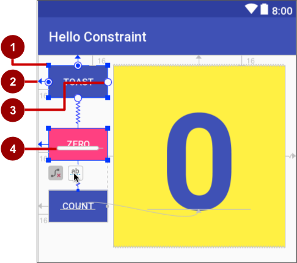
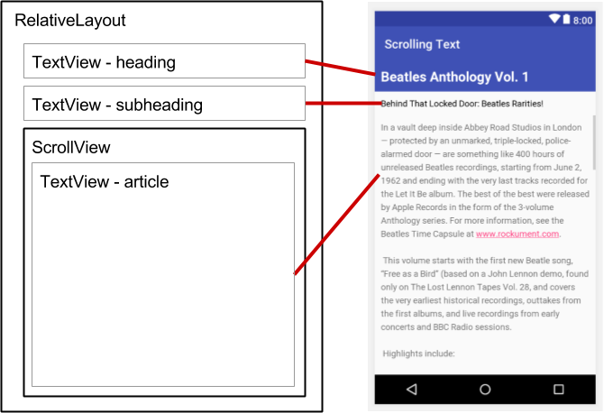
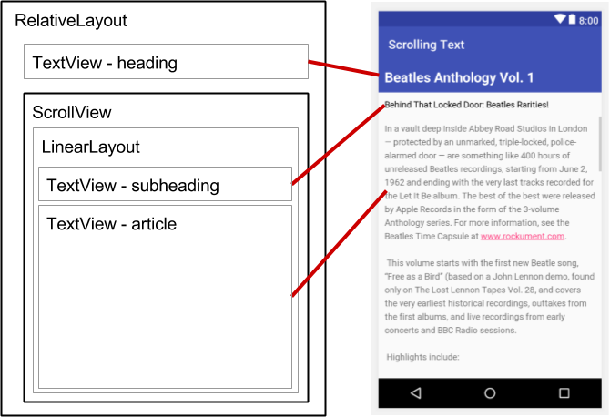
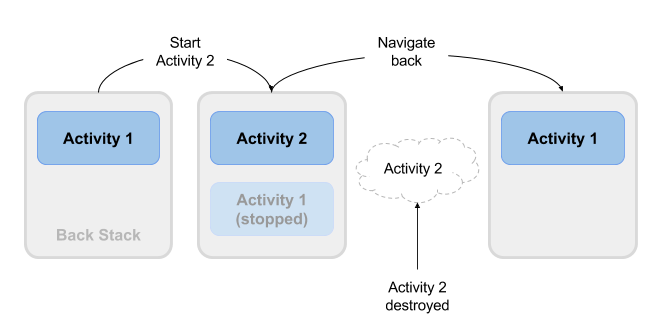

# Started for Android #

## 1. build first app ##

### 1.1 my first Android app ###

**Gradle files**

**app code**

**Layout files**

To view and edit a layout file, expand the `res` folder and the `layout` folder to see the layout file. 

**Resource files** : in `res` folder

- drawable
- layout
- mipmap
- values:
  - colors.xml
  - dimens.xml
  - strings.xml
  - styles.xml

**Android manifest**

```xml
<?xml version="1.0" encoding="utf-8"?>
<manifest xmlns:android="http://schemas.android.com/apk/res/android"
    package="com.example.android.helloworld">

    <application
        android:allowBackup="true"
        android:icon="@mipmap/ic_launcher"
        android:label="@string/app_name"
        android:roundIcon="@mipmap/ic_launcher_round"
        android:supportsRtl="true"
        android:theme="@style/AppTheme">
        <activity android:name=".MainActivity">
            <intent-filter>
               <action android:name="android.intent.action.MAIN" />

               <category android:name="android.intent.category.LAUNCHER" />
            </intent-filter>
        </activity>
    </application>

</manifest>
```

1，attr: package 在app发布后不应该更改。

2，自动备份： `android:allowBackup="true"`

3，`<uses-sdk android:minSdkVersion="14" android:targetSdkVersion="19" />` uses-sdk表示的含义。

### 1.2 layouts & resources ###

#### Views ####

UI由一个称为视图的对象层次结构组成——屏幕上的每个元素都是一个View

View类表示所有UI组件的基本构建块，以及提供交互式UI组件(如按钮、复选框和文本输入字段)的类的基类。

- TextView
- EditText
- Button
- ScrollView RecyclerView
- ImageView
- ConstraintLayout LinearLayout

##### ViewGroup groups #####

Common items:

- ConstraintLayout
- SrollView
- RecyclerView

一些ViewGroup组被指定为布局，因为它们以特定的方式组织子View元素，通常用作根ViewGroup。一些布局的例子是:

- ConstraintLayout: 一组子视图元素，使用约束、边和指南来控制元素在布局中相对于其他元素的位置。ConstraintLayout的设计是为了方便在布局编辑器中单击和拖动View元素。
- LinearLayout: 一组水平或垂直定位和对齐的子View元素。
- RelativeLayout:一组子视图元素，其中每个元素相对于ViewGroup中的其他元素进行定位和对齐。换句话说，子View元素的位置可以相互描述，也可以与父ViewGroup相关联。
- TableLayout:一组按行和列排列的子视图元素。
- FrameLayout:一组在堆栈中的子视图元素。FrameLayout的设计是为了在屏幕上挡住一个区域来显示一个视图。子视图元素在一个堆栈中绘制，最近添加的子元素在顶部。FrameLayout的大小就是它最大的子视图元素的大小。
- GridLayout

#### The layout editor ####

**1, 使用ConstraintLayout**

约束是与另一个UI元素、父布局或不可见的指导方针的连接或对齐。每个约束显示为从一个循环句柄延伸出来的一行。在Component Tree窗格中选择一个UI元素或在布局编辑器中单击它后，该元素在每个角上显示一个调整大小的句柄，在每个边的中间显示一个圆形约束句柄。



约束和大小调整句柄：

1. **Resizing handle**.
2. **Constraint line and handle**. In the figure, the constraint aligns the left side of the **Toast** `Button` to the left side of the layout.
3. **Constraint handle** without a constraint line.
4. **Baseline handle**. The baseline handle aligns the text baseline of an element to the text baseline of another element.

-- 在设计窗口中调整或者在XML file中直接更改对应的属性。

-- using a baseline constraint

-- 使用属性窗口：

ConstraintLayout的 `layout_height`  `layout_width`有以下的属性：

- match_constraint
- warp_content
- specify a fixed size

#### Edting XML directly ####

```xml
<?xml version="1.0" encoding="utf-8"?>
<androidx.constraintlayout.widget.ConstraintLayout
    xmlns:android="http://schemas.android.com/apk/res/android"
    xmlns:tools="http://schemas.android.com/tools"
    xmlns:app="http://schemas.android.com/apk/res-auto"
    android:layout_width="match_parent"
    android:layout_height="match_parent"
    tools:context=".MainActivity">

    <TextView
        android:layout_width="wrap_content"
        android:layout_height="wrap_content"
        android:layout_marginLeft="8dp"
        android:layout_marginTop="8dp"
        android:layout_marginRight="8dp"
        android:layout_marginBottom="8dp"
        android:text="Hello World!"
        app:layout_constraintBottom_toBottomOf="parent"
        app:layout_constraintLeft_toLeftOf="parent"
        app:layout_constraintRight_toRightOf="parent"
        app:layout_constraintTop_toTopOf="parent" />

  </androidx.constraintlayout.widget.ConstraintLayout>
```

**XML的属性**

视图的属性定义了视图在屏幕上出现的位置、它的大小、视图与其他视图的关系以及它如何响应用户输入。在XML中或在布局编辑器的Attributes窗格中定义视图时，属性被称为属性。

属性通常采用以下形式:

`android:attribute_name="value"`

如果值是一种资源，比如一种颜色，@符号指定了哪种资源：

`android:background="@color/myBackgroundColor"`

**定义一个View**

要唯一地标识视图并从代码中引用它，必须给它一个id。android:id属性允许你指定一个唯一的id 一个视图的资源标识符。

`android:id="@+id/button_count"`

该属性的`@+id/button_count`部分为Button (View的子类)创建了一个名为`button_count`的id。您使用加号(+)符号表示您正在创建一个新id。

引用现有资源标识符:

`android:layout_toLeftOf="@id/show_count"`

**Positioning a View**

1, LinearLayout定位

- android:layout_width

- android:layout_height

- android:orientation
- android:layout_gravity

`android:layout_width`和`android:layout_height`属性可以采用以下三个值之一:

- match_parent
- wrap_content
- a fixed number of dp

The `android:orientation` can be:

- horizontal
- vertical

填充是UI元素的边缘和元素内容之间的空间，以密度无关的像素度量，

- `android:padding`: Sets the padding of all four edges.
- `android:paddingTop`: Sets the padding of the top edge.
- `android:paddingBottom`: Sets the padding of the bottom edge.
- `android:paddingLeft`: Sets the padding of the left edge.
- `android:paddingRight`: Sets the padding of the right edge.
- `android:paddingStart`: Sets the padding of the start of the view, in pixels. Used in place of the padding attributes listed above, especially with views that are long and narrow.
- `android:paddingEnd`: Sets the padding of the end edge of the view, in pixels. Used along with `android:paddingStart`.

2, RelativeLayout Positioning

另一个有用的布局视图组是RelativeLayout，你可以用它来相对地定位子视图元素或父视图元素。RelativeLayout可以使用的属性包括:

- `android:layout_toLeftOf`: Positions the right edge of this View to the left of another View (identified by its ID).
- `android:layout_toRightOf`: Positions the left edge of this View to the right of another View (identified by its ID).
- `android:layout_centerHorizontal`: Centers this View horizontally within its parent.
- `android:layout_centerVertical`: Centers this View vertically within its parent.
- `android:layout_alignParentTop`: Positions the top edge of this View to match the top edge of the parent.
- `android:layout_alignParentBottom`: Positions the bottom edge of this View to match the bottom edge of the parent.

**Style-related attributes**

您可以指定样式属性来定制视图的外观。一个没有样式属性的视图，如android:textColor, android:textSize，和android:background，采用应用程序的主题中定义的样式。

- `android:background`: Specifies a color or drawable resource to use as the background.
- `android:text`: Specifies text to display in the view.
- `android:textColor`: Specifies the text color.
- `android:textSize`: Specifies the text size.
- `android:textStyle`: Specifies the text style, such as `bold`.

#### Resource files ####

资源文件是一种将静态值从代码中分离出来的方法，这样您就不必通过更改代码本身来更改值。您可以将所有字符串、布局、尺寸、颜色、样式和菜单文本分别存储在资源文件中。

当查看Project > Android窗格时，资源文件存储在res文件夹中的文件夹中。这些文件夹包括:

- `drawable`: For images and icons
- `layout`: For layout resource files
- `menu`: For menu items
- `mipmap`: For pre-calculated, optimized collections of app icons used by the Launcher
- `values`: For colors, dimensions, strings, and styles (theme attributes)

在XML布局中引用资源的语法如下:

`@package_name:resource_type/resource_name`

- Package_name是资源所在的包的名称。当您引用存储在项目的res文件夹中的资源时，不需要包名，因为这些资源来自同一个包。
- resource_type是资源类型的R子类 See [Resource Types](https://developer.android.com/guide/topics/resources/available-resources.html)
- resource_name是没有扩展名的资源文件名，或者是XML元素中的android:name属性值。

下面列出demo:

`android:text="@string/button_label_toast"`

`android:background="@color/colorPrimary"`

`android:textColor="@android:color/white"`

#### View clicks ####

- Write a Java method that performs the specific action you want the app to do when this event occurs. This method is typically referred to as an *event handler*.
- Associate this event-handler method to the `View`, so that the method executes when the event occurs.

```xml
<Button
    android:id="@+id/button_toast"
    android:onClick="showToast"
```

### 1.3 Text and scrolling views ###

本章描述应用程序中最常用的View子类之一:TextView，它在屏幕上显示文本内容。TextView可以用来显示一条消息，一个来自数据库的响应，甚至是整个杂志风格的文章，用户可以滚动。本章还展示了如何创建文本和其他元素的滚动视图。

#### TextView ####

您可以通过使用它的资源id在您的Java代码中引用一个TextView，以便从您的代码中更新文本或其属性。如果你想让用户编辑文本，使用EditText，一个允许文本输入和编辑的TextView的子类。你学习关于EditText在另一课。

**TextView的attributes**

您可以使用TextView的XML属性来控制：

- TextView在布局中的位置(像任何其他视图一样)
- TextView本身如何显示，比如使用背景颜色
- 文本在TextView中是什么样子的，比如初始文本及其样式、大小和颜色

最常用的属性与TextView是以下:

- `android:text`
- `android:textColor` 设置文本的颜色。您可以将该属性设置为颜色值、预定义资源或主题。颜色资源和主题将在其他章节中描述。
- `android:textAppearance` 文本的外观，包括颜色、字体、样式和大小。将此属性设置为预定义的样式资源或主题，这些资源或主题已经定义了这些值。
- `android:textSize` 设置文本大小,Use `sp` (scaled-pixel) sizes such as `20sp` or `14.5sp`, or set the attribute to a predefined resource or theme.
- `android:textStyle` Use `normal`, `bold`, `italic`, or `bold`|`italic`.
- `android:typeface` Use `normal`, `sans`, `serif`, or `monospace`.
- `android:lineSpacingExtra` 在文本行之间设置额外的间距。使用sp(缩放像素)或dp(设备无关像素)大小，或将属性设置为预定义的资源或主题。
- `android:autoLink` 控制url和电子邮件地址等链接是否自动找到并转换为可点击(可触摸)链接。
  - none
  - web
  - email
  - phone
  - map
  - all

**在文本中使用嵌入标签 Using embedded tags in text**

在这两种情况下，文本都可能包含嵌入的HTML标记或其他文本格式化代码。为了在文本视图中正确显示，文本必须按照以下规则进行格式化:

- 输入\n表示行尾，输入另一个\n表示空行。您需要添加行尾字符，以防止段落相互冲突。
- 如果你的文本中有撇号(')，你必须在它前面加一个反斜杠(\')来转义它。如果文本中有双引号，也必须转义它(\")。
- Enter the HTML and **</b>** tags around words that should be in bold.
- Enter the HTML and **</i>** tags around words that should be in italics.

**在代码中引用TextView**

1. You use the [`findViewById()`](https://developer.android.com/reference/android/view/View.html#findViewById(int)) method of the `View` class, and refer to the view you want to find using this format
2. After retrieving the `View` as a `TextView` member variable, you can then set the text to new text (in this case, `mCount_text`) using the [`setText()`](https://developer.android.com/reference/android/widget/TextView.html#setText(java.lang.CharSequence)) method of the `TextView` class

#### Scrolling views ####

The [`ScrollView`](https://developer.android.com/reference/android/widget/ScrollView.html) class provides the layout for a vertical scrolling view. (For horizontal scrolling, you would use [`HorizontalScrollView`](https://developer.android.com/reference/android/widget/HorizontalScrollView.html).) `ScrollView` is a subclass of [`FrameLayout`](https://developer.android.com/reference/android/widget/FrameLayout.html), which means that you can place only *one* `View` as a child within it; that child contains the entire contents to scroll.

即使你只能在一个ScrollView中放置一个子视图，子视图也可以是一个ViewGroup，它具有子视图元素的层次结构，比如LinearLayout。对于ScrollView中的视图来说，一个很好的选择是LinearLayout，它是按照垂直方向排列的。

**性能**

ScrollView的所有内容(例如带有View元素的ViewGroup)占用内存和视图层次结构，即使部分内容没有显示在屏幕上。

Consider using flatter layouts such as [`RelativeLayout`](https://developer.android.com/reference/android/widget/RelativeLayout.html) or [`GridLayout`](https://developer.android.com/reference/android/widget/GridLayout.html) to improve performance.

To display long lists of items, or images, consider using a [`RecyclerView`](https://developer.android.com/reference/android/support/v7/widget/RecyclerView.html), which is covered in another lesson.

*RelativeLayout* *GridLayout* *RecyclerView*

**ScrollView with a TextView**

要在屏幕上显示可滚动的杂志文章，您可以使用RelativeLayout，其中包括用于文章标题的单独TextView、用于文章副标题的另一个TextView和用于滚动文章文本的第三个TextView(见下图)，这些都是在ScrollView中设置的。屏幕上唯一可以滚动的部分是带有文章文本的ScrollView。



**ScrollView with a LinearLayout**

一个ScrollView只能包含一个子视图;然而，这个视图可以是一个ViewGroup，它包含几个视图元素，比如LinearLayout。你可以在ScrollView中嵌套一个ViewGroup，比如LinearLayout，从而滚动LinearLayout中的所有内容。



对于LinearLayout：

- android:layout_width : match_parent
- android:layout_height: wrap_content

因为ScrollView只支持垂直滚动 你必须设置LinearLayout orientation属性为 vertical

## 2. Activities & intents ##

### 2.1 Activities and intents ###

#### About activities ####

acivity代表应用程序中带有用户可以交互的界面的单个屏幕.

通常，应用程序中的一个activity被指定为“主”活动，例如MainActivity。用户在第一次启动应用程序时看到主活动。每个活动可以启动其他活动来执行不同的操作。

每当一个新的活动启动时，前一个活动就会停止，但系统会将该活动保留在一个堆栈中(“back stack”)。当用户完成当前活动并按下Back按钮时，该活动将从堆栈中弹出并销毁，前一个活动将继续。

当一个活动因为一个新的活动开始而停止时，第一个活动通过活动生命周期回调方法被通知。

#### 创建activity ####

**Create the Activity**

the [`AppCompatActivity`](https://developer.android.com/reference/android/support/v7/app/AppCompatActivity.html) class类可以让你使用最新的Android应用功能，比如应用栏和材质设计，同时还可以让你的应用与运行旧版本Android的设备兼容。

```java
public class MainActivity extends AppCompatActivity {
   @Override
   protected void onCreate(Bundle savedInstanceState) {
       super.onCreate(savedInstanceState);
       setContentView(R.layout.activity_main);
   }
}
```

了解activity的lifecycle

**Declare the Activity in AndroidManifest.xml**

Each `Activity` in your app must be declared in the `AndroidManifest.xml` file

The <activity> element includes a number of attributes to define properties of the Activity such as its label, icon, or theme. The only required attribute is android:name, which specifies the class name for the Activity (such as MainActivity). 

The <activity> element can also include declarations for Intent filters. The Intent filters specify the kind of Intent your Activity will accept.

`Intent` filters must include at least one `<action>` element, and can also include a `<category>` and optional `<data>`.

#### intent介绍 ####

Each activity is started or activated with an [`Intent`](https://developer.android.com/reference/android/content/Intent.html), which is a message object that makes a request to the Android runtime to start an activity or other app component in your app or in some other app.

当你的应用程序第一次从设备主屏幕启动时，Android运行时发送一个Intent给你的应用程序来启动你的应用程序的主活动(在AndroidManifest.xml文件中用main动作和LAUNCHER类别定义的那个)。要在你的应用程序中启动另一个活动，或者请求设备上其他可用的活动执行一个动作，你构建自己的意图并调用startActivity()方法来发送意图。

除了启动一个活动，意图还可以用于在一个活动和另一个活动之间传递数据。当您创建一个意图来启动一个新活动时，您可以包含关于您希望新活动操作的数据的信息。例如，一个显示消息列表的email Activity可以向显示该消息的Activity发送一个Intent。显示活动需要关于要显示的消息的数据，您可以在意图中包含该数据。

**intent types**

- 显式意图:使用活动的完全限定类名指定接收活动(或其他组件)。您可以使用显式意图在自己的应用程序中启动组件(例如，在UI中在屏幕之间移动)，因为您已经知道该组件的包和类名。
- 隐式意图:你不指定一个特定的活动或其他组件来接收意图。相反，您声明一个通用的操作来执行，Android系统将您的请求匹配到一个活动或其他可以处理请求的操作的组件。您将在另一个实践中了解更多关于使用隐式意图的内容。

**Intent objects and fields**

对于一个显式意图，关键字段包括以下内容:

- Activity类(针对显式Intent)。这是应该接收Intent的Activity或其他组件的类名;使用Intent构造函数或setComponent()、setComponentName()或setClassName()方法来指定类。
- Intent data。Intent数据字段包含了你想要接收Activity作为Uri对象操作的数据的引用
- intent extras. 这些键值对携带接收activity完成请求操作所需的信息。
- intent flgas. These are additional bits of metadata, defined by the `Intent` class.这些标志可能会指示Android系统如何启动一个Activity或者在Activity启动后如何处理它。

#### Starting an Activity with an explicit Intent ####

```java
Intent messageIntent = new Intent(this, ShowMessageActivity.class);
startActivity(messageIntent);
```

The intent constructor takes two arguments for an explicit `Intent`:

- An application context. In this example, the `Activity` class provides the context (`this`).
- The specific component to start (`ShowMessageActivity.class`).

已启动的活动保持在屏幕上，直到用户点击设备上的后退按钮，此时该活动关闭并被系统回收，而原来的活动恢复。

 You can also manually close the started `Activity` in response to a user action (such as a `Button` click) with the [`finish()`](https://developer.android.com/reference/android/app/Activity.html#finish()) method:

```java
public void closeActivity (View view) {
    finish();
}
```

#### Passing data from one Activity to another ####

除了简单地从另一个活动启动一个活动之外，你还可以使用Intent将信息从一个活动传递到另一个活动。你用来启动一个Activity的Intent对象可以包含Intent数据(一个要操作的对象的URI)，或者Intent额外数据，这些都是Activity可能需要的额外数据。

In the first (sending) `Activity`, you:

1. Create the `Intent` object.
2. Put data or extras into that `Intent`.
3. Start the new `Activity` with `startActivity()`.

In the second (receiving) `Activity`, you:

1. Get the `Intent` object the `Activity` was started with.
2. Retrieve the data or extras from the `Intent` object.

**When to use Intent data or Intent extras**

数据和额外数据之间有几个关键的区别，这些区别决定了您应该使用哪一个。

intent data 只能保存一条信息:表示要操作的数据位置的URI。

- 当您只有一条信息需要发送到已启动的活动。
- 当该信息是可以用URI表示的数据位置时。

intent extra: 您想要传递给已启动的活动的任何其他任意数据。`Intent` extras are stored in a [`Bundle`](https://developer.android.com/reference/android/os/Bundle.html) object as key and value pairs.value can be any primitive or object type (objects must implement the [`Parcelable`](https://developer.android.com/reference/android/os/Parcelable.html) interface).  putExtra & putExtras

- 如果您想要传递多个信息到已启动的活动。
- 如果您想传递的任何信息不能通过URI表示。

**Add data to the Intent**

*<u>setData</u>*

```java
Intent messageIntent = new Intent(this, ShowMessageActivity.class);

// A web page URL
messageIntent.setData(Uri.parse("http://www.google.com")); 
// a Sample file URI
messageIntent.setData(Uri.fromFile(new File("/sdcard/sample.jpg")));
// A sample content: URI for your app's data model
messageIntent.setData(Uri.parse("content://mysample.provider/data")); 
// Custom URI 
messageIntent.setData(Uri.parse("custom:" + dataID + buttonId));
```

**Add extras to the Intent**

从原始activity中向显式的Intent添加额外的Intent:

- 确定要用于将信息放入额外组件的键，或者定义自己的键。每条信息都需要它自己唯一的密钥。
- 使用putExtra()方法将你的键/值对添加到Intent附加项中。你可以选择创建一个Bundle对象，将你的数据添加到Bundle中，然后将Bundle添加到Intent中。

Intent类包含了你可以使用的额外键，它们被定义为以单词EXTRA_开头的常量。

你也可以定义你自己的Intent额外的键。按照惯例，你将Intent额外键定义为以EXTRA_开头的静态变量。为了保证键是唯一的，键本身的字符串值应该以应用程序的完全限定类名作为前缀。

```java
public final static String EXTRA_POSITION_X = "com.example.mysampleapp.X";
public final static String EXTRA_POSITION_Y = "com.example.mysampleapp.Y";

// first way
messageIntent.putExtra(EXTRA_MESSAGE, "this is my message");
messageIntent.putExtra(EXTRA_POSITION_X, 100);
messageIntent.putExtra(EXTRA_POSITION_Y, 500);

// second way
Bundle extras = new Bundle();
extras.putString(EXTRA_MESSAGE, "this is my message");
extras.putInt(EXTRA_POSITION_X, 100);
extras.putInt(EXTRA_POSITION_Y, 500);
messageIntent.putExtras(extras);
```

**Retrieve the data from the Intent in the started Activity**

当你用Intent启动一个Activity时，启动的Activity可以访问Intent和它包含的数据。

要获取Activity(或其他组件)启动时的Intent，使用getIntent()方法:

```java
Intent intent = getIntent();

// get the URI
Uri locationUri = intent.getData();

// get the extra data
String message = intent.getStringExtra(MainActivity.EXTRA_MESSAGE); 
int positionX = intent.getIntExtra(MainActivity.EXTRA_POSITION_X);
int positionY = intent.getIntExtra(MainActivity.EXTRA_POSITION_Y);

Bundle extras = intent.getExtras();
String message = extras.getString(MainActivity.EXTRA_MESSAGE);
```

#### Getting data back from an Activity ####

当你用Intent启动一个Activity时，原始Activity会被暂停，而新的Activity会一直在屏幕上，直到用户点击Back按钮，或者你在点击处理程序中调用finish()方法或其他函数来结束用户参与这个Activity。

To launch a new `Activity` and get a result back, do the following steps in your originating `Activity`:

1. Instead of launching the `Activity` with `startActivity()`, call [`startActivityForResult()`](https://developer.android.com/reference/android/app/Activity.html#startActivityForResult(android.content.Intent, int)) with the `Intent` and a request code.
2. Create a new `Intent` in the launched `Activity` and add the return data to that `Intent`.
3. Implement `onActivityResult()` in the originating `Activity` to process the returned data.

**Use startActivityForResult() to launch the Activity** in original act

```java
startActivityForResult(messageIntent, TEXT_REQUEST);

public static final int PHOTO_REQUEST = 1;
public static final int PHOTO_PICK_REQUEST = 2;
public static final int TEXT_REQUEST = 3;
```

请求代码是一个整数，用于标识请求，并可用于在处理返回数据时区分结果。

**Return a response from the launched Activity** in launched act

从启动的Activity返回到原始Activity的响应数据在Intent中被发送，要么在data中，要么在extra的。

To return data from the launched `Activity`, create a new empty `Intent` object.

返回结果Intent不需要一个类或组件名来结束在正确的位置。Android系统为你将响应返回到原始的Activity。

然后像往常一样将返回数据放入Intent中。在接下来的代码中，返回消息是一个带有EXTRA_RETURN_MESSAGE键的Intent额外消息。

Use the `setResult()` method with a response code and the `Intent` with the response data.

```java
Intent returnIntent = new Intent();

public final static String EXTRA_RETURN_MESSAGE = "com.example.mysampleapp.RETURN_MESSAGE";

returnIntent.putExtra(EXTRA_RETURN_MESSAGE, mMessage);
setResult(RESULT_OK,replyIntent);
```

The response codes are defined by the [`Activity`](https://developer.android.com/reference/android/app/Activity.html) class, and can be

- `RESULT_OK`: The request was successful.
- `RESULT_CANCELED`: The user canceled the operation.
- `RESULT_FIRST_USER`: For defining your own result codes.

You use the result code in the originating `Activity`.

Finally, call `finish()` to close the `Activity` and resume the originating `Activity`:

```java
finish();
```

**Read response data in onActivityResult()** in original act

现在启动的Activity已经将数据发送回带有Intent的原始Activity，第一个Activity必须处理这些数据。要处理原始活动中的返回数据，实现onActivityResult()回调方法。

```java
public void onActivityResult(int requestCode, int resultCode,  Intent data) {
    super.onActivityResult(requestCode, resultCode, data);
    if (requestCode == TEXT_REQUEST) {
        if (resultCode == RESULT_OK) {
            String reply = 
               data.getStringExtra(SecondActivity.EXTRA_RETURN_MESSAGE);
               // process data
        }
    }
}
```

onActivityResult()的三个参数包含处理返回数据所需的所有信息。

- requestCode: 使用startActivityForResult()启动activity时设置的request code。
- resultcode: the result code set in the launched `Activity`
- intent data:

#### Activity navigation ####

Android系统支持两种不同形式的导航策略。

- 后退(时态)导航，由设备后退按钮和后退堆栈提供。
- 向上(祖先)导航，由你提供作为一个选项在应用程序栏。

**Back navigation, tasks, and the back stack**

返回导航允许您的用户通过点击设备返回按钮返回到前一个活动。后退导航也被称为时间导航，因为后退按钮会以相反的时间顺序浏览最近浏览过的屏幕的历史。

因为一个应用程序可以在一个应用程序内部和外部启动一个Activity, back stack包含了每个已经被用户以相反顺序启动的Activity。每当用户按下Back按钮时，堆栈中的每个Activity都会弹出，以显示前一个Activity，直到用户返回到主屏幕。


Android为每个任务提供了一个back stack。任务是用户在执行操作时与每个Activity交互的组织概念，无论它们是在你的应用程序内还是跨多个应用程序。

**Up navigation**

向上导航，有时也被称为祖先或逻辑导航，用于在应用程序中基于屏幕之间明确的层次关系进行导航

**Implement Up navigation with a parent Activity**

使用Android Studio中的标准模板项目，很容易实现向上导航。如果一个Activity是你应用程序Activity层次结构中另一个Activity的子Activity，在AndroidManifest.xml文件中指定那个Activity的父Activity。

Beginning in Android 4.1 (API level 16), declare the logical parent of each `Activity` by specifying the `android:parentActivityName` attribute in the `<activity>` element. 

```xml
<application
    android:allowBackup="true"
    android:icon="@mipmap/ic_launcher"
    android:label="@string/app_name"
    android:roundIcon="@mipmap/ic_launcher_round"
    android:supportsRtl="true"
    android:theme="@style/AppTheme">
    <!-- The main activity (it has no parent activity) -->
    <activity android:name=".MainActivity">
       <intent-filter>
            <action android:name="android.intent.action.MAIN" />

            <category android:name="android.intent.category.LAUNCHER" />
       </intent-filter>
    </activity>
    <!-- The child activity) -->
    <activity android:name=".SecondActivity"
       android:label = "Second Activity"
       android:parentActivityName=".MainActivity">
       <meta-data
          android:name="android.support.PARENT_ACTIVITY"
          android:value="com.example.android.twoactivities.MainActivity" />
       </activity>
</application>
```

### 2.2 Activity lifecycle and state ###

#### about the activity lifecycle ####

活动生命周期是活动在其整个生命周期中所处的状态集，从创建活动到销毁活动和系统回收其资源。当用户与你的应用程序和设备上的其他应用程序交互时，活动进入不同的状态。

For example:

- When you start an app, the app's main activity ("Activity 1" in the figure below) is started, comes to the foreground, and receives the user focus.
- When you start a second activity ("Activity 2" in the figure below), a new activity is created and started, and the main activity is stopped.
- When you're done with the Activity 2 and navigate back, Activity 1 resumes. Activity 2 stops and is no longer needed.
- If the user doesn't resume Activity 2, the system eventually destroys it.



#### Activity states and lifecycle callback methods ####

记住，生命周期状态(和回调)是每个Activity，而不是每个app，你可能在每个Activity生命周期的不同点实现不同的行为。

这个图显示了每个Activity状态和回调方法，发生在不同状态之间的Activity转换:


**OnCreate**

您的Activity在第一次启动时进入创建状态。当一个Activity第一次被创建时，系统调用onCreate()方法来初始化这个Activity。例如，当用户在主屏幕上点击你的应用程序图标来启动应用程序时，系统会调用onCreate()方法来调用你的应用程序中你已经声明为“launcher”或“main”活动的活动。在这种情况下，主活动onCreate()方法类似于其他程序中的main()方法。

onCreate()方法是你必须在Activity类中实现的唯一必需的回调。在你的onCreate()方法中，你执行了基本的应用程序启动逻辑，这些逻辑应该只发生一次，比如设置用户界面，分配类范围变量，或者设置后台任务。

创建的是暂时的状态;活动只在运行onCreate()时保持在创建状态，然后活动移动到启动状态。

**OnStart**

在你的活动被onCreate()初始化后，系统调用onStart()方法，活动是在启动状态。如果一个已停止的Activity返回前台，也会调用onStart()方法，比如当用户单击Back按钮或Up按钮导航到前一个屏幕时。当Activity被创建时onCreate()只被调用一次，onStart()方法可能在Activity的生命周期中被调用很多次，当用户在你的应用周围导航。

当一个Activity处于启动状态并且在屏幕上可见时，用户不能与它交互，直到onResume()被调用，Activity正在运行，并且Activity在前台。

启动和创建一样，都是暂时状态。在启动之后，Activity移动到resumed(running)状态。

**Activity resumed/running: the onResume() method**

你的活动在初始化时处于恢复状态，在屏幕上可见，准备使用。恢复状态通常被称为运行状态，因为正是在这种状态下用户实际与应用程序交互。

第一次活动启动后，系统调用onResume()方法就在onStart()之后。onResume()方法也可能被多次调用，每次应用程序从暂停状态返回。

只要Activity在前台并且用户正在与它交互，Activity就会保持在resumed状态。活动可以从resumed状态移动到paused状态。

**onPause**

暂停状态可能发生在以下几种情况:

- 活动正在进入后台，但还没有完全停止。这是用户离开Activity的第一个迹象。
- 活动在屏幕上只部分可见，因为对话框或其他透明的活动覆盖在它上面。
- 在多窗口或分屏模式下(API 24)， Activity显示在屏幕上，但一些其他Activity有用户焦点。

当活动进入暂停状态时，系统调用onPause()方法。因为onPause()方法是你得到的第一个提示，你可以使用onPause()来停止动画或视频播放，释放任何硬件密集型资源，或提交未保存的活动更改(如一封电子邮件草稿)。

当应用程序经过暂停状态时，它仍然可以在屏幕上看到，并且执行onPause()中的任何延迟都会减慢用户转移到下一个Activity的速度。当应用程序处于停止状态时，实现任何重载操作。

注意，在多窗口模式下(API 24)，你暂停的Activity仍然可以在屏幕上完全可见。在这种情况下，你不希望暂停动画或视频回放，因为你会暂停部分可见的活动。你可以使用Activity类中的inMultiWindowMode()方法来测试你的应用程序是否在多窗口模式下运行。

Your `Activity` can move from the paused state into the resumed state (if the user returns to the `Activity`) or to the stopped state (if the user leaves the `Activity` altogether).

**onStop**

当一个活动在屏幕上不再可见时，它就处于停止状态。这通常是因为用户启动了另一个活动或返回到主屏幕。Android系统在back stack中保留activity实例，如果用户返回该activity，系统将重新启动它。如果资源不足，系统可能会完全终止一个已停止的活动。

当活动停止时，系统调用onStop()方法。实现onStop()方法来保存持久数据并释放你没有在onPause()中释放的资源，包括那些对onPause()来说太重量级的操作。

**onDestroy**

当你的Activity被销毁时，它被完全关闭，Activity实例被系统回收。这种情况有几种:

- 您可以在Activity中调用finish()来手动关闭它。
- 用户导航回前一个活动。
- 设备处于低内存状态，系统会回收任何已停止的Activity以释放更多的资源。
- 设备配置发生变化。

使用onDestroy()来完全清理你的活动后，这样没有组件(如线程)是运行后，活动被摧毁。

注意，在有些情况下，系统会简单地杀死Activity的宿主进程，而不调用这个方法(或任何其他方法)，所以你不应该依赖于onDestroy()来保存任何必需的数据或Activity状态。使用onPause()或onStop()代替。

**onRestart**

重新启动状态是一种暂态，只有在一个已停止的活动再次启动时才会发生。在这种情况下，onRestart()方法在onStop()和onStart()之间被调用。如果你有需要停止或启动的资源，你通常在onStop()或onStart()而不是onRestart()实现该行为。

#### Configuration changes and Activity state ####

当一个配置改变发生，Android系统关闭你的活动，调用onPause()， onStop()，和onDestroy()。然后系统从头开始重新启动活动，调用onCreate()， onStart()和onResume()。

**Activity instance state**

当一个活动被销毁和重新创建时，会对该活动的运行时状态产生影响。当一个活动被暂停或停止时，该活动的状态被保留，因为该活动仍然被保存在内存中。当一个Activity被重新创建时，Activity的状态和任何在该Activity中的用户进度都会丢失 ：

- 默认情况下，会自动保存部分活动状态信息。
- 用来启动Activity的Intent，以及存储在数据中的信息，在Activity被重新创建的时候仍然是可用的。

Activity状态作为一组键/值对存储在一个名为Activity实例状态的Bundle对象中。系统在Activity停止之前将默认状态信息保存到实例状态Bundle，并将该Bundle传递给新的Activity实例进行恢复。

You can add your own instance data to the instance state `Bundle` by overriding the `onSaveInstanceState()` callback. The state `Bundle` is passed to the `onCreate()` method, so you can restore that instance state data when your `Activity` is created. There is also a corresponding `onRestoreInstanceState()` callback you can use to restore the state data.

**Saving Activity instance state**

To save information to the instance state `Bundle`, use the `onSaveInstanceState()` callback.

```java
@Override
public void onSaveInstanceState(Bundle savedInstanceState) {
    super.onSaveInstanceState(savedInstanceState);
    // save your state data to the instance state bundle
}

@Override
public void onSaveInstanceState(Bundle savedInstanceState) {
    super.onSaveInstanceState(savedInstanceState);

    // Save the user's current game state
    savedInstanceState.putInt("score", mCurrentScore);
    savedInstanceState.putInt("level", mCurrentLevel);
}
```

onSaveInstanceState()方法在调用时传递一个Bundle对象(键/值对的集合)。这是实例状态Bundle，您将向其添加自己的活动状态信息。

**Restoring Activity instance state**

一旦您保存了活动实例状态，您还需要在重新创建活动时恢复它。你可以在以下两个地方做到这一点:

- onCreate()回调方法，当Activity被创建时，它被实例状态Bundle调用。
- onRestoreInstanceState()回调，它在Activity创建后的onStart()之后被调用。

```java
@Override
protected void onCreate(Bundle savedInstanceState) {
    // Always call the superclass first
    super.onCreate(savedInstanceState); 

    // Check if recreating a previously destroyed instance.
    if (savedInstanceState != null) {
        // Restore value of members from saved state.
        mCurrentScore = savedInstanceState.getInt("score");
        mCurrentLevel = savedInstanceState.getInt("level");
    } else {
        // Initialize members with default values for a new instance.
        // ...
    }
    // ... Rest of code
}
```

### 2.3 Implicit intents ###

如何发送和接收隐式意图。在隐式意图中，您声明要执行的一般操作，然后系统将您的请求与活动匹配。

#### Understanding an implicit Intent ####

一个更灵活的Intent用法是隐式Intent。您不必指定要运行的确切活动(或其他组件)—相反，您只需在意图中包含关于要执行的任务的足够信息。Android系统匹配你的请求意图中的信息与设备上任何可用的活动，可以执行该任务。如果只有一个匹配的活动，就会启动该活动。如果有多个活动与意图匹配，用户将看到一个应用选择器，并选择他们想要执行任务的应用。

一个Activity将自己注册到系统中，它可以用Intent过滤器来处理一个隐含的Intent，在AndroidManifest.xml文件中声明。

**Intent actions, categories, and data**

An implicit `Intent`, like an explicit `Intent`, is an instance of the [`Intent`](http://developer.android.com/reference/android/content/Intent.html) class.these fields are used by an implicit `Intent`:

- Intent action: 接收活动应该执行的通用操作.可用的Intent动作被定义为Intent类中的常量，并以ACTION_开头。
- Intent category: 它提供了关于应该处理Intent的组件类别的额外信息。Intent类别是可选的，你可以给Intent添加多个类别。Intent categories也是Intent类中的常量，并以单词CATEGORY_开始。你可以用addCategory()方法给Intent添加类别。
- data type: 它指示活动应该操作的数据的MIME类型.通常，数据类型是从Intent数据字段中的URI推断出来的，但是你也可以使用setType()方法显式定义数据类型。

Intent动作、类别和数据类型被你在发送活动中创建的Intent对象以及你在接收活动的AndroidManifest.xml文件中定义的Intent过滤器所使用。Android系统使用这些信息来匹配一个隐含的Intent请求和一个Activity或者其他可以处理该Intent的组件。

#### Sending an implicit Intent ####

使用隐式意图启动一个Activity，并将数据从一个Activity传递到另一个Activity，其工作方式与显式意图的工作方式基本相同:

1. In the sending `Activity`, create a new `Intent` object.
1. Add information about the request to the `Intent` object, such as data or extras.
1. Send the `Intent` with `startActivity()` (to just start the `Activity`) or `startActivityforResult()` (to start the `Activity` and expect a result back).

当你创建一个隐式Intent对象时，你:

- 不要指定activity
- Add an `Intent` action or `Intent` categories (or both).
- Resolve the `Intent` with the system before calling `startActivity()` or `startActivityforResult()`.
- 显示请求的应用程序选择器(可选)。

**create implicit intent objects**

```java
Intent sendIntent = new Intent();
// Intent intent = new Intent(Intent.ACTION_VIEW);
sendIntent.setAction(Intent.ACTION_SEND);
sendIntent.putExtra(Intent.EXTRA_TEXT, "Hello world");
sendIntent.setType("text/plain");
```

**Resolve the Activity before starting it**

当你定义一个带有特定动作和/或类别的 implicit `Intent`时，设备上可能没有任何活动来处理你的请求。如果你只是发送意图，没有合适的匹配，你的应用程序将崩溃。

要验证一个Activity或其他组件是否可用来接收你的Intent，在系统包管理器中使用resolveActivity()方法，如下所示:

```java
if (sendIntent.resolveActivity(getPackageManager()) != null) {
    startActivity(chooser);
}
```

**show the app chooser**

```java
// The implicit Intent object
Intent sendIntent = new Intent(Intent.ACTION_SEND);
// Always use string resources for UI text.
String title = getResources().getString(R.string.chooser_title);
// Create the wrapper intent to show the chooser dialog.
Intent chooser = Intent.createChooser(sendIntent, title);
// Resolve the intent before starting the activity
if (sendIntent.resolveActivity(getPackageManager()) != null) {
    startActivity(chooser);
}
```

#### Receiving an implicit Intent ####

如果你想在你的应用程序中有一个Activity来响应一个隐含的Intent(来自你自己的应用程序或其他应用程序)，在AndroidManifest.xml文件中声明一个或多个Intent过滤器。

一个显式的Intent总是被传递给它的目标，不管组件声明了什么Intent过滤器。相反，如果一个Activity没有包含Intent过滤器，它只能在显式的Intent下启动。

一旦你的Activity被一个隐式Intent成功启动，你可以像处理一个显式Intent一样处理这个Intent和它的数据，通过:

1. Getting the `Intent` object with `getIntent()`.
1. Getting `Intent` data or extras out of that `Intent`.
1. Performing the task the `Intent` requested.
1. Returning data to the calling `Activity` with another `Intent`, if needed.

**intent filters**

在AndroidManifest.xml文件中使用一个或多个< Intent -filter>元素定义Intent过滤器，嵌套在相应的`<activity>`元素中。在`<intent-filter>`中，指定你的活动可以处理的意图类型。只有当intent对象中的字段匹配该组件的intent过滤器时，Android系统才会将隐式intent与activity或其他应用组件匹配。

一个Intent过滤器可能包含以下元素，它们对应于上面描述的Intent对象中的字段:

- action: The `Intent` action that the activity accepts.
- data:  The type of data accepted, including the MIME type or other attributes of the data URI (such as scheme, host, port, and path).
- category: The `Intent` category.

```xml
<intent-filter>
    <action android:name="android.intent.action.MAIN" />
    <category android:name="android.intent.category.LAUNCHER" />
</intent-filter>

<activity android:name="ShareActivity">
    <intent-filter>
        <action android:name="android.intent.action.SEND"/>
        <category android:name="android.intent.category.DEFAULT"/>
        <data android:mimeType="text/plain"/>
    </intent-filter>
</activity>
```

MAIN: 表示是程序的主入口

LAUNCHER: that this activity should be listed in the system's app launcher 

**Actions**

```xml
<intent-filter>
    <action android:name="android.intent.action.EDIT" />
    <action android:name="android.intent.action.VIEW" />
</intent-filter>
```

**Categories**

```xml
<intent-filter>
    <category android:name="android.intent.category.DEFAULT" />
    <category android:name="android.intent.category.BROWSABLE" />
</intent-filter>
```

注意，任何你想要接受隐式意图的Activity都必须包含`android.intent.category.DEFAULT` Intent过滤器。这个类别被应用到Android系统的所有隐式Intent对象。

**Data**

- URI Scheme
- URI Host
- URI Path
- Mime type

#### Sharing data using `ShareCompat.IntentBuilder` ####

```java
ShareCompat.IntentBuilder
    .from(this)         // information about the calling activity
    .setType(mimeType)  // mime type for the data
    .setChooserTitle("Share this text with: ") //title for the app chooser
    .setText(txt)       // intent data
    .startChooser();    // send the intent
```

#### Managing tasks ####

 If you want to change the normal behavior, Android provides a number of ways to manage tasks and each `Activity` within those tasks, including:

- `Activity` launch modes, to determine how an `Activity` should be launched.
- Task affinities, which indicate which task a launched `Activity` belongs to.

#### Activity launch modes ####

 Define launch modes for the `Activity` with attributes on the `<activity>` element of the `AndroidManifest.xml` file, or with flags set on the `Intent` that starts that `Activity`.

**Activity attributes**

要定义一个Activity的启动模式，在AndroidManifest.xml文件的< Activity >元素中添加android:launchMode属性。这个例子使用了默认的“standard”启动模式。

```java
<activity
   android:name=".SecondActivity"
   android:label="@string/activity2_name"
   android:parentActivityName=".MainActivity"
   android:launchMode="standard">
   <!-- More attributes ... -->
</activity>
```

- standard: 一个新的Activity被启动并添加到当前任务的back stack中,一个activity可以被实例化多次，一个任务可以有同一个活动的多个实例，多个实例可以属于不同的任务。
- singleTop: 
- singleTask:
- singleInstance:

**intent flags**

Intent flags是用来指定接收Intent的activity(或其他app组件)应该如何处理该Intent的选项。Intent标记被定义为Intent类中的常量，并且以单词FLAG_开头。

使用 `setFlag()` `addFlag()`

三个特定的Intent标志用于控制活动启动模式，或者与launchMode属性一起使用，或者代替它。在冲突的情况下，intent标志总是优先于activity launch mode。

- [`FLAG_ACTIVITY_NEW_TASK`](https://developer.android.com/reference/android/content/Intent.html#FLAG_ACTIVITY_NEW_TASK): start the `Activity` in a new task.
- [`FLAG_ACTIVITY_SINGLE_TOP`](https://developer.android.com/reference/android/content/Intent.html#FLAG_ACTIVITY_SINGLE_TOP): 如果要启动的Activity位于back stack的顶部，将Intent路由到那个已经存在的Activity实例。
- [`FLAG_ACTIVITY_CLEAR_TOP`](https://developer.android.com/reference/android/content/Intent.html#FLAG_ACTIVITY_CLEAR_TOP):如果要启动的Activity的一个实例已经存在于back stack中，销毁它上面的任何其他Activity，并将Intent路由到那个已经存在的实例。

**Handle a new Intent**

When the Android system routes an `Intent` to an existing `Activity` instance, the system calls the `onNewIntent()` callback method (usually just before the `onResume()` method). 

The `onNewIntent()` method includes an argument for the new `Intent` that was routed to the `Activity`. Override the `onNewIntent()` method in your class to handle the information from that new `Intent`.

```java
@Override 
public void onNewIntent(Intent intent) { 
    super.onNewIntent(intent); 
    // Use the new intent, not the original one
    setIntent(intent); 
}
```

#### Task affinities ####

Task affinity指示当Activity实例被启动时Activity更倾向于属于哪个Task。

一个Activity从应用程序外部启动的implicit `Intent`属于发送implicit `Intent`的应用程序。

To define a task affinity, add the `android:taskAffinity` attribute to the `<activity>` element in the `AndroidManifest.xml` file.

```xml
<activity
   android:name=".SecondActivity"
   android:label="@string/activity2_name"
   android:parentActivityName=".MainActivity"
   android:taskAffinity="com.example.android.myapp.newtask">
   <!-- More attributes ... -->
</activity>
```

任务亲和性的另一个用途是重养育，它允许任务从启动它的活动移动到它具有亲和性的活动。要启用任务重亲，添加一个任务关联属性到`<activity>`元素，并设置android:allowTaskReparenting为true。

```xml
<activity
   android:name=".SecondActivity"
   android:label="@string/activity2_name"
   android:parentActivityName=".MainActivity"
   android:taskAffinity="com.example.android.myapp.newtask"
   android:allowTaskReparenting="true" >
   <!-- More attributes ... -->
</activity>
```

