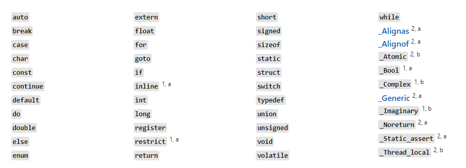
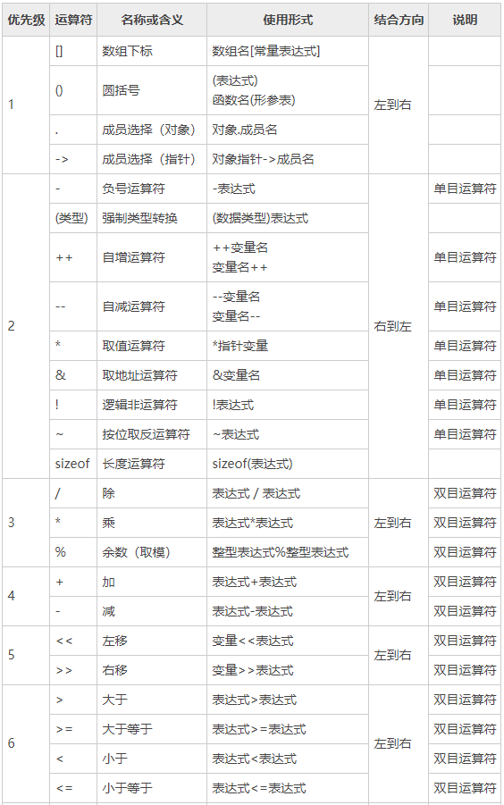
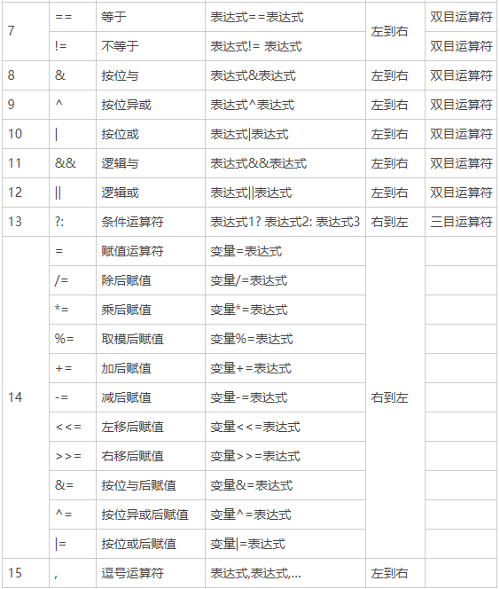

# Pointers On C

## 1. Quick Start ##

### 1.1 简介 ###

#### 1.1.2 预处理指令 ####

preprocessor directives，由预处理器解释，根据预处理指令对其进行修改，然后把修改过的源码递交给编译器。

`#define` 当这个名字以后出现在源文件的任何地方时，它就会被替换为定义的值。

函数原型 function prototype

## 2. 基本概念 ##

### 2.1 环境 ###

#### 2.1.1 翻译 ####

多个源文件经过编译过程变成目标代码(object code) 每个目标文件通过链接器(linker) 捆绑在一起，同时也会引入标准库。

**编译和链接**

1，编译一个源文件: `cc demo.c` 输出一个`a.out` 的可执行文件，中间会产生一个 `demo.o` 的目标文件

2, 编译并链接多个文件: `cc demo1.c demo2.c`

3, 编译一个c源文件，并链接现有的目标文件: `cc demo1.o demo2.c`

4, 编译并输出目标文件： `cc -c demo.c`

### 2.2 词法规则 ###

#### 2.2.1 字符 ####

特别注意一个 三字母词(trigrph) 总是以 `??` 开头，比如 `??(` 表示 `[`

#### 2.2.4 标识符 ####

c保留的关键字:



## 3. 数据 ##

### 3.1 基本数据类型 ###

四种基本数据类型：整形，浮点型，指针和聚合类型。

#### 3.1.1 整型 ####

两个角度确定整型的定义 有符号和无符号 字符，短整型，整型和长整型。

`char` `short int` `int` `long int`

头文件 `limits.h` 说明了各种不同的整数类型的特点。

#### 3.1.2 浮点数 ####

`float` `double` `long double` 

#### 3.1.3 指针 ####

1，指针常量 pointer constant

有一个特殊的指针 `NULL` 它可以用零值来表示。

2，字符串常量 string literal

一串以 `NUL (\0)`  字节结尾的零个或者多个字符。

### 3.2 基本声明 ###

#### 3.2.3 声明指针 ####

```c
int *a;
```

这条语句表达式 `*a` 产生的结果类型是 int 。 `*` 表示间接访问操作。

```c
int* a,b,c;
int *a,*b,*c;
```

在声明指针变量时，可以为它指定初始值。

```c
char *msg = "hello world";
// 把 message 声明为一个指向字符的指针，并用字符串常量中第一个字符的地址对该指针进行初始化。
```

```c
char *msg1 = "hello world";
char *msg;
msg = "hello world";
```

#### 3.2.4 隐式声明 ####

函数如果不显式地声明返回值的类型，它就默认会返回整型。

### 3.3 typedef ###

允许为各种数据类型定义新名字。

```c
cahr *ptr_to_char;
typedef char *ptr_to_char;

// 那么以后 ptr_to_char 就代表 char *
```

### 3.4 常量 ###

使用 `const` 声明常量，使他们的值不能修改。

其次，在函数中声明为const的形参在函数被调用时会得到实参的值。

指针变量和它所指向的实体可以成为常量：

```c
int *pi;
int const *pci; // 指向整型常量的指针，可以修改指针的值，但不能修改它所指向的值。
int *const cpi; // 指向整型的常量指针。指针是常量，它的地址无法修改，但可以修改他所指向的整型的值。

/*
pci --> 可以看作 *pci 产生的结果是 int const,所以表示指向整型常量。
cpi --> 可以看作 *const cpi 产生的结果是int, 而const作用于 cpi。

*/
```

### 3.5 作用域 ###

编译器可以确认四种不同类型的作用域：文件作用域，函数作用域。代码块作用域。原型作用域。

#### 3.5.1 代码块作用域 ####

任何在代码块开始位置声明的标识符都具有代码块作用域

#### 3.5.2 文件作用域 ####

#### 3.5.3 原型作用域 ####

只适用于函数原型中声明的参数名。

#### 3.5.4 函数作用域 ####

### 3.6 链接属性 ###

标识符的链接属性决定如何处理在不同文件中出现的标识符。标识符的作用域与它的链接属性有关，但这两个属性并不相同。

- none: 单独的个体，该标识符的多个声明被当作不同的实体。
- internal: 在同一个源文件内的所有声明都指向同一个实体。
- external: 位于不同源文件的标识符表示同一个实体。

```c
typedef char *a;
int b;

int c(int d) {
    int e;
    int f(int g);
}

/*
默认情况下， b c f 的链接属性为external。其他的为none。

*/
```

- static 修改标识符的链接属性，如果某个声明在正常情况下具有 external 链接属性，那么 static 可以将其更改为 internal 
  `static int b;`
- extern：为一个标识符指定 external 链接属性。只能作用于标识符第一次声明，不会改变由第一次声明所指定的链接属性。

### 3.7 存储类型 ###

变量的存储类型决定变量何时创建，何时销毁，值会保持多久。三个地方可以用于存储变量：普通内存，运行时堆栈，硬件寄存器。

任何在代码块之外声明的变量总是存储于静态内存中。

在代码块内部声明的变量的缺省存储类型是自动的 automatic 存储于堆栈中，称为自动变量。该代码块要执行时，变量才被创建，代码块执行结束时，这些自动变量将被销毁。

对于在代码块内部声明的变量，如果加上 `static` ,可以将存储类型改变为静态。

`register` 可用于自动变量的声明，改变其为寄存器变量。

**初始化**

注意静态变量和自动变量初始化时的区别。

### 3.8 static 关键字 ###

两个使用方式，改变链接属性和改变存储方式。

## 4. 语句 ##

### 4.6 for语句 ###

```c
for(expression1;expression2;expression3) {
    
}
/*
1. 初始化 执行一次
2. 条件部分，循环体执行前执行
3. 调整部分，循环体每次执行完毕，在条件部分执行之前执行。

for while 不同可能会跳过调整部分。

*/
```

## 5. 操作符和表达式 ##

### 5.1 操作符 ###

#### 5.1.1 算术操作符 ####

`+ - * / %`

#### 5.1.2 移位操作符 ####

`<<` 左移操作符

`>>` 右移操作符, 分为逻辑移位和算术移位

#### 5.1.3 位操作符 ####

AND: &

OR: |

XOR: ^

#### 5.1.4 赋值 ####

赋值操作符把右操作数的值存储于左操作数指定的位置。赋值也是个表达式，表达式的值就是左操作数的新值。

**复合赋值符**

`+= -= *= /= %= <<= >>= &= ^= |=`

#### 5.1.5 单目操作符 ####

```c
! ++ - & sizeof 
~ -- + * 
```

- `!` 执行逻辑反操作

- `~` 对整型进行求补

- `&` 产生它的操作数的地址

  ```c
  int a, *b;
  b = &a;
  ```

- `*` 间接访问操作符。访问指针所指向的值。

- `(type)` 强制类型转换。

++variable --> 操作数的值被增加，表达式的值就是操作数增加后的值。

#### 5.1.6 关系操作符 ####

```c
>    >=   <    <=   !=     ==
```

产生的结果是一个整型值。

#### 5.1.7 逻辑操作符 ####

`&&` `||` 

#### 5.1.8 条件操作符 ####

`expression1 ? expression2 : expression3`

#### 5.1.9 逗号操作符 ####

#### 5.1.10 下标引用，函数调用和结构成员 ####

以下操作是等价的：

```c
array[index];
*(array + (index));
```

访问结构成员： `.` `->` 后面的操作符表示但我有一个结构指针时，要访问其成员需要使用 `->`

### 5.2 Boolean ###

零是假，任何非零值都是真。

### 5.3 左值和右值 ###

demo: `a = b + 23`

左值因为它标识了一个可以存储结果值得地方 / 右值：指定了一个值。

| 表达式    | 是左值吗                                     |
| --------- | -------------------------------------------- |
| array[1]  | 是；一个数组元素是一个具有位置的对象         |
| &array[1] | 否；此对象的位置，并非一个具有位置的对象     |
| ptr       | 是；此指针变量是一个具有位詈的对象           |
| *ptr      | 是；指针所指的地方是一个具有位置的对象       |
| ptr+1     | 否；此加法产生一个新的地址值，但不是一个对象 |
| *ptr+l    | 否；此加法产生一个新的算术值，但不是一个对象 |

### 5.4 表达式求值 ###

#### 5.4.1 隐式类型转换 ####

c中的整型算术运算总是至少以缺省整型类型的精度来进行的，为了获得这个精度，表达式中的字符型和短整型操作数在使用之前被转换为普通整型--> 整型提升。

#### 5.4.2 算术转换 ####

如果操作数属于不同类型，那么会进行类型转换：

```console
long double
double
float
unsigned long int
long int
unsigned int
int
```

#### 5.4.3 操作符的属性 ####

操作符的优先级，操作符的结合性，操作符是否控制执行的顺序。

C语言中大多数运算符的结合性都是从左往右，只有三个运算符是从右往左的。一个是**单目运算符**，另一个是**三目运算符**，还有一个就是**双目运算符中的赋值运算符**`=`。双目运算符中只有赋值运算符的结合性是从右往左的，其他的都是从左往右。运算符的“结合性”也不要死记，在不断使用中就记住了。





对于优先级：算术运算符 > 关系运算符 > 逻辑运算符 > 赋值运算符。逻辑运算符中“逻辑非 !”除外。

| 优先级问题                                    | 表达式               | 经常误认为的结果                                        | 实际结果                                                     |
| --------------------------------------------- | -------------------- | ------------------------------------------------------- | ------------------------------------------------------------ |
| . 的优先级高于 *（-> 操作符用于消除这个问题） | *p.f                 | p 所指对象的字段 f，等价于： (*p).f                     | 对 p 取 f 偏移，作为指针，然后进行解除引用操作，等价于： *(p.f) |
| [] 高于 *                                     | int *ap[]            | ap 是个指向 int 数组的指针，等价于： int (*ap)[]        | ap 是个元素为 int 指针的数组，等价于： int *(ap [])          |
| 函数 () 高于 *                                | int *fp()            | fp 是个函数指针，所指函数返回 int，等价于： int (*fp)() | fp 是个函数，返回 int*，等价于： int* ( fp() )               |
| == 和 != 高于位操作                           | (val & mask != 0)    | (val &mask) != 0                                        | val & (mask != 0)                                            |
| == 和 != 高于赋值符                           | c = getchar() != EOF | (c = getchar()) != EOF                                  | c = (getchar() != EOF)                                       |
| 算术运算符高于位移 运算符                     | msb << 4 + lsb       | (msb << 4) + lsb                                        | msb << (4 + lsb)                                             |
| 逗号运算符在所有运 算符中优先级最低           | i = 1, 2             | i = (1,2)                                               | (i = 1), 2                                                   |

## 6. 指针 Pointer ##

### 6.1 内存和地址 ###

### 6.2 值和类型 ###

变量的值就是分配给该变量的内存位置所存储的数值，即使变量也不例外。

### 6.4 间接访问操作 ###

### 6.6 NULL指针 ###

测试一个指针变量是否为NULL，可以将它与零值进行比较。

### 6.7 指针 间接访问和左值 ###

### 6.8 指针 间接访问和变量 ###

### 6.9 指针常量 ###

```c
*100 = 25;

*(int *)100 = 25; // 强制类型转换100 为 int指针，将25赋值给 100 地址。
```

### 6.10 指针的指针 ###

`*` 操作符具有从右到左的结合性。

有如下的声明：

```c
int main(void) {
    int a = 22;
    int *b = &a;

    int **c = &b;
    return 0;
}
/*
*c 是一个 int* 类型的变量 变量b的值是 a的地址。
**c 是一个 int 类型的变量 访问方式： *c --> b **c --> *b  --> a

*/
```

### 6.11 指针表达式 ###

```c
char ch = 'c';
char *cp = &ch;

/*
1, ch 作为右值，表达式结果为 'a'
   ch 作为左值，表示ch那个位置或者说那个地址
   
2, &ch  作为右值，结果是ch的地址
   &ch  作为左值，结果是非法的，因为地址确实会保存于某个地址，但是无法知道它处于何处。
   
3, cp   右: 指针变量的值
        左: cp所处的内存位置
        
4, &cp  右：保存指针cp的地址
        左: 非法

5, *cp  右: 间接访问，cp指针指向地址的值
        左: 实际上是修改 *cp 指向地址的值。
        
6, *cp + 1    右: 向算*cp 得到 'a' 再加1 得到 'b'
              左: 由于整体结果并没有明确位置，所以是非法的

7, *(cp + 1)  右: 先把cp指针变量加1，再 * 指向 ch的后面
              左: 修改ch后面那个位置的值

8, ++cp       右: 增加cp的值, 使cp的地址值加1，
              左: 由于不知道++cp 会放到哪个位置，非法

9, *++cp      右: 间接访问作用于增值后的指针拷贝上，所以结果是ch后面那个内存地址的值。
              左: 那个地址本身

10, *cp++     右: ch变量
              左: ch变量的位置
              三个操作: ++ 产生一份拷贝， ++操作符增加cp的值 在cp的拷贝上执行间接访问
              
11, ++*cp     右: 先执行间接访问，再把结果加1 得到 'b'
              左：由于增量是在拷贝后得到的，位置未明确定义，非法              

指针的加法结果是个右值，因为它的存储位置并未清晰定义。

*/
```

### 6.12 Demo ###

```c
#include <stdio.h>

#define TRUE 1
#define FALSE 0


int string_len(const char *);

int find_char(char **strings, char value) {
    char *string;

    while ((string = *strings++) != NULL) {

        while (*string != '\0') {
            if (*string++ == value) {
                return TRUE;
            }
        }
    }
    return FALSE;
}


int main() {
    // char *demo = "hello world";
    //
    // int len = string_len(demo);
    // printf("demo len: %d", len);
    // return 0;

    char *demo[5] = {"a", "b", "C", "D", "E"};

    int flag = find_char(demo, 'a');
    printf("the result of flag: %d", flag);

    return 0;
}


int string_len(const char *str) {

    int len = 0;

    while (*str++ != '\0') {
        len += 1;
    }

    return len;
}
```

### 6.13 指针运算 ###

当一个指针和一个整数执行算术运算是，整数在执行加法前始终会根据合适的大小进行调整。指针所指向类型的大小，调整是把整数和类型大小相乘。

第二种情况是: 指针 - 指针

相减的结果类型是 `ptrdiff_t` 指的是两个指针在内存中的距离，结果会除以数组元素类型的长度。

第三种 指针也支持关系运算 `<` `>`

## 7. 函数 ##

### 7.3 函数的参数 ###

传值调用。

### 7.6 可变参数列表 ###

#### 7.6.1 stdarg宏 ####

可变参数通过宏来实现，

这个头文件声明了一个类型 `va_list` 和 三个宏 `va_start` `va_arg` `va_end` 

```c
#include <stdarg.h>
#include <stdio.h>


float average(int n_values, ...) {

    va_list var_arg;
    int count;
    float sum = 0;

    va_start(var_arg, n_values);

    for (count = 0; count < n_values; count += 1) {
        sum += va_arg(var_arg, int);
    }

    va_end(var_arg);


    return sum / (float) n_values;
}
```

## 8. 数组 ##

#### 8.1.1 数组名 ####

数组名的值是一个指针常量，数组第一个元素的地址。指向 int的常量指针。

只有当数组名再表达式中使用时，编译器才会为它产生一个指针常量。

sizeof 返回数组的长度。

`&` 取一个数组名的地址所产生的是一个指向数组的指针。

#### 8.1.2 下标引用 ####

```c
*(b+3); // b是一个指向int的指针，加3指向第四个元素， * 间接访问获取第四个元素。所以以下表达式相同:

array[idx];
*(array + idx)
```

例如以下操作:

```c
int array[10];
int *ap = array + 2;

/*
ap      --> array+2 or &array[2]
*ap     --> array[2] or *(array + 2)
ap[0]   --> 等价于间接访问 *(ap+0) --> array[2]
ap+6    --> ap是个指针那么 array+8
*ap+6   --> array[2] + 6 --> 一个int值
*(ap+6) --> array[8]
ap[6]   --> *(ap+6) --> array[8]
&ap     --> 获取ap自身的地址
ap[-1]  --> array[1]
ap[9]   --> array[11]
2[array]  --> *(2 + (array)) --> *(array + 2) --> array[2]

*/
```

#### 8.1.3 指针与下标 ####

下标绝不会比指针更有效，但指针有时会比下标更有效

#### 8.1.5 数组和指针 ####

```c
int a[5];
int *b;

/*
a 已经分配了五个int的内存空间
但是b还是未被初始化的指针

*/
```

#### 8.1.6 作为函数参数的数组名 ####

对数组名的传递将会退化为指针。

这个参数实际上是通过传值方式传递的，函数得到的是该指针的一份拷贝，它可以被修改，但调用程序的实参并不受影响。

#### 8.1.7 声明数组参数 ####

```c
int strlen(char *str);
int strlen(char str[]);
```

以上两个函数原型其实是一致的。推荐使用指针的声明方式。

#### 8.1.8 初始化 ####

#### 8.1.11 字符数组的初始化 ####

字符数组和字符串的区别。

```c
char msg[] = "hello";
char msg[] = {'j', 'k', 0};
char *msg = "hello";
```

### 8.2 多维数组 ###

### 8.3 指针数组 ###

`int *api[10]` api是个数组，它的元素类型是指向整型的指针。

## 9. 字符串 字符和字节 ##

### 9.1 Base of string ###

`size_t` 在头文件 `stddef.h` 中定义。

## 10. 结构和联合 ##

### 10.1 结构基础知识 ###

#### 10.1.1 结构声明 ####

`struct tag {member-list} variable-list;`

```c
struct {
    int a;
    char b;
    float c;
} x;

struct {
    int a;
    char b;
} y[20], *z;

struct SIMPLE {
    int a;
    char b;
    float c;
};

typedef struct SIMPLE {
    int a;
    char b;
    float c;
}
```

#### 10.1.4 结构成员的间接访问 ####

```c
(*cp).f; // 优先级的问题所以设计了一个 -> 操作符
cp->f
```

#### 10.1.5 结构的自引用 ####

非法的自引用:

```c
struct DEMO {
    int a;
    int c;
    struct DEMO b;
};
```

#### 10.1.7 结构的初始化 ####

### 10.2 结构 指针和成员 ###

```c
typedef struct {
    int a;
    short b[2];
} Ex2;

typedef struct Ex {
    int a;
    char b[3];
    Ex2 c;
    struct Ex *d;
} Ex;


int main() {
    Ex x = {10, {'1', '2', '3'}, {5, {-10, -20}}, 0};
    Ex *px = &x;

    return 0;
}

/*
1. 访问指针
px --> R: px的地址
       L: px的旧值被新值所取代

px+1 --> R: px的后一个地址
         L: px+1的拷贝没有任何意义，所以是非法的

2. 访问结构
*px   --> R: 结构
          L: 可以把表达式赋值给另一个类型相同的结构

*px + 1  --> R: 非法，类型不同不能相加
             L: 

3. 访问结构成员
*(px + 1) --> R: 结构体x后面的一个item
              L: 将新的结构体放到item后面

int *pi;
pi = &px->a; //  -> 优先级高于&
*px: 结果是整个struct  *pi的结果是一个int值

4. 访问嵌套的结构
px->c 访问整个结构，有右值
px->c.a 访问内部结构c的成员a 

*px->c.b  结构是一个指针常量，先 px->c --> .b --> * 指向数组的第一个元素。

5. 访问成员指针
px->d   结果是一个指向d结构的指针，只不过现在是0.
*px->d  结果是自身嵌套的结构体

*/
```

### 10.3 结构的存储分配 ###

要考虑内存分配对齐的问题，所以一般性原则是把大类型的都排前面。

`offsetof` 确认结构的某个成员的实际位置。

### 10.4 作为函数参数的结构 ###

```c
typedef struct {
    int a;
    int b;
} Demo;

void print_demo(Demo demo);
```

c语言中参数传值调用要求把参数的一份拷贝传递给函数。所以一般建议将结构体指针作为函数形参。

### 10.5 位段 ###

### 10.6 联合 ###

## 11. 动态内存分配 ##

### 11.2 malloc 和 free ###

执行内存分配和释放。

```c
// stdlib.h
void *malloc(size_t size);
void free(void *pointer);

void *calloc(size_t num_elements, size_t element_size); // 返回内存指针之前把它初始化为0, 
void realloc(void *ptr, size_t new_size); // 修改一个原先已经分配的内存块大小。
```

### 11.4 使用动态分配的内存 ###

```c
int *pi;

pi = malloc(25 * sizeof(int));
if (pi == NULL) {
    printf("out of memory;");
    exit(1);
}
```

传递给free的指针必须是malloc calloc realloc 函数返回的指针。

### 11.6 Demo ###

```c
//
// Created by Liberty on 2021/5/16.
//

#include <stdlib.h>
#include <stdio.h>


int compare_integers(void const *a, void const *b) {
    register int const *pa = a;
    register int const *pb = b;
    return *pa > *pb ? 1 : *pa < *pb ? -1 : 0;
}

int main() {
    int *array;
    int n_values;
    int i;

    printf("How many values are there? ");
    if (scanf("%d", &n_values) != 1 || n_values <= 0) {
        printf("Illegal number of values.\n");
        exit(EXIT_FAILURE);
    }

    array = malloc(n_values * sizeof(int));
    if (array == NULL) {
        printf("Can't get memory for that many values.\n");
        exit(EXIT_FAILURE);
    }

    for (i = 0; i < n_values; i += 1) {
        printf("? ");
        if (scanf("%d", array + i) != 1) {
            printf("Error reading value #%d\n", i);
            exit(EXIT_FAILURE);
        }
    }

    qsort(array, n_values, sizeof(int), compare_integers);
    for (i = 0; i < n_values; i += 1) {
        printf("%d\n", array[i]);
    }
    free(array);
    return EXIT_SUCCESS;

}
```

## 12. 使用结构和指针 ##

## 13. 高级指针话题 ##

### 13.1 进一步讨论指向指针的指针 ###

```c
#include <stdio.h>

int main () {

    int i = 12;
    int *pi = &i;
    int **ppi = &pi;

    printf("&pi = %d\n", &pi);
    printf("ppi = %d\n", ppi);
    printf("&ppi is %d\n", &ppi);
    return 0;

}
/*
&pi = -13264
ppi = -13264
&ppi is -13272

*/
```

变量名在函数的作用域内部是未知的。函数所拥有的只是一个指向需要修改内存位置的指针 。

### 13.2 高级声明 ###

```c
int f;
int *f;
int *f, g;
int f();
int *f();  // 根据优先级，首先执行的是函数调用操作符，所以f返回值是一个int*的类型。

int (*f)(); // f成为了一个函数指针，函数的返回值是一个整数。
int *(*f)(); // f也是一个函数指针，返回值是一个int* 类型。

int *f[];  // 下标的优先级更高，f是一个数组，它的元素类型指向整数型的指针。
int f()[];  // f是一个函数，返回值是一个数组。非法
int f[]();  
int (*f[])();  // 表达式的 *f[] 首先进行求值，所以f是一个元素为某种类型的指针的数组。数组元素的类型是函数指针，它所指向的函数的返回值是一个整数型。
int *(*f[])();

int (*f)(int, float); // f是一个函数指针。
int *(*g[])(int, float);

```

### 13.3 函数指针 ###

```c
// 函数指针也需要初始化

int f(int);
int (*pf)(int) = &f; // & 操作符是可选的，因为函数名被使用时总是由编译器把他转换为函数指针。

// 调用方式
int ans;
ans = f(25);
ans = (*pf)(25);
ans = pf(25);  // 编译器需要一个函数指针。
```

#### 13.3.1 回调函数 ####

```c
Node *search_list(Node *node, void const *value, int (*compare)(void const *, void const *)) {
    while (node != NULL) {
        if (compare(&node->value, value) == 0) {
            break;
        }
        node = node->next;
    }
    return node;
}

int compare_int(void const *a, void const *b) {
    if (*(int *) a == *(int *) b) {
        return 0;
    } else {
        return 1;
    }
}
```

#### 13.3.2 转移表 ####

### 13.4 命令行参数 ###

```c
int main(int argc, char **argv);
```

## 14. 预处理器 ##

```c
#define reg register;
#define do_forever for(;;)
#define CASE break;case

#include <stdlib.h>
#include <stdio.h>

#define reg register;
#define do_forever for(;;)
#define CASE break;case

#define DEBUG_PRINT printf("file %s line %d \n", __FILE__, __LINE__)

int main(int argc, char **argv) {

    DEBUG_PRINT;
    printf("file: %s\n", __DATE__);
    printf("file: %s\n", __TIME__);
    printf("file: %d\n", __STDC__);

    while (*++argv != NULL) {
        printf("%s\n", *argv);
    }
    return EXIT_SUCCESS;

}
```

#### 14.2.1 宏 ####

允许把参数替换到文本中，这种实现通常称为宏 `macro` 

`#define name(parameter-list) stuff`

```c
#define SQUARE(X) X*X

int a = 4;
SQUARE(a+1);  // 4+1*4+1 --> 9

#define DOUBLE(X) (X)+(X)
double a = 10 * DOUBLE(10);  // 10 * (10) + (10) --> 110
#define DOUBLE(X) ((X)+(X))
```

#### 14.2.2 #define 替换 ####

```c
#define PRINT(FORMAT, VALUE) printf("The value is " FORMAT "\n", VALUE)
#define PRINT2(FORMAT, VALUE) printf("The value of " #VALUE " is " FORMAT "\n", VALUE)
// #argument 翻译为 argument

int main(int argc, char **argv) {

    int a = 5;
    int b = SQUARE(5+1);
    printf("result of SQUARE is: %d\n", b);

    PRINT("%d", a);
    PRINT2("%d", a);
}

#define ADD_TO_SUM(sum_number, value) sum ## sum_number += value
int main(int argc, char **argv) {
    int i;
    int sum5 = 9;
    i = ADD_TO_SUM(5,23);
}
```

#### 14.2.3 宏与函数 ####

`#define MAX(a,b) ( (a) > (b) ? (a) : (b) )`

`#define MALLOC(n, type) ( (type *)malloc( (n) * sizeof( type ) ) )`

宏与类型无关。

#### 14.2.4 带副作用的宏参数 ####

#### 14.2.5 命名约定 ####

#### 14.2.6 #undef ####

用于移除一个宏定义: `#undef name`

#### 14.2.7 命令行定义 ####

```c
/*
-Dname
-Dname=stuff

cc -DARRAY_SIZE=100 prog.c

同理 -Uname 去除符号定义

*/
```

### 14.3 条件编译 ###

```c
//
// Created by Liberty on 2021/5/17.
//

#include <stdlib.h>

#define DEBUG 1

#if DEBUG

#define HELLO hello

#else

#define HELLO world 

#endif


int main(int argc, char **argv) {

    return 0;
}
```

#### 14.3.1 是否被定义 ####

```c
#ifdef HELLO
#define WORLD world
#endif
```

### 14.4 文件包含 ###

```c
#ifndef POINTERSONC_DEMO_H
#define POINTERSONC_DEMO_H

#endif //POINTERSONC_DEMO_H
```

### 14.5 其他指令 ###

## 15. 输入输出函数 ##

### 15.1 错误报告 ###

`perror` 函数定义于stdio.h 中

### 15.2 终止执行 ###

`exit`函数定义于 stdlib.h 中。

### 15.4 ANSI I/O ###

#### 15.4.1 流 ####

绝大多数流是完全缓冲的 (full buffered) ，这意味着 读取和写入实际上是从一块被称为缓冲区的内存区域来回复制数据。

#### 15.4.2 文件 ####

stdio.h 定义了 FILE 结构体。对于每个ANSI C 运行时系统必须提供三个流 stdin stdout stderr

#### 15.4.3 标准IO常量 ####

### 15.5 流I/O总览 ###

1. 为每个文件声明一个指针变量 FILE *
2. 通过fopen函数打开
3. 对该文件进行读取或者写入
4. fclose 函数关闭流

标准I/O 不需要打开或关闭

I/O函数以三种基本的形式处理数据: 单个字符，文本行和二进制数据。

| data type  | In           | Out           | Description |
| ---------- | ------------ | ------------- | ----------- |
| 字符       | getchar      | putchar       |             |
| 文本行     | gets / scanf | puts / printf |             |
| 二进制数据 | fread        | fwrite        |             |

### 15.6 打开流 ###

`FILE * fopen(char const *name, char const *mode);`

## 16. 标准函数库 ##

### 16.1 整型函数 ###

### 16.3 日期和时间函数 ###

#### 16.3.1 处理器时间  ####

`clock_t clock(void);` 表示处理器滴答的次数。

#### 16.3.2 当天的时间 ####

```c
char *wday[] = {"Sun", "Mon", "Tue", "Wed", "Thu", "Fri", "Sat"};
time_t timep;
struct tm *p;
time(&timep);
p = gmtime(&timep);
printf("%d%d%d", (1900 + p->tm_year), (1 + p->tm_mon), p->tm_mday);
printf("%s%d;%d;%d\n", wday[p->tm_wday], p->tm_hour, p->tm_min, p->tm_sec);

time_t curtime;
time(&curtime);
printf("curtime is %d \n", curtime);
char* str = ctime(&curtime);
printf("date: %s \n", str);
```

## 18. 运行时环境 ##

