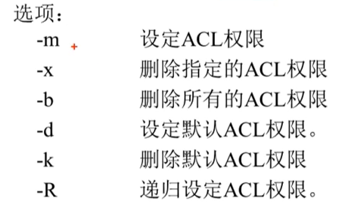
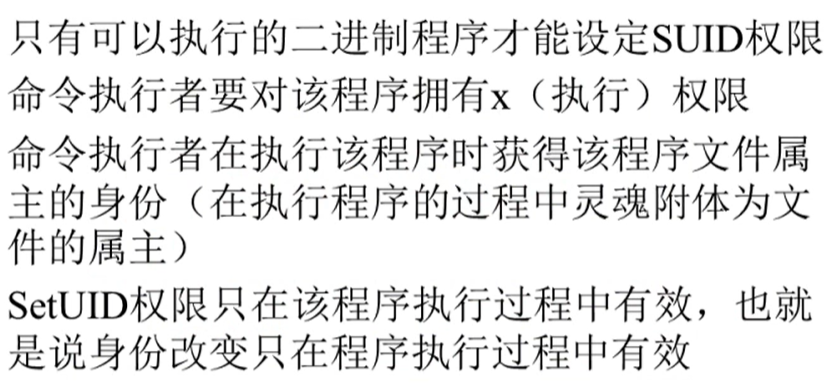
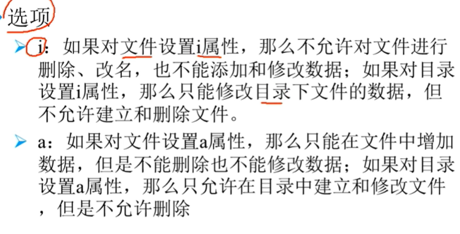

linux 权限管理
======

### ACL权限列表

**目录权限的说明**

目录文件即保存有目录结构和文件权限：

r：可读取目录结构和权限

w：可更改目录结构列表、新建、删除、重命名、转移子文件、目录

x：表示用户可进入到该目录中

**查看分区是否支持ACL**

`dumpe2fs -h /dev/sda3` 查询指定分区详细文件系统信息的命令。

`/etc/fstab` 系统开机自动挂载的分区表

**设定ACL权限的命令**

`setfacl [options] file_name`



`setfacl -m u:user01:rx /opt/dev-common`

**查看ACL权限**

```bash
[dev03@mylnx opt]$ getfacl dev-common/
# file: dev-common/
# owner: root
# group: dev_group
user::rwx
user:user01:r-x
group::rwx
mask::rwx
other::---
```

**最大有效权限 mask**

ACL权限要和mask权限 `and` 逻辑运算之后，才能得到用户的正真权限

设定 mask 权限： `setfacl =m m:rx /project/`

**清除ACL权限**

`setfacl -b [文件名/目录名]`

**递归ACL权限**

### 其他命令

#### SetUID



只有可以执行的二进制程序才能设定 SUID 权限

执行命令的人要对该文件拥有 x 权限

```bash
[root@mylnx bin]# ls -l pass*
-rwsr-xr-x. 1 root root 27856 Aug  9  2019 passwd
```

**设置SUID权限**

`chmod 4755 [filename]`

#### chattr

文件系统属性权限

`chattr [+-=] [options] file_name/flod`



#### sudo

sudo的操作对象是系统命令。 

需要管理员 `visudo` --> `/etc/sudoers`

`man 5 sudoers`

查看sudo可以执行的命令 `sudo -l`

