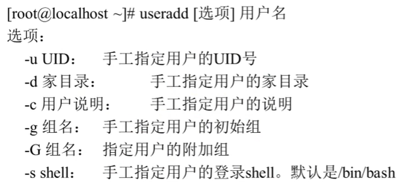
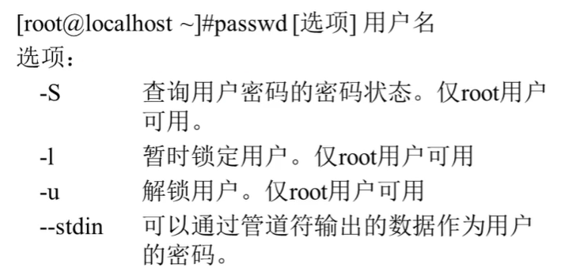
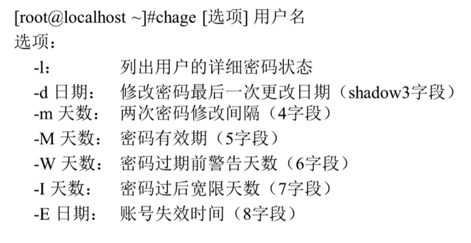

linux 用户和用户组
=====

关于用户和用户组的相关文件:

- 用户信息文件 /etc/passwd
- 影子文件 /etc/shadow
- 组信息文件 /etc/group
- 组密码文件 /etc/gshadow

###  /etc/passwd

使用 `man 5 passwd` 查看该配置文件信息。

文件格式: `name:password:UID:GID:GECOS:directory:shell`

其中 password 的 **x** 表示密码需要从 `/etc/shadow` 寻找。

`GID` 表示用户的初始组

### /etc/shadow

每个字段的解释:

1. 用户名
2. 加密之后的密码 (如果密码是 "!!" "*" 表示没有密码，不能登录)
3. 密码最后一次修改日期 (从1970-1-1的时间戳)
4. 两次密码的修改间隔时间 允许更改密码的时间间隔
5. 密码的有效期，单位为天
6. 密码的有效期的前多少天提醒用户.
7. 密码过期之后的宽限天数。
8. 账号的失效时间，用时间戳表示。
9. 保留字段

### /etc/group

1. 组的名字
2. 组的密码标识。给组管理员使用
3. GID
4. 组中附加用户

### useradd

useradd默认值配置文件: `/etc/default/useradd` `/etc/login.defs`

### passwd

### userdel 删除用户

`userdel -l [username]`  -l 同时删除用户的家目录

### 切换用户身份 su

`su -c [commands]` 仅执行命令一次，不切换用户。

### 组管理命令

`groupadd`  添加一个用户组， -g  指定组ID

`gpasswd`  -a 将用户加入组 / -d 把用户从组中删除

