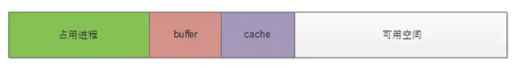
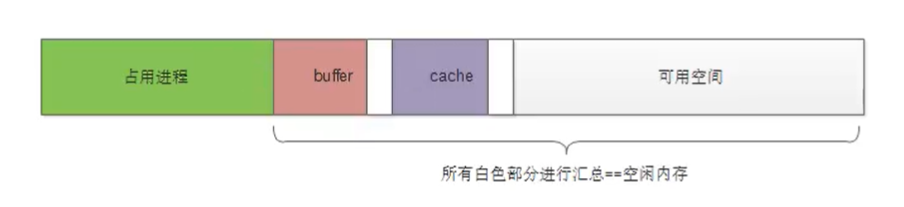
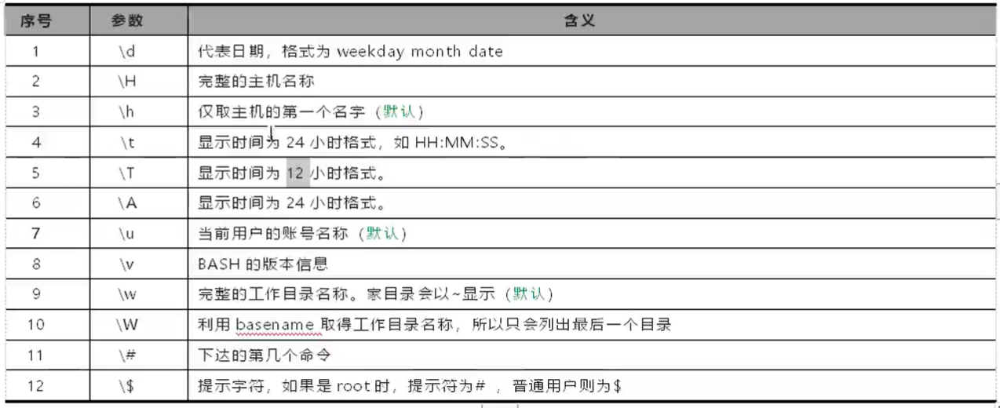

linux系统目录结构
=======

### 系统的目录结构

bin -- 存放二进制命令的目录

sbin -- 存放二进制命令的目录(root 用户)

etc -- 系统配置和服务存放的目录 (/etc/sysconfig/network-scripts 系统网卡配置目录)

proc -- 虚拟目录，显示内存中的信息 (进程，内核 ......)

### etc目录中的数据文件

`/etc/resolv.conf`  DNS解析

`/etc/hostname` 主机名配置文件

`/etc/hosts` -- 在本地建立IP地址和主机名称的对应关系

命令： `df` 查看磁盘挂载情况

`/etc/fstab` 系统开机挂载配置文件

**开机自动加载文件** /etc/rc.local

`/etc/motd` 登录之后提示文件

`/etc/issue  /etc/issue.net` 登录之前的提示文件

### 系统运行级别 target

查看系统运行级别: `runlevel`

切换运行级别: `init  1` 

---- init 0 系统的关机级别

---- init 1 进入到维修级别

---- init 2 进入到单用户级别 用于修复系统或者重置密码信息

---- init 3 系统的多用户级别

---- init 4 预留级别

---- init 5 图形化级别

---- init 6 系统重启级别

### 变量加载文件

`/etc/profile`

`source` 重新加载配置文件

**设置变量** `X=1234` 使用变量: `echo $X`

`$PATH` 系统环境变量

### 系统别名

`alias`

查看内置命令或者外置命令的方法：`type`

系统日志目录：`/var/log/messages` ----系统日志信息， `/var/log/secure` ----系统的用户登录信息

怎么样一直追踪日志文件的变化: `tail -f /var/log/secure`

### 一些参数的查看

1, CPU info: `cat /proc/cpuinfo` 或者命令查看 `lscpu`

2, Memory Info: `cat /proc/meminfo` 或者 `free -h`

3, 磁盘信息 `cat /proc/mounts` 或者使用 `df -h`

4, 查看负载 `cat /proc/loadavg` 或者使用 `uptime` `w`

### 系统命令提示符

环境变量: `PS1`

命令提示符的一些可配置参数

**su 和 su - 的区别**

su -： 会切换root用户，也会把用户变量也切换到root的环境变量
su ： 只是会切换root用户，但是当前的环境变量还是以前用户的环境变量

**关闭selinux服务程序**

`getenforce` 查看selinux服务程序

`setenforce 0` 临时关闭selinux服务程序

配置文件 `/etc/selinux/config`

**查看系统默认编码**  `echo $LANG`

