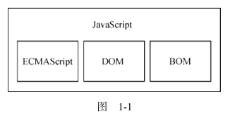
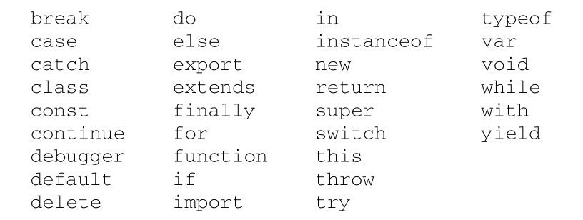

# JavaScript 高级编程v4 #

## 1. what is javascript ##

### 1.1 简短的历史回顾 ###

1995 年，网景公司一位名叫 Brendan Eich 的工程师，开始为即将发布的 Netscape Navigator 2 开发一个叫 Mocha（后来改名为 LiveScript）的脚本语言。当时的计划是在客户端和服务器端都使用它，它在服务器端叫 LiveWire。

为了赶上发布时间，网景与 Sun 公司结为开发联盟，共同完成 LiveScript 的开发。就在 Netscape Navigator 2正式发布前，网景把 LiveScript改名为 JavaScript，以便搭上媒体当时热烈炒作 Java的顺风车。

微软的 JavaScript 实现意味着出现了两个版本的 JavaScript：Netscape Navigator 中的 JavaScript，以及 IE 中的 JScript。

### 1.2 JavaScript实现 ###

虽然JavaScript和ECMAScript基本上是同义词，但JavaScript远远不限于ECMA-262所定义的那样。
没错，完整的 JavaScript 实现包含以下几个部分：

- 核心 ECMAScript
- 文档对象模型DOM
- 浏览器对象模型BOM



## 2 HTML中的JavaScript ##

### 2.1 `<script>` 元素 ###

该元素有以下的属性：

- async 可选。表示应该立即开始下载脚本，但不能阻止其他页面动作，比如下载资源或等待其他脚本加载。只对外部脚本文件有效。
- charset 可选。使用 src 属性指定的代码字符集。这个属性很少使用，因为大多数浏览器不在乎它的值。
- crossorigin 可选。配置相关请求的CORS（跨源资源共享）设置。默认不使用CORS。
- defer 可选。表示脚本可以延迟到文档完全被解析和显示之后再执行。只对外部脚本文件有效。
- integrity 可选。允许比对接收到的资源和指定的加密签名以验证子资源完整性（SRI，Subresource Integrity）。
- language 废弃。最初用于表示代码块中的脚本语言
- src 可选。表示包含要执行的代码的外部文件。
- type 可选。代替 language ，表示代码块中脚本语言的内容类型（也称 MIME 类型）。按照惯
  例，这个值始终都是 "text/javascript" 。

两种使用方式：通过它直接在网页中嵌入 JavaScript 代码，以及通过它在网页中包含外部 JavaScript 文件。

不管包含的是什么代码，浏览器都会按照 <script> 在页面中出现的顺序依次解释它们，前提是它们没有使用 defer 和 async 属性。第二个 <script> 元素的代码必须在第一个 <script> 元素的代码解释完毕才能开始解释，第三个则必须等第二个解释完，以此类推。

#### 2.1.1 标签位置 ####

现代 Web 应用程序通常将所有 JavaScript 引用放在 <body> 元素中的页面内容后面，如下面的例子所示：

```html
<!DOCTYPE html>
<html lang="en">
<head>
    <meta charset="UTF-8">
    <title>Title</title>
</head>
<body>

<!-- 这里是页面内容 -->
<script src="example1.js"></script>
<script src="example2.js"></script>
</body>
</html>
```

#### 2.1.2 推迟执行脚本 ####

defer: 脚本会被延迟到整个页面都解析完毕后再运行,相当于告诉浏览器立即下载，但延迟执行。

```html
<!DOCTYPE html>
<html>
	<head>
		<title>Example HTML Page</title>
		<script defer src="example1.js"></script>
		<script defer src="example2.js"></script>
	</head>
	<body>
	<!-- 这里是页面内容 -->
	</body>
</html>
```

HTML5 规范要求脚本应该按照它们出现的顺序执行，因此第一个推迟的脚本会在第二个推迟的脚本之前执行，而且两者都会在 DOMContentLoaded 事件之前执行

#### 2.1.3 异步执行脚本 ####

async: 告诉浏览器，不必等脚本下载和执行完后再加载页面，同样也不必等到该异步脚本下载和执行后再加载其他脚本。正因为如此，异步脚本不应该在加载期间修改 DOM。

异步脚本保证会在页面的 load 事件前执行，但可能会在 DOMContentLoaded （参见第 17 章）之前或之后。

## 3 语法基础 ##

### 3.1 语法 ###

#### 3.1.1 区分大小写 ####

#### 3.1.2 标识符 ####

所谓标识符，就是变量、函数、属性或函数参数的名称。标识符可以由一或多个下列字符组成：

- 第一个字符必须是一个字母、下划线（ _ ）或美元符号（ $ ）；
- 剩下的其他字符可以是字母、下划线、美元符号或数字。

标识符中的字母可以是扩展 ASCII（Extended ASCII）中的字母，也可以是 Unicode 的字母字符，

ECMAScript 标识符使用驼峰大小写形式，

#### 3.1.4 严格模式 ####

`"use strict"`

#### 3.1.5 语句 ####

ECMAScript 中的语句以分号结尾。省略分号意味着由解析器确定语句在哪里结尾，

### 3.2 关键字和保留字 ###

ECMA-262 描述了一组保留的关键字，这些关键字有特殊用途，比如表示控制语句的开始和结束，
或者执行特定的操作。按照规定，保留的关键字不能用作标识符或属性名。



### 3.3 变量 ###

ECMAScript 变量是松散类型的，意思是变量可以用于保存任何类型的数据。每个变量只不过是一个用于保存任意值的命名占位符。有 3 个关键字可以声明变量： var 、 const 和 let 。其中， var 在ECMAScript 的所有版本中都可以使用，而 const 和 let 只能在 ECMAScript 6及更晚的版本中使用。

#### 3.3.1 var ####

```javascript
// 不初始化的情况下，变量会保存一个特殊值 undefined
var message;
var message = "hi";
```

**1. var声明作用域**

使用 var 操作符定义的变量会成为包含它的函数的局部变量。

```javascript
function test() {
    var s2 = "hello";
}
test();
console.log(s2); // meet error
```

不过，在函数内定义变量时省略 var 操作符，可以创建一个全局变量：

```javascript
function test2() {
    s3 = "nihao";
}
test2();
console.log(s3);
```

**2. var声明提升**

使用这个关键字声明的变量会自动提升到函数作用域顶部：

```javascript
function foo() {
    console.log(age);
    var age = 23;
}

foo();
```

之所以不会报错，是因为 ECMAScript 运行时把它看成等价于如下代码：

```javascript
function foo1() {
    var age1;
    console.log(age1);
    age1 = 23;
}

foo1();
```

这就是所谓的“提升”（hoist），也就是把所有变量声明都拉到函数作用域的顶部。此外，反复多次使用 var 声明同一个变量也没有问题.

#### 3.3.2 let ####

let 跟 var 的作用差不多，但有着非常重要的区别。最明显的区别是， let 声明的范围是块作用域，而 var 声明的范围是函数作用域。

```js
if (true) {
    var name = 'Tom';
    console.log(name);
}
console.log(name);

if (true) {
    let age = 23;
    console.log(age);
}
console.log(age); // meet error
```

let 也不允许同一个块作用域中出现冗余声明。这样会导致报错.

对声明冗余报错不会因混用 let 和 var 而受影响。这两个关键字声明的并不是不同类型的变量，它们只是指出变量在相关作用域如何存在。

```js
var name;
let name; // SyntaxError
let age;
var age; // SyntaxError
```

**1. 暂时性死区**

```js
// name 会被提升
console.log(name); // undefined
var name = 'Matt';

// age 不会被提升
console.log(age); // ReferenceError：age 没有定义
let age = 26;
```

**2. 全局声明**

与 var 关键字不同，使用 let 在全局作用域中声明的变量不会成为 window 对象的属性（ var 声明的变量则会）。

```js
var name = 'Matt';
console.log(window.name); // 'Matt'

let age = 26;
console.log(window.age); // undefined
```

**3. 条件声明**

在使用 var 声明变量时，由于声明会被提升，JavaScript 引擎会自动将多余的声明在作用域顶部合并为一个声明。

因为 let 的作用域是块，所以不可能检查前面是否已经使用 let 声明过同名变量，同时也就不可能在没有声明的情况下声明它。

```html
<script>
var name = 'Nicholas';
let age = 26;
</script>

<script>
// 假设脚本不确定页面中是否已经声明了同名变量
// 那它可以假设还没有声明过
var name = 'Matt';
// 这里没问题，因为可以被作为一个提升声明来处理
// 不需要检查之前是否声明过同名变量
let age = 36;
// 如果 age 之前声明过，这里会报错
</script>
```

使用 try / catch 语句或 typeof 操作符也不能解决，因为条件块中 let 声明的作用域仅限于该块。

```js
// script1
let name = 'Nicholas';
let age = 36;

// script2
if (typeof name === 'undefined') {
    let name;
}

name = 'Matt';

try {
    console.log(age);
} catch (error) {
    let age;
}

age = 26;

```

**4. for 循环中的let声明**

在 let 出现之前， for 循环定义的迭代变量会渗透到循环体外部：

```js
for (var i = 0; i < 5; ++i) {
	// 循环逻辑
}
console.log(i); // 5
```

改成使用 let 之后，这个问题就消失了，因为迭代变量的作用域仅限于 for 循环块内部：

```js
for (let i = 0; i < 5; ++i) {
	// 循环逻辑
}
console.log(i); // ReferenceError: i 没有定义
```

在使用 var 的时候，最常见的问题就是对迭代变量的奇特声明和修改：

```js
for (var i = 0; i < 5; ++i) {
	setTimeout(() => console.log(i), 0)
}
// 你可能以为会输出 0、1、2、3、4
// 实际上会输出 5、5、5、5、5
```

#### 3.3.3 const ####

const 的行为与 let 基本相同，唯一一个重要的区别是用它声明变量时必须同时初始化变量，且尝试修改 const 声明的变量会导致运行时错误。

```js
const age = 23;
age = 36 // TypeError: 给常量赋值

// const 也不允许重复声明
const name = 'Matt';
const name = 'Nicholas'; // SyntaxError

// const 声明的作用域也是块
const name = 'Matt';
if (true) {
	const name = 'Nicholas';
}
console.log(name); // Matt
```

const 声明的限制只适用于它指向的变量的引用。换句话说，如果 const 变量引用的是一个对象，那么修改这个对象内部的属性并不违反 const 的限制。

```js
const person = {};
person.name = 'Matt'; // ok
```

### 3.4 数据类型 ###

ECMAScript 有 6 种简单数据类型（也称为原始类型）： Undefined 、 Null 、 Boolean 、 Number 、String 和 Symbol 。 Symbol （符号）是 ECMAScript 6 新增的。还有一种复杂数据类型叫 Object （对象）。

#### 3.4.1 typeof 操作符 ####

对一个值使用 typeof 操作符会返回下列字符串之一：

- undefined 值未定义
- boolean
- string
- number
- object
- function
- symbol 表示值为符号。

#### 3.4.2 undefined 类型 ####

Undefined 类型只有一个值，就是特殊值 undefined 。当使用 var 或 let 声明了变量但没有初始化时，就相当于给变量赋予了 undefined 值：

```js
let msg1;
console.log(msg1 == undefined);
```

包含 undefined 值的变量跟未定义变量是有区别的。请看下面的例子：

```js
let message; // 这个变量被声明了，只是值为 undefined
// 确保没有声明过这个变量
// let age
console.log(message); // "undefined"
console.log(age); // 报错
```

在对未初始化的变量调用 typeof 时，返回的结果是 "undefined" ，但对未声明的变量调用它时，返回的结果还是 "undefined" ，

#### 3.4.3 Null类型 ####

Null 类型同样只有一个值，即特殊值 null 。逻辑上讲， null 值表示一个空对象指针，这也是给typeof 传一个 null 会返回 "object" 的原因：

```js
let car = null;
console.log(typeof car); // "object"
```

#### 3.4.4 Boolean类型 ####

Boolean （布尔值）类型是 ECMAScript 中使用最频繁的类型之一，有两个字面值： true 和 false 。这两个布尔值不同于数值，因此 true 不等于 1， false 不等于 0。

虽然布尔值只有两个，但所有其他 ECMAScript 类型的值都有相应布尔值的等价形式。要将一个其他类型的值转换为布尔值，可以调用特定的 Boolean() 转型函数：

```js
let message = "Hello world!";
let messageAsBoolean = Boolean(message);
```

| 数据类型  | 转换为true的值 | 转换为false的值 |
| --------- | -------------- | --------------- |
| Boolean   | true           | false           |
| String    | 非空字符串     | ""              |
| Number    | 非零数值       | 0 NaN           |
| Object    | 任意对象       | null            |
| Undefined | N/A            | undefined       |

理解以上转换非常重要，因为像 if 等流控制语句会自动执行其他类型值到布尔值的转换。

#### 3.4.5 Number类型 ####

 Number 类型使用 IEEE 754格式表示整数和浮点值

**2. 值的范围**

ECMAScript 可以表示的最小数值保存在 Number.MIN_VALUE 中。

可以表示的最大数值保存在Number.MAX_VALUE 中。

任何无法表示的负数以 -Infinity （负无穷大）表示，任何无法表示的正数以 Infinity （正无穷大）表示。

要确定一个值是不是有限大（即介于 JavaScript 能表示的最小值和最大值之间），可以使用 isFinite() 函数，

**3. NaN**

有一个特殊的数值叫 NaN ，意思是“不是数值”（Not a Number），用于表示本来要返回数值的操作失败了（而不是抛出错误）。比如，用 0 除任意数值在其他语言中通常都会导致错误，从而中止代码执行。

```js
console.log(0/0); // NaN
console.log(-0/+0); // NaN

console.log(5/0); // Infinity
console.log(5/-0); // -Infinity
```

首先，任何涉及 NaN 的操作始终返回 NaN （如 NaN/10 ），在连续多步计算时这可能是个问题。其次， NaN 不等于包括 NaN 在内的任何值。

为此，ECMAScript 提供了 isNaN() 函数。该函数接收一个参数，可以是任意数据类型，然后判断这个参数是否“不是数值”。

