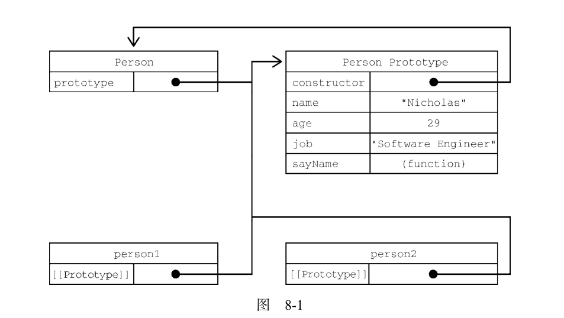

# JavaScript 高级编程v4 #

## 1. what is javascript ##

### 1.1 简短的历史回顾 ###

1995 年，网景公司一位名叫 Brendan Eich 的工程师，开始为即将发布的 Netscape Navigator 2 开发一个叫 Mocha（后来改名为 LiveScript）的脚本语言。当时的计划是在客户端和服务器端都使用它，它在服务器端叫 LiveWire。

为了赶上发布时间，网景与 Sun 公司结为开发联盟，共同完成 LiveScript 的开发。就在 Netscape Navigator 2正式发布前，网景把 LiveScript改名为 JavaScript，以便搭上媒体当时热烈炒作 Java的顺风车。

微软的 JavaScript 实现意味着出现了两个版本的 JavaScript：Netscape Navigator 中的 JavaScript，以及 IE 中的 JScript。

### 1.2 JavaScript实现 ###

虽然JavaScript和ECMAScript基本上是同义词，但JavaScript远远不限于ECMA-262所定义的那样。
没错，完整的 JavaScript 实现包含以下几个部分：

- 核心 ECMAScript
- 文档对象模型DOM
- 浏览器对象模型BOM


## 2 HTML中的JavaScript ##

### 2.1 `<script>` 元素 ###

该元素有以下的属性：

- async 可选。表示应该立即开始下载脚本，但不能阻止其他页面动作，比如下载资源或等待其他脚本加载。只对外部脚本文件有效。
- charset 可选。使用 src 属性指定的代码字符集。这个属性很少使用，因为大多数浏览器不在乎它的值。
- crossorigin 可选。配置相关请求的CORS（跨源资源共享）设置。默认不使用CORS。
- defer 可选。表示脚本可以延迟到文档完全被解析和显示之后再执行。只对外部脚本文件有效。
- integrity 可选。允许比对接收到的资源和指定的加密签名以验证子资源完整性（SRI，Subresource Integrity）。
- language 废弃。最初用于表示代码块中的脚本语言
- src 可选。表示包含要执行的代码的外部文件。
- type 可选。代替 language ，表示代码块中脚本语言的内容类型（也称 MIME 类型）。按照惯
  例，这个值始终都是 "text/javascript" 。

两种使用方式：通过它直接在网页中嵌入 JavaScript 代码，以及通过它在网页中包含外部 JavaScript 文件。

不管包含的是什么代码，浏览器都会按照 <script> 在页面中出现的顺序依次解释它们，前提是它们没有使用 defer 和 async 属性。第二个 <script> 元素的代码必须在第一个 <script> 元素的代码解释完毕才能开始解释，第三个则必须等第二个解释完，以此类推。

#### 2.1.1 标签位置 ####

现代 Web 应用程序通常将所有 JavaScript 引用放在 <body> 元素中的页面内容后面，如下面的例子所示：

```html
<!DOCTYPE html>
<html lang="en">
<head>
    <meta charset="UTF-8">
    <title>Title</title>
</head>
<body>

<!-- 这里是页面内容 -->
<script src="example1.js"></script>
<script src="example2.js"></script>
</body>
</html>
```

#### 2.1.2 推迟执行脚本 ####

defer: 脚本会被延迟到整个页面都解析完毕后再运行,相当于告诉浏览器立即下载，但延迟执行。

```html
<!DOCTYPE html>
<html>
	<head>
		<title>Example HTML Page</title>
		<script defer src="example1.js"></script>
		<script defer src="example2.js"></script>
	</head>
	<body>
	<!-- 这里是页面内容 -->
	</body>
</html>
```

HTML5 规范要求脚本应该按照它们出现的顺序执行，因此第一个推迟的脚本会在第二个推迟的脚本之前执行，而且两者都会在 DOMContentLoaded 事件之前执行

#### 2.1.3 异步执行脚本 ####

async: 告诉浏览器，不必等脚本下载和执行完后再加载页面，同样也不必等到该异步脚本下载和执行后再加载其他脚本。正因为如此，异步脚本不应该在加载期间修改 DOM。

异步脚本保证会在页面的 load 事件前执行，但可能会在 DOMContentLoaded （参见第 17 章）之前或之后。

## 3 语法基础 ##

### 3.1 语法 ###

#### 3.1.1 区分大小写 ####

#### 3.1.2 标识符 ####

所谓标识符，就是变量、函数、属性或函数参数的名称。标识符可以由一或多个下列字符组成：

- 第一个字符必须是一个字母、下划线（ _ ）或美元符号（ $ ）；
- 剩下的其他字符可以是字母、下划线、美元符号或数字。

标识符中的字母可以是扩展 ASCII（Extended ASCII）中的字母，也可以是 Unicode 的字母字符，

ECMAScript 标识符使用驼峰大小写形式，

#### 3.1.4 严格模式 ####

`"use strict"`

#### 3.1.5 语句 ####

ECMAScript 中的语句以分号结尾。省略分号意味着由解析器确定语句在哪里结尾，

### 3.2 关键字和保留字 ###

ECMA-262 描述了一组保留的关键字，这些关键字有特殊用途，比如表示控制语句的开始和结束，
或者执行特定的操作。按照规定，保留的关键字不能用作标识符或属性名。


### 3.3 变量 ###

ECMAScript 变量是松散类型的，意思是变量可以用于保存任何类型的数据。每个变量只不过是一个用于保存任意值的命名占位符。有 3 个关键字可以声明变量： var 、 const 和 let 。其中， var 在ECMAScript 的所有版本中都可以使用，而 const 和 let 只能在 ECMAScript 6及更晚的版本中使用。

#### 3.3.1 var ####

```javascript
// 不初始化的情况下，变量会保存一个特殊值 undefined
var message;
var message = "hi";
```

**1. var声明作用域**

使用 var 操作符定义的变量会成为包含它的函数的局部变量。

```javascript
function test() {
    var s2 = "hello";
}
test();
console.log(s2); // meet error
```

不过，在函数内定义变量时省略 var 操作符，可以创建一个全局变量：

```javascript
function test2() {
    s3 = "nihao";
}
test2();
console.log(s3);
```

**2. var声明提升**

使用这个关键字声明的变量会自动提升到函数作用域顶部：

```javascript
function foo() {
    console.log(age);
    var age = 23;
}

foo();
```

之所以不会报错，是因为 ECMAScript 运行时把它看成等价于如下代码：

```javascript
function foo1() {
    var age1;
    console.log(age1);
    age1 = 23;
}

foo1();
```

这就是所谓的“提升”（hoist），也就是把所有变量声明都拉到函数作用域的顶部。此外，反复多次使用 var 声明同一个变量也没有问题.

#### 3.3.2 let ####

let 跟 var 的作用差不多，但有着非常重要的区别。最明显的区别是， let 声明的范围是块作用域，而 var 声明的范围是函数作用域。

```js
if (true) {
    var name = 'Tom';
    console.log(name);
}
console.log(name);

if (true) {
    let age = 23;
    console.log(age);
}
console.log(age); // meet error
```

let 也不允许同一个块作用域中出现冗余声明。这样会导致报错.

对声明冗余报错不会因混用 let 和 var 而受影响。这两个关键字声明的并不是不同类型的变量，它们只是指出变量在相关作用域如何存在。

```js
var name;
let name; // SyntaxError
let age;
var age; // SyntaxError
```

**1. 暂时性死区**

```js
// name 会被提升
console.log(name); // undefined
var name = 'Matt';

// age 不会被提升
console.log(age); // ReferenceError：age 没有定义
let age = 26;
```

**2. 全局声明**

与 var 关键字不同，使用 let 在全局作用域中声明的变量不会成为 window 对象的属性（ var 声明的变量则会）。

```js
var name = 'Matt';
console.log(window.name); // 'Matt'

let age = 26;
console.log(window.age); // undefined
```

**3. 条件声明**

在使用 var 声明变量时，由于声明会被提升，JavaScript 引擎会自动将多余的声明在作用域顶部合并为一个声明。

因为 let 的作用域是块，所以不可能检查前面是否已经使用 let 声明过同名变量，同时也就不可能在没有声明的情况下声明它。

```html
<script>
var name = 'Nicholas';
let age = 26;
</script>

<script>
// 假设脚本不确定页面中是否已经声明了同名变量
// 那它可以假设还没有声明过
var name = 'Matt';
// 这里没问题，因为可以被作为一个提升声明来处理
// 不需要检查之前是否声明过同名变量
let age = 36;
// 如果 age 之前声明过，这里会报错
</script>
```

使用 try / catch 语句或 typeof 操作符也不能解决，因为条件块中 let 声明的作用域仅限于该块。

```js
// script1
let name = 'Nicholas';
let age = 36;

// script2
if (typeof name === 'undefined') {
    let name;
}

name = 'Matt';

try {
    console.log(age);
} catch (error) {
    let age;
}

age = 26;

```

**4. for 循环中的let声明**

在 let 出现之前， for 循环定义的迭代变量会渗透到循环体外部：

```js
for (var i = 0; i < 5; ++i) {
	// 循环逻辑
}
console.log(i); // 5
```

改成使用 let 之后，这个问题就消失了，因为迭代变量的作用域仅限于 for 循环块内部：

```js
for (let i = 0; i < 5; ++i) {
	// 循环逻辑
}
console.log(i); // ReferenceError: i 没有定义
```

在使用 var 的时候，最常见的问题就是对迭代变量的奇特声明和修改：

```js
for (var i = 0; i < 5; ++i) {
	setTimeout(() => console.log(i), 0)
}
// 你可能以为会输出 0、1、2、3、4
// 实际上会输出 5、5、5、5、5
```

#### 3.3.3 const ####

const 的行为与 let 基本相同，唯一一个重要的区别是用它声明变量时必须同时初始化变量，且尝试修改 const 声明的变量会导致运行时错误。

```js
const age = 23;
age = 36 // TypeError: 给常量赋值

// const 也不允许重复声明
const name = 'Matt';
const name = 'Nicholas'; // SyntaxError

// const 声明的作用域也是块
const name = 'Matt';
if (true) {
	const name = 'Nicholas';
}
console.log(name); // Matt
```

const 声明的限制只适用于它指向的变量的引用。换句话说，如果 const 变量引用的是一个对象，那么修改这个对象内部的属性并不违反 const 的限制。

```js
const person = {};
person.name = 'Matt'; // ok
```

### 3.4 数据类型 ###

ECMAScript 有 6 种简单数据类型（也称为原始类型）： Undefined 、 Null 、 Boolean 、 Number 、String 和 Symbol 。 Symbol （符号）是 ECMAScript 6 新增的。还有一种复杂数据类型叫 Object （对象）。

#### 3.4.1 typeof 操作符 ####

对一个值使用 typeof 操作符会返回下列字符串之一：

- undefined 值未定义
- boolean
- string
- number
- object
- function
- symbol 表示值为符号。

#### 3.4.2 undefined 类型 ####

Undefined 类型只有一个值，就是特殊值 undefined 。当使用 var 或 let 声明了变量但没有初始化时，就相当于给变量赋予了 undefined 值：

```js
let msg1;
console.log(msg1 == undefined);
```

包含 undefined 值的变量跟未定义变量是有区别的。请看下面的例子：

```js
let message; // 这个变量被声明了，只是值为 undefined
// 确保没有声明过这个变量
// let age
console.log(message); // "undefined"
console.log(age); // 报错
```

在对未初始化的变量调用 typeof 时，返回的结果是 "undefined" ，但对未声明的变量调用它时，返回的结果还是 "undefined" ，

#### 3.4.3 Null类型 ####

Null 类型同样只有一个值，即特殊值 null 。逻辑上讲， null 值表示一个空对象指针，这也是给typeof 传一个 null 会返回 "object" 的原因：

```js
let car = null;
console.log(typeof car); // "object"
```

#### 3.4.4 Boolean类型 ####

Boolean （布尔值）类型是 ECMAScript 中使用最频繁的类型之一，有两个字面值： true 和 false 。这两个布尔值不同于数值，因此 true 不等于 1， false 不等于 0。

虽然布尔值只有两个，但所有其他 ECMAScript 类型的值都有相应布尔值的等价形式。要将一个其他类型的值转换为布尔值，可以调用特定的 Boolean() 转型函数：

```js
let message = "Hello world!";
let messageAsBoolean = Boolean(message);
```

| 数据类型  | 转换为true的值 | 转换为false的值 |
| --------- | -------------- | --------------- |
| Boolean   | true           | false           |
| String    | 非空字符串     | ""              |
| Number    | 非零数值       | 0 NaN           |
| Object    | 任意对象       | null            |
| Undefined | N/A            | undefined       |

理解以上转换非常重要，因为像 if 等流控制语句会自动执行其他类型值到布尔值的转换。

#### 3.4.5 Number类型 ####

 Number 类型使用 IEEE 754格式表示整数和浮点值

**2. 值的范围**

ECMAScript 可以表示的最小数值保存在 Number.MIN_VALUE 中。

可以表示的最大数值保存在Number.MAX_VALUE 中。

任何无法表示的负数以 -Infinity （负无穷大）表示，任何无法表示的正数以 Infinity （正无穷大）表示。

要确定一个值是不是有限大（即介于 JavaScript 能表示的最小值和最大值之间），可以使用 isFinite() 函数，

**3. NaN**

有一个特殊的数值叫 NaN ，意思是“不是数值”（Not a Number），用于表示本来要返回数值的操作失败了（而不是抛出错误）。比如，用 0 除任意数值在其他语言中通常都会导致错误，从而中止代码执行。

```js
console.log(0/0); // NaN
console.log(-0/+0); // NaN

console.log(5/0); // Infinity
console.log(5/-0); // -Infinity
```

首先，任何涉及 NaN 的操作始终返回 NaN （如 NaN/10 ），在连续多步计算时这可能是个问题。其次， NaN 不等于包括 NaN 在内的任何值。

为此，ECMAScript 提供了 isNaN() 函数。该函数接收一个参数，可以是任意数据类型，然后判断这个参数是否“不是数值”。

```js
console.log(isNaN(NaN)); // true
console.log(isNaN(10)); // false，10 是数值
console.log(isNaN("10")); // false，可以转换为数值 10
console.log(isNaN("blue")); // true，不可以转换为数值
console.log(isNaN(true)); // false，可以转换为数值 1
```

**4. 数值转换**

有 3 个函数可以将非数值转换为数值： Number() 、 parseInt() 和 parseFloat() 。 Number() 是转型函数，可用于任何数据类型。后两个函数主要用于将字符串转换为数值。

`Number()` 函数的转换规则：

- 布尔值， true 转换为 1， false 转换为 0。
- 数值，直接返回
- null ，返回 0。
- undefined ，返回 NaN 。
- 字符串：
  - 如果字符串包含数值字符，包括数值字符前面带加、减号的情况，则转换为一个十进制数值。
  - 如果字符串包含有效的浮点值格式如 "1.1" ，则会转换为相应的浮点值（同样，忽略前面的零）。
  - 如果字符串包含有效的十六进制格式如 "0xf" ，则会转换为与该十六进制值对应的十进制整数值。
  - 如果是空字符串（不包含字符），则返回 0。
  - 如果字符串包含除上述情况之外的其他字符，则返回 NaN 。
- 对象，调用 valueOf() 方法，并按照上述规则转换返回的值。

#### 3.4.6 String类型 ####

String （字符串）数据类型表示零或多个 16 位 Unicode 字符序列。字符串可以使用双引号（"）、单引号（'）或反引号（`）标示。

**3. 转换为字符串**

有两种方式把一个值转换为字符串。首先是使用几乎所有值都有的 toString() 方法。这个方法唯一的用途就是返回当前值的字符串等价物。

**4. 模板字面量**

反引号。

**5. 字符串插值**

模板字面量最常用的一个特性是支持字符串插值，也就是可以在一个连续定义中插入一个或多个值。技术上讲，模板字面量不是字符串，而是一种特殊的 JavaScript 句法表达式，只不过求值后得到的是字符串。模板字面量在定义时立即求值并转换为字符串实例，任何插入的变量也会从它们最接近的作用域中取值。

字符串插值通过在 `${}` 中使用一个 JavaScript 表达式实现。

```js
let value = 5;
let exponent = 'second';
let interpolatedString = `${value} to the ${exponent} power is ${value * value}`;
console.log(interpolatedString);
```

**6. 模板字面量标签函数**

模板字面量也支持定义标签函数（tag function），而通过标签函数可以自定义插值行为。标签函数会接收被插值记号分隔后的模板和对每个表达式求值的结果。

标签函数本身是一个常规函数，通过前缀到模板字面量来应用自定义行为，如下例所示。标签函数接收到的参数依次是原始字符串数组和对每个表达式求值的结果。这个函数的返回值是对模板字面量求值得到的字符串。

```js
function simpleTag(strings, aValExpression, bValExpression, sumExpression) {
    console.log(strings);
    console.log(aValExpression);
    console.log(bValExpression);
    console.log(sumExpression);

    return "foobar";
}
let untaggedResult = `${ a } + ${ b } = ${ a + b }`;
let taggedResult = simpleTag`${ a } + ${ b } = ${ a + b }`;

function simpleTag1(strings, ...expressions) {
    console.log(strings);
    for (const expression of expressions) {
        console.log(expression);
    }
    return 'foobar';
}
```

#### 3.4.7 Symbol类型 ####

符号是原始值，且符号实例是唯一、不可变的。符号的用途是确保对象属性使用唯一标识符，不会发生属性冲突的危险。

**1. 符号的基本用法**

符号需要使用 Symbol() 函数初始化。因为符号本身是原始类型，所以 typeof 操作符对符号返回symbol 。

```js
let sym = Symbol();
console.log(typeof sym);
```

调用 Symbol() 函数时，也可以传入一个字符串参数作为对符号的描述（description），将来可以通过这个字符串来调试代码。但是，这个字符串参数与符号定义或标识完全无关：

```js
let genericSymbol = Symbol();
let otherGenericSymbol = Symbol();

let fooSymbol = Symbol('foo');
let otherFooSymbol = Symbol('foo');
console.log(genericSymbol == otherGenericSymbol);
console.log(fooSymbol == otherFooSymbol);
```

 Symbol() 函数不能与 new 关键字一起作为构造函数使用。这样做是为了避免创建符号包装对象。

```js
let myBool = new Boolean();
console.log(typeof myBool);

let myStr = new String();
console.log(typeof myStr);

let myNum = new Number();
console.log(typeof myNum);

// let mySymbol = new Symbol(); // Uncaught TypeError: Symbol is not a constructor

// 如果你确实想使用符号包装对象，可以借用 Object() 函数：
let mySymbol = Symbol();
let myWrappedSymbol = Object(mySymbol);
console.log(typeof myWrappedSymbol); // "object"

```

**2. 使用全局符号注册表**

`Symbol.for()` 对每个字符串键都执行幂等操作。第一次使用某个字符串调用时，它会检查全局运行时注册表，发现不存在对应的符号，于是就会生成一个新符号实例并添加到注册表中。后续使用相同字符串的调用同样会检查注册表，发现存在与该字符串对应的符号，然后就会返回该符号实例。

```js
let fooGlobalSymbol = Symbol.for('foo'); // 创建新符号
let otherFooGlobalSymbol = Symbol.for('foo'); // 重用已有符号
console.log(fooGlobalSymbol === otherFooGlobalSymbol); // true
```

即使采用相同的符号描述，在全局注册表中定义的符号跟使用 Symbol() 定义的符号也并不等同：

```js
let localSym = Symbol('foo')
let globalSym = Symbol.for('foo')
localSym === globalSym // false

Symbol.keyFor(globalSym) // foo
```

**3. 使用符号作为属性**

凡是可以使用字符串或数值作为属性的地方，都可以使用符号。这就包括了对象字面量属性和`Object.defineProperty()` / `Object.defineProperties()` 定义的属性。对象字面量只能在计算属性语法中使用符号作为属性。

```js
let s1 = Symbol('foo'),
    s2 = Symbol('bar'),
    s3 = Symbol('baz'),
    s4 = Symbol('qux');

let o = {
    [s1]: 'foo val'
}
console.log(o);

Object.defineProperty(o, s2, {value: 'bar val'});
console.log(o);

Object.defineProperties(o, {
    [s3]: {value: 'baz val'},
    [s4]: {value: 'qux val'}
});
console.log(o);
```

类似于 `Object.getOwnPropertyNames()` 返回对象实例的常规属性数组， `Object.getOwnPropertySymbols()`返回对象实例的符号属性数组。这两个方法的返回值彼此互斥。 `Object.getOwnPropertyDescriptors()` 会返回同时包含常规和符号属性描述符的对象。 `Reflect.ownKeys()` 会返回两种类型的键。

```js
let s1 = Symbol('foo');
let s2 = Symbol('bar');

let o = {
[s1]: 'foo val',
[s2]: 'bar val',
baz: 'baz val',
qux: 'qux val'
};
console.log(o);

console.log(Object.getOwnPropertySymbols(o));
console.log(Object.getOwnPropertyNames(o));
console.log(Object.getOwnPropertyDescriptors(o));
console.log(Reflect.ownKeys(o));
```

因为符号属性是对内存中符号的一个引用，所以直接创建并用作属性的符号不会丢失。但是，如果没有显式地保存对这些属性的引用，那么必须遍历对象的所有符号属性才能找到相应的属性键：

```js
let o = {
[Symbol('foo')]: 'foo val',
[Symbol('bar')]: 'bar val'
}
console.log(o);

let barSymbol = Object.getOwnPropertySymbols(o).find((symbol) => symbol.toString().match(/bar/));
console.log(barSymbol);
```

**4. 常用内置符号**

#### 3.4.8 Object类型 ####

ECMAScript 中的对象其实就是一组数据和功能的集合。对象通过 new 操作符后跟对象类型的名称来创建。开发者可以通过创建 Object 类型的实例来创建自己的对象，然后再给对象添加属性和方法：

```js
let o = new Object()
```

这个语法类似 Java，但 ECMAScript 只要求在给构造函数提供参数时使用括号。如果没有参数，如上面的例子所示，那么完全可以省略括号（不推荐）：

```js
let o = new Object; // 合法，但不推荐
```

ECMAScript中的 Object 也是派生其他对象的基类。 Object 类型的所有属性和方法在派生的对象上同样存在。

每个 Object 实例都有如下属性和方法:

- constructor
- hasOwnProperty(propertyName) 用于判断当前对象实例（不是原型）上是否存在给定的属性。
- isPrototypeOf(object) ：用于判断当前对象是否为另一个对象的原型。
- propertyIsEnumerable(propertyName) ：用于判断给定的属性是否可以使用（本章稍后讨论的） for-in 语句枚举。
- toLocaleString() ：返回对象的字符串表示，该字符串反映对象所在的本地化执行环境
- toString() ：返回对象的字符串表示。
- valueOf() ：返回对象对应的字符串、数值或布尔值表示。

### 3.5 操作符 ###

#### 3.5.2 位操作符 ####

接下来要介绍的操作符用于数值的底层操作，也就是操作内存中表示数据的比特（位）。ECMAScript中的所有数值都以 IEEE 754 64 位格式存储，但位操作并不直接应用到 64 位表示，而是先把值转换为32 位整数，再进行位操作，之后再把结果转换为 64 位。

**1. 按位非**

```js
let num1 = 25; // 二进制 00000000000000000000000000011001
let num2 = ~num1; // 二进制 11111111111111111111111111100110
console.log(num2); // -26
```

**2. 按位与**

```js
let result = 25 & 3;
console.log(result); // 1
```

**3. 按位或**

```js
let result = 25 | 3;
console.log(result); // 27
```

**4. 按位异或**

```js
let result = 25 ^ 3;
console.log(result); // 26
```

左移：`<<`

有符号右移： `>>`

无符号右移: `>>>`

#### 3.5.3 布尔操作符 ####

#### 3.5.7 关系操作符 ####

关系操作符执行比较两个值的操作，包括小于（ < ）、大于（ > ）、小于等于（ <= ）和大于等于（ >= ），用法跟数学课上学的一样。这几个操作符都返回布尔值。

与 ECMAScript中的其他操作符一样，在将它们应用到不同数据类型时也会发生类型转换和其他行为。

- 如果操作数都是数值，则执行数值比较。
- 如果操作数都是字符串，则逐个比较字符串中对应字符的编码。
- 如果有任一操作数是数值，则将另一个操作数转换为数值，执行数值比较。
- 如果有任一操作数是对象，则调用其 valueOf() 方法，取得结果后再根据前面的规则执行比较
- 如果没有 valueOf() 操作符，则调用 toString() 方法，取得结果后再根据前面的规则执行比较。
- 如果有任一操作数是布尔值，则将其转换为数值再执行比较。

#### 3.5.8 相等操作符 ####

提供了两组操作符。第一组是等于和不等于，它们在比较之前执行转换。第二组是全等和不全等，它们在比较之前不执行转换。

**1. 等于和不等于**

ECMAScript 中的等于操作符用两个等于号（ == ）表示，如果操作数相等，则会返回 true 。不等于操作符用叹号和等于号（ != ）表示，如果两个操作数不相等，则会返回 true 。这两个操作符都会先进行类型转换（通常称为强制类型转换）再确定操作数是否相等。

- 如果任一操作数是布尔值，则将其转换为数值再比较是否相等。 false 转换为 0， true 转换为 1。
-  如果一个操作数是字符串，另一个操作数是数值，则尝试将字符串转换为数值，再比较是否相等。
- 如果一个操作数是对象，另一个操作数不是，则调用对象的 valueOf() 方法取得其原始值，再根据前面的规则进行比较。

在进行比较时，这两个操作符会遵循如下规则。

- null 和 undefined 相等。
- null 和 undefined 不能转换为其他类型的值再进行比较。
- 如果有任一操作数是 NaN ，则相等操作符返回 false ，不相等操作符返回 true 。
- 如果两个操作数都是对象，则比较它们是不是同一个对象。如果两个操作数都指向同一个对象，则相等操作符返回 true 。

**2. 全等和不全等**

全等和不全等操作符与相等和不相等操作符类似，只不过它们在比较相等时不转换操作数。全等操作符由 3 个等于号（ === ）表示，只有两个操作数在不转换的前提下相等才返回 true 

不全等操作符用一个叹号和两个等于号（ !== ）表示，只有两个操作数在不转换的前提下不相等才返回 true 。

### 3.6 语句 ###

## 4. 变量 作用域和内存 ##

### 4.1 原始值和引用值 ###

在把一个值赋给变量时，JavaScript 引擎必须确定这个值是原始值还是引用值。上一章讨论了 6 种原始值： Undefined 、 Null 、 Boolean 、 Number 、 String 和 Symbol 。保存原始值的变量是按值（by value）访问的，因为我们操作的就是存储在变量中的实际值。

#### 4.1.1 动态属性 ####

原始类型的初始化可以只使用原始字面量形式。如果使用的是 new 关键字，则 JavaScript 会创建一个 Object 类型的实例，但其行为类似原始值。

```js
let name1 = "Tom";
let name2 = new String("Bob");
name1.age = 27;
name2.age = 26;

console.log(name1.age); // undefined
console.log(name2.age); // 26
console.log(typeof name1); // string
console.log(typeof name2); // object
```

#### 4.1.2 复制值 ####

#### 4.1.3 传递参数 ####

按值传递的方式

#### 4.1.4 确定类型 ####

 typeof 操作符最适合用来判断一个变量是否为原始类型。它是判断一个变量是否为字符串、数值、布尔值或 undefined 的最好方式。

```js
let s = "Nicholas";
let b = true;
let i = 22;
let u;
let n = null;
let o = new Object();

console.log(typeof s); // string
console.log(typeof i); // number
console.log(typeof b); // boolean
console.log(typeof u); // undefined
console.log(typeof n); // object
console.log(typeof o); // object
```

### 4.2 执行上下文与作用域 ###

每个上下文都有一个关联的变量对象（variable object），而这个上下文中定义的所有变量和函数都存在于这个对象上。虽然无法通过代码访问变量对象，但后台处理数据会用到它。

全局上下文是最外层的上下文。根据 ECMAScript实现的宿主环境，表示全局上下文的对象可能不一样。在浏览器中，全局上下文就是我们常说的 window 对象。

因此所有通过 var 定义的全局变量和函数都会成为 window 对象的属性和方法。

上下文中的代码在执行的时候，会创建变量对象的一个作用域链（scope chain）。这个作用域链决定了各级上下文中的代码在访问变量和函数时的顺序。代码正在执行的上下文的变量对象始终位于作用域链的最前端。如果上下文是函数，则其活动对象（activation object）用作变量对象。

```js
var color = "blue";

function changeColor() {
    if (color === 'blue') {
        color = 'red';  // 相当于一个全局变量
    } else {
        color = 'blue';
    }
}

changeColor();
console.log(color);  // red
```

```js
var color = 'blue';

function changeColor() {
    let anotherColor = 'red';
    function swapColors() {
        let tmpColor = anotherColor;
        anotherColor = color;  // 全局 但是应该会被 let 抑制
        color = tmpColor;  // 全局
        demo = '123'
    }
    swapColors();
}
changeColor();
console.log(color);
// console.log(anotherColor);
console.log(demo);
```

 `swapColors()`局部上下文的作用域链中有 3 个对象： swapColors() 的变量对象、 changeColor() 的变量对象和全局变量对象。

#### 4.2.1 作用域链增强 ####

#### 4.2.2 变量声明 ####

**1. 使用var的函数作用域声明**

**2. 使用let的块级作用域声明**

### 4.3 垃圾回收 ###

## 5 基本引用类型 ##

### 5.2 RegExp ###

`let expression = /pattern/flags;`

- g ：全局模式，表示查找字符串的全部内容，而不是找到第一个匹配的内容就结束。
- i ：不区分大小写，表示在查找匹配时忽略 pattern 和字符串的大小写。
- m ：多行模式，表示查找到一行文本末尾时会继续查找。
- y ：粘附模式，表示只查找从 lastIndex 开始及之后的字符串。
- u ：Unicode 模式，启用 Unicode 匹配。
- s ： dotAll 模式，表示元字符 . 匹配任何字符（包括 \n 或 \r ）。

#### 5.2.1 RegExp 实例属性 ####

```js
let pattern1 = /[bc]at/i;
console.log(pattern1.global); // false
console.log(pattern1.ignoreCase); // true
console.log(pattern1.multiline); // false
console.log(pattern1.lastIndex); // 0
console.log(pattern1.source); // "\[bc\]at"
console.log(pattern1.flags); // "i"
```

### 5.4 单例内置对象 ###

#### 5.4.1 Global ####

在全局作用域中定义的变量和函数都会变成 Global 对象的属性 。

虽然 ECMA-262 没有规定直接访问 Global 对象的方式，但浏览器将 window 对象实现为 Global对象的代理。因此，所有全局作用域中声明的变量和函数都变成了 window 的属性。

#### 5.4.2 Math ####

## 6 集合引用类型 ##

### 6.1 Object ###

显式地创建 Object 的实例有两种方式。

```js
let person = new Object();
person.name = "Nicholas";
person.age = 29;

let person = {
	name: "Nicholas",
	age: 29
};
```

### 6.2 Array ###

### 6.3 typed array ###

## 7 迭代器和生成器 ##

## 8 面向对象 ##

### 8.1 理解对象 ###

```js
let person = new Object();
person.name = "Nicholas";
person.age = 29;
person.job = "Software Engineer";

// console.log(this) // 表示全局的window对象

person.sayName = function () {
    console.log(this.name);
};

let person1 = {
    name: "Nicholas",
    age: 29,
    job: "Software Engineer",
    sayName() {
        console.log(this.name);
    }
};
```

#### 8.1.1 属性的类型 ####

属性分两种：数据属性和访问器属性。

**1. 数据属性**

数据属性包含一个保存数据值的位置。值会从这个位置读取，也会写入到这个位置。数据属性有 4个特性描述它们的行为。

- `[[Configurable]]` 表示属性是否可以通过 delete 删除并重新定义，是否可以修改它的特性，以及是否可以把它改为访问器属性。默认情况下，所有直接定义在对象上的属性的这个特性都是 true 
- `[[Enumerable]]` 表示属性是否可以通过 for-in 循环返回。默认情况下，所有直接定义在对象上的属性的这个特性都是 true
- `[[Writable]]` 表示属性的值是否可以被修改。默认情况下，所有直接定义在对象上的属性的这个特性都是 true
- `[[Value]]` 包含属性实际的值。这就是前面提到的那个读取和写入属性值的位置。这个特性的默认值为 undefined

```js
let person = {};

Object.defineProperty(person, "name", {
    writable: false,
    value: 'Tom',
});
```

在调用 Object.defineProperty() 时， configurable 、 enumerable 和 writable 的值如果不指定，则都默认为 false 。

**2. 访问器属性**

访问器属性不包含数据值。相反，它们包含一个获取（getter）函数和一个设置（setter）函数，不过这两个函数不是必需的。

- `[[Configurable]]` 
- `[[Enumerable]]` 
- `[[Get]]` 获取函数，在读取属性时调用。默认值为 undefined 。
- `[[Set]]` 设置函数，在写入属性时调用。默认值为 undefined 。

```js
let book = {
    year_: 2017,
    edition: 1,
};

Object.defineProperty(book, 'year', {
    get() {
        return this.year_;
    },
    set(value) {
        if (value > 2017) {
            this.year_ = value;
            this.edition += (value - 2017);
        }
    }
})；
```

#### 8.1.2 定义多个属性 ####

#### 8.1.3 读取属性的特性 ####

使用 `Object.getOwnPropertyDescriptor()` 方法可以取得指定属性的属性描述符。这个方法接收两个参数：属性所在的对象和要取得其描述符的属性名。

ECMAScript 2017 新增了 Object.getOwnPropertyDescriptors() 静态方法。这个方法实际上会在每个自有属性上调用 Object.getOwnPropertyDescriptor() 并在一个新对象中返回它们。

#### 8.1.4 合并对象 ####

```js
// Object.assign()

let dest, src, result;

dest = {};
src = {id: 'src'};
result = Object.assign(dest, src);

// Object.assign 修改目标对象
// 也会返回修改后的目标对象
console.log(dest === result); // true
console.log(dest !== src); // true
console.log(result); // { id: src }
console.log(dest); // { id: src }
```

Object.assign() 实际上对每个源对象执行的是浅复制。如果多个源对象都有相同的属性，则使用最后一个复制的值。此外，从源对象访问器属性取得的值，比如获取函数，会作为一个静态值赋给目标对象。换句话说，不能在两个对象间转移获取函数和设置函数。

#### 8.1.5 对象标识及相等判定 ####

Object.is(obj_a, obj_b)

#### 8.1.6 增强的对象语法 ####

**1. 属性值简写**

```js
let name = 'Matt';
let person = {
    name
}
```

**3. 简写方法名**

```js
let person = {
    sayName: function (name) {
        console.log(`My name is ${name}`);
    }
};

let person1 = {
    sayName(name) {
        console.log(`My name is ${name}`);
    }
};

// 简写方法名与可计算属性键相互兼容：
const methodKey = 'sayName';

let person3 = {
    [methodKey](name) {
        console.log(`My name is ${name}`);
    }
};
```

#### 8.1.7 对象解构 ####

```js
let person = {
	name: 'Matt',
	age: 27
};
let { name: personName, age: personAge } = person;
```

使用解构，可以在一个类似对象字面量的结构中，声明多个变量，同时执行多个赋值操作。如果想让变量直接使用属性的名称，那么可以使用简写语法，比如：

`let { name, age } = person;`

也可以在解构赋值的同时定义默认值，这适用于前面刚提到的引用的属性不存在于源对象中的情况：

`let { name, job='Software engineer' } = person;`

解构在内部使用函数 ToObject() （不能在运行时环境中直接访问）把源数据结构转换为对象。这意味着在对象解构的上下文中，原始值会被当成对象。这也意味着（根据 ToObject() 的定义）， null和 undefined 不能被解构，否则会抛出错误。

```js
let {'length': aLen} = 'foobar';
console.log(aLen);

let {'constructor': c} = 4;
console.log(c === Number);
```

### 8.2 创建对象 ###

#### 8.2.2 工厂模式 ####

```js
function createPerson(name, age, job) {
    let o = {};
    o.name = name;
    o.age = age;
    o.job = job;
    o.sayName = function () {
        console.log(this.name);
    };

    return o;
}

let person1 = createPerson("Nicholas", 29, "Software Engineer");
let person2 = createPerson("Greg", 27, "Doctor");
```

#### 8.2.3 构造函数模式 ####

```js
function Person(name, age, job) {
    this.name = name;
    this.age = age;
    this.job = job;
    this.sayName = function () {
        console.log(this.name);
    }
}

let person1 = new Person("Nicholas", 29, "Software Engineer");
let person2 = new Person("Greg", 27, "Doctor");
```

- 没有显式地创建对象。
- 属性和方法直接赋值给了 this 。
- 没有 return 。

要创建 Person 的实例，应使用 new 操作符。以这种方式调用构造函数会执行如下操作。

(1) 在内存中创建一个新对象。

(2) 这个新对象内部的 [[Prototype]] 特性被赋值为构造函数的 prototype 属性。

(3) 构造函数内部的 this 被赋值为这个新对象（即 this 指向新对象）。

(4) 执行构造函数内部的代码（给新对象添加属性）。

(5) 如果构造函数返回非空对象，则返回该对象；否则，返回刚创建的新对象。

定义自定义构造函数可以确保实例被标识为特定类型.

任何函数只要使用 new 操作符调用就是构造函数，而不使用 new 操作符调用的函数就是普通函数。

**2. 构造函数的问题**

构造函数的主要问题在于，其定义的方法会在每个实例上都创建一遍。因此对前面的例子而言， person1 和 person2 都有名为 sayName() 的方法，但这两个方法不是同一个 Function 实例。

```js
function Person(name, age, job) {
    this.name = name;
    this.age = age;
    this.job = job;
    this.sayName = sayName;
}

function sayName() {
    console.log(this.name);
}

let person1 = new Person("Nicholas", 29, "Software Engineer");
let person2 = new Person("Greg", 27, "Doctor");
```

#### 8.2.4 原型模式 ####

每个函数都会创建一个 prototype 属性，这个属性是一个对象，包含应该由特定引用类型的实例共享的属性和方法。

实际上，这个对象就是通过调用构造函数创建的对象的原型。使用原型对象的好处是，在它上面定义的属性和方法可以被对象实例共享。原来在构造函数中直接赋给对象实例的值，可以直接赋值给它们的原型，如下所示：

```js
function Person() {
}

Person.prototype.name = "Nicholas";
Person.prototype.age = 29;
Person.prototype.job = "Software Engineer";
Person.prototype.sayName = function () {
    console.log(this.name);
};

let person1 = new Person();
person1.sayName(); // "Nicholas"
let person2 = new Person();
person2.sayName(); // "Nicholas"

console.log(person1.sayName == person2.sayName); // true

let Person = function() {}; // 使用函数表达式也可以。
```

与构造函数模式不同，使用这种原型模式定义的属性和方法是由所有实例共享的。因此 person1 和 person2 访问的都是相同的属性和相同的 sayName() 函数。

**1. 理解原型**

无论何时，只要创建一个函数，就会按照特定的规则为这个函数创建一个 prototype 属性（指向原型对象）。默认情况下，所有原型对象自动获得一个名为 constructor 的属性，指回与之关联的构造函数。对前面的例子而言， Person.prototype.constructor 指向 Person 。

在自定义构造函数时，原型对象默认只会获得 constructor 属性，其他的所有方法都继承自Object 。每次调用造函数创建一个新实例，这个实例的内部 [[Prototype]] 指针就会被赋值为构造函数的原型对象。脚本中没有访问这个 [[Prototype]] 特性的标准方式，但 Firefox、Safari 和 Chrome会在每个对象上暴露 `__proto__` 属性，通过这个属性可以访问对象的原型。在其他实现中，这个特性完全被隐藏了.

```js
/**
 * 构造函数可以是函数表达式
 * 也可以是函数声明，因此以下两种形式都可以：
 * function Person() {}
 * let Person = function() {}
 */
function Person() {
}

/**
 * 声明之后，构造函数就有了一个
 * 与之关联的原型对象：
 */
console.log(typeof Person.prototype);  // object
console.log(Person.prototype);
// {
// constructor: f Person(),
// __proto__: Object
// }

/**
 * 如前所述，构造函数有一个 prototype 属性
 * 引用其原型对象，而这个原型对象也有一个
 * constructor 属性，引用这个构造函数
 * 换句话说，两者循环引用：
 */
console.log(Person.prototype.constructor === Person); // true


/**
 * 正常的原型链都会终止于 Object 的原型对象
 * Object 原型的原型是 null
 */
console.log(Person.prototype.__proto__ === Object.prototype); // true
console.log(Person.prototype.__proto__.constructor === Object); // true
console.log(Person.prototype.__proto__.__proto__ === null); // true

let person1 = new Person(),
    person2 = new Person();

/**
 * 构造函数、原型对象和实例
 * 是 3 个完全不同的对象：
 */
console.log(person1 !== Person); // true
console.log(person1 !== Person.prototype); // true
console.log(Person.prototype !== Person); // true


/**
 * 实例通过__proto__链接到原型对象，
 * 它实际上指向隐藏特性[[Prototype]]
 *
 * 构造函数通过 prototype 属性链接到原型对象
 *
 * 实例与构造函数没有直接联系，与原型对象有直接联系
 */
console.log(person1.__proto__ === Person.prototype); // true
console.log(person1.__proto__.constructor === Person); // true


/**
 * 同一个构造函数创建的两个实例
 * 共享同一个原型对象：
 */
console.log(person1.__proto__ === person2.__proto__); // true

/**
 * instanceof 检查实例的原型链中
 * 是否包含指定构造函数的原型：
 */
console.log(person1 instanceof Person); // true
console.log(person1 instanceof Object); // true
console.log(Person.prototype instanceof Object); // true
```

构造函数的原型的构造函数是构造函数本身？？？

只有实例，而且在特定的浏览器环境中才有 `__proto__` ？？？

由构造器函数构造的实例的 `__proto__` 就是构造函数的原型对象？？？



原型对象包含 constructor 属性和其他后来添加的属性。

虽然不是所有实现都对外暴露了 [[Prototype]] ，但可以使用 isPrototypeOf() 方法确定两个对象之间的这种关系。本质上， isPrototypeOf() 会在传入参数的 [[Prototype]] 指向调用它的对象时返回 true ，如下所示：

```js
console.log(Person.prototype.isPrototypeOf(person1)); // true
console.log(Person.prototype.isPrototypeOf(person2)); // true
```

ECMAScript 的 Object 类型有一个方法叫 Object.getPrototypeOf() ，返回参数的内部特性[[Prototype]] 的值。

```js
console.log(Object.getPrototypeOf(person1) == Person.prototype); // true
console.log(Object.getPrototypeOf(person1).name); // "Nicholas"
```

Object 类型还有一个 setPrototypeOf() 方法，可以向实例的私有特性 [[Prototype]] 写入一个新值。这样就可以重写一个对象的原型继承关系：

```js
let biped = {
    numLegs: 2
};

let person = {
    name: 'Matt'
};

Object.setPrototypeOf(person, biped);

console.log(person.name);
console.log(person.numLegs);
console.log(Object.getPrototypeOf(person) === biped);

console.log(person.__proto__);
```

为避免使用 Object.setPrototypeOf() 可能造成的性能下降，可以通过 Object.create() 来创建一个新对象，同时为其指定原型：

```js
let biped = {
    numLegs: 2
};
let person = Object.create(biped);
person.name = 'Matt';
console.log(person.name); // Matt
console.log(person.numLegs); // 2
console.log(Object.getPrototypeOf(person) === biped); // true
```

**2. 原型层级**

在通过对象访问属性时，会按照这个属性的名称开始搜索。搜索开始于对象实例本身。如果在这个实例上发现了给定的名称，则返回该名称对应的值。如果没有找到这个属性，则搜索会沿着指针进入原型对象，然后在原型对象上找到属性后，再返回对应的值。因此，在调用 person1.sayName() 时，会发生两步搜索。

虽然可以通过实例读取原型对象上的值，但不可能通过实例重写这些值。如果在实例上添加了一个与原型对象中同名的属性，那就会在实例上创建这个属性，这个属性会遮住原型对象上的属性。

```js
let Person = function () {
}

Person.prototype.name = 'Tom';
Person.prototype.age = 29;
Person.prototype.sayName = function () {
    console.log(this.name);
}

let person1 = new Person();
let person2 = new Person();
person1.name = "Greg";
console.log(person1.name); // "Greg" ，来自实例
console.log(person2.name); // "Nicholas" ，来自原型

delete person1.name;
console.log(person1.name); // "Nicholas"
```

不过，使用 delete 操作符可以完全删除实例上的这个属性，从而让标识符解析过程能够继续搜索原型对象。

hasOwnProperty() 方法用于确定某个属性是在实例上还是在原型对象上。这个方法是继承自 Object的，会在属性存在于调用它的对象实例上时返回 true 。

**3. 原型和 in 操作符**

有两种方式使用 in 操作符：单独使用和在 for-in 循环中使用。

在单独使用时， in 操作符会在可以通过对象访问指定属性时返回 true ，无论该属性是在实例上还是在原型上。

```js
function hasPrototypeProperty(object, name) {
    return !object.hasOwnProperty(name) && (name in object);
}

function Person() {
}

Person.prototype.name = "Nicholas";
Person.prototype.age = 29;
Person.prototype.job = "Software Engineer";
Person.prototype.sayName = function () {
    console.log(this.name);
};

let keys = Object.keys(Person.prototype);
console.log(keys); // "name,age,job,sayName"
let p1 = new Person();
p1.name = "Rob";
p1.age = 31;
let p1keys = Object.keys(p1);
console.log(p1keys); // "[name,age]"
```

如果想列出所有实例属性，无论是否可以枚举，都可以使用 Object.getOwnPropertyNames() ：

```js
let keys = Object.getOwnPropertyNames(Person.prototype);
console.log(keys); // "[constructor,name,age,job,sayName]"
```

#### 8.2.5 对象迭代 ####

这两个静态方法Object.values() 和 Object.entries() 接收一个对象，返回它们内容的数组。 Object.values()返回对象值的数组， Object.entries() 返回键/值对的数组。

**1. 其他原型语法**

```js
function Person() {
}

Person.prototype = {
    name: "Nicholas",
    age: 29,
    job: "Software Engineer",
    sayName() {
        console.log(this.name);
    }
}

// 恢复 constructor 属性
Object.defineProperty(Person.prototype, "constructor", {
    enumerable: false,
    value: Person
});
```

在创建函数时，也会创建它的 prototype 对象，同时会自动给这个原型的 constructor 属性赋值。而上面的写法完全重写了默认的 prototype 对象，因此其 constructor 属性也指向了完全不同的新对象（ Object 构造函数），不再指向原来的构造函数。

**2. 原型的动态性**

因为从原型上搜索值的过程是动态的，所以即使实例在修改原型之前已经存在，任何时候对原型对象所做的修改也会在实例上反映出来。

**4. 原型的问题**

在通过同一个原型创建出来的实例，引用值类型的属性由于指向同一个地址，那么一个实例对其更改将会造成所有实例该属性的更改：

### 8.3 继承 ###

#### 8.3.1 原型链 ####

如果原型是另一个类型的实例呢？那就意味着这个原型本身有一个内部指针指向另一个原型，相应地另一个原型也有一个指针指向另一个构造函数。这样就在实例和原型之间构造了一条原型链。

```js
function SuperType() {
    this.property = true;
}

SuperType.prototype.getSuperValue = function () {
    return this.property;
}

function SubType() {
    this.subproperty = false;
}

SubType.prototype = new SuperType();
SubType.prototype.getSubValue = function () {
    return this.subproperty;
}

let ins = new SubType();

console.log(ins.getSuperValue());
```


**2. 原型与继承关系**

第一种方式是使用 instanceof 操作符，如果一个实例的原型链中出现过相应的构造函数，则 instanceof 返回 true 。

```js
console.log(ins instanceof Object); // true
console.log(ins instanceof SuperType); // true
console.log(ins instanceof SubType); // true
```

**4. 原型链的问题**

- 还是引用类型的问题。
- 子类型在实例化时不能给父类型的构造函数传参。

#### 8.3.2 盗用构造函数 ####

```js
function SuperType() {
    this.colors = ["red", "blue", "green"];
}

function SubType() {
    SuperType.call(this);
}

let instance1 = new SubType();
instance1.colors.push("black");
console.log(instance1.colors); // "red,blue,green,black"

let instance2 = new SubType();
console.log(instance2.colors); // "red,blue,green"
```

示例中加粗的代码展示了盗用构造函数的调用。通过使用 call() （或 apply() ）方法， SuperType构造函数在为 SubType 的实例创建的新对象的上下文中执行了。这相当于新的 SubType 对象上运行了SuperType() 函数中的所有初始化代码。结果就是每个实例都会有自己的 colors 属性。

**1. 传递参数**

```js
function SuperType(name) {
    this.name = name;
}

function SubType() {
    // 继承 SuperType 并传参
    SuperType.call(this, "Nicholas");
    // 实例属性
    this.age = 29;
}

let instance = new SubType();
console.log(instance.name); // "Nicholas";
console.log(instance.age); // 29
```

**2. 盗用构造函数的问题**

函数不能重用

#### 8.3.3 组合继承 ####

基本的思路是使用原型链继承原型上的属性和方法，而通过盗用构造函数继承实例属性。

```js
function SuperType(name) {
    this.name = name;
    this.colors = ["red", "blue", "green"];
}

SuperType.prototype.sayName = function () {
    console.log(this.name);
};

function SubType(name, age) {
// 继承属性
    SuperType.call(this, name);
    this.age = age;
}

// 继承方法
SubType.prototype = new SuperType();
SubType.prototype.sayAge = function () {
    console.log(this.age);
};

let instance1 = new SubType("Nicholas", 29);
instance1.colors.push("black");
console.log(instance1.colors); // "red,blue,green,black"
instance1.sayName(); // "Nicholas";
instance1.sayAge(); // 29

let instance2 = new SubType("Greg", 27);
console.log(instance2.colors); // "red,blue,green"
instance2.sayName(); // "Greg";
instance2.sayAge(); // 27
```

#### 8.3.4 原型式继承 ####

#### 8.3.5 寄生式继承 ####

#### 8.3.6 寄生式组合继承 ####

### 8.4 类 ###

#### 8.4.1 类定义 ####

与函数表达式类似，类表达式在它们被求值前也不能引用。不过，与函数定义不同的是，虽然函数声明可以提升，但类定义不能：

```js
console.log(FunctionExpression); // undefined
var FunctionExpression = function() {};
console.log(FunctionExpression); // function() {}

console.log(FunctionDeclaration); // FunctionDeclaration() {}
function FunctionDeclaration() {}
console.log(FunctionDeclaration); // FunctionDeclaration() {}

console.log(ClassExpression); // undefined
var ClassExpression = class {};
console.log(ClassExpression); // class {}

console.log(ClassDeclaration); // ReferenceError: ClassDeclaration is not defined
class ClassDeclaration {}
console.log(ClassDeclaration); // class ClassDeclaration {}
```

另一个跟函数声明不同的地方是，函数受函数作用域限制，而类受块作用域限制

**类的构成**

```js
class Foo {

}

class Bar {
    constructor() {
    }
}

class Baz {
    get myBaz() {

    }
}

class Qux {
    static myQux() {
        
    }
}

let Person = class PersonName {
    identify() {
        console.log(Person.name, PersonName.name);
    }
}
let p = new Person();
p.identify(); // PersonName PersonName
console.log(Person.name); // PersonName
console.log(PersonName); // ReferenceError: PersonName is not defined
```

#### 8.4.2 类构造函数 ####

**1. 实例化**

使用 new 调用类的构造函数会执行如下操作：

(1) 在内存中创建一个新对象。

(2) 这个新对象内部的 [[Prototype]] 指针被赋值为构造函数的 prototype 属性。

(3) 构造函数内部的 this 被赋值为这个新对象（即 this 指向新对象）。

(4) 执行构造函数内部的代码（给新对象添加属性）。

(5) 如果构造函数返回非空对象，则返回该对象；否则，返回刚创建的新对象。

```js
class Vegetable {
    constructor() {
        this.color = 'orange';
    }
}

class Person {
    constructor(name) {
        console.log(arguments.length);
        this.name = name || null;
    }
}

let p2 = new Person(); // 0
console.log(p2.name); // null

let p3 = new Person('Jake'); // 1
console.log(p3.name); // Jake
```

**2. 类也是特殊的函数**

在类的上下文中，类本身在使用 new 调用时就会被当成构造函数。重点在于，类中定义的 constructor 方法不会被当成构造函数，在对它使用instanceof 操作符时会返回 false 。但是，如果在创建实例时直接将类构造函数当成普通构造函数来使用，那么 instanceof 操作符的返回值会反转：

```js
class Person {}

let p1 = new Person();

console.log(p1.constructor === Person); // true
console.log(p1 instanceof Person); // true
console.log(p1 instanceof Person.constructor); // false

let p2 = new Person.constructor();

console.log(p2.constructor === Person); // false
console.log(p2 instanceof Person); // false
console.log(p2 instanceof Person.constructor); // true
```

#### 8.4.3 实例，原型和类成员 ####

类的语法可以非常方便地定义应该存在于实例上的成员、应该存在于原型上的成员，以及应该存在于类本身的成员。

**1. 实例成员**

每次通过 new 调用类标识符时，都会执行类构造函数。在这个函数内部，可以为新创建的实例（ this ）添加“自有”属性。

```js
class Person {
    constructor() {
        this.name = new String('Jack');
        this.sayName = () => console.log(this.name);
        this.nicknames = ['Jake', 'J-Dog']
    }
}

let p1 = new Person(),
    p2 = new Person();

p1.sayName();
p2.sayName();

console.log(p1.name === p2.name); // false
console.log(p1.sayName === p2.sayName); // false
console.log(p1.nicknames === p2.nicknames); // false

p1.name = p1.nicknames[0];
p2.name = p2.nicknames[1];
p1.sayName(); // Jake
p2.sayName(); // J-Dog
```

**2. 原型方法与访问器**

为了在实例间共享方法，类定义语法把在类块中定义的方法作为原型方法。

```js
class Person {
    constructor() {
        this.name = new String('Jack');
        this.sayName = () => console.log(this.name);
        this.nicknames = ['Jake', 'J-Dog'];
        // 添加到 this 的所有内容都会存在于不同的实例上
        this.locate = () => console.log('instance');
    }

    locate() {
        console.log('prototype');
    }
}

let p = new Person();

p.locate(); // instance
Person.prototype.locate(); // prototype
```

类方法等同于对象属性，因此可以使用字符串、符号或计算的值作为键：

```js
const symbolKey = Symbol('symbolKey');

class Person {
    constructor() {
        this.name = new String('Jack');
        this.sayName = () => console.log(this.name);
        this.nicknames = ['Jake', 'J-Dog'];
        // 添加到 this 的所有内容都会存在于不同的实例上
        this.locate = () => console.log('instance');
    }

    locate() {
        console.log('prototype');
    }

    stringKey() {
        console.log('call stringKey');
    }

    [symbolKey]() {
        console.log('call symbolKey');
    }

    ['computed' + 'Key']() {
        console.log('invoked computedKey');
    }
}

let p = new Person();

p.stringKey();
p[symbolKey]();
p.computedKey();
```

**3. 静态类方法**

可以在类上定义静态方法。这些方法通常用于执行不特定于实例的操作，也不要求存在类的实例。

```js
class Person {
    constructor() {
        this.locate = () => console.log('instance', this);
    }

    locate() {
        console.log('prototype', this);
    }

    static locate() {
        console.log('class', this);
    }

}

let p = new Person();

p.locate(); // instance, Person {}
Person.prototype.locate(); // prototype, {constructor: ... }
Person.locate(); // class, class Person {}
```

**4. 非函数原型和类成员**

```js
// 在类上定义数据成员
Person.greeting = 'My name is';
// 在原型上定义数据成员
Person.prototype.name = 'Jake';
```

**5. 迭代器与生成器方法**

```js
class Person {
    // 在原型上定义生成器方法
    * createNicknameIterator() {
        yield 'Jack';
        yield 'Jake';
        yield 'J-Dog';
    }

    // 在类上定义生成器方法
    static* createJobIterator() {
        yield 'Butcher';
        yield 'Baker';
        yield 'Candlestick maker';
    }

}

let jobIter = Person.createJobIterator();
console.log(jobIter.next().value); // Butcher
console.log(jobIter.next().value); // Baker
console.log(jobIter.next().value); // Candlestick maker

let p = new Person();
let nicknameIter = p.createNicknameIterator();
console.log(nicknameIter.next().value); // Jack
console.log(nicknameIter.next().value); // Jake
console.log(nicknameIter.next().value); // J-Dog
```

#### 8.4.4 继承 ####

**1. 继承基础**

不仅可以继承一个类，也可以继承普通的构造函数

```js
class Vehicle {}
class Bus extends Vehicle {}
let b = new Bus();
console.log(b instanceof Bus);
console.log(b instanceof Vehicle);

function Person() { }
class Engineer extends Person { }
let e = new Engineer();
console.log(e instanceof Engineer); // true
console.log(e instanceof Person); // true
```

派生类都会通过原型链访问到类和原型上定义的方法。 this 的值会反映调用相应方法的实例或者类：

```js
class Vehicle {
    identifyPrototype(id) {
        console.log(id, this);
    }

    static identifyClass(id) {
        console.log(id, this);
    }
}

class Bus extends Vehicle {
}

let v = new Vehicle();
let b = new Bus();

b.identifyPrototype('bus'); // bus, Bus {}
v.identifyPrototype('vehicle'); // vehicle, Vehicle {}

Bus.identifyClass('bus'); // bus, class Bus {}
Vehicle.identifyClass('vehicle'); // vehicle, class Vehicle {}
```

**2. 构造函数，HomeObject 和 super()**

派生类的方法可以通过 super 关键字引用它们的原型。这个关键字只能在派生类中使用，而且仅限于类构造函数、实例方法和静态方法内部。在类构造函数中使用 super 可以调用父类构造函数。

```js
class Bus extends Vehicle {
    constructor() {
        // 不要在调用 super()之前引用 this，否则会抛出 ReferenceError
        super();
        console.log(this instanceof Vehicle); // true
        console.log(this); // Bus { hasEngine: true }
    }
}
```

在静态方法中可以通过 super 调用继承的类上定义的静态方法：

ES6 给类构造函数和静态方法添加了内部特性 [[HomeObject]] ，这个特性是一个指针，指向定义该方法的对象。 super 始终会定义为 `[[HomeObject]]` 的原型。

在使用 super 时要注意几个问题。

- super 只能在派生类构造函数和静态方法中使用。
- 调用 super() 会调用父类构造函数，并将返回的实例赋值给 this 。
- super() 的行为如同调用构造函数，如果需要给父类构造函数传参，则需要手动传入。
- 在类构造函数中，不能在调用 super() 之前引用 this 。
- 如果在派生类中显式定义了构造函数，则要么必须在其中调用 super() ，要么必须在其中返回一个对象。

**3. 抽象基类**

有时候可能需要定义这样一个类，它可供其他类继承，但本身不会被实例化。

通过 new.target 也很容易实现。 new.target 保存通过 new 关键字调用的类或函数。通过在实例化时检测 new.target 是不是抽象基类，可以阻止对抽象基类的实例化：

```js
class Vehicle {
    constructor() {
        console.log(new.target);
        if (new.target === Vehicle) {
            throw new Error('Vehicle cannot be directly instantiated');
        }
    }
}
```

**5. 类混入**

> Object.assign()

## 9 代理与反射 ##

## 10 函数 ##

函数定义的两种方式：

```js
function sum1(num1, num2) {
    return num1 + num2;
}

let sum2 = function (num1, num2) {
    return num1 + num2;
};

let sum3 = (num1, num2) => {
    return num1 + num2;
};

let sum4 = new Function("num1", "num2", "return num1 + num2");
```

### 10.1 箭头函数 ###

```js
console.log(ints.map(function(i) { return i + 1; })); // [2, 3, 4]
console.log(ints.map((i) => { return i + 1 })); // [2, 3, 4]
```

此外，箭头函数也没有 prototype 属性。

### 10.2 函数名 ###

### 10.3 理解参数 ###

事实上，在使用 function 关键字定义（非箭头）函数时，可以在函数内部访问 arguments 对象，从中取得传进来的每个参数值。

### 10.5 默认参数值 ###

### 10.7 函数声明与函数表达式 ###

JavaScript 引擎在任何代码执行之前，会先读取函数声明，并在执行上下文中生成函数定义。而函数表达式必须等到代码执行到它那一行，才会在执行上下文中生成函数定义。

以上代码可以正常运行，因为函数声明会在任何代码执行之前先被读取并添加到执行上下文。这个过程叫作函数声明提升（function declaration hoisting）。

### 10.9 函数内部 ###

#### 10.9.1 arguments ####

虽然主要用于包含函数参数，但 arguments 对象其实还有一个 callee 属性，是一个指向 arguments 对象所在函数的指针。

```js
function factorial1(num) {
    if (num <= 1) {
        return 1;
    } else {
        return num * factorial1(num - 1);
    }
}

function factorial(num) {
    if (num <= 1) {
        return 1;
    } else {
        return num * arguments.callee(num - 1);
    }
}
```

#### 10.9.2 this ####

在标准函数中， this 引用的是把函数当成方法调用的上下文对象，这时候通常称其为 this 值

```js
window.color = 'red';
let o = {
    color: 'blue'
};

function sayColor() {
    console.log(this.color);
}

sayColor(); // 'red'
o.sayColor = sayColor;
o.sayColor(); // 'blue'
```

在箭头函数中， this 引用的是定义箭头函数的上下文。

#### 10.9.3 caller ####

这个属性引用的是调用当前函数的函数，或者如果是在全局作用域中调用的则为 null 。比如：

```js
function outer() {
	inner();
}
function inner() {
	console.log(inner.caller);
}
outer();

function inner() {
	console.log(arguments.callee.caller);
}
```

#### 10.9.4 new.target ####

### 10.10 函数属性与方法 ###

每个函数都有两个属性： length和 prototype 。

 length 属性保存函数定义的命名参数的个数

prototype 属性也许是 ECMAScript 核心中最有趣的部分。 prototype 是保存引用类型所有实例方法的地方，这意味着 toString() 、 valueOf() 等方法实际上都保存在 prototype 上，进而由所有实例共享

```js
function sum(num1, num2) {
    return num1 + num2;
}

function callSum1(num1, num2) {
    return sum.apply(this, arguments);
}

function callSum2(num1, num2) {
    return sum.apply(this, [num1, num2]);
}
```

函数还有两个方法： apply() 和 call() 。这两个方法都会以指定的 this 值来调用函数，即会设置调用函数时函数体内 this 对象的值。

### 10.11 函数表达式 ###

这样创建的函数叫作匿名函数（anonymous funtion），因为 function 关键字后面没有标识符。（匿名函数有也时候也被称为兰姆达函数）。

### 10.14 闭包 ###

闭包指的是那些引用了另一个函数作用域中变量的函数，通常是在嵌套函数中实现的。

```js
function createComparisonFunction(propertyName) {
    return function (object1, object2) {
        let value1 = object1[propertyName];
        let value2 = object2[propertyName];
        if (value1 < value2) {
            return -1;
        } else if (value1 > value2) {
            return 1;
        } else {
            return 0;
        }
    };
}
```

#### 10.14.1 this对象 ####

在闭包中使用 this 会让代码变复杂。如果内部函数没有使用箭头函数定义，则 this 对象会在运行时绑定到执行函数的上下文。如果在全局函数中调用，则 this 在非严格模式下等于 window ，在严格模式下等于 undefined 。如果作为某个对象的方法调用，则 this 等于这个对象。匿名函数在这种情况下不会绑定到某个对象，这就意味着 this 会指向 window ，除非在严格模式下 this 是 undefined 。

```js
window.identity = 'The Window';
let object = {
    identity: 'My Object',
    getIdentityFunc() {
        return function () {
            return this.identity;
        };
    }
};
console.log(object.getIdentityFunc()()); // 'The Window'
```

### 10.15 立即调用的函数表达式 ###

```js
(function () {
// 块级作用域
})();
```
