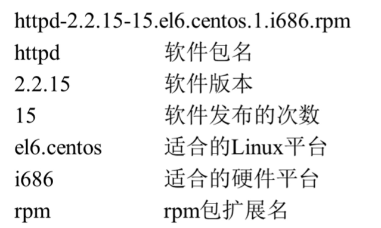
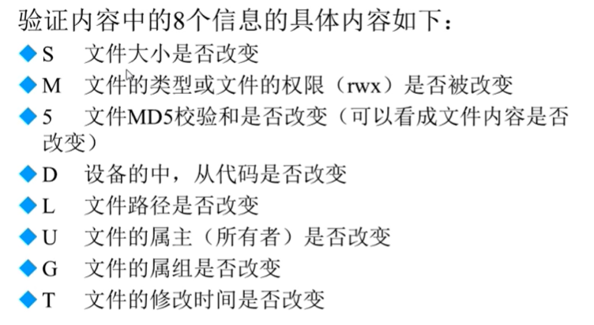
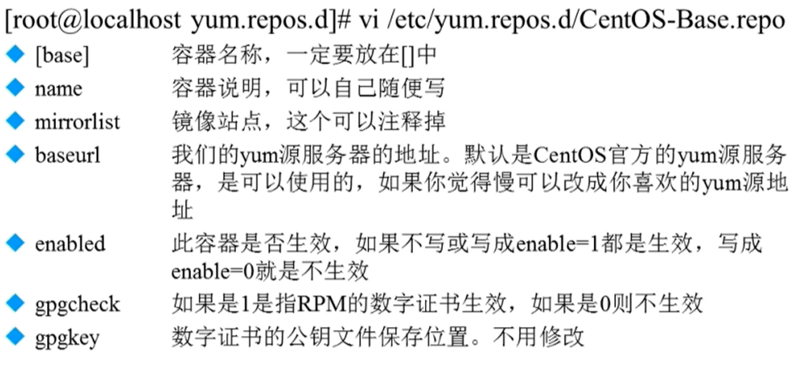

Linux 系统的软件安装
=======

### YUM 的使用

本地yum源文件: `/etc/yum.repos.d`

安装软件 `yum install vim`

### RPM包管理工具的使用

**RPM包命名的规则**



**RPM命令参数**

-i ---- 安装软件包

-v ---- Print verbose information

-h ---- 显示安装进度

-U ---- 升级

-e ---- 卸载

-q ---- 查询一个软件包

-a ---- 查询所有软件包

--nodeps ---- 不检测依赖

1, 安装一个软件包: `rpm -ivh package_name`

2, 包名和包全名的说明：操作的包是没有安装的软件包时，使用包全名。操作已经安装的软件包时，使用包名。会搜索 `/var/lib/rpm/`

3, 一般搜索软件包的方法: `rpm -qa | grep java`

```bash
rpm -qa | grep java
tzdata-java-2019b-1.el7.noarch
javapackages-tools-3.4.1-11.el7.noarch
java-1.7.0-openjdk-1.7.0.221-2.6.18.1.el7.x86_64
java-1.8.0-openjdk-1.8.0.222.b03-1.el7.x86_64
java-1.7.0-openjdk-headless-1.7.0.221-2.6.18.1.el7.x86_64
java-1.8.0-openjdk-headless-1.8.0.222.b03-1.el7.x86_64
python-javapackages-3.4.1-11.el7.noarch
```

4, 查询软件信息: `rpm -qi java-1.7.0-openjdk`

5, 查询未安装的软件包信息: `rpm -qip 包全名`

6, 查询包中文件的安装位置: `rpm -ql 包名`

```bash
rpm -ql java-1.7.0-openjdk
/usr/lib/jvm/java-1.7.0-openjdk-1.7.0.221-2.6.18.1.el7.x86_64/jre/bin/policytool
/usr/lib/jvm/java-1.7.0-openjdk-1.7.0.221-2.6.18.1.el7.x86_64/jre/lib/amd64/libjavagtk.so
/usr/lib/jvm/java-1.7.0-openjdk-1.7.0.221-2.6.18.1.el7.x86_64/jre/lib/amd64/libjsoundalsa.so
/usr/lib/jvm/java-1.7.0-openjdk-1.7.0.221-2.6.18.1.el7.x86_64/jre/lib/amd64/libpulse-java.so
/usr/lib/jvm/java-1.7.0-openjdk-1.7.0.221-2.6.18.1.el7.x86_64/jre/lib/amd64/libsplashscreen.so
/usr/lib/jvm/java-1.7.0-openjdk-1.7.0.221-2.6.18.1.el7.x86_64/jre/lib/amd64/xawt/libmawt.so
/usr/share/applications/java-1.7.0-openjdk-1.7.0.221-2.6.18.1.el7.x86_64-policytool.desktop
/usr/share/icons/hicolor/16x16/apps/java-1.7.0.png
/usr/share/icons/hicolor/24x24/apps/java-1.7.0.png
/usr/share/icons/hicolor/32x32/apps/java-1.7.0.png
/usr/share/icons/hicolor/48x48/apps/java-1.7.0.png
/usr/share/man/man1/policytool-java-1.7.0-openjdk-1.7.0.221-2.6.18.1.el7.x86_64.1.gz
```

```bash
rpm -qpl yum-utils-1.1.31-52.el7.noarch.rpm
/etc/bash_completion.d
/etc/bash_completion.d/yum-utils.bash
/usr/bin/debuginfo-install
/usr/bin/find-repos-of-install
/usr/bin/needs-restarting
/usr/bin/package-cleanup
/usr/bin/repo-graph
/usr/bin/repo-rss
/usr/bin/repoclosure
/usr/bin/repodiff
/usr/bin/repomanage
/usr/bin/repoquery
/usr/bin/reposync
/usr/bin/repotrack
/usr/bin/show-changed-rco
/usr/bin/show-installed
/usr/bin/verifytree
/usr/bin/yum-builddep
/usr/bin/yum-config-manager
/usr/bin/yum-debug-dump
/usr/bin/yum-debug-restore
/usr/bin/yum-groups-manager
/usr/bin/yumdownloader
/usr/lib/python2.7/site-packages/yumutils
/usr/lib/python2.7/site-packages/yumutils/__init__.py
/usr/lib/python2.7/site-packages/yumutils/__init__.pyc
/usr/lib/python2.7/site-packages/yumutils/__init__.pyo
/usr/lib/python2.7/site-packages/yumutils/i18n.py
/usr/lib/python2.7/site-packages/yumutils/i18n.pyc
/usr/lib/python2.7/site-packages/yumutils/i18n.pyo
/usr/sbin/yum-complete-transaction
/usr/sbin/yumdb
/usr/share/doc/yum-utils-1.1.31
/usr/share/doc/yum-utils-1.1.31/COPYING
/usr/share/doc/yum-utils-1.1.31/README
/usr/share/doc/yum-utils-1.1.31/yum-util-cli-template
/usr/share/locale/da/LC_MESSAGES/yum-utils.mo
/usr/share/man/man1/debuginfo-install.1.gz
/usr/share/man/man1/find-repos-of-install.1.gz
/usr/share/man/man1/needs-restarting.1.gz
/usr/share/man/man1/package-cleanup.1.gz
/usr/share/man/man1/repo-graph.1.gz
/usr/share/man/man1/repo-rss.1.gz
/usr/share/man/man1/repoclosure.1.gz
/usr/share/man/man1/repodiff.1.gz
/usr/share/man/man1/repomanage.1.gz
/usr/share/man/man1/repoquery.1.gz
/usr/share/man/man1/reposync.1.gz
/usr/share/man/man1/repotrack.1.gz
/usr/share/man/man1/show-changed-rco.1.gz
/usr/share/man/man1/show-installed.1.gz
/usr/share/man/man1/verifytree.1.gz
/usr/share/man/man1/yum-builddep.1.gz
/usr/share/man/man1/yum-config-manager.1.gz
/usr/share/man/man1/yum-debug-dump.1.gz
/usr/share/man/man1/yum-debug-restore.1.gz
/usr/share/man/man1/yum-groups-manager.1.gz
/usr/share/man/man1/yum-utils.1.gz
/usr/share/man/man1/yumdownloader.1.gz
/usr/share/man/man8/yum-complete-transaction.8.gz
/usr/share/man/man8/yumdb.8.gz
```

7, 查询系统文件属于哪个RPM包 `rpm -qf 系统文件名`

```bash
[root@mylnx bin]# rpm -qf tree 
tree-1.6.0-10.el7.x86_64
```

8, 查询软件包的依赖性 `rpm -qR 包名`

```bash
rpm -qR tree
libc.so.6()(64bit)
libc.so.6(GLIBC_2.14)(64bit)
libc.so.6(GLIBC_2.2.5)(64bit)
libc.so.6(GLIBC_2.3)(64bit)
libc.so.6(GLIBC_2.3.4)(64bit)
libc.so.6(GLIBC_2.4)(64bit)
rpmlib(CompressedFileNames) <= 3.0.4-1
rpmlib(FileDigests) <= 4.6.0-1
rpmlib(PayloadFilesHavePrefix) <= 4.0-1
rtld(GNU_HASH)
rpmlib(PayloadIsXz) <= 5.2-1
```

9, RPM包校验 `rpm -V 已安装的包名`

```bash
[root@mylnx Packages]# rpm -V tree
S.5....T.  d /usr/share/doc/tree-1.6.0/README
```




10, RPM包中的文件提取 `rpm2cpio 包全名 | cpio -idv .文件绝对路径`

```bash
[root@mylnx ~]# rpm2cpio /mnt/cdrom/Packages/zip-3.0-11.el7.x86_64.rpm | cpio -idv ./usr/bin/zip
./usr/bin/zip
1598 blocks
```

11, `cpio的使用`

### YUM 包管理工具的使用

1, yum源文件的说明



2，`yum list` 查询服务器的软件包

3，`yum search 包名` 查询服务器上的软件包

4，`yum grouplist` 列出所有可用的软件组列表

### 源码安装MySQL

https://blog.csdn.net/jwx90312/article/details/105862466

