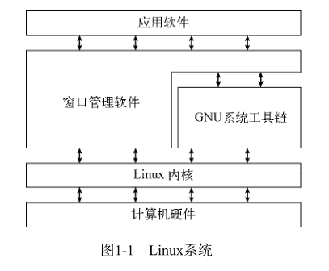
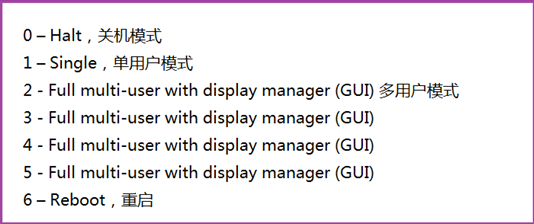
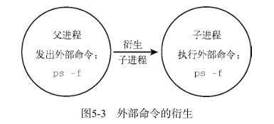
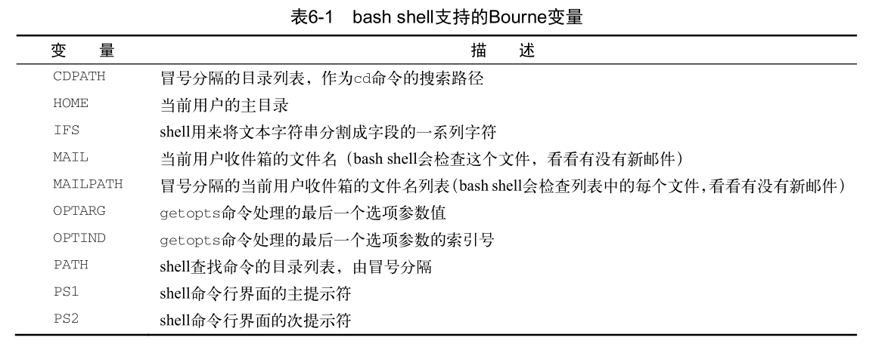
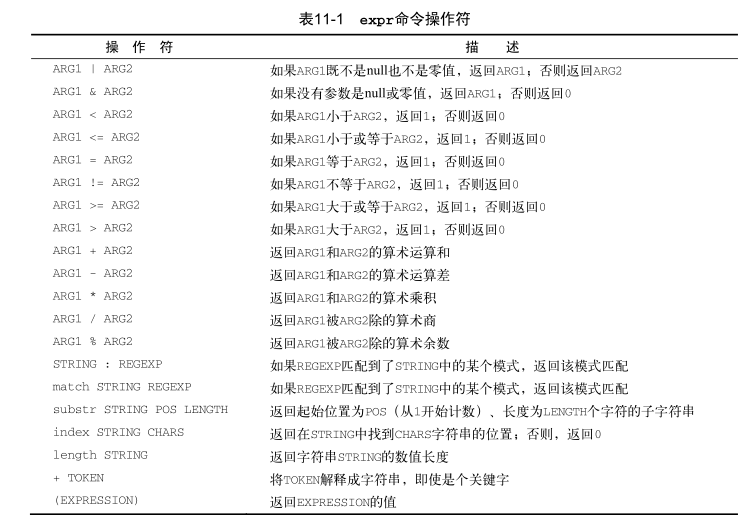
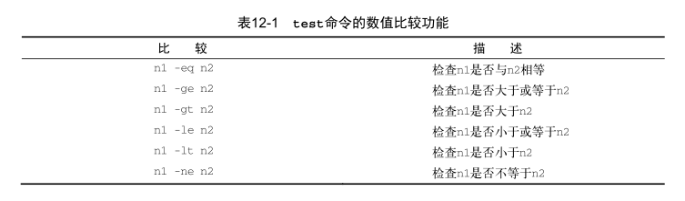
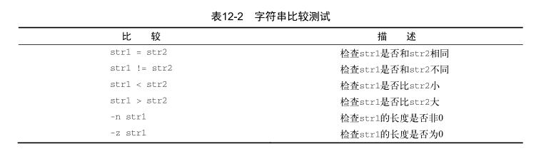
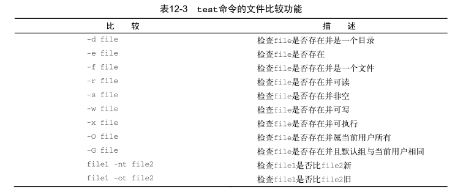
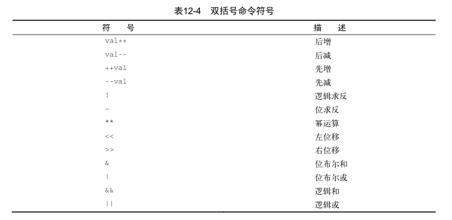
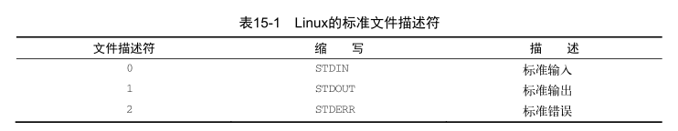

Linux Shell
=====

## 1. 初识Linux shell ##



#### 1.1.1 了解Linux 内核 ####

某些Linux发行版使用一个表来管理在系统开机要自动启动的进程： `/etc/inittab`

或者 ubuntu 系统，则采用 `/etc/init.d` 目录的方式，将开机启动或停止某个应用的脚本放在这个目录下。这些脚本通过 `/etc/rcX.d` 目录下的入口 (entry) 启动。

**linux系统中的运行级别**：

- 1 只启动基本的系统进程以及一个控制台终端进程。我们称之为单用户模式。单用户模式通常用来在系统有问题时进行紧急的文件系统维护。显然，在这种模式下，仅有一个人（通常是系统管理员）能登录到系统上操作数据。
- 标准的用户级别是3



可用通过 `runlevel` 查看系统当前的运行级别, 配置参数一般在： `/etc/init/rc-sysinit.conf`

```console
(base) root@ubuntu20:/etc/rc5.d# runlevel 
N 5
```

**关于系统自启脚本的顺序**

查看某个目录下的文件：

```console
(base) root@ubuntu20:/etc/rc2.d# ls -l
total 0
lrwxrwxrwx 1 root root 27 Mar 14 07:37 K01speech-dispatcher -> ../init.d/speech-dispatcher
lrwxrwxrwx 1 root root 18 Mar 14 07:37 K01whoopsie -> ../init.d/whoopsie
lrwxrwxrwx 1 root root 15 Mar 14 07:37 S01acpid -> ../init.d/acpid
lrwxrwxrwx 1 root root 17 Mar 14 07:37 S01anacron -> ../init.d/anacron
lrwxrwxrwx 1 root root 16 Mar 14 07:37 S01apport -> ../init.d/apport
lrwxrwxrwx 1 root root 22 Mar 14 07:37 S01avahi-daemon -> ../init.d/avahi-daemon
lrwxrwxrwx 1 root root 19 Mar 14 07:37 S01bluetooth -> ../init.d/bluetooth
lrwxrwxrwx 1 root root 26 Mar 14 07:37 S01console-setup.sh -> ../init.d/console-setup.sh
lrwxrwxrwx 1 root root 14 Mar 14 07:37 S01cron -> ../init.d/cron
```

软链的名称有一定的规则：`S[number][service name] --> ../init.d/servicename`
[number]表示的是该脚本的运行优先级，number越小，脚本的运行优先级就越高
[service name]表示的是服务的名称。

**自启和关闭自启服务**

`liunx init --> rcS.d --> rcN.d --> rc.local`

`update-rc.d`来自动实现System V 的RunLevel的启动脚本服务，前提是这些服务的启动脚本位于`/etc/init.d/`目录下:

`update-rc.d <service name> start|stop| <order number> <run levels>`

启用或禁用开机自启：`update-rc.d <service name> enable|disable <runlevels>`

**对于 init [number]**

对于 `shutdown now` or `reboot now` 在本质上调用的是： `init 0` or `init 6`

**硬件设备管理**

Linux系统将硬件设备当成特殊的文件，称为设备文件。设备文件有3种分类：
字符型设备文件
块设备文件
网络设备文件

## 3. 基本的bash shell ##

### 3.2 shell提示符 ###

### 3.3 bash手册 ###

man 命令用来访问存储在Linux系统上的手册页面。在想要查找的工具的名称前面输入 man 命令，就可以找到那个工具相应的手册条目。

还可以使用 `man -k [keywords]` 搜索手册页。除了对节按照惯例进行命名，手册页还有对应的内容区域。每个内容区域都分配了一个数字，从1开始，一直到9。

| 区域号 | 所涵盖的内容             |
| ------ | ------------------------ |
| 1      | 可执行程序或shell命令    |
| 2      | 系统调用                 |
| 3      | 库调用                   |
| 4      | 特殊文件                 |
| 5      | 文件格式与约定           |
| 6      | 游戏                     |
| 7      | 概览、约定及杂项         |
| 8      | 超级用户和系统管理员命令 |
| 9      | 内核例程                 |

### 3.5 文件和目录列表 ###

`ls -F` : 轻松区分文件和目录

`ls -R -F` : -R 参数是 ls 命令可用的另一个参数，叫作递归选项

#### 3.5.3 过滤输出列表 ####

文件扩展匹配: 元字符通配符(metacharacter wildcards)

`?` 一个字符

`*` 零个或者多个字符

`[ai]` 可选为a或者i

`[a-i]` 可选为 从a到i

`[!a]` 排除a

#### 3.6.4 链接文件 ####

在Linux中有两种不同类型的文件链接：符号链接和硬链接。

在上面的例子中，注意符号链接的名字sl_data_file位于 ln 命令中的第二个参数位置上。

```console
(base) liberty@ubuntu20:~/Downloads$ echo "hello world" > hello.txt 
(base) liberty@ubuntu20:~/Downloads$ ls -li
total 596664
1734219 -rwxrw-rw- 1 liberty liberty 554535580 Feb  3 18:49 Anaconda3-2020.11-Linux-x86_64.sh
1745401 -rw-rw-r-- 1 liberty liberty        12 May 25 23:24 hello.txt
1731114 -rw-rw-r-- 1 liberty liberty  56435756 Feb 20  2019 VMwareTools-10.3.10-12406962.tar.gz
(base) liberty@ubuntu20:~/Downloads$ ln hello.txt hello_ln.txt
(base) liberty@ubuntu20:~/Downloads$ ls -li
total 596668
1734219 -rwxrw-rw- 1 liberty liberty 554535580 Feb  3 18:49 Anaconda3-2020.11-Linux-x86_64.sh
1745401 -rw-rw-r-- 2 liberty liberty        12 May 25 23:24 hello_ln.txt
1745401 -rw-rw-r-- 2 liberty liberty        12 May 25 23:24 hello.txt
1731114 -rw-rw-r-- 1 liberty liberty  56435756 Feb 20  2019 VMwareTools-10.3.10-12406962.tar.gz
```

## 4. 更多的bash shell ##

### 4.1 监测程序 ###

默认情况下， ps 命令并不会提供那么多的信息：

```console
(base) liberty@ubuntu20:~$ ps
    PID TTY          TIME CMD
  17637 pts/1    00:00:00 bash
  17662 pts/1    00:00:00 ps
```

默认情况下， ps 命令只会显示运行在当前控制台下的属于当前用户的进程。

ps支持三种不同类型的命令行参数：

**Unix 风格的参数，前面加单破折线**

| 参数        | 描述                                                     |
| ----------- | -------------------------------------------------------- |
| -A          | display all process                                      |
| -N          | 显示与指定参数不符的所有进程                             |
| -a          | 显示除控制进程（session leader）和无终端进程外的所有进程 |
| -d          | 显示除控制进程外的所有进程                               |
| -e          | 显示所有进程                                             |
| -C cmdlist  | 显示包含在 cmdlist 列表中的进程                          |
| -G grplist  | 显示组ID在 grplist 列表中的进程                          |
| -U userlist | 显示属主的用户ID在 userlist 列表中的进程                 |
| -g grplist  | 显示会话或组ID在 grplist 列表中的进程                    |
| -p pidlist  | 显示PID在 pidlist 列表中的进程                           |
| -s sesslist | 显示会话ID在 sesslist 列表中的进程                       |
| -t ttylist  | 显示终端ID在 ttylist 列表中的进程                        |
| -u userlist | 显示有效用户ID在 userlist 列表中的进程                   |
| -F          | 显示更多额外输出                                         |
| -O format   | 显示默认的输出列以及 format 列表指定的特定列             |
| -M          | 显示进程的安全信息                                       |
| -c          | 显示进程的额外调度器信息                                 |
| -f          | 显示完整格式的输出                                       |
| -j          | 显示任务列表                                             |
| -l          | 显示长列表                                               |
| -o format   | 仅显示由 format 指定的列                                 |
| -y          | 不要显示进程标记（process flag，表明进程状态的标记）     |
| -z          | 显示安全标签（security context）信息                     |
| -H          | 用层级格式来显示进程（树状，用来显示父进程）             |
| -n namelist | 定义了 WCHAN 列显示的值                                  |
| -w          | 采用宽输出模式，不限宽度显示                             |
| -L          | 显示进程中的线程                                         |
| -V          | 显示 ps 命令的版本号                                     |

UID：启动这些进程的用户。
PID：进程的进程ID。
PPID：父进程的进程号（如果该进程是由另一个进程启动的）。
C：进程生命周期中的CPU利用率。
STIME：进程启动时的系统时间。
TTY：进程启动时的终端设备。
TIME：运行进程需要的累计CPU时间。
CMD：启动的程序名称。

**BSD 风格的参数，前面不加破折线**

**GNU 风格的长参数，前面加双双破折线**

#### 4.1.2 实时监测进程 ####

#### 4.3.2 搜索数据 ####

## 5. 理解shell

### 5.2 理解shell的父子关系

在CLI提示符后输入 /bin/bash 命令或其他等效的 bash 命令时，会创建一个新的shell程序。这个shell程序被称为子shell（child shell）。子shell也拥有CLI提示符，同样会等待命令输入。

```console
[root@mylnx ~]# ps -f
UID         PID   PPID  C STIME TTY          TIME CMD
root       1865   1859  0 20:30 pts/0    00:00:00 -bash
root       1905   1865  0 20:30 pts/0    00:00:00 ps -f
[root@mylnx ~]# bash
[root@mylnx ~]# ps -f
UID         PID   PPID  C STIME TTY          TIME CMD
root       1865   1859  0 20:30 pts/0    00:00:00 -bash
root       1906   1865  1 20:30 pts/0    00:00:00 bash
root       1934   1906  0 20:30 pts/0    00:00:00 ps -f
[root@mylnx ~]# ps --forest
   PID TTY          TIME CMD
  1865 pts/0    00:00:00 bash
  1906 pts/0    00:00:00  \_ bash
  1972 pts/0    00:00:00      \_ bash
  2005 pts/0    00:00:00          \_ bash
  2041 pts/0    00:00:00              \_ bash
  2079 pts/0    00:00:00                  \_ ps
```

bash shell程序可使用命令行参数修改shell启动方式。

| 参数      | 描述                                        |
| --------- | ------------------------------------------- |
| -c string | 从 string 中读取命令并进行处理              |
| -i        | 启动一个能够接收用户输入的交互shell         |
| -l        | 以登录shell的形式启动                       |
| -r        | 启动一个受限shell，用户会被限制在默认目录中 |
| -s        | 从标准输入中读取命令                        |

#### 5.2.1 进程列表

可以在一行中指定要依次运行的命令，用 `;` 分隔 。尽管多出来的括号看起来没有什么太大的不同，但起到的效果确是非同寻常。括号的加入使命令列表变成了进程列表，生成了一个子shell来执行对应的命令。

```shell
[root@mylnx ~]# pwd; ls ; cd /etc ; pwd ; cd ; pwd ; ls
/root
anaconda-ks.cfg  Documents  initial-setup-ks.cfg  Pictures  Templates
Desktop          Downloads  Music                 Public    Videos
/etc
/root
anaconda-ks.cfg  Documents  initial-setup-ks.cfg  Pictures  Templates
Desktop          Downloads  Music                 Public    Videos

[root@mylnx ~]# pwd ; ls ; cd /etc ; pwd ; cd ; pwd ; ls ; echo $BASH_SUBSHELL
/root
anaconda-ks.cfg  Documents  initial-setup-ks.cfg  Pictures  Templates
Desktop          Downloads  Music                 Public    Videos
/etc
/root
anaconda-ks.cfg  Documents  initial-setup-ks.cfg  Pictures  Templates
Desktop          Downloads  Music                 Public    Videos
0
[root@mylnx ~]# (pwd ; ls ; cd /etc ; pwd ; cd ; pwd ; ls ; echo $BASH_SUBSHELL)
/root
anaconda-ks.cfg  Documents  initial-setup-ks.cfg  Pictures  Templates
Desktop          Downloads  Music                 Public    Videos
/etc
/root
anaconda-ks.cfg  Documents  initial-setup-ks.cfg  Pictures  Templates
Desktop          Downloads  Music                 Public    Videos
1
```

要想知道是否生成了子shell，得借助一个使用了环境变量的命令 `$BASH_SUBSHELL`

在命令提示符中，使用括号将命令包裹起来可以生成新的shell子进程。

#### 5.2.2 子shell的用法

**1. 使用后台模式**

```shell
[root@mylnx ~]# sleep 3000 &
[1] 3075
[root@mylnx ~]# ps -f
UID         PID   PPID  C STIME TTY          TIME CMD
root       3026   3020  0 20:57 pts/0    00:00:00 -bash
root       3075   3026  0 20:59 pts/0    00:00:00 sleep 3000
root       3076   3026  0 20:59 pts/0    00:00:00 ps -f
```

使用 `jobs` 来显示后台作业信息。 jobs 命令可以显示出当前运行在后台模式中的所有用户的进程（作业）。

```shell
[root@mylnx ~]# jobs
[1]+  Running                 sleep 3000 &
```

**2. 将进程列表置入后台**

进程列表是运行在子shell中的一条或多条命令

```shell
[root@mylnx ~]# (sleep 2 ; echo $BASH_SUBSHELL ; sleep 2)
1

[root@mylnx ~]# (sleep 2 ; echo $BASH_SUBSHELL ; sleep 2) &
[2] 3168
[root@mylnx ~]# 1

[2]+  Done                    ( sleep 2; echo $BASH_SUBSHELL; sleep 2 )
```

使用 tar 创建备份文件是有效利用后台进程列表的一个更实用的例子。

**3. 协程**

使用 coproc 开一个协程：

```console
(base) liberty@ubuntu20:~$ coproc sleep 20
[1] 21026
```

还可以使用命令的扩展语法设置名字：

```console
(base) liberty@ubuntu20:~$ coproc Demo { sleep 10; }
[1] 21190
(base) liberty@ubuntu20:~$ jobs
[1]+  Running                 coproc Demo { sleep 10; } &
(base) liberty@ubuntu20:~$ 
```

### 5.3 理解shell的内建命令

#### 5.3.1 外部命令

外部命令，有时候也被称为文件系统命令，是存在于bash shell之外的程序。它们并不是shell程序的一部分。外部命令程序通常位于/bin、/usr/bin、/sbin或/usr/sbin中。

```console
(base) liberty@ubuntu20:~$ which ps
/usr/bin/ps
(base) liberty@ubuntu20:~$ type -a ps
ps is /usr/bin/ps
ps is /bin/ps
(base) liberty@ubuntu20:~$ 
```

当外部命令执行时，会创建出一个子进程。这种操作被称为衍生（forking）。作为外部命令， ps 命令执行时会创建出一个子进程。在这里， ps 命令的PID是 2801 ，父PID是 2743 。作为父进程的bash shell的PID是 2743 。



#### 5.3.2 内建命令

```shell
[root@mylnx ~]# type cd
cd is a shell builtin
[root@mylnx ~]# type exit
exit is a shell builtin
```

可以在退出shell会话之前强制将命令历史记录写入.bash_history文件。要实现强制写入，需要使用 history 命的 -a选项。

## 6. linux 环境变量

### 6.1 环境变量的定义

bash shell用一个叫作环境变量（environment variable）的特性来存储有关shell会话和工作环境的信息（这也是它们被称作环境变量的原因）。有全局变量和局部变量两种分类。

#### 6.1.1 全局环境变量

全局环境变量对于shell会话和所有生成的子shell都是可见的。局部变量则只对创建它们的shell可见。这让全局环境变量对那些所创建的子shell需要获取父shell信息的程序来说非常有用。

要查看全局变量，可以使用 env 或 printenv 命令。

```console
(base) liberty@ubuntu20:~$ printenv
SHELL=/bin/bash
CONDA_EXE=/opt/anaconda3/bin/conda
_CE_M=
LANGUAGE=en_US:en
LC_ADDRESS=en_US.UTF-8
LC_NAME=en_US.UTF-8
LC_MONETARY=en_US.UTF-8
PWD=/home/liberty
LOGNAME=liberty
XDG_SESSION_TYPE=tty
CONDA_PREFIX=/opt/anaconda3
MOTD_SHOWN=pam
HOME=/home/liberty
LC_PAPER=en_US.UTF-8
LANG=en_US.UTF-8
LS_COLORS=rs=0:di=01;34:ln=01;36:mh=00:pi=40;33:so=01;35:do=01;35:bd=40;33;01:cd=40;33;01:or=40;31;01:mi=00:su=37;41:sg=30;43:ca=30;41:tw=30;42:ow=34;42:st=37;44:ex=01;32:*.tar=01;31:*.tgz=01;31:*.arc=01;31:*.arj=01;31:*.taz=01;31:*.lha=01;31:*.lz4=01;31:*.lzh=01;31:*.lzma=01;31:*.tlz=01;31:*.txz=01;31:*.tzo=01;31:*.t7z=01;31:*.zip=01;31:*.z=01;31:*.dz=01;31:*.gz=01;31:*.lrz=01;31:*.lz=01;31:*.lzo=01;31:*.xz=01;31:*.zst=01;31:*.tzst=01;31:*.bz2=01;31:*.bz=01;31:*.tbz=01;31:*.tbz2=01;31:*.tz=01;31:*.deb=01;31:*.rpm=01;31:*.jar=01;31:*.war=01;31:*.ear=01;31:*.sar=01;31:*.rar=01;31:*.alz=01;31:*.ace=01;31:*.zoo=01;31:*.cpio=01;31:*.7z=01;31:*.rz=01;31:*.cab=01;31:*.wim=01;31:*.swm=01;31:*.dwm=01;31:*.esd=01;31:*.jpg=01;35:*.jpeg=01;35:*.mjpg=01;35:*.mjpeg=01;35:*.gif=01;35:*.bmp=01;35:*.pbm=01;35:*.pgm=01;35:*.ppm=01;35:*.tga=01;35:*.xbm=01;35:*.xpm=01;35:*.tif=01;35:*.tiff=01;35:*.png=01;35:*.svg=01;35:*.svgz=01;35:*.mng=01;35:*.pcx=01;35:*.mov=01;35:*.mpg=01;35:*.mpeg=01;35:*.m2v=01;35:*.mkv=01;35:*.webm=01;35:*.ogm=01;35:*.mp4=01;35:*.m4v=01;35:*.mp4v=01;35:*.vob=01;35:*.qt=01;35:*.nuv=01;35:*.wmv=01;35:*.asf=01;35:*.rm=01;35:*.rmvb=01;35:*.flc=01;35:*.avi=01;35:*.fli=01;35:*.flv=01;35:*.gl=01;35:*.dl=01;35:*.xcf=01;35:*.xwd=01;35:*.yuv=01;35:*.cgm=01;35:*.emf=01;35:*.ogv=01;35:*.ogx=01;35:*.aac=00;36:*.au=00;36:*.flac=00;36:*.m4a=00;36:*.mid=00;36:*.midi=00;36:*.mka=00;36:*.mp3=00;36:*.mpc=00;36:*.ogg=00;36:*.ra=00;36:*.wav=00;36:*.oga=00;36:*.opus=00;36:*.spx=00;36:*.xspf=00;36:
CONDA_PROMPT_MODIFIER=(base) 
SSH_CONNECTION=192.168.20.1 11061 192.168.20.123 22
LESSCLOSE=/usr/bin/lesspipe %s %s
XDG_SESSION_CLASS=user
LC_IDENTIFICATION=en_US.UTF-8
TERM=xterm
_CE_CONDA=
LESSOPEN=| /usr/bin/lesspipe %s
USER=liberty
CONDA_SHLVL=1
DISPLAY=localhost:10.0
SHLVL=1
LC_TELEPHONE=en_US.UTF-8
LC_MEASUREMENT=en_US.UTF-8
XDG_SESSION_ID=16
PAPERSIZE=letter
CONDA_PYTHON_EXE=/opt/anaconda3/bin/python
XDG_RUNTIME_DIR=/run/user/1000
SSH_CLIENT=192.168.20.1 11061 22
CONDA_DEFAULT_ENV=base
LC_TIME=en_US.UTF-8
XDG_DATA_DIRS=/usr/local/share:/usr/share:/var/lib/snapd/desktop
PATH=/opt/anaconda3/bin:/opt/anaconda3/condabin:/usr/local/sbin:/usr/local/bin:/usr/sbin:/usr/bin:/sbin:/bin:/usr/games:/usr/local/games:/snap/bin
DBUS_SESSION_BUS_ADDRESS=unix:path=/run/user/1000/bus
SSH_TTY=/dev/pts/0
LC_NUMERIC=en_US.UTF-8
_=/usr/bin/printenv
(base) liberty@ubuntu20:~$ 
```

要显示个别环境变量的值，可以使用 printenv 命令，但是不要用 env 命令。

```console
(base) liberty@ubuntu20:~$ printenv HOME
/home/liberty
```

也可以使用 echo 显示变量的值。在这种情况下引用某个环境变量的时候，必须在变量前面加上一个美元符`$`

#### 6.1.2 局部环境变量

局部环境变量只能在定义它们的进程中可见，Linux系统也默认定义了标准的局部环境变量。

### 6.2 设置用户定义变量

#### linux shell 中单引号和双引号的区别: ####

以单引号`' '`包围变量的值时，单引号里面是什么就输出什么，即使内容中有变量和命令（命令需要反引起来）也会把它们原样输出。这种方式比较适合定义显示纯字符串的情况，即不希望解析变量、命令等的场景。

以双引号`" "`包围变量的值时，输出时会先解析里面的变量和命令，而不是把双引号中的变量名和命令原样输出。这种方式比较适合字符串中附带有变量和命令并且想将其解析后再输出的变量定义。

#### 6.2.1 设置局部用户定义变量

```shell
[root@mylnx ~]# echo $my_var

[root@mylnx ~]# $my_var=Hello
bash: =Hello: command not found...
[root@mylnx ~]# my_var=Hello
[root@mylnx ~]# echo $my_var 
Hello
```

如果要给变量赋一个含有空格的字符串值，必须用单引号来界定字符串的首和尾。变量名、等号和值之间没有空格，这一点非常重要。如果在赋值表达式中加上了空格，bash shell就会把值当成一个单独的命令。

设置的局部变量在子shell中不可使用。

#### 6.2.2 设置全局环境变量

创建全局环境变量的方法是先创建一个局部环境变量，然后再把它导出到全局环境中。

修改子shell中全局环境变量并不会影响到父shell中该变量的值。

```shell
[root@mylnx ~]# my_var1='this is a Global var'
[root@mylnx ~]# export my_var1
[root@mylnx ~]# echo $my_var1 
this is a Global var
[root@mylnx ~]# 
[root@mylnx ~]# bash
[root@mylnx ~]# 
[root@mylnx ~]# echo $my_var1
this is a Global var
```

### 6.3 删除环境变量

可以用 unset 命令完成这个操作。在 unset 命令中引用环境变量时，记住不要使用 `$` 。和修改变量一样，在子shell中删除全局变量后，你无法将效果反映到父shell中。

在涉及环境变量名时，什么时候该使用 `$` ，什么时候不该使用 `$` ，实在让人摸不着头脑。
记住一点就行了：如果要用到变量，使用 `$` ；如果要操作变量，不使用` $ `

### 6.4 默认的shell环境变量 ###



### 6.5 设置PATH环境变量

 PATH 环境变量定义了用于进行命令和程序查找的目录。

```console
(base) root@ubuntu20:~# echo $PATH
/opt/anaconda3/bin:/opt/anaconda3/condabin:/usr/local/sbin:/usr/local/bin:/usr/sbin:/usr/bin:/sbin:/bin:/usr/games:/usr/local/games:/snap/bin
```

PATH 中各个目录之间是用冒号分隔的，你只需引用原来的 PATH 值，然后再给这个字符串添加新目录就行了`PATH=$PATH:/home/christine/Scripts`

程序员通常的办法是将单点符也加入 PATH 环境变量。该单点符代表当前目录：

```console
PATH=$PATH:.
```

### 6.6 定位系统环境变量

在你登入Linux系统启动一个bash shell时，默认情况下bash会在几个文件中查找命令。这些文件叫作启动文件或环境文件。bash检查的启动文件取决于你启动bash shell的方式。启动bash shell有三种方式：

- 登录时作为默认登录shell

- 作为非登录shell的交互式shell

- 作为运行脚本的非交互shell

#### 6.6.1 登录shell

当你登录Linux系统时，bash shell会作为登录shell启动。登录shell会从5个不同的启动文件里读取命令：

- /etc/profile
- $HOME/.bash_profile
- $HOME/.bashrc
- $HOME/.bash_login
- $HOME/.profile

`/etc/profile`文件是系统上默认的bash shell的主启动文件。系统上的每个用户登录时都会执行这个启动文件。

在 HOME 目录下的启动文件规则如下：

- shell会按照按照下列顺序，运行第一个被找到的文件，余下的则被忽略：

  $HOME/.bash_profile

  $HOME/.bash_login

  $HOME/.profile

- 这个列表中并没有$HOME/.bashrc文件。这是因为该文件通常通过其他文件运行的。

#### 6.6.2 交互式shell进程

如果你的bash shell不是登录系统时启动的（比如是在命令行提示符下敲入 bash 时启动），那么你启动的shell叫作交互式shell。交互式shell不会像登录shell一样运行，但它依然提供了命令行提示符来输入命令。

如果bash是作为交互式shell启动的，它就不会访问/etc/profile文件，只会检查用户HOME目录中的`.bashrc`文件。

#### 6.6.3 非交互式shell

最后一种shell是非交互式shell。系统执行shell脚本时用的就是这种shell。不同的地方在于它没有命令行提示符。但是当你在系统上运行脚本时，也许希望能够运行一些特定启动的命令。

为了处理这种情况，bash shell提供了 BASH_ENV 环境变量。当shell启动一个非交互式shell进程时，它会检查这个环境变量来查看要执行的启动文件。

#### 6.6.4 环境变量持久化

对全局环境变量来说（Linux系统中所有用户都需要使用的变量），可能更倾向于将新的或修改过的变量设置放在/etc/profile文件中，但这可不是什么好主意。如果你升级了所用的发行版，这个文件也会跟着更新，那你所有定制过的变量设置可就都没有了。
最好是在`/etc/profile.d`目录中创建一个以.sh结尾的文件。把所有新的或修改过的全局环境变量设置放在这个文件中。

存储个人用户永久性bash shell变量的地方是`$HOME/.bashrc`文件。

### 6.7 数组变量

要给某个环境变量设置多个值，可以把值放在括号里，值与值之间用空格分隔。

```shell
[root@mylnx ~]# mytest=(one two three four five)
[root@mylnx ~]# echo $mytest
one
[root@mylnx ~]# echo ${mytest[2]}
three
[root@mylnx ~]# echo ${mytest[*]}
one two three four five
```

## 11. 构建基本脚本

### 11.3 显示消息

注意，默认情况下，不需要使用引号将要显示的文本字符串划定出来。

如果想把文本字符串和命令输出显示在同一行中，该怎么办呢？可以用 `echo` 语句的 `-n` 参数。

```console
(base) liberty@ubuntu20:~/PycharmProjects/pythonProject/shells$ /bin/bash /home/liberty/PycharmProjects/pythonProject/shells/demo1.sh
The time and date are: Wed 26 May 2021 10:51:30 PM CST
Let's see who's logged into the system:
liberty  :0           2021-05-25 22:07 (:0)
liberty  pts/0        2021-05-26 22:37 (192.168.20.1)
```

### 11.4 使用变量

#### 11.4.1 环境变量

```shell
[root@mylnx tools]# cat show_who_logged.sh 
#!/bin/bash

# display user infomation from the system.

echo "User info for userid: $USER"
echo UID: $UID
echo HOME: $HOME
```

**反斜线允许shell脚本将美元符解读为实际的美元符，而不是变量。**

#### 11.4.2 用户变量

shell脚本还允许在脚本中定义和使用自己的变量，用户变量可以是任何由字母、数字或下划线组成的文本字符串，长度不超过20个。

shell脚本会自动决定变量值的数据类型。引用一个变量值时需要使用美元符，而引用变量来对其进行赋值时则不要使用美元符。

```shell
[root@mylnx tools]# cat demo02.sh 
#!/bin/bash

value1=10
value2=$value1

echo "the result for value2 is $value2"

value2=value1

echo "the result for value2 is $value2"

[root@mylnx tools]# ./demo02.sh 
the result for value2 is 10
the result for value2 is value1
```

#### 11.4.3 命令替换

shell脚本中最有用的特性之一就是可以从命令输出中提取信息，并将其赋给变量。

有两种方法可以将命令输出赋给变量:  反引号字符` 和  $() 格式。注意，赋值等号和命令替换字符之间没有空格

```shell
#!/bin/bash

today=$(date +%Y%m%d)
ls /usr/bin -al > log.$today
```

命令替换会创建一个子shell来运行对应的命令。子shell（subshell）是由运行该脚本的shell所创建出来的一个独立的子shell（child shell）。正因如此，由该子shell所执行命令是无法使用脚本中所创建的变量的

### 11.5 重定向输入和输出

#### 11.5.1 输出重定向

最基本的重定向将命令的输出发送到一个文件中。bash shell用大于号（`>`）来完成这项功能：

```shell
[root@mylnx ~]# date > testtttt
[root@mylnx ~]# ls -l testtttt 
-rw-r--r-- 1 root root 29 Jul 30 21:10 testtttt
[root@mylnx ~]# cat testtttt 
Thu Jul 30 21:10:35 CST 2020
```

如果输出文件已经存在了，重定向操作符会用新的文件数据覆盖已有文件。

有时，你可能并不想覆盖文件原有内容，而是想要将命令的输出追加到已有文件中，比如你正在创建一个记录系统上某个操作的日志文件。在这种情况下，可以用双大于号（`>>`）来追加数据。

#### 11.5.2 输入重定向

输入重定向和输出重定向正好相反。输入重定向将文件的内容重定向到命令，而非将命令的输出重定向到文件。

```shell
[root@mylnx ~]# wc < testtttt 
 1  6 29
```

还有另外一种输入重定向的方法，称为内联输入重定向（inline input redirection）。这种方法无需使用文件进行重定向，只需要在命令行中指定用于输入重定向的数据就可以了。

内联输入重定向符号是远小于号（<<）。除了这个符号，你必须指定一个文本标记来划分输入数据的开始和结尾。任何字符串都可作为文本标记，但在数据的开始和结尾文本标记必须一致。

```console
command << marker
data
marker

[root@mylnx ~]# wc << EOF
> test string 1
> test string 2
> test string 3
> EOF
 3  9 42
```

### 11.6 管道

我们用不着将命令输出重定向到文件中，可以将其直接重定向到另一个命令。这个过程叫作管道连接（piping）。

不要以为由管道串起的两个命令会依次执行。Linux系统实际上会同时运行这两个命令，在系统内部将它们连接起来。在第一个命令产生输出的同时，输出会被立即送给第二个命令。数据传输不会用到任何中间文件或缓冲区。

```console
$ rpm -qa | sort
abrt-1.1.14-1.fc14.i686
abrt-addon-ccpp-1.1.14-1.fc14.i686
abrt-addon-kerneloops-1.1.14-1.fc14.i686
abrt-addon-python-1.1.14-1.fc14.i686
abrt-desktop-1.1.14-1.fc14.i686
abrt-gui-1.1.14-1.fc14.i686
abrt-libs-1.1.14-1.fc14.i686
abrt-plugin-bugzilla-1.1.14-1.fc14.i686
abrt-plugin-logger-1.1.14-1.fc14.i686
abrt-plugin-runapp-1.1.14-1.fc14.i686
acl-2.2.49-8.fc14.i686
```

### 11.7 执行数学运算

#### 11.7.1 expr 命令



尽管标准操作符在 expr 命令中工作得很好，但在脚本或命令行上使用它们时仍有问题出现。许多 expr 命令操作符在shell中另有含义（比如星号）。

```console
(base) liberty@ubuntu20:~$ expr 4 * 5
expr: syntax error: unexpected argument ‘Desktop’
(base) liberty@ubuntu20:~$ expr 4 \* 6
24
```

#### 11.7.2 使用方括号

在bash中，在将一个数学运算结果赋给某个变量时，可以用美元符和方括号（ $[ operation ] ）将数学表达式围起来。bash shell数学运算符只支持整数运算。若要进行任何实际的数学计算，这是一个巨大的限制。

```shell
#!/bin/bash

var1=100
var2=50
var3=45

var4=$[$var1 * ($var2 - $var3)]
echo the final result is $var4
```

#### 11.7.3 浮点解决方案

**1. bc的基本用法**

bash计算器实际上是一种编程语言，它允许在命令行中输入浮点表达式，然后解释并计算该表达式，最后返回结果。要退出bash计算器，你必须输入 `quit` 。浮点运算是由内建变量 `scale` 控制的。必须将这个值设置为你希望在计算结果中保留的小数位数，否则无法得到期望的结果。

```shell
[root@mylnx tools]# bc -q
3.44 / 5
0
scale=4
3.44 / 5
.6880
quit
```

**2. 在脚本中使用bc**

可以用命令替换运行 bc 命令，并将输出赋给一个变量。基本格式如下：

`variable=$(echo "options; expression" | bc)`

最好的办法是使用内联输入重定向，它允许你直接在命令行中重定向数据。在shell脚本中，你可以将输出赋给一个变量。

```shell
variable=$(bc << EOF
options
statements
expressions
EOF
)
```

### 11.8 退出脚本

shell中运行的每个命令都使用退出状态码（exit status）告诉shell它已经运行完毕。退出状态码是一个0～255的整数值，在命令结束运行时由命令传给shell。可以捕获这个值并在脚本中使用。

Linux提供了一个专门的变量 `$?` 来保存上个已执行命令的退出状态码

#### 11.8.2 exit命令

默认情况下，shell脚本会以脚本中的最后一个命令的退出状态码退出。

```shell
$ cat test13
#!/bin/bash
# testing the exit status
var1=10
var2=30
var3=$[$var1 + $var2]
echo The answer is $var3
exit 5
$
```

## 12. 使用结构化命令

### 12.1 使用if-then语句

bash shell的 if 语句会运行 if 后面的那个命令。如果该命令的退出状态码（参见第11章）是 0（该命令成功运行），位于 then 部分的命令就会被执行。

### 12.2 if-then-else语句

```shell
if command
then
	commands
else
	commands
fi
```

### 12.4 test命令

test 命令提供了在 if-then 语句中测试不同条件的途径。如果 test 命令中列出的条件成立，test 命令就会退出并返回退出状态码 0 。

bash shell提供了另一种条件测试方法，无需在 if-then 语句中声明 test 命令。方括号定义了测试条件。注意，第一个方括号之后和第二个方括号之前必须加上一个空格，否则就会报错。 test命令可以判断三类条件： 数值比较，字符串比较 ，文件比较。

```shell
if [ condition ]
then
	commands
fi
```

#### 12.4.1 数值比较



#### 12.4.2 字符串比较



**2. 比较字符串顺序**

大于号和小于号必须转义，否则shell会把它们当作重定向符号，把字符串值当作文件名；大于和小于顺序和 sort 命令所采用的不同。

#### 12.4.3 文件比较



### 12.5 复合条件测试

if-then 语句允许你使用布尔逻辑来组合测试。有两种布尔运算符可用：

```shell
[ condition1 ] && [ condition2 ]
[ condition1 ] || [ condition2 ]
```

### 12.6 if-then的高级特性

bash shell提供了两项可在 if-then 语句中使用的高级特性：

- 用于数学表达式的双括号
- 用于高级字符串处理功能的双方括号

#### 12.6.1 使用双括号

双括号命令的格式: `(( expression))`



#### 12.6.2 使用双方括号

双方括号命令提供了针对字符串比较的高级特性。双方括号命令的格式如下： `[[ expression ]]`

双方括号里的 expression 使用了 test 命令中采用的标准字符串比较。但它提供了 test 命令未提供的另一个特性：模式匹配（pattern matching）。

### 12.7 case命令

case命令的使用方式：

```shell
case variable in
pattern1 | pattern2 ) commands1 ;;
pattern3 ) commands2 ;;
*) default commands ;;
esac
```

## 13. 更多的结构化命令

### 13.1 for命令

```shell
for var in list
do
    commands
done

$ cat test1
#!/bin/bash
# basic for command
for test in Alabama Alaska Arizona Arkansas California Colorado
do
echo The next state is $test
done
$ ./test1
The next state is Alabama
The next state is Alaska
The next state is Arizona
The next state is Arkansas
The next state is California
The next state is Colorado
$
```

在最后一次迭代后， `$test` 变量的值会在shell脚本的剩余部分一直保持有效。

#### 13.1.2 读取列表中的复杂值

shell看到了列表值中的单引号并尝试使用它们来定义一个单独的数据值。

有两种办法可解决这个问题：使用转义字符（反斜线）来将单引号转义；使用双引号来定义用到单引号的值。

#### 13.1.3 从变量读取列表

```shell
$ cat test4
#!/bin/bash
# using a variable to hold the list
list="Alabama Alaska Arizona Arkansas Colorado"
list=$list" Connecticut"
for state in $list
do
echo "Have you ever visited $state?"
done
$ ./test4
Have you ever visited Alabama?
Have you ever visited Alaska?
Have you ever visited Arizona?
Have you ever visited Arkansas?
Have you ever visited Colorado?
Have you ever visited Connecticut?
$
```

#### 13.1.4 从命令读取值

#### 13.1.5 更改字段分隔符

特殊的环境变量 `IFS` ，叫作内部字段分隔符（internal field separator）。默认情况下，分隔符是：空格，制表符，换行符

#### 13.1.6 用通配符读取目录

可以用 for 命令来自动遍历目录中的文件。在Linux中，目录名和文件名中包含空格当然是合法的。要适应这种情况，应该将 `$file` 变量用双引号圈起来。

### 13.2 C语言风格的for命令

`for (( variable assignment ; condition ; iteration process ))`

### 13.3 while命令

 while 命令允许定义一个要测试的命令，然后循环执行一组命令，只要定义的测试命令返回的是退出状态码 0 。它会在每次迭代的一开始测试 test 命令。在 test 命令返回非零退出状态码时， while 命令会停止执行那组命令。

#### 13.3.1 while 的基本格式

```shell
while test command
do
	other commands
done
```

### 13.4 until 命令

until 命令要求你指定一个通常返回非零退出状态码的测试命令。只有测试命令的退出状态码不为 0 ，bash shell才会执行循环中列出的命令。

## 14. 处理用户输入

向shell脚本传递数据的最基本方法是使用命令行参数。

### 14.1 命令行参数

#### 14.1.1 读取参数

bash shell会将一些称为位置参数（positional parameter）的特殊变量分配给输入到命令行中的所有参数。

这也包括shell所执行的脚本名称，位置参数变量是标准的数字： `$0` 是程序名，`$1` 是第一个参数。

```shell
[root@mylnx tools]# cat test_pos.sh 
#!/bin/bash

factorial=1

for (( number = 1 ; number <= $1 ; number++  ))
do
    factorial=$[ $factorial * $number ]
done

echo "The factorial of $1 is $factorial"


[root@mylnx tools]# ./test_pos.sh 5
The factorial of 5 is 120
[root@mylnx tools]#
```

如果脚本需要的命令行参数不止9个，你仍然可以处理，但是需要稍微修改一下变量名。在第9个变量之后，你必须在变量数字周围加上花括号，比如 ${10} 。

#### 14.1.2 读取脚本名

可以用 $0 参数获取shell在命令行启动的脚本名。 `basename` 命令会返回不包含路径的脚本名。

```shell
[root@mylnx tools]# cat test_script_name.sh 
#!/bin/bash

script_name=$(basename $0)

echo "the script name is: $script_name"

[root@mylnx tools]# ./test_script_name.sh 
the script name is: test_script_name.sh
[root@mylnx tools]#
```

#### 14.1.3 测试参数

在下面的示例中使用了 `if [ -n "$1"]` 来测试命令行参数是否存在数据。

```shell
$ cat test7.sh
#!/bin/bash
# testing parameters before use
#
if [ -n "$1" ]
then
echo Hello $1, glad to meet you.
else
echo "Sorry, you did not identify yourself. "
fi
$
$ ./test7.sh Rich
Hello Rich, glad to meet you.
$
$ ./test7.sh
Sorry, you did not identify yourself.
$
```

### 14.2 特殊参数变量

在bash shell中有些特殊变量，它们会记录命令行参数。本节将会介绍这些变量及其用法。

#### 14.2.1 参数统计

特殊变量 `$#` 含有脚本运行时携带的命令行参数的个数。

```shell
$ cat test10.sh
#!/bin/bash
# Grabbing the last parameter
#
params=$#
echo
echo The last parameter is $params
echo The last parameter is ${!#}
echo
#
$
$ bash test10.sh 1 2 3 4 5
The last parameter is 5
The last parameter is 5
```

#### 14.2.2 抓取所有的数据

`$*` 和 `$@` 变量可以用来轻松访问所有的参数。这两个变量都能够在单个变量中存储所有的命令行参数。

 `$*` 变量会将所有参数当成单个参数，而 `$@` 变量会单独处理每个参数。这是遍历命令行参数的一个绝妙方法。

```shell
[root@mylnx tools]# cat test_all.sh 
#!/bin/bash

echo 
echo "Using the \$* method: $*"
echo "Using the \$@ method: $@"

[root@mylnx tools]# ./test_all.sh 

Using the $* method: 
Using the $@ method: 
[root@mylnx tools]#

[root@mylnx tools]# cat test_all_for.sh 
#!/bin/bash
# testing $* and $@

echo 
count=1
for param in "$*"
do
    echo "\$* Parameter #$count = $param"
    count=$[ $count + 1 ]
done
#
echo
count=1
#
for param in "$@"
do
    echo "\$@ Parameter #$count = $param"
    count=$[ $count + 1 ]
done
[root@mylnx tools]# ./test_all_for.sh aa bb cc dd ee ff hh ii gg 

$* Parameter #1 = aa bb cc dd ee ff hh ii gg

$@ Parameter #1 = aa
$@ Parameter #2 = bb
$@ Parameter #3 = cc
$@ Parameter #4 = dd
$@ Parameter #5 = ee
$@ Parameter #6 = ff
$@ Parameter #7 = hh
$@ Parameter #8 = ii
$@ Parameter #9 = gg
[root@mylnx tools]#
```

### 14.3 移动变量

bash shell的 shift 命令能够用来操作命令行参数。跟字面上的意思一样， shift 命令会根据它们的相对位置来移动命令行参数。在使用 shift 命令时，默认情况下它会将每个参数变量向左移动一个位置。

### 14.4 处理选项

#### 14.4.1 查找选项

```shell
[liberty@mylnx tools]$ cat test_options.sh 
#!/bin/bash
# extracting command line options as parameters
#

echo

while [ -n "$1" ];
do
  case "$1" in
    -a) echo "Found the -a option" ;;
    -b) echo "Found the -b option" ;;
    -c) echo "Found the -c option" ;;
     *) echo "$1 is not an option" ;;
  esac
  shift
done
[liberty@mylnx tools]$ ./test_options.sh -a -d

Found the -a option
-d is not an option
[liberty@mylnx tools]
```

**2. 分离参数和选项**

你会经常遇到想在shell脚本中同时使用选项和参数的情况。Linux中处理这个问题的标准方式是用特殊字符来将二者分开，该字符会告诉脚本何时选项结束以及普通参数何时开始。

对Linux来说，这个特殊字符是双破折线 `--` ，shell会用双破折线来表明选项列表结束。

```shell
#!/bin/bash

echo
while [ -n "$1" ]; do
  case "$1" in
  -a) echo "Found the -a option" ;;
  -b) echo "Found the -b option" ;;
  -c) echo "Found the -c option" ;;
  --) shift
    break ;;
  *) echo "$1 is not an option"
  esac
  shift
done

count=1
for param in $@
do
  echo "Parameter #$count: $param"
  count=$[ $count + 1 ]
done

```

**3. 处理带值的选项**

#### 14.4.2 使用getopt命令

**1. 命令的格式**

getopt 命令可以接受一系列任意形式的命令行选项和参数，并自动将它们转换成适当的格式。

`getopt optstring parameters`

optstring 是这个过程的关键所在。它定义了命令行有效的选项字母，还定义了哪些选项字母需要参数值。

```shell
[liberty@mylnx ~]$ getopt ab:cd -a -b test1 -cd test2 test3
 -a -b test1 -c -d -- test2 test3
```

忽略没有提供的参数选项: `-q` , 用法:

`getopt -q ab:cd -a -b test1 -cde test2 test3`

**2. 在脚本中使用getopt**

方法是用 getopt 命令生成的格式化后的版本来替换已有的命令行选项和参数。用 set 命令能够做到。

getopt 命令并不擅长处理带空格和引号的参数值。它会将空格当作参数分隔符，而不是根据双引号将二者当作一个参数。

```shell
#!/bin/bash
# Extract command line options & values with getopt
#
set -- $(getopt -q ab:cd "$@")
echo
while [ -n "$1" ]; do
  case "$1" in
  -a) echo "Found the -a option" ;;
  -b)
    param="$2"
    echo "Found the -b option, with parameter value $param"
    shift
    ;;
  -c) echo "Found the -c option" ;;
  --)
    shift
    break
    ;;
  *) echo "$1 is not an option" ;;
  esac
  shift
done

count=1
for param in "$@";
do
  echo "Parameter #$count: $param"
  count=$(($count + 1))
done
```

#### 14.4.3 使用getopts

getopts命令的格式如下：

`getopts optstring variable`

你会注意到在本例中 case 语句的用法有些不同。 getopts 命令解析命令行选项时会移除开头的单破折线，所以在 case 定义中不用单破折线。

```shell
#!/bin/bash
# simple demonstration of the getopts command
#
echo
while getopts :ab:c opt; do
  case "$opt" in
  a) echo "found the -a option" ;;
  b) echo "found the -b option, with value $OPTARG" ;;
  c) echo "found the -c option" ;;
  *) echo "unknown option: $opt" ;;
  esac
done

bash test_getopts.sh -ab test1 -cdddd

found the -a option
found the -b option, with value test1
found the -c option
unknown option: ?
unknown option: ?
unknown option: ?
unknown option: ?
```

### 14.5 将选项标准化

### 14.6 获得用户输入

#### 14.6.1 基本的读取

read 命令从标准输入（键盘）或另一个文件描述符中接受输入。在收到输入后,read 命令会将数据放进一个变量。

```shell
#!/bin/bash
# testing the read command
#
echo -n "Enter your name: "
read name
echo "Hello $name, welcome to my program."

[liberty@mylnx tools]$ bash test_read.sh 
Enter your name: Tom
Hello Tom, welcome to my program.
```

生成提示的 echo 命令使用了 -n 选项。该选项不会在字符串末尾输出换行符。

#### 14.6.2 超时

 `-t` 选项指定了 read 命令等待输入的秒数。当计时器过期后， read 命令会返回一个非零退出状态码。

#### 14.6.3 隐藏方式读取

`read -s -p "Enter your password: " pass`

#### 14.6.4 从文件中读取 ####

最后，也可以用 read 命令来读取Linux系统上文件里保存的数据。每次调用 read 命令，它都会从文件中读取一行文本。当文件中再没有内容时， read 命令会退出并返回非零退出状态码。

其中最难的部分是将文件中的数据传给 read 命令。最常见的方法是对文件使用 cat 命令，将结果通过管道直接传给含有 read 命令的 while 命令。下面的例子说明怎么处理。

## 15. 呈现数据

### 15.1 理解输入和输出 ###

- 在显示器屏幕上显示输出
- 将输出重定向到文件中

这两种方法要么将数据输出全部显示，要么什么都不显示。但有时将一部分数据在显示器上显示，另一部分数据保存到文件中也是不错的。

#### 15.1.1 标准文件描述符

Linux系统将每个对象当作文件处理。这包括输入和输出进程。

Linux用文件描述符（ file descriptor ）来标识每个文件对象。文件描述符是一个非负整数，可以唯一标识会话中打开的文件。每个进程一次最多可以有九个文件描述符。出于特殊目的， `bash shell` 保留了前三个文件描述符 (0, 1, 2) 



这三个特殊文件描述符会处理脚本的输入和输出。shell用它们将shell默认的输入和输出导向到相应的位置。下面几节将会进一步介绍这些标准文件描述符。

**1. STDIN**

STDIN 文件描述符代表shell的标准输入。对终端界面来说，标准输入是键盘。shell从 STDIN文件描述符对应的键盘获得输入，在用户输入时处理每个字符。可以通过 STDIN 重定向符号强制 cat 命令接受来自另一个非 STDIN 文件的输入。

**2. STDOUT**

shell对于错误消息的处理是跟普通输出分开的。如果你创建了在后台模式下运行的shell脚本，通常你必须依赖发送到日志文件的输出消息。用这种方法的话，如果出现了错误信息，这些信息是不会出现在日志文件中的。你需要换种方法来处理。

**3. STDERR**

shell通过特殊的 STDERR 文件描述符来处理错误消息。 STDERR 文件描述符代表shell的标准错误输出。shell或shell中运行的程序和脚本出错时生成的错误消息都会发送到这个位置。

默认情况下， STDERR 文件描述符会和 STDOUT 文件描述符指向同样的地方（尽管分配给它们的文件描述符值不同）。也就是说，默认情况下，错误消息也会输出到显示器输出中。

但从上面的例子可以看出， STDERR 并不会随着 STDOUT 的重定向而发生改变。使用脚本时，你常常会想改变这种行为，尤其是当你希望将错误消息保存到日志文件中的时候。

#### 15.1.2 重定向错误

你已经知道如何用重定向符号来重定向 STDOUT 数据。重定向 STDERR 数据也没太大差别，只要在使用重定向符号时定义 STDERR 文件描述符就可以了。

**1. 只重定向错误**

可以选择只重定向错误消息，将该文件描述符值放在重定向符号前。该值必须紧紧地放在重定向符号前，否则不会工作。

```shell
$ ls -al badfile 2> test4
$ cat test4
ls: cannot access badfile: No such file or directory
$
```

ls 命令的正常 STDOUT 输出仍然会发送到默认的 STDOUT 文件描述符，也就是显示器。由于该命令将文件描述符 2 的输出（ STDERR ）重定向到了一个输出文件，shell会将生成的所有错误消息直接发送到指定的重定向文件中。

**2. 重定向错误和数据**

如果想重定向错误和正常输出，必须用两个重定向符号。需要在符号前面放上待重定向数据所对应的文件描述符，然后指向用于保存数据的输出文件。

```shell
$ ls -al test test2 test3 badtest 2> test6 1> test7
$ cat test6
ls: cannot access test: No such file or directory
ls: cannot access badtest: No such file or directory
$ cat test7
-rw-rw-r-- 1 rich rich 158 2014-10-16 11:32 test2
-rw-rw-r-- 1 rich rich 0 2014-10-16 11:33 test3
$
```

可以将 STDERR 和 STDOUT 的输出重定向到同一个输出文件。为此bash shell提供了特殊的重定向符号 `&>` 。

### 15.2 在脚本中重定向输出

可以在脚本中用 STDOUT 和 STDERR 文件描述符以在多个位置生成输出，只要简单地重定向相应的文件描述符就行了。有两种方法来在脚本中重定向输出：

- 临时重定向行输出
- 永久重定向脚本中的所有命令

#### 15.2.1 临时重定向 ####

如果有意在脚本中生成错误消息，可以将单独的一行输出重定向到 STDERR 。你所需要做的是使用输出重定向符来将输出信息重定向到 STDERR 文件描述符。在重定向到文件描述符时，你必须在文件描述符数字之前加一个&

`echo "This is an error message" >&2`

使用方式:

`./test2 2> test9`

这个方法非常适合在脚本中生成错误消息。如果有人用了你的脚本，他们可以像上面的例子中那样轻松地通过 STDERR 文件描述符重定向错误消息。

#### 15.2.2 永久重定向 ####

如果脚本中有大量数据需要重定向，那重定向每个 echo 语句就会很烦琐。取而代之，你可以用 exec 命令告诉shell在脚本执行期间重定向某个特定文件描述符。

```shell
$ cat test10
#!/bin/bash
# redirecting all output to a file
exec 1>testout
echo "This is a test of redirecting all output"
echo "from a script to another file."
echo "without having to redirect every individual line"
$ ./test10
$ cat testout
This is a test of redirecting all output
from a script to another file.
without having to redirect every individual line
$
```

exec命令会启动一个新shell并将STDOUT文件描述符重定向到文件。脚本中发给 STDOUT 的所有输出会被重定向到文件。

### 15.3 在脚本中重定向输入 ###

你可以使用与脚本中重定向 STDOUT 和 STDERR 相同的方法来将 STDIN 从键盘重定向到其他
位置。 exec 命令允许你将 STDIN 重定向到Linux系统上的文件中：

`exec 0< testfile`

这个命令会告诉shell它应该从文件 testfile 中获得输入，而不是 STDIN 。这个重定向只要在脚本需要输入时就会作用。

### 15.4 创建自己的重定向 ###

在脚本中重定向输入和输出时，并不局限于这3个默认的文件描述符。我曾提到过，在shell中最多可以有9个打开的文件描述符。其他6个从 3 ~ 8 的文件描述符均可用作输入或输出重定向。

#### 15.4.1 创建输出文件描述符 ####

可以用 exec 命令来给输出分配文件描述符。和标准的文件描述符一样，一旦将另一个文件描述符分配给一个文件，这个重定向就会一直有效，直到你重新分配。

```shell
#!/bin/bash
# using an alternative file descriptor
exec 3>test13out
echo "This should display on the monitor"
echo "and this should be stored in the file" >&3
echo "Then this should be back on the monitor"
$ ./test13
This should display on the monitor
Then this should be back on the monitor
$ cat test13out
and this should be stored in the file
```

#### 15.4.2 重定向文件描述符 ####

现在介绍怎么恢复已重定向的文件描述符。你可以分配另外一个文件描述符给标准文件描述符，反之亦然。这意味着你可以将 STDOUT 的原来位置重定向到另一个文件描述符，然后再利用该文件描述符重定向回 STDOUT 。

```shell
$ cat test14
#!/bin/bash
# storing STDOUT, then coming back to it
exec 3>&1
exec 1>test14out
echo "This should store in the output file"
echo "along with this line."
exec 1>&3
echo "Now things should be back to normal"

$ ./test14
Now things should be back to normal
$ cat test14out
This should store in the output file
along with this line.
```

#### 15.4.3 创建输入文件描述符 ####

可以用和重定向输出文件描述符同样的办法重定向输入文件描述符。在重定向到文件之前，先将 STDIN 文件描述符保存到另外一个文件描述符，然后在读取完文件之后再将 STDIN 恢复到它原来的位置。

```shell
$ cat test15
#!/bin/bash
# redirecting input file descriptors
exec 6<&0
exec 0< testfile
count=1
while read line
do
	echo "Line #$count: $line"
	count=$[ $count + 1 ]
done
exec 0<&6
read -p "Are you done now? " answer
case $answer in
Y|y) echo "Goodbye";;
N|n) echo "Sorry, this is the end.";;
esac

$ ./test15
Line #1: This is the first line.
Line #2: This is the second line.
Line #3: This is the third line.
Are you done now? y
Goodbye
```

#### 15.4.4 创建读写文件描述符 ####

列出写法： `exec 3<> testfile`

#### 15.4.5 关闭文件描述符 ####

如果你创建了新的输入或输出文件描述符，shell会在脚本退出时自动关闭它们。然而在有些情况下，你需要在脚本结束前手动关闭文件描述符。

要关闭文件描述符，将它重定向到特殊符号 &- 。脚本中看起来如下： `exec 3>&-`

一旦关闭了文件描述符，就不能在脚本中向它写入任何数据，否则shell会生成错误消息。

### 15.5 列出打开的文件描述符 ###

lsof 命令会列出整个Linux系统打开的所有文件描述符。这是个有争议的功能，因为它会向非系统管理员用户提供Linux系统的信息。鉴于此，许多Linux系统隐藏了该命令，这样用户就不会一不小心就发现了。

该命令会产生大量的输出。它会显示当前Linux系统上打开的每个文件的有关信息。这包括后台运行的所有进程以及登录到系统的任何用户。

有大量的命令行选项和参数可以用来帮助过滤 lsof 的输出。最常用的有 -p 和 -d ，前者允许指定进程ID（PID），后者允许指定要显示的文件描述符编号。-a 选项用来对其他两个选项的结果执行布尔 AND 运算

```console
liberty@ubuntu20:/dev$ lsof -a -p $$ -d 0,1,2
COMMAND  PID    USER   FD   TYPE DEVICE SIZE/OFF NODE NAME
bash    3616 liberty    0u   CHR  136,0      0t0    3 /dev/pts/0
bash    3616 liberty    1u   CHR  136,0      0t0    3 /dev/pts/0
bash    3616 liberty    2u   CHR  136,0      0t0    3 /dev/pts/0
```

FD 栏中 u:表示读写，r:读 w:写

TYPE 文件的类型（ CHR 代表字符型， BLK 代表块型， DIR 代表目录， REG 代表常规文件）

DEVICE 设备的设备号（主设备号和从设备号）

### 15.6 阻止命令输出 ###

要解决这个问题，可以将 STDERR 重定向到一个叫作null文件的特殊文件。null文件跟它的名字很像，文件里什么都没有： `/dev/null`

### 15.7 创建临时文件 ###

Linux系统有特殊的目录，专供临时文件使用。Linux使用/tmp目录来存放不需要永久保留的文件。大多数Linux发行版配置了系统在启动时自动删除/tmp目录的所有文件。

有个特殊命令可以用来创建临时文件。 mktemp 命令可以在/tmp目录中创建一个唯一的临时文件。

#### 15.7.1 创建本地临时文件 ####

默认情况下， mktemp 会在本地目录中创建一个文件。要用 mktemp 命令在本地目录中创建一个临时文件，你只要指定一个文件名模板就行了。模板可以包含任意文本文件名，在文件名末尾加上6个 X 就行了。

```console
liberty@ubuntu20:~$ mktemp testing.XXX
testing.i4t
liberty@ubuntu20:~$ ls -l testing.*
-rw------- 1 liberty liberty 0 May 30 23:03 testing.i4t
```

#### 15.7.2 在 /tmp 目录创建临时文件 ####

可以加上选项 -t 强制 mktemp 命令来在系统的临时目录来创建该文件

#### 15.7.3 创建临时目录 ####

-d 选项告诉 mktemp 命令来创建一个临时目录而不是临时文件

### 15.8 记录消息 ###

将输出同时发送到显示器和日志文件，这种做法有时候能够派上用场。你不用将输出重定向两次，只要用特殊的 tee 命令就行。

tee 命令相当于管道的一个T型接头。它将从 STDIN 过来的数据同时发往两处。一处是STDOUT ，另一处是 tee 命令行所指定的文件名： `tee filename`

```console
liberty@ubuntu20:~$ date | tee testing.i4t 
Sun 30 May 2021 11:07:46 PM CST
liberty@ubuntu20:~$ cat testing.i4t 
Sun 30 May 2021 11:07:46 PM CST
```

如果你想将数据追加到文件中，必须用 -a 选项。

## 16. 控制脚本 ##

在本书中，到目前为止，我们运行脚本的唯一方式就是以实时模式在命令行界面上直接运行。这并不是Linux上运行脚本的唯一方式。有不少方法可以用来运行shell脚本。另外还有一些选项能够用于控制脚本。这些控制方法包括向脚本发送信号、修改脚本的优先级以及在脚本运行时切换到运行模式。

### 16.1 处理信号 ###

Linux利用信号与运行在系统中的进程进行通信。第4章介绍了不同的Linux信号以及Linux如何用这些信号来停止、启动、终止进程。可以通过对脚本进行编程，使其在收到特定信号时执行某些命令，从而控制shell脚本的操作。

| 信号 | 值      | 描述                           |
| ---- | ------- | ------------------------------ |
| 1    | SIGHUP  | 挂起进程                       |
| 2    | SiGINT  | 终止进程                       |
| 3    | SIGOUIT | 停止进程                       |
| 9    | SIGKILL | 无条件终止进程                 |
| 15   | SIGTERM | 尽可能终止进程                 |
| 17   | SIGSTOP | 无条件停止进程，但不是终止进程 |
| 18   | SIGTSTP | 停止或暂停进程，但不终止进程   |
| 19   | SIGCONT | 继续运行停止的进程             |

默认情况下，bash shell会忽略收到的任何 SIGQUIT (3) 和 SIGTERM (15) 信号，但是bash shell会处理收到的 SIGHUP (1) 和 SIGINT (2) 信号。

如果bash shell收到了 SIGHUP 信号，比如当你要离开一个交互式shell，它就会退出。但在退出之前，它会将 SIGHUP 信号传给所有由该shell所启动的进程（包括正在运行的shell脚本）。

shell会将这些信号传给shell脚本程序来处理。而shell脚本的默认行为是忽略这些信号。它们可能会不利于脚本的运行。要避免这种情况，你可以脚本中加入识别信号的代码，并执行命令来处理信号。

#### 16.1.2 生成信号 ####

**1. 中断进程** Ctrl+C --> SIGINT

**2. 暂停进程** Ctrl+Z --> SIGTSTP

```console
liberty@ubuntu20:~$ sleep 100
^Z
[1]+  Stopped                 sleep 100
liberty@ubuntu20:~$ exit
exit
There are stopped jobs.
liberty@ubuntu20:~$ ps -l
F S   UID     PID    PPID  C PRI  NI ADDR SZ WCHAN  TTY          TIME CMD
0 S  1000   28377   28366  0  80   0 -  2059 do_wai pts/0    00:00:00 bash
0 T  1000   28396   28377  0  80   0 -  1362 do_sig pts/0    00:00:00 sleep
0 R  1000   28399   28377  0  80   0 -  2189 -      pts/0    00:00:00 ps
```

在 S 列中（进程状态）， ps 命令将已停止作业的状态为显示为 T 。

#### 16.1.3 捕获信号 ####

 trap 命令允许你来指定shell脚本要监看并从shell中拦截的Linux信号。如果脚本收到了 trap 命令中列出的信号，该信号不再由shell处理，而是交由本地处理: `trap commands signals`

```console
#!/bin/bash
# testing signal trapping

trap "echo ' Sorry! I have trapped Ctrl-C'" SIGINT
echo "this is a test script"

count=1
while [ $count -le 10 ]
do
  echo "Loop #$count"
  sleep 1
  count=$[ $count + 1 ]
done

echo "This is the end of the test script"

liberty@ubuntu20:~/PycharmProjects/pythonProject/shells/16$ ./test1.sh 
this is a test script
Loop #1
Loop #2
^C Sorry! I have trapped Ctrl-C
Loop #3
Loop #4
^C Sorry! I have trapped Ctrl-C
Loop #5
Loop #6
Loop #7
Loop #8
^C Sorry! I have trapped Ctrl-C
Loop #9
Loop #10
This is the end of the test script
```

#### 16.1.4 捕获脚本退出 ####

```shell
#!/bin/bash

trap "echo Goodbye..." EXIT

count=1
while [ $count -le 4 ]
do
  echo "Loop #$count"
  sleep 1
  count=$[ $count + 1 ]
done
```

要捕获shell脚本的退出，只要在 trap 命令后加上 EXIT 信号就行。

#### 16.1.5 修改或移除捕获 ####

```shell
#!/bin/bash

trap "echo ' Sorry... Ctrl-C is trapped.'" SIGINT
count=1
while [ $count -le 5 ]; do
  echo "Loop #$count"
  sleep 1
  count=$(($count + 1))
done

trap "echo ' I modified the trap!'" SIGINT
count=1
while [ $count -le 5 ]; do
  echo "Second Loop #$count"
  sleep 1
  count=$(($count + 1))
done
```

也可以删除已设置好的捕获。只需要在 trap 命令与希望恢复默认行为的信号列表之间加上两个破折号就行了: `trap -- SIGINT`

### 16.2 以后台模式运行脚本 ###

#### 16.2.1 后台运行脚本 ####

以后台模式运行shell脚本非常简单。只要在命令后加个 & 符就行了

注意，当后台进程运行时，它仍然会使用终端显示器来显示 STDOUT 和 STDERR 消息。

#### 16.2.2 运行多个后台作业 ####

每次启动新作业时，Linux系统都会为其分配一个新的作业号和PID。通过 ps 命令，可以看到所有脚本处于运行状态。在终端会话中使用后台进程时一定要小心。注意，在 ps 命令的输出中，每一个后台进程都和终端会话（ pts/0 ）终端联系在一起。如果终端会话退出，那么后台进程也会随之退出。

### 16.3 在非控制台下运行脚本 ###

有时你会想在终端会话中启动shell脚本，然后让脚本一直以后台模式运行到结束，即使你退出了终端会话。这可以用 nohup 命令来实现。

nohup 命令运行了另外一个命令来阻断所有发送给该进程的 SIGHUP 信号。这会在退出终端会话时阻止进程退出。

如果使用 nohup 运行了另一个命令，该命令的输出会被追加到已有的nohup.out文件中。当运行位于同一个目录中的多个命令时一定要当心，因为所有的输出都会被发送到同一个nohup.out文件中，结果会让人摸不清头脑。

### 16.4 作业控制 ###

#### 16.4.1 查看作业 ####

作业控制中的关键命令是 jobs 命令。 jobs 命令允许查看shell当前正在处理的作业。

```shell
#!/bin/bash

echo "Script Process ID: $$"
count=1
while [ $count -le 10 ]
do
  echo "Loop #$count"
  sleep 10
count=$[ $count + 1 ]
done

echo "End of script..."

```

jobs 命令使用一些不同的命令行参数

| 参数 | 描述                                        |
| ---- | ------------------------------------------- |
| -l   | PID 和 作业号                               |
| -n   | 只列出上次shell发出的通知后改变了状态的作业 |
| -p   | 只列出作业的PID                             |
| -r   | 只列出运行中的作业                          |
| -s   | 只列出已停止的作业                          |

你可能注意到了 jobs 命令输出中的加号和减号。带加号的作业会被当做默认作业。在使用作业控制命令时，如果未在命令行指定任何作业号，该作业会被当成作业控制命令的操作对象。

当前的默认作业完成处理后，带减号的作业成为下一个默认作业。任何时候都只有一个带加号的作业和一个带减号的作业，不管shell中有多少个正在运行的作业。

#### 16.4.2 重启停止的作业 ####

要以后台模式重启一个作业，可用 bg 命令加上作业号。

### 16.5 调整谦让度 ###

nice 命令允许你设置命令启动时的调度优先级。要让命令以更低的优先级运行，只要用 nice的 -n 命令行来指定新的优先级级别。

nice 命令阻止普通系统用户来提高命令的优先级。

#### 16.5.2 renice命令 ####

renice 命令会自动更新当前运行进程的调度优先级。和 nice 命令一样， renice 命令也有一些限制：

只能对属于你的进程执行 renice ；
只能通过 renice 降低进程的优先级；
root用户可以通过 renice 来任意调整进程的优先级。

### 16.6 定时运行作业 ###

