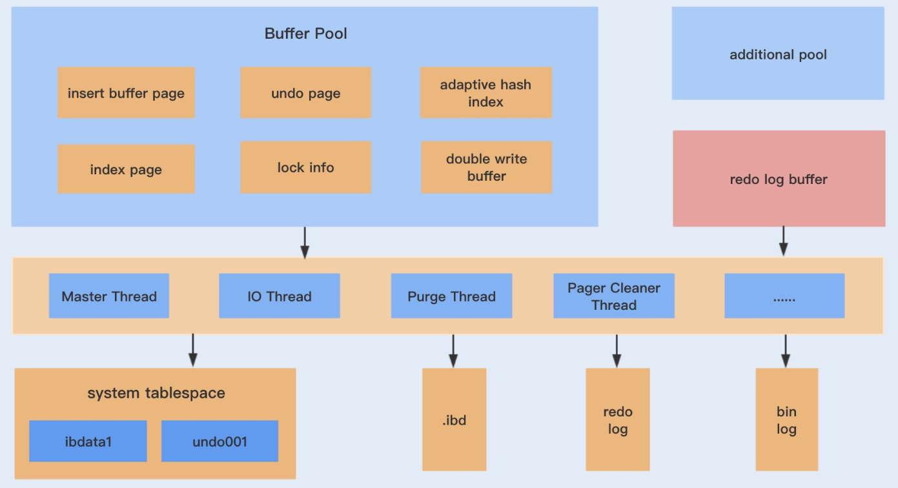

# InnoDB  #

## 2. InnoDB 存储引擎 ##

### 2.3 体系架构 ###



#### 2.3.1 后台线程 ####

- Master Thread

- IO Thread: 处理写IO请求，通过 `innodb_read_io_threads` `innodb_write_io_threads` 参数设置。

  ```
  I/O thread 0 state: wait Windows aio (insert buffer thread)
  I/O thread 1 state: wait Windows aio (log thread)
  I/O thread 2 state: wait Windows aio (read thread)
  I/O thread 3 state: wait Windows aio (read thread)
  I/O thread 4 state: wait Windows aio (read thread)
  I/O thread 5 state: wait Windows aio (read thread)
  I/O thread 6 state: wait Windows aio (write thread)
  I/O thread 7 state: wait Windows aio (write thread)
  I/O thread 8 state: wait Windows aio (write thread)
  I/O thread 9 state: wait Windows aio (write thread)
  ```

- Purge Thread: undo log ，`innodb_purge_threads`

- Page Cleaner Thread: 处理脏页

#### 2.3.2 内存 ####

**1. 缓冲池**

大小通过 `innodb_buffer_pool_size` 设置。

innodb可以有多个缓冲池实例，可以通过 `innodb_buffer_pool_instances` 设置。

查看缓冲池状态： `INFORMATION_SCHEMA.INNODB_BUFFER_POOL_STATUS`

**2. LRU list Free list Flush List**

在LRU list 中，新读取到的页，并不是直接放入到LRU list列表的首部，而是放入到LRU列表的midpoint 位置。该位置由 `innodb_old_blocks_pct` 控制。

系统变量`innodb_old_blocks_time` 用于表示页读取到mid位置后需要等待多久才会被加入到 LRU列表的热端。

当页从LRU list的old -> new ,此时发生的操作为 page_made_young

因为 `innodb_old_blocks_time` 的设置导致页没有从 old -> new 的操作为 page not made young

### 2.4 Checkpoint ###

Write Ahead Log : 当事务提交时，先写重做日志，再修改页。

假如有以下场景：如果重做日志可以无限地增大，同时缓冲池也足够大，能够缓冲所有数据库的数据，那么是不需要将缓冲池中页的新版本刷新回磁盘。

checkpoint 解决的问题：

- 缩短数据库的恢复时间
- 缓冲池不够用时，将脏页刷新到磁盘
- 重做日志(redo log)不可用时，刷新脏页。

当缓冲池不够用时，根据LRU算法会溢出最近最少使用的页，若此页为脏页，那么需要强制执行checkpoint,将脏页也就是页的新版本刷新回磁盘。

在innodb中，通过 LSN (log sequence number) 来标记版本，是一个8字节的数字。

```
Log sequence number 432376306
Log flushed up to   432376306
Pages flushed up to 432376306
Last checkpoint at  432376297
```

**checkpoint 发生的条件和时机**

种类：

- Sharp
- Fuzzy

Sharp 发生数据库关闭时。对应的参数 `innodb_fast_shutdown=1`

以下列出了 Fuzzy 可能发生的情况：

- Master thread 

  以一定的频率从缓冲池的脏页列表刷新一定比例的页到磁盘。这个过程不会阻塞用户线程

- FLUSH_LRU_LIST

  在Page Cleaner 线程进行，由于LRU list 需要保证可用的空闲页。 `innodb_lru_scan_depth`

- Async / Sync Flush

  重做日志不可用的情况，此时需要强制将一些页刷新回磁盘，脏页从脏页列表选取。保证重做日志的循环使用的可能性，也是在 Page Cleaner 线程中进行

- Dirty Page too mach

  `innodb_max_dirty_pages_pct`

### 2.5 Master Thread 工作方式 ###

早期的 main loop的逻辑：

每秒一次：

- always: redo log
- may: merge insert buffer
- may: purge dirty page

每十秒：

- may: flush dirty page
- always: merge insert buffer
- always: redo log
- always: delete undo page
- always: purge dirty page

简单地列出其逻辑：

```c
void master_thread() 
{
goto loop;

// main loop
loop:
	for (int i = 0; i < 10; i++) {
        thread_sleep(1);
        do log buffer flush to disk;
        if (last_one_second_ios < 5% innodb_io_capacity) 
            do merge 5% innodb_io_capacity insert buffer;
        if (buf_get_modified_ratio_pct > innodb_max_dirty_pages_pct) 
            do buffer pool flush 100% innodb_io_capacity dirty page;
        else if (enable adaptive flush) 
            do buffer pool flush desired amount dirty page;
        
        if (no user activity) {
            goto background loop;
        }
    }
    
    if (last_ten_second_ios < innodb_io_capacity) 
        do buffer pool flush 100% innodb_io_capacity dirty page;
    do merge 5% innodb_io_capacity insert buffer;
    do log buffer flush to disk;
    do full purge;
    
    if ( buf_get_modified_ratio_pct > 70% )
        do buffer pool flush 100% innodb_io_capacity dirty page;
    else:
   		do buffer pool flush 10% innodb_io_capacity dirty page;
    goto loop;

background loop:
    do full purge;
    do merge 100% innodb_io_capacity insert buffer;
    if (not idle)
        goto loop
    else
        goto flush loop

flush loop:
    do buffer pool flush 100% innodb_io_capacity ditry page;
    if ( buf_get_modified_ratio_pct > innodb_max_dirty_pages_pct)
        goto flush loop;
    goto suspend loop
        
suspend loop:
    suspend_thread()
    waiting event
    goto loop;
    
}
```

### 2.6 关键特性 ###

- insert buffer
- double write
- adaptive hash index
- async io
- flush neighbor page


