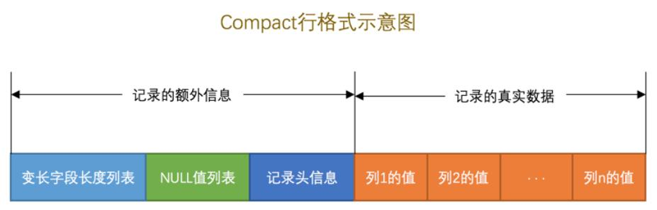
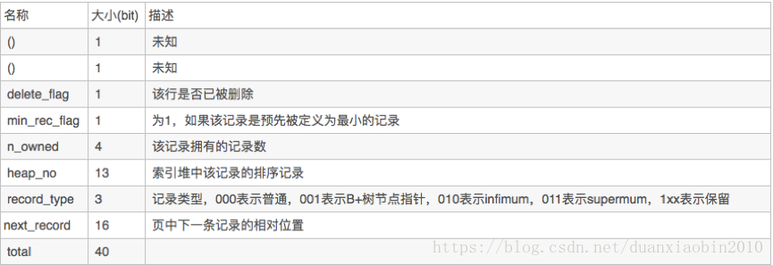
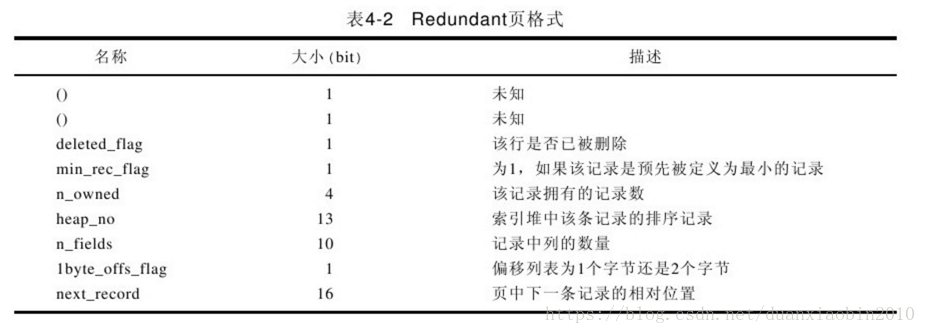
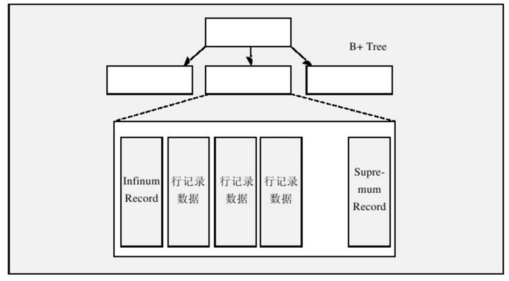

# InnoDB  #

## 2. InnoDB 存储引擎 ##

### 2.3 体系架构 ###


#### 2.3.1 后台线程 ####

- Master Thread

- IO Thread: 处理写IO请求，通过 `innodb_read_io_threads` `innodb_write_io_threads` 参数设置。

  ```
  I/O thread 0 state: wait Windows aio (insert buffer thread)
  I/O thread 1 state: wait Windows aio (log thread)
  I/O thread 2 state: wait Windows aio (read thread)
  I/O thread 3 state: wait Windows aio (read thread)
  I/O thread 4 state: wait Windows aio (read thread)
  I/O thread 5 state: wait Windows aio (read thread)
  I/O thread 6 state: wait Windows aio (write thread)
  I/O thread 7 state: wait Windows aio (write thread)
  I/O thread 8 state: wait Windows aio (write thread)
  I/O thread 9 state: wait Windows aio (write thread)
  ```

- Purge Thread: undo log ，`innodb_purge_threads`

- Page Cleaner Thread: 处理脏页

#### 2.3.2 内存 ####

**1. 缓冲池**

大小通过 `innodb_buffer_pool_size` 设置。

innodb可以有多个缓冲池实例，可以通过 `innodb_buffer_pool_instances` 设置。

查看缓冲池状态： `INFORMATION_SCHEMA.INNODB_BUFFER_POOL_STATUS`

**2. LRU list Free list Flush List**

在LRU list 中，新读取到的页，并不是直接放入到LRU list列表的首部，而是放入到LRU列表的midpoint 位置。该位置由 `innodb_old_blocks_pct` 控制。

系统变量`innodb_old_blocks_time` 用于表示页读取到mid位置后需要等待多久才会被加入到 LRU列表的热端。

当页从LRU list的old -> new ,此时发生的操作为 page_made_young

因为 `innodb_old_blocks_time` 的设置导致页没有从 old -> new 的操作为 page not made young

### 2.4 Checkpoint ###

Write Ahead Log : 当事务提交时，先写重做日志，再修改页。

假如有以下场景：如果重做日志可以无限地增大，同时缓冲池也足够大，能够缓冲所有数据库的数据，那么是不需要将缓冲池中页的新版本刷新回磁盘。

checkpoint 解决的问题：

- 缩短数据库的恢复时间
- 缓冲池不够用时，将脏页刷新到磁盘
- 重做日志(redo log)不可用时，刷新脏页。

当缓冲池不够用时，根据LRU算法会溢出最近最少使用的页，若此页为脏页，那么需要强制执行checkpoint,将脏页也就是页的新版本刷新回磁盘。

在innodb中，通过 LSN (log sequence number) 来标记版本，是一个8字节的数字。

```
Log sequence number 432376306
Log flushed up to   432376306
Pages flushed up to 432376306
Last checkpoint at  432376297
```

**checkpoint 发生的条件和时机**

种类：

- Sharp
- Fuzzy

Sharp 发生数据库关闭时。对应的参数 `innodb_fast_shutdown=1`

以下列出了 Fuzzy 可能发生的情况：

- Master thread 

  以一定的频率从缓冲池的脏页列表刷新一定比例的页到磁盘。这个过程不会阻塞用户线程

- FLUSH_LRU_LIST

  在Page Cleaner 线程进行，由于LRU list 需要保证可用的空闲页。 `innodb_lru_scan_depth`

- Async / Sync Flush

  重做日志不可用的情况，此时需要强制将一些页刷新回磁盘，脏页从脏页列表选取。保证重做日志的循环使用的可能性，也是在 Page Cleaner 线程中进行

- Dirty Page too mach

  `innodb_max_dirty_pages_pct`

### 2.5 Master Thread 工作方式 ###

早期的 main loop的逻辑：

每秒一次：

- always: redo log
- may: merge insert buffer
- may: purge dirty page

每十秒：

- may: flush dirty page
- always: merge insert buffer
- always: redo log
- always: delete undo page
- always: purge dirty page

简单地列出其逻辑：

```c
void master_thread() 
{
goto loop;

// main loop
loop:
	for (int i = 0; i < 10; i++) {
        thread_sleep(1);
        do log buffer flush to disk;
        if (last_one_second_ios < 5% innodb_io_capacity) 
            do merge 5% innodb_io_capacity insert buffer;
        if (buf_get_modified_ratio_pct > innodb_max_dirty_pages_pct) 
            do buffer pool flush 100% innodb_io_capacity dirty page;
        else if (enable adaptive flush) 
            do buffer pool flush desired amount dirty page;
        
        if (no user activity) {
            goto background loop;
        }
    }
    
    if (last_ten_second_ios < innodb_io_capacity) 
        do buffer pool flush 100% innodb_io_capacity dirty page;
    do merge 5% innodb_io_capacity insert buffer;
    do log buffer flush to disk;
    do full purge;
    
    if ( buf_get_modified_ratio_pct > 70% )
        do buffer pool flush 100% innodb_io_capacity dirty page;
    else
   		do buffer pool flush 10% innodb_io_capacity dirty page;
    goto loop;

background loop:
    do full purge;
    do merge 100% innodb_io_capacity insert buffer;
    if (not idle)
        goto loop
    else
        goto flush loop

flush loop:
    do buffer pool flush 100% innodb_io_capacity ditry page;
    if ( buf_get_modified_ratio_pct > innodb_max_dirty_pages_pct)
        goto flush loop;
    goto suspend loop
        
suspend loop:
    suspend_thread()
    waiting event
    goto loop;
    
}
```

### 2.6 关键特性 ###

- insert buffer
- double write
- adaptive hash index
- async io
- flush neighbor page

#### 2.6.1 插入缓冲 ####

在通常情况下，一张表上有多个非聚集的辅助索引 (secondary index) , 这个时候的插入情况对于非聚集索引叶子节点的插入不再是顺序的了，而需要离散地访问非聚集索引页。

而这种插入缓冲先将页放到 Insert Buffer 对象中，再以一定的频率和情况进行 Insert Buffer 和辅助索引页子节点的merge操作。

Insert Buffer 的使用需要满足：

- secondary index
- not unique index

**Insert Buffer的内部实现**

Insert buffer 是一个 B+ 树，存放再共享表空间中 ibdata1 。因此试图通过独立表空间ibd 文件恢复表中数据时，往往会导致 check table 失败，还需要进行 REPIAR TABLE 重建表上所有的辅助索引。

由叶节点和非叶节点组成。 非叶节点存放的是查询的 search key :

其构造包括三个字段：space （4 byte）+ marker（1byte） + offset（4byte） = search key （9 byte ）

​	**space**表示待插入记录所在的表空间id，InnoDB中，每个表有一个唯一的space id，可以通过space id查询得知是哪张表；

​	**marker**是用来兼容老版本的insert buffer；

​	**offset**表示页所在的偏移量。

**4. Merge Insert Buffer**

合并动作发生的情况：

- 辅助索引被读取到缓冲池中
- Insert Buffer Bitmap 页追踪到该辅助索引页以无可用空间时。
- Master Thread

#### 2.6.2 Double Write ####

先写 doublewrite buffer 再将dublewrite buffer 中的页写入各个表空间文件中。

#### 2.6.3 自适应哈希索引 ####

由innodb自动在特定条件下创建。

只能在等值得条件下命中。

### 2.7 启动，关闭，恢复 ###

关闭时，影响innodb引擎行为得参数： `innodb_fast_shutdown=1`

影响innodb恢复时得参数：`innodb_force_recovery`

## 3. 文件 ##

### 3.1 参数文件 ###

### 3.2 日志文件 ###

- 重做日志（redo log）
- 回滚日志（undo log）
- 二进制日志（binlog）
- 错误日志（errorlog）
- 慢查询日志（slow query log）
- 一般查询日志（general log）
- 中继日志（relay log）

#### 3.2.1 redo log ####

确保事务的持久性。防止在发生故障的时间点，尚有脏页未写入磁盘，在重启mysql服务的时候，根据redo log进行重做，从而达到事务的持久性这一特性。

事务开始之后就产生redo log，redo log的落盘并不是随着事务的提交才写入的，而是在事务的执行过程中，便开始写入redo log文件中。

当对应事务的脏页写入到磁盘之后，redo log的使命也就完成了，重做日志占用的空间就可以重用（被覆盖）。

之所以说重做日志是在事务开始之后逐步写入重做日志文件，而不一定是事务提交才写入重做日志缓存，原因就是，重做日志有一个缓存区`Innodb_log_buffer`，`Innodb_log_buffer`的默认大小为8M，Innodb存储引擎先将重做日志写入innodb_log_buffer中。

#### 3.2.2 undo log ####

保存了事务发生之前的数据的一个版本，可以用于回滚，同时可以提供多版本并发控制下的读（MVCC），也即非锁定读

事务开始之前，将当前是的版本生成undo log，undo 也会产生 redo 来保证undo log的可靠性.

当事务提交之后，undo log并不能立马被删除，而是放入待清理的链表，由purge线程判断是否由其他事务在使用undo段中表的上一个事务之前的版本信息，决定是否可以清理undo log的日志空间。

默认情况下undo文件是保持在共享表空间的，也即ibdatafile文件中

#### 3.2.3 bin log ####

事务提交的时候，一次性将事务中的sql语句（一个事物可能对应多个sql语句）按照一定的格式记录到binlog中。

这里与redo log很明显的差异就是redo log并不一定是在事务提交的时候刷新到磁盘，redo log是在事务开始之后就开始逐步写入磁盘。

### 3.5 表结构定义文件 ###

### 3.6 InnoDB存储引擎文件 ###

#### 3.6.1 表空间文件 ####

在默认情况下会有一个10MB名为 ibdata1的文件，该文件就是默认的表空间文件 tablespace file ，可以通过参数 `innodb_data_file_path` 进行设置。

在设置了 `innodb_data_file_path` 参数后，所有基于innodb存储引擎的表的数据都会保存在该共享表空间中。

如果设置了 `innodb_file_per_table` 那么就是使用独立表空间 `table_name.ibd`

#### 3.6.2 重做日志文件 redo_log ####

在默认情况下，在数据目录下会有两个名为 ib_logfile0 和 ib_logfile1 的文件。

下列参数影响重做日志文件的属性：

- innodb_log_file_size : 指定每个重做日志的大小
- innodb_log_files_in_group ：日志文件组中日志文件的数量
- innodb_mirrored_log_groups ：日志镜像文件组的数量
- innodb_log_group_home_dir ：日志文件组所在路径

```mysql
show variables like 'innodb\_log\_%';
```

## 4. table ##

### 4.1 索引组织表 ###

### 4.2 InnoDB 逻辑存储结构 ###


#### 4.2.1 tablespace ####

单独的表空间保存：数据 索引 和 insert buffer bitmap

共享的表空间保存： undo, insert buffer, 系统事务信息，doublewrite buffer，

#### 4.2.2 segment ####

数据段为树的叶子节点

非数据段为树的非索引节点

#### 4.2.3 extent ####

任何情况下每个区的大小都为1MB 。

InnoDB1.0.x版本开始引入压缩页，每个页的大小可以通过参数KEY_BLOCK_SIZE设置为2K、4K、8K，因此每个区对应的页尾512、256、128.

InnoDB1.2.x版本新增了参数innodb_page_size，通过该参数可以将默认页的大小设置为4K、8K，但是页中的数据不是压缩的。

#### 4.2.4 页 ####

在InnoDB存储引擎中，常见的页类型有：

- 数据页 B-tree Node
- undo 页 Undo Log Page
- 系统页 System Page
- 事务数据页 Transaction system Page
- Insert Buffer Bitmap
- Insert Buffer Free List
- Uncompressed BLOB Page
- compressed Blob Page

#### 4.2.5 行 ####

InnoDB 存储引擎是面向列的 (`row-oriented`)

### 4.3 InnoDB 行记录格式 ###

innoDB存储引擎提供了两种格式：`Compact` 和 `Redundant` ，默认格式为Compact行格式。

#### 4.3.1 Compact行格式 ####

在MySQL5.0 中引入，一个页中存放的行数据越多，其性能就越高。



首部：是一个非NULL变长字段长度列表的表，并且是按照列的顺序逆序放置的，其长度：

- 若列的长度小于255字节，用一字节表示
- 若大于255字节，用两字节表示。

NULL值列表：占1个字节。

record header: 5字节，其信息如下图：



最后的部分就是实际存储每个列的数据。

每行数据除了用户定义的列，还有两个隐藏列，事务ID列和回滚指针列，分别为6字节和7字节的大小。如果没有主键还会有一个隐藏的6字节的主键。

接下来使用具体的demo来查看：

```mysql
create table mytest
(
    t1 varchar(10),
    t2 varchar(10),
    t3 char(10),
    t4 varchar(10)
) engine = innodb
  charset = LATIN1
  ROW_FORMAT = COMPACT;
  
# 插入三条数据
insert into mytest values ('a', 'bb', 'cc', 'ccc');
insert into mytest values ('d', 'ee', 'ee', 'fff');
insert into mytest values ('d', NULL, NULL, 'fff');
```

此时我们可以查看mytest.idb文件：

```
0000c070  73 75 70 72 65 6d 75 6d  03 02 01 00 00 00 10 00  |supremum........|
0000c080  2c 00 00 00 0c 06 00 00  00 00 01 6e 19 b9 00 00  |,..........n....|
0000c090  01 1f 01 10 61 62 62 63  63 20 20 20 20 20 20 20  |....abbcc       |
0000c0a0  20 63 63 63 03 02 01 00  00 00 18 00 2b 00 00 00  | ccc........+...|
0000c0b0  0c 06 01 00 00 00 01 6e  1a ba 00 00 01 2f 01 10  |.......n...../..|
0000c0c0  64 65 65 65 65 20 20 20  20 20 20 20 20 66 66 66  |deeee        fff|
0000c0d0  03 01 06 00 00 20 ff 98  00 00 00 0c 06 02 00 00  |..... ..........|
0000c0e0  00 01 6e 1f bd 00 00 01  24 01 10 64 66 66 66 00  |..n.....$..dfff.|
```

真正的数据记录开始位置： 0000c078

下面列出第一个记录的数据：

```c
03 02 01 								// 变长字段长度列表
00       								// NULL 标志位
00 00 10 00 2c 							// record header
00 00 00 0c 06 00 						// row id
00 00 00 01 6e 19 						// transaction id
b9 00 00 01 1f 01 10 					// roll pointer 回滚指针
61                                      // 列1数据
62 62                                   // 列2数据
63 63 20 20 20 20 20 20 20 20           // 列3数据
63 63 63                                // 列4数据
```

第二个记录：

```c
03 02 01
00
00 00 18 00 2b
00 00 00 0c 06 01
00 00 00 01 6e 1a
ba 00 00 01 2f 01 10
64
65 65
65 65 20 20 20 20 20 20 20 20
66 66 66
```

第三个记录：

```c
03 01
06                         // 0000 0110
00 00 20 ff 98
00 00 00 0c 06 02
00 00 00 01 6e 1f
bd 00 00 01 24 01 10
64                          // 第一列数据
66 66 66                    // 第四列数据
```

#### 4.3.2 Redundant 行格式 ####


首部是一个字段长度偏移列表，也是按照列的顺序逆序放置的。

record header: 占6字节。



同样列出以下的demo:

```mysql
create table mytest2
    engine = innodb
    row_format = redundant as
select *
from mytest;
```

接下来查看idb文件:

```
0000c070  08 03 00 00 73 75 70 72  65 6d 75 6d 00 23 20 16  |....supremum.# .|
0000c080  14 13 0c 06 00 00 10 0f  00 ba 00 00 00 0c 06 03  |................|
0000c090  00 00 00 01 6e 24 a2 00  00 01 15 01 10 61 62 62  |....n$.......abb|
0000c0a0  63 63 20 20 20 20 20 20  20 20 63 63 63 23 20 16  |cc        ccc# .|
0000c0b0  14 13 0c 06 00 00 18 0f  00 ea 00 00 00 0c 06 04  |................|
0000c0c0  00 00 00 01 6e 24 a2 00  00 01 15 01 1f 64 65 65  |....n$.......dee|
0000c0d0  65 65 20 20 20 20 20 20  20 20 66 66 66 21 9e 94  |ee        fff!..|
0000c0e0  14 13 0c 06 00 00 20 0f  00 74 00 00 00 0c 06 05  |...... ..t......|
0000c0f0  00 00 00 01 6e 24 a2 00  00 01 15 01 2e 64 00 00  |....n$.......d..|
0000c100  00 00 00 00 00 00 00 00  66 66 66 00 00 00 00 00  |........fff.....|
```

那么可以得出第一条记录的数据：

```c
23 20 16 14 13 0c 06                     // 长度偏移列表： 06 0c 13 14 16 20 23
00 00 10 0f 00 ba                        // record header
00 00 00 0c 06 03                        // row id
00 00 00 01 6e 24                        // transaction id
a2 00 00 01 15 01 10                     // roll pointer
61                                       // col1
62 62                                    // col2
63 63 20 20 20 20 20 20 20 20            // col3
63 63 63                                 // col4
```

解释一下长度偏移列表：06 0c 13 14 16 20 23

第一列长度6     (0x00+6=0x06)

第二列长度6    (0x06+6= 0x0c)

第三列长度7    (0x0c+7=  0x13)

第四列长度1    (0x13+1=   0x14)

第五列长度2    (0x14+2=  0x16)

第六列长度10  (0x16+10= 0x20)

第七列长度3   (0x20+3=  0x23)

第三条记录：

```c
21 9e 94 14 13 0c 06
00 00 20 0f 00 74
00 00 00 0c 06 05
00 00 00 01 6e 24
a2 00 00 01 15 01 2e
64  // col1
00 00 00 00 00 00 00 00 00 00  // col3
66 66 66  // col4
```

为什么从14变成了94 ???

NULL 标志的影响，最高位的标志位设为1

#### 4.3.3 行溢出数据 ####

varchar最大长度是65535字节，指的是一个表中所有列的总和不能超过这个长度。一个utf8的字节数从1-3个字节。

当发生行溢出时，数据放在页类型为 Uncompress BLOB 页中。

下面列出一个demo:

```mysql
create table t ( a varchar(65532) ) engine = innodb charset = latin1 row_format = redundant;
insert into t select repeat('a', 65532);
```

然后列出数据：

```
0000c070  08 03 00 00 73 75 70 72  65 6d 75 6d 00 43 27 00  |....supremum.C'.|
0000c080  13 00 0c 00 06 00 00 10  08 00 74 00 00 00 0c 06  |..........t.....|
0000c090  07 00 00 00 01 6e 42 bb  00 00 01 31 01 10 61 61  |.....nB....1..aa|
0000c0a0  61 61 61 61 61 61 61 61  61 61 61 61 61 61 61 61  |aaaaaaaaaaaaaaaa|
...
0000c380  61 61 61 61 61 61 61 61  61 61 61 61 61 61 61 61  |aaaaaaaaaaaaaaaa|
0000c390  61 61 61 61 61 61 61 61  61 61 61 61 61 61 00 00  |aaaaaaaaaaaaaa..|
0000c3a0  03 bb 00 00 00 04 00 00  00 26 00 00 00 00 00 00  |.........&......|
0000c3b0  fc fc 00 00 00 00 00 00  00 00 00 00 00 00 00 00  |................|
```

```c
00 43 27 00 13 00 0c 00 06  // 06 00 0c 00 13 00 27 00 00 43 ???
00 00 10 08 00 74
00 00 00 0c 06 07
00 00 00 01 6e 42
bb 00 00 01 31 01 10
61 61 ... 61 
```

实际溢出不溢出还是要根据实际数据的长度来决定：保证一个页能放入两条记录那么就不会溢出。

#### 4.3.4 Compressed & Dynamic ####

Antelope: Compact & Redundant

Barracuda: Compressed & Dynamic

新的记录格式对于行溢出，只在数据页中存放20个字节的指针，实际的数据都存放在Off Page中。

Compressed 会将行数据以zlib的算法进行压缩。

#### 4.3.5 CHAR ####

`char(N)` 其中N指的是字符的长度而不是实际的长度，如utf8就会有1-3个字节表示unicode，那么当N=10时，实际的长度就可能是10-30byte之间。

### 4.4 InnoDB数据页结构 ###

InnoDB数据页由以下部分组成：

- file header : 38byte
- page header: 56 byte
- Infimum & Supremum Records
- User Records
- Free Space
- Page Directory
- File Trailer: 8byte


#### 4.4.1 File Header ####

| 名称                             | 大小 (byte) | description                                           |
| -------------------------------- | ----------- | ----------------------------------------------------- |
| FIL_PAGE_SPACE_OR_CHECKSUM       | 4           | 该页的checksum                                        |
| FIL_PAGE_OFFSET                  | 4           | 表空间中页的偏移量，表示该页在所有页中的位置。        |
| FIL_PAGE_PREV                    | 4           | 上一个页                                              |
| FIL_PAGE_NEXT                    | 4           | 下一个页                                              |
| FIL_PAGE_LSN                     | 8           | 该页最后被修改的日志序列位置LSN                       |
| FIL_PAGE_TYPE                    | 2           | InnoDB Engine Page Type                               |
| FIL_PAGE_FILE_FLUSH_LSN          | 8           | 该值仅在一个页中定义，代表文件至少被更新到了该LSN值。 |
| FIL_PAGE_ARCH_LOG_NO_OR_SPACE_ID | 4           | 该值表示页属于哪个表空间                              |

  InnoDB Engine Page Type：

| Name                    | Hex    | Description             |
| ----------------------- | ------ | ----------------------- |
| FIL_PAGE_INDEX          | 0x45BF | B+树叶节点              |
| FIL_PAGE_UNDO_LOG       | 0x0002 | Undo Log 页             |
| FIL_PAGE_INODE          | 0x0003 | 索引节点                |
| FIL_PAGE_IBUF_FREE_LIST | 0x0004 | Insert Buffer Free List |
| FIL_PAGE_TYPE_ALLOCATED | 0x0000 | 最新分配                |
| FIL_PAGE_IBUF_BITMAP    | 0x0005 | Insert Buffer 位图      |
| FIL_PAGE_TYPE_SYS       | 0x0006 | system page             |
| FIL_PAGE_TYPE_TRX_SYS   | 0x0007 | system transaction data |
| FIL_PAGE_TYPE_FSP_HDR   | 0x0008 | file space header       |
| FIL_PAGE_TYPE_XDES      | 0x0009 | 扩展描述页              |
| FIL_PAGE_TYPE_BLOB      | 0x000A | Blob页                  |

#### 4.4.2 Page header ####

| name              | size (bytes) | desc                                                         |
| ----------------- | ------------ | ------------------------------------------------------------ |
| PAGE_N_DIR_SLOTS  | 2            | 在Page Directory(页目录) 中的 slot                           |
| PAGE_HEAP_TOP     | 2            | 堆中第一个记录的指针                                         |
| PAGE_N_HEAP       | 2            | 堆中的记录数，第15位表示行记录格式                           |
| PAGE_FREE         | 2            | 指向可重用空间的指针                                         |
| PAGE_GARBAGE      | 2            | 已删除记录的字节数。                                         |
| PAGE_LAST_INSERT  | 2            | 最后插入记录的位置                                           |
| PAGE_DIRECTION    | 2            | 最后插入的方向：<br />PAGE_LEFT 0x01<br />PAGE_RIGHT 0x02<br />PAGE_SAME_REC 0x03<br />PAGE_SAME_PAGE 0x04<br />PAGE_NO_DIRECTION 0x05 |
| PAGE_N_DIRECTION  | 2            | 一个方向连续插入记录的数量                                   |
| PAGE_N_RECS       | 2            | 该页中记录的数量                                             |
| PAGE_MAX_TRX_ID   | 8            | 修改当前页的最大事务ID                                       |
| PAGE_LEVEL        | 2            | 当前页在索引树中的位置                                       |
| PAGE_INDEX_ID     | 8            | 索引ID, 表示当前页属于哪个索引                               |
| PAGE_BTR_SEG_LEAF | 10           |                                                              |
| PAGE_BTR_SEG_TOP  | 10           |                                                              |

#### 4.4.3 Infimum & Supremun ####

Infimum 记录是比该页中任何主键值都要小的值。

Supremum 比任何可能大的值还要大的值。

在创建页时创建，并且在任何情况下不会被删除。



#### 4.4.4 User Record & Free Space ####

free space 是个链表，在一条记录被删除后，该空间会被加入到空闲链表中。

#### 4.4.5 Page Directory ####

Page Directory（页目录）中存放了记录的相对位置（注意，这里存放的是页相对位置，而不是偏移量），有些时候这些记录指针称为Slots（槽）或者目录槽（Directory Slots）。与其他数据库系统不同的是，InnoDB并不是每个记录拥有一个槽，InnoDB存储引擎的槽是一个稀疏目录（sparse directory），即一个槽中可能属于（belong to）多个记录，最少属于4条记录，最多属于8条记录。

Slots中记录按照键顺序存放，这样可以利用二叉查找迅速找到记录的指针。假设我们有（'i'，'d'，'c'，'b'，'e'，'g'，'l'，'h'，'f'，'j'，'k'，'a'），同时假设一个槽中包含4条记录，则Slots中的记录可能是（'a'，'e'，'i'）。

由于InnoDB存储引擎中Slots是稀疏目录，二叉查找的结果只是一个粗略的结果，所以InnoDB必须通过recorder header中的next_record来继续查找相关记录。同时，slots很好地解释了recorder header中的n_owned值的含义，即还有多少记录需要查找，因为这些记录并不包括在slots中。

需要牢记的是，B+树索引本身并不能找到具体的一条记录，B+树索引能找到只是该记录所在的页。数据库把页载入内存，然后通过Page Directory再进行二叉查找。只不过二叉查找的时间复杂度很低，同时内存中的查找很快，因此通常我们忽略了这部分查找所用的时间。

#### 4.4.6 File Trailer ####

为了保证页能够完整地写入磁盘（如可能发生的写入过程中磁盘损坏、机器宕机等原因），InnoDB存储引擎的页中设置了File Trailer部分。File Trailer只有一个FIL_PAGE_END_LSN部分，占用8个字节。前4个字节代表该页的checksum值，最后4个字节和File Header中的FIL_PAGE_LSN相同。通过这两个值来和File Header中的FIL_PAGE_SPACE_OR_CHKSUM和FIL_PAGE_LSN值进行比较，看是否一致（checksum的比较需要通过InnoDB的checksum函数来进行比较，不是简单的等值比较），以此来保证页的完整性（not corrupted）。

### 4.5 Named File Formats ###

参数 `innodb_file_format` 用来指定文件格式。

### 4.6 约束 ###

#### 4.6.1 数据完整性 ####

可以通过 `Primary Key` `Unique Key` 和 触发器来保证数据的完整性。

域完整性保证数据每列的值满足特定的条件：

- Foreign Key
- Use Trigger
- DEFAULT
- NOT NULL
- Primary Key

#### 4.6.2 约束的创建和查找 ####

两种创建方式：

- 表建立时就进行约束定义
- 利用 ALTER TABLE 命令来进行创建约束

通过表 `information_schema.TABLE_CONSTRAINTS` 来查看约束关系。

外键可以通过 `information_schema.REFERENTIAL_CONSTRAINTS` 查看。

#### 4.6.7 外键约束 ####

外键定义时的 ON DELETE 和 ON UPDATE 表示在对父表进行 DELETE 和 UPDATE 操作时，对子表所做的操作，可定义的子表操作有：

- CASCADE
- SET NULL
- NO ACTION
- RESTRICT

关闭外键约束检查：

```mysql
SET foreign_key_checks=0;
```

### 4.7 视图 ###

查看所有物理表：

```mysql
select * from information_schema.TABLES where table_type='BASE TABLE' and table_schema=database()\G
```

## 5. 索引和算法 ##

### 5.1 InnoDB 索引 ###

- B+ 树
- 全文索引
- 哈希索引

B+树索引并不能找到一个给定键值的具体行，只能查找到数据行所在的页。然后数据库通过页读入到内存，再在内存中进行查找。

#### 5.4.1 聚集索引 ####

聚集索引的存储并不是物理上连续的，而是逻辑上连续的。

- 页通过双向链表链接，页按照主键的顺序排序
- 每个页中的记录也是通过双向链表进行维护的，物理存储上可以同样不按照主键存储

#### 5.4.2 辅助索引 ####

对于辅助索引来说，叶子节点并不包含行记录的全部数据。叶子节点除了包含键值以外，每个叶子节点中的索引行中还包含了一个书签(相应行数据的聚集索引键)

```mysql
show index from t\G
```

当通过辅助索引来寻找数据时，InnoDB存储引擎会遍历辅助索引并通过叶级别的指针获得指向主键索引的主键，然后再通过主键索引来找到一个完整的行记录。

#### 5.4.3 B+树索引的分裂 ####

#### 5.4.4 B+树索引的管理 ####

```mysql
alter table table_name
| ADD {INDEX|KEY} [index_name]
[index_type] (index_col_name, ...) [index_option] ...
```

使用 `show index from` 查看表上的索引：

- table
- non_unique
- key_name
- seq_in_index: 索引中该列的位置
- column_name: 索引列的名字
- collation：列以什么方式存储在索引中的
- Cardinality: 索引中唯一值的数目的估计值。可以通过 `ANALYZE TABLE` 更新
- sub_part: 是否是列的部分被索引
- packed: 关键字如何被压缩
- null: 是否索引的列含有NULL值
- index_type: 索引的类型
- comment: 注释

### 5.5 Cardinality ###

一般来说，在访问表中很少一部分时使用B+树索引才有意义。(高选择性)

Cardinality值 表示索引中不重复记录数量的预估值。

在实际应用中， `Cardinality/n_rows_in_table` 应该尽可能地接近1。

在 innoDB存储引擎内部对更新Cardinality信息的策略：

- 表中 1/16 的数据已经发生过变化
- stat_modified_counter > 2 000 000 000

### 5.6 B+树索引的使用 ###

OLTP 和 OLAP, 面向事务和面向分析

#### 5.6.2 联合索引 ####

```mysql
create table t (a int, b int, primary key (a), key idx_a_b (a, b)) engine = innodb;
```

对于查询：

```mysql
select * from table where a=xx and b=xxx;
select * from table where a=xxx;
```

这两个是可以命中索引的。

但是对于：

```mysql
select * from table where b=xxx;
```

无法命中这个联合索引。

联合索引的第二个好处是已经对第二个键值进行了排序处理。

```mysql
select * from table where a=xxx order by b;
```

#### 5.6.3 覆盖索引 covering index ####

- 解释一： 就是select的数据列只用从索引中就能够取得，不必从数据表中读取，换句话说查询列要被所使用的索引覆盖。
- 解释二： 索引是高效找到行的一个方法，当能通过检索索引就可以读取想要的数据，那就不需要再到数据表中读取行了。如果一个索引包含了（或覆盖了）满足查询语句中字段与条件的数据就叫 做覆盖索引。
- 解释三：是非聚集组合索引的一种形式，它包括在查询里的Select、Join和Where子句用到的所有列（即建立索引的字段正好是覆盖查询语句[select子句]与查询条件[Where子句]中所涉及的字段，也即，索引包含了查询正在查找的所有数据）。

不是所有类型的索引都可以成为覆盖索引。覆盖索引必须要存储索引的列，而哈希索引、空间索引和全文索引等都不存储索引列的值，所以MySQL只能使用B-Tree索引做覆盖索引。

#### 5.6.4 优化器选择不使用索引的情况 ####

由于选择了所有的列，而辅助索引没有所有的列，所以直接通过聚集索引来查找数据。

可以使用 `FORCE INDEX` 来强制使用某个索引

#### 5.6.5 索引提示 ####

`USE INDEX`

#### 5.6.6 Multi-Range Read ####

可适用于 range ref eq_ref

系统参数: `optimizer_switch`

#### 5.6.7 index condition pushdown ####

可适用于: range ref eq_ref ref_or_null

### 5.7 哈希算法 ###

#### 5.7.3 自适应哈希索引 ####

### 5.8 全文检索 ###

#### 5.8.2 倒排索引 inverted index ####

在辅助表中存储了单词与单词自身在一个或多个文档中所在位置之间的映射，这通常利用关联数组实现：

- inverted file index {text, doc_ids}
- full inverted index {text, (doc_id, pos)...}

#### 5.8.3 InnoDB全文检索 ####

FTS Index Cache

Auxiliary Table

参数 `innodb_ft_cache_size` 用来控制 FTS index Cache 的大小。

```mysql
create fulltext index idx_fts on fts_a(body);
set global inodb_ft_aux_table='test/fts_a';
select * from information_schema.INNODB_FT_INDEX_TABLE;
```

#### 5.8.4 全文检索 ####

## 6. 锁 ##

### 6.2 lock & latch ###

latch一般称为轻量级的锁，可以分为 mutex 互斥锁 和 rwlock 读写锁。

可以通过 `show engine innodb mutex;` 查看。

lock对象是事务。

可以通过 information_schema 的表 INNODB_TRX INNODB_LOCKS INNODB_LOCK_WAITS 来观察锁的信息。

### 6.3 InnoDB中的锁 ###

#### 6.3.1 锁的类型 ####

- S 共享锁
- X 排他锁

如果需要对页上的记录r进行上X锁，那么分别需要对数据库A, 表，页上意向锁IX，最后对记录r上X锁。

意向锁即为表锁，目的是为了在一个事务中揭示下一行将被请求的锁类型：

- IS
- IX

INNODB_TRX 的结构说明：

| 字段名                | 说明                     |
| --------------------- | ------------------------ |
| trx_id                | innodb internal trans id |
| trx_state             | current trans state      |
| trx_started           | trans start time         |
| trx_requested_lock_id | 等待事务的锁ID           |
| trx_wait_started      | 事务等待开始的时间       |
| trx_weight            | 事务的权重               |
| trx_mysql_thread_id   | mysql thread id          |
| trx_query             | SQL                      |

INNODB_LOCKS的结构：

| column      | desc                   |
| ----------- | ---------------------- |
| lock_id     | lock id                |
| lock_trx_id | trans id               |
| lock_mode   | lock type              |
| lock_type   | 锁的类型，表锁还是行锁 |
| lock_table  | 要加锁的表             |
| lock_index  | 锁住的索引             |
| lock_space  | 锁对象的space id       |
| lock_page   | 事务锁定页的数量       |
| lock_rec    | 事务锁定行的数量       |
| lock_data   | 事务锁定记录的主键值   |

INNODB_LOCK_WAITS的结构：

| column             | desc                 |
| ------------------ | -------------------- |
| requesting_trx_id  | 申请锁资源的trans id |
| requesting_lock_id | 申请的锁的id         |
| blocking_trx_id    | 阻塞的事务trans id   |
| blocking_lock_id   | 阻塞的锁的id         |

#### 6.3.2 一致性非锁定读 ####


如果读取的行正在执行更新操作，那么innodb会去读取一个快照数据。快照数据是指该行的之前版本的数据，通过undo段来完成。

不同的事务隔离级别下，读取的快照版本也不一致。

READ COMMITTED 总是读取最新的一份快照

REPEATABLE READ 总是读取事务开始时的行数据版本

#### 6.3.3 一致性锁定读 ####

select ... for update: X

select ... lock in share mode: S

#### 6.3.4 自增长与锁 ####

插入的类型：

| 插入类型           | 说明                                 |
| ------------------ | ------------------------------------ |
| insert-like        | 所有的插入语句                       |
| simple inserts     | 能在插入前就确定插入行数的语句       |
| bulk inserts       | 在插入前不能确定插入行数的语句       |
| mixed-mode inserts | 有一部分是自增长的，有一部分是确定的 |

自增列插入有个参数： `innodb_auotinc_lock_mode`

| innodb_auotinc_lock_mode | desc                                                         |
| ------------------------ | ------------------------------------------------------------ |
| 0                        | 通过表锁 AUTO-INC Locking                                    |
| 1                        | 对于simple inserst,使用互斥量mutex对内存中的计数器进行累加操作<br />对于bulk inserts,使用AUTO-INC Locking 表锁 |
| 2                        | 对于所有insert-like使用互斥量                                |

#### 6.3.5 外键和锁 ####

### 6.4 锁的算法 ###

#### 6.4.1 行锁的3种算法 ####

- record lock
- gap lock
- next-key lock

这里解释一下next-key lock, 例如一个索引有10,11,13和20四个值，那么索引被next-key lock的区间：

`(-∞, 10] (10, 11] (11, 13] (13, 20] (20, +∞]`

设计的目的是为了解决幻行。

如果查询的索引含有唯一属性时，innodb会将next-key lock 进行优化，降级为record-lock

此外 用户可以通过 InnoDB存储引擎的Next-Key Locking 机制在应用层面实现唯一性检查，需要借助事务隔离级别吗？应该时需要 可重复读 的事务隔离级别

```mysql
select * from table1 where col1=xxx lock in share mode;
if not found any row:
	insert into table1 values (...);
```

### 6.5 锁问题 ###

#### 6.5.1 脏读 ####

在不同的事务下，当前事务可以读到另外事务未提交的数据。

#### 6.5.2 不可重复读 ####

在一个事务内多次读取 同一个数据集合。在这个事务还没有结束时，另外一个事务也访问该同一数据集合，并进行了DML。因此第一个事务由于第二个事务的修改动作，导致了多个读取到的数据不一致的情况。

#### 6.5.3 丢失更新 ####

## 7. 事务 ##

