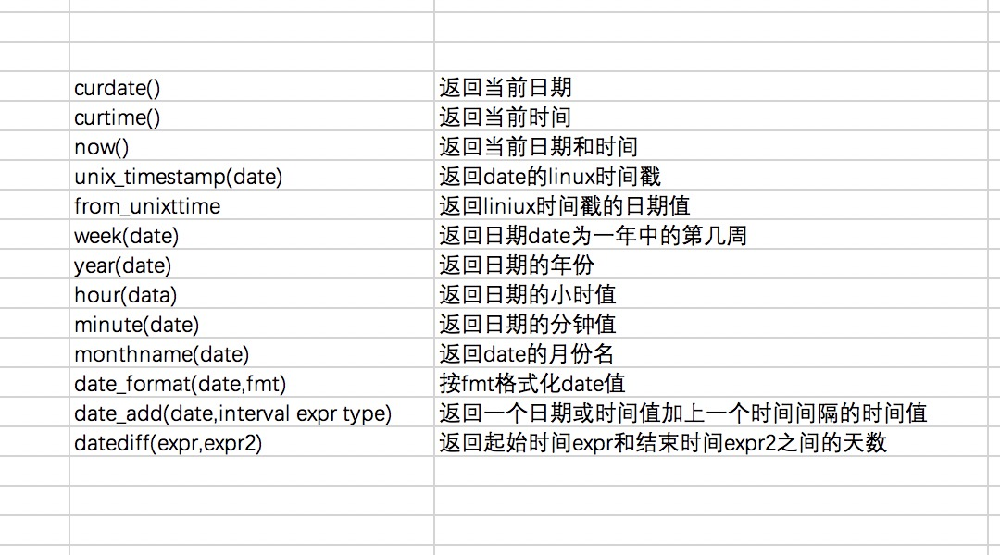
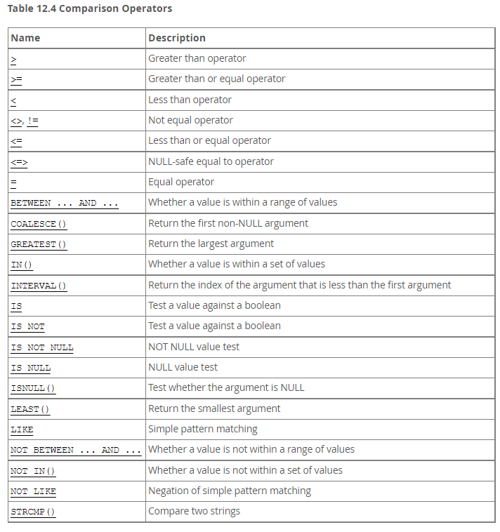

MySQL Official Document
==========

## 1. 一般信息 ##

## 2. 安装和升级MySQL ##

## 3. 向导 ##

### 3.1 连接数据库和断开连接 ###

```shell
C:\Users\Liberty>mysql -h localhost -u root -p
Enter password: ********
Welcome to the MySQL monitor.  Commands end with ; or \g.
Your MySQL connection id is 206
Server version: 5.7.27-log MySQL Community Server (GPL)

Copyright (c) 2000, 2019, Oracle and/or its affiliates. All rights reserved.

Oracle is a registered trademark of Oracle Corporation and/or its
affiliates. Other names may be trademarks of their respective
owners.

Type 'help;' or '\h' for help. Type '\c' to clear the current input statement.

mysql>
```

### 3.2 Entering Queries ###

```shell
mysql> SELECT VERSION(), CURRENT_DATE;
+------------+--------------+
| VERSION()  | CURRENT_DATE |
+------------+--------------+
| 5.7.27-log | 2020-11-08   |
+------------+--------------+
1 row in set (0.00 sec)

mysql>
```

mysql 以表格形式(row & column) 显示查询输出。mysql显示返回了多少行以及查询执行了多长时间。

关键字可以用任何大写字母输入。以下查询是等效的：

```mysql
mysql> SELECT VERSION(), CURRENT_DATE;
mysql> select version(), current_date;
mysql> SeLeCt vErSiOn(), current_DATE;

mysql> SELECT SIN(PI()/4), (4+1)*3;
+--------------------+---------+
| SIN(PI()/4)        | (4+1)*3 |
+--------------------+---------+
| 0.7071067811865476 |      15 |
+--------------------+---------+
1 row in set (0.00 sec)

mysql> SELECT VERSION(); SELECT NOW();
+------------+
| VERSION()  |
+------------+
| 5.7.27-log |
+------------+
1 row in set (0.00 sec)

+---------------------+
| NOW()               |
+---------------------+
| 2020-11-08 21:52:34 |
+---------------------+
1 row in set (0.00 sec)
```

下表显示了您可能会看到的每个提示，并总结了它们对于mysql所处的状态的含义 。

| 提示   | 含义                                            |
| :----- | ----------------------------------------------- |
| mysql> | 准备进行新查询                                  |
| ->     | 等待多行查询的下一行                            |
| '>     | 等待下一行，等待以单引号（'）开头的字符串的完成 |
| ">     | 等待下一行，等待以双引号（"）开头的字符串的完成 |
| `>     | 等待下一行，等待以反引号（`）开头的标识符的完成 |
| /*>    | 等待下一行，等待以开头的注释的完成 /*           |

### 3.3 创建和使用数据库 ###

显示所有的数据库:

```mysql
mysql> show databases;
+---------------------+
| Database            |
+---------------------+
| information_schema  |
| mysql               |
| performance_schema  |
| python_django_demo2 |
| sys                 |
+---------------------+
5 rows in set (0.00 sec)

mysql> GRANT ALL ON python_django_demo2.* TO 'your_mysql_name'@'your_client_host';
```

`your_client_host` is the host from which you connect to the server.

#### 3.3.1 创建和选择一个数据库 ####

```mysql
CREATE DATABASE demo_01;

-- 可以在开始mysql会话时，传入数据库参数: 
mysql -h host -u user -p menagerie
-- 查看目前选择的数据库: 
SELECT DATABASE()
```

VARCHAR's length can be set to 1-65535

显示表的结构信息:

```mysql
mysql> describe pet;
+---------+-------------+------+-----+---------+-------+
| Field   | Type        | Null | Key | Default | Extra |
+---------+-------------+------+-----+---------+-------+
| name    | varchar(20) | YES  |     | NULL    |       |
| owner   | varchar(20) | YES  |     | NULL    |       |
| species | varchar(20) | YES  |     | NULL    |       |
| sex     | char(1)     | YES  |     | NULL    |       |
| birth   | date        | YES  |     | NULL    |       |
| death   | date        | YES  |     | NULL    |       |
+---------+-------------+------+-----+---------+-------+
6 rows in set (0.00 sec)
```

#### 3.3.3 Loading Data into a Table ####

可以使用 `LOAD DATA LOCAL INFILE '/somefile' INTO TABLE pet;`

#### 3.3.4 Selecting Particular Columns ####

**1. 条件查询**

```mysql
mysql> SELECT DISTINCT owner FROM pet;
+--------+
| owner  |
+--------+
| Benny  |
| Diane  |
| Gwen   |
| Harold |
+--------+
```

**2. Sorting Rows**

```mysql
mysql> SELECT name, birth FROM pet ORDER BY birth DESC;
+----------+------------+
| name     | birth      |
+----------+------------+
| Puffball | 1999-03-30 |
| Chirpy   | 1998-09-11 |
| Whistler | 1997-12-09 |
| Slim     | 1996-04-29 |
| Claws    | 1994-03-17 |
| Fluffy   | 1993-02-04 |
| Fang     | 1990-08-27 |
| Bowser   | 1989-08-31 |
| Buffy    | 1989-05-13 |
+------
```

**3. Date Calculations**

```mysql
mysql> SELECT name, birth, CURDATE(),
    ->        TIMESTAMPDIFF(YEAR,birth,CURDATE()) AS age
    ->        FROM pet;
+----------+------------+------------+------+
| name     | birth      | CURDATE()  | age  |
+----------+------------+------------+------+
| Fluffy   | 1993-02-04 | 2020-11-08 |   27 |
| Claws    | 1994-03-17 | 2020-11-08 |   26 |
| Buffy    | 1989-05-13 | 2020-11-08 |   31 |
| Fang     | 1990-08-27 | 2020-11-08 |   30 |
| Bowser   | 1979-08-31 | 2020-11-08 |   41 |
| Chirpy   | 1998-09-11 | 2020-11-08 |   22 |
| Whistler | 1997-12-09 | 2020-11-08 |   22 |
| Slim     | 1996-04-29 | 2020-11-08 |   24 |
+----------+------------+------------+------+
8 rows in set (0.00 sec)
```

`TIMESTAMPDIFF()` `YEAR()` `MONTH()` `DAYOFMONTH()` `MONTH()` 函数的使用方式

```mysql
-- 查找下一个月过生日的
mysql> SELECT name, birth FROM pet where MONTH(birth) = MONTH(DATE_ADD(CURDATE(), INTERVAL 1 MONTH));
+----------+------------+
| name     | birth      |
+----------+------------+
| Whistler | 1997-12-09 |
+----------+------------+
1 row in set (0.00 sec)

mysql> SELECT name, birth FROM pet where month(birth) = mod(month(curdate()), 12) + 1;
+----------+------------+
| name     | birth      |
+----------+------------+
| Whistler | 1997-12-09 |
+----------+------------+
1 row in set (0.00 sec)
```

**4. 使用NULL值**

测试 NULL 值，使用 `is null`  `is not null`

**5. 模式匹配**

`_` 匹配单一的字符

`%` 匹配任何数量的字符(包括0个字符)

模式匹配判断条件使用 `like` or `not like`

```mysql
mysql> select * from pet where name like 'b%';
+--------+--------+---------+------+------------+------------+
| name   | owner  | species | sex  | birth      | death      |
+--------+--------+---------+------+------------+------------+
| Buffy  | Harold | dog     | f    | 1989-05-13 | NULL       |
| Bowser | Diane  | dog     | m    | 1979-08-31 | 1995-07-29 |
+--------+--------+---------+------+------------+------------+
2 rows in set (0.00 sec)

mysql> select * from pet where name like '%w%';
+----------+-------+---------+------+------------+------------+
| name     | owner | species | sex  | birth      | death      |
+----------+-------+---------+------+------------+------------+
| Claws    | Gwen  | cat     | m    | 1994-03-17 | NULL       |
| Bowser   | Diane | dog     | m    | 1979-08-31 | 1995-07-29 |
| Whistler | Gwen  | bird    |      | 1997-12-09 | NULL       |
+----------+-------+---------+------+------------+------------+
3 rows in set (0.00 sec)

mysql> SELECT * FROM pet WHERE name LIKE '_____';
+-------+--------+---------+------+------------+-------+
| name  | owner  | species | sex  | birth      | death |
+-------+--------+---------+------+------------+-------+
| Claws | Gwen   | cat     | m    | 1994-03-17 | NULL  |
| Buffy | Harold | dog     | f    | 1989-05-13 | NULL  |
+-------+--------+---------+------+------------+-------+
2 rows in set (0.00 sec)
```

**6. Counting Rows**

```mysql
mysql> SELECT COUNT(*) FROM pet;
+----------+
| COUNT(*) |
+----------+
|        8 |
+----------+
1 row in set (0.00 sec)

-- find out how many pets each owner has:
mysql> select owner, count(*) from pet group by owner;
+--------+----------+
| owner  | count(*) |
+--------+----------+
| Benny  |        2 |
| Diane  |        1 |
| Gwen   |        3 |
| Harold |        2 |
+--------+----------+
4 rows in set (0.00 sec)

mysql>  SELECT species, COUNT(*) FROM pet GROUP BY species;
+---------+----------+
| species | COUNT(*) |
+---------+----------+
| bird    |        2 |
| cat     |        2 |
| dog     |        3 |
| snake   |        1 |
+---------+----------+
4 rows in set (0.00 sec)

mysql> SELECT species, sex, COUNT(*) FROM pet GROUP BY species, sex;
+---------+------+----------+
| species | sex  | COUNT(*) |
+---------+------+----------+
| bird    |      |        1 |
| bird    | f    |        1 |
| cat     | f    |        1 |
| cat     | m    |        1 |
| dog     | f    |        1 |
| dog     | m    |        2 |
| snake   | m    |        1 |
+---------+------+----------+
7 rows in set (0.00 sec)
```

`ONLY_FULL_GROUP_BY` sql mode 的使用方式：

```mysql
mysql> SET sql_mode = 'ONLY_FULL_GROUP_BY';
Query OK, 0 rows affected (0.00 sec)

mysql> SELECT owner, COUNT(*) FROM pet;
ERROR 1140 (42000): In aggregated query without GROUP BY, expression
#1 of SELECT list contains nonaggregated column 'menagerie.pet.owner';
this is incompatible with sql_mode=only_full_group_by
```

**7. 多表查询**

```mysql
mysql> select pet.name, timestampdiff(year,pet.birth,event.date) as age, remark from pet inner join event on pet.name = event.name where event.type = 'litter';
+--------+------+-----------------------------+
| name   | age  | remark                      |
+--------+------+-----------------------------+
| Fluffy |    2 | 4 kittens, 3 female, 1 male |
| Buffy  |    4 | 5 puppies, 2 female, 3 male |
| Buffy  |    5 | 3 puppies, 3 female         |
+--------+------+-----------------------------+
3 rows in set (0.00 sec)

mysql>
```

 An `INNER JOIN` permits rows from either table to appear in the result if and only if both tables meet the conditions specified in the `ON` clause.

### 3.5 在批处理模式下使用mysql ###

## 4. MySQL Programs ##

**Table of Contents**

- [4.1 Overview of MySQL Programs](https://dev.mysql.com/doc/refman/5.7/en/programs-overview.html)
- [4.2 Using MySQL Programs](https://dev.mysql.com/doc/refman/5.7/en/programs-using.html)
- [4.3 Server and Server-Startup Programs](https://dev.mysql.com/doc/refman/5.7/en/programs-server.html)
- [4.4 Installation-Related Programs](https://dev.mysql.com/doc/refman/5.7/en/programs-installation.html)
- [4.5 Client Programs](https://dev.mysql.com/doc/refman/5.7/en/programs-client.html)
- [4.6 Administrative and Utility Programs](https://dev.mysql.com/doc/refman/5.7/en/programs-admin-utils.html)
- [4.7 Program Development Utilities](https://dev.mysql.com/doc/refman/5.7/en/programs-development.html)
- [4.8 Miscellaneous Programs](https://dev.mysql.com/doc/refman/5.7/en/programs-miscellaneous.html)
- [4.9 Environment Variables](https://dev.mysql.com/doc/refman/5.7/en/environment-variables.html)
- [4.10 Unix Signal Handling in MySQL](https://dev.mysql.com/doc/refman/5.7/en/unix-signal-response.html)

### 4.1 Overview ###

大多数MySQL发行版包括所有这些程序，除了那些特定于平台的程序。(例如，Windows系统不使用服务器启动脚本。) 例外的是RPM发行版更加专门化。

几乎所有的mysql 程序都可以使用 `--help` 获取帮助信息。

The MySQL server, [**mysqld**](https://dev.mysql.com/doc/refman/5.7/en/mysqld.html), is the main program that does most of the work in a MySQL installation. 

- mysqld: SQL daemon. 要使用客户端程序，mysqld 必须运行。
- mysqld_safe: A server startup script. attempts to start mysqld, See [Section 4.3.2, “mysqld_safe — MySQL Server Startup Script”](https://dev.mysql.com/doc/refman/5.7/en/mysqld-safe.html).
- mysql.server: A server startup script.此脚本用于使用 System V-style 运行目录的系统，这些目录包含启动特定运行级别的系统服务的脚本。调用 mysqld_safe 启动mysql server。 See [Section 4.3.3, “mysql.server — MySQL Server Startup Script”](https://dev.mysql.com/doc/refman/5.7/en/mysql-server.html).
- mysqld_multi: A server startup script that can start or stop multiple servers installed on the system. See [Section 4.3.4, “mysqld_multi — Manage Multiple MySQL Servers”](https://dev.mysql.com/doc/refman/5.7/en/mysqld-multi.html).

mysql 还提供了在升级和安装过程中使用的程序:

- comp_err
- mysql_install_db
- mysql_plugin
- mysql_secure_installation
- mysql_ssl_rsa_setup
- mysql_tzinfo_to_sql
- mysql_upgrade

MySQL client programs that connect to the MySQL server:

- mysql
- mysqladmin
- mysqlcheck
- mysqldump
- mysqlimport
- mysqlpump
- mysqlsh
- mysqlshow
- mysqlslap

......

使用MySQL客户端/服务器库与服务器通信的MySQL客户端程序使用以下环境变量。

| Environment Variable | Meaning                                                      |
| :------------------- | :----------------------------------------------------------- |
| `MYSQL_UNIX_PORT`    | The default Unix socket file; used for connections to `localhost` |
| `MYSQL_TCP_PORT`     | The default port number; used for TCP/IP connections         |
| `MYSQL_PWD`          | The default password                                         |
| `MYSQL_DEBUG`        | Debug trace options when debugging                           |
| `TMPDIR`             | The directory where temporary tables and files are created   |

### 4.2 using MySQL Programs ###

#### 4.2.1 invoking MySQL Programs ####

#### 4.2.2 Specifying Program Options ####

There are several ways to specify options for MySQL programs:

- 在程序名后面列出命令行上的选项。
- 在选项文件中列出程序启动时读取的选项。
- List the options in environment variables

##### 4.2.2.1 在命令行中使用选项 #####

MySQL服务器有一些命令选项只能在启动时指定，还有一组系统变量，其中一些可以在启动时、运行时或两者都设置。系统变量名使用下划线而不是破折号，当在运行时引用(例如，使用SET或SELECT语句)时，必须使用下划线:

```mysql
SET GLOBAL general_log = ON;
SELECT @@GLOBAL.general_log;
```

##### 4.2.2.2 using Option files #####

使用 `mysqld --verbose --help` 确定程序是否读取选项文件.

Many option files are plain text files, created using any text editor. The exception is the `.mylogin.cnf` file that contains login path options. This is an encrypted file created by the [**mysql_config_editor**](https://dev.mysql.com/doc/refman/5.7/en/mysql-config-editor.html) utility. See [Section 4.6.6, “mysql_config_editor — MySQL Configuration Utility”](https://dev.mysql.com/doc/refman/5.7/en/mysql-config-editor.html). 

**Option File Processing Order**

window中文件读取的顺序：

| file name                            | purpose                                         |
| ------------------------------------ | ----------------------------------------------- |
| `%WINDIR%\my.ini`  `%WINDIR%\my.cnf` | global options                                  |
| `C:\my.ini` `C:\my.cnf`              | global options                                  |
| `BASEDIR\my.ini`                     | global options                                  |
| defaults-extra-file                  | the file specified with `--defaults-extra-file` |
| `%APPDATA%\MySQL\.mylogin.cnf`       | login path options                              |

在linux中读取的顺序如下：

| file name            | purpose                                         |
| -------------------- | ----------------------------------------------- |
| /etc/my.cnf          | global                                          |
| /etc/mysql/my.cnf    | global                                          |
| `SYSCONFDIR/my.cnf`  | global                                          |
| `$MYSQL_HOME/my.cnf` | Server-specific                                 |
| defaults-extra-file  | the file specified with `--defaults-extra-file` |
| `~/.my.cnf`          | user-specific                                   |
| `~/.mylogin.cnf`     | User-specific login path options (clients only) |

#### 4.2.3 连接服务器的命令选项 ####

**连接服务器的选项**

| Option Name                                                  | Description                                                  | Deprecated |
| :----------------------------------------------------------- | :----------------------------------------------------------- | :--------- |
| [--default-auth](https://dev.mysql.com/doc/refman/5.7/en/connection-options.html#option_general_default-auth) | Authentication plugin to use                                 |            |
| [--host](https://dev.mysql.com/doc/refman/5.7/en/connection-options.html#option_general_host) | Host on which MySQL server is located                        |            |
| [--password](https://dev.mysql.com/doc/refman/5.7/en/connection-options.html#option_general_password) | Password to use when connecting to server                    |            |
| [--pipe](https://dev.mysql.com/doc/refman/5.7/en/connection-options.html#option_general_pipe) | Connect to server using named pipe (Windows only)            |            |
| [--plugin-dir](https://dev.mysql.com/doc/refman/5.7/en/connection-options.html#option_general_plugin-dir) | Directory where plugins are installed                        |            |
| [--port](https://dev.mysql.com/doc/refman/5.7/en/connection-options.html#option_general_port) | TCP/IP port number for connection                            |            |
| [--protocol](https://dev.mysql.com/doc/refman/5.7/en/connection-options.html#option_general_protocol) | Transport protocol to use                                    |            |
| [--secure-auth](https://dev.mysql.com/doc/refman/5.7/en/connection-options.html#option_general_secure-auth) | Do not send passwords to server in old (pre-4.1) format      | Yes        |
| [--shared-memory-base-name](https://dev.mysql.com/doc/refman/5.7/en/connection-options.html#option_general_shared-memory-base-name) | Shared-memory name for shared-memory connections (Windows only) |            |
| [--socket](https://dev.mysql.com/doc/refman/5.7/en/connection-options.html#option_general_socket) | Unix socket file or Windows named pipe to use                |            |
| [--user](https://dev.mysql.com/doc/refman/5.7/en/connection-options.html#option_general_user) | MySQL user name to use when connecting to server             |            |

**加密连接命令选项**

| Option Name                                                  | Description                                                  | Introduced |
| :----------------------------------------------------------- | :----------------------------------------------------------- | :--------- |
| [--get-server-public-key](https://dev.mysql.com/doc/refman/5.7/en/connection-options.html#option_general_get-server-public-key) | Request RSA public key from server                           | 5.7.23     |
| [--server-public-key-path](https://dev.mysql.com/doc/refman/5.7/en/connection-options.html#option_general_server-public-key-path) | Path name to file containing RSA public key                  |            |
| [--skip-ssl](https://dev.mysql.com/doc/refman/5.7/en/connection-options.html#option_general_ssl) | Disable connection encryption                                |            |
| [--ssl](https://dev.mysql.com/doc/refman/5.7/en/connection-options.html#option_general_ssl) | Enable connection encryption                                 |            |
| [--ssl-ca](https://dev.mysql.com/doc/refman/5.7/en/connection-options.html#option_general_ssl-ca) | File that contains list of trusted SSL Certificate Authorities |            |
| [--ssl-capath](https://dev.mysql.com/doc/refman/5.7/en/connection-options.html#option_general_ssl-capath) | Directory that contains trusted SSL Certificate Authority certificate files |            |
| [--ssl-cert](https://dev.mysql.com/doc/refman/5.7/en/connection-options.html#option_general_ssl-cert) | File that contains X.509 certificate                         |            |
| [--ssl-cipher](https://dev.mysql.com/doc/refman/5.7/en/connection-options.html#option_general_ssl-cipher) | Permissible ciphers for connection encryption                |            |
| [--ssl-crl](https://dev.mysql.com/doc/refman/5.7/en/connection-options.html#option_general_ssl-crl) | File that contains certificate revocation lists              |            |
| [--ssl-crlpath](https://dev.mysql.com/doc/refman/5.7/en/connection-options.html#option_general_ssl-crlpath) | Directory that contains certificate revocation-list files    |            |
| [--ssl-key](https://dev.mysql.com/doc/refman/5.7/en/connection-options.html#option_general_ssl-key) | File that contains X.509 key                                 |            |
| [--ssl-mode](https://dev.mysql.com/doc/refman/5.7/en/connection-options.html#option_general_ssl-mode) | Desired security state of connection to server               | 5.7.11     |
| [--ssl-verify-server-cert](https://dev.mysql.com/doc/refman/5.7/en/connection-options.html#option_general_ssl-verify-server-cert) | Verify host name against server certificate Common Name identity |            |
| [--tls-version](https://dev.mysql.com/doc/refman/5.7/en/connection-options.html#option_general_tls-version) | Permissible TLS protocols for encrypted connections          | 5.7.10     |

### 4.3 Server & Server Startup ###

#### 4.3.1 mysqld ####

#### 4.3.2 mysqld_safe ####

下面列出了mysqld_safe的选项：

| Option Name                                                  | Description                                                  | Introduced | Deprecated |
| :----------------------------------------------------------- | :----------------------------------------------------------- | :--------- | :--------- |
| [--basedir](https://dev.mysql.com/doc/refman/5.7/en/mysqld-safe.html#option_mysqld_safe_basedir) | Path to MySQL installation directory                         |            |            |
| [--core-file-size](https://dev.mysql.com/doc/refman/5.7/en/mysqld-safe.html#option_mysqld_safe_core-file-size) | Size of core file that mysqld should be able to create       |            |            |
| [--datadir](https://dev.mysql.com/doc/refman/5.7/en/mysqld-safe.html#option_mysqld_safe_datadir) | Path to data directory                                       |            |            |
| [--defaults-extra-file](https://dev.mysql.com/doc/refman/5.7/en/mysqld-safe.html#option_mysqld_safe_defaults-extra-file) | Read named option file in addition to usual option files     |            |            |
| [--defaults-file](https://dev.mysql.com/doc/refman/5.7/en/mysqld-safe.html#option_mysqld_safe_defaults-file) | Read only named option file                                  |            |            |
| [--help](https://dev.mysql.com/doc/refman/5.7/en/mysqld-safe.html#option_mysqld_safe_help) | Display help message and exit                                |            |            |
| [--ledir](https://dev.mysql.com/doc/refman/5.7/en/mysqld-safe.html#option_mysqld_safe_ledir) | Path to directory where server is located                    |            |            |
| [--log-error](https://dev.mysql.com/doc/refman/5.7/en/mysqld-safe.html#option_mysqld_safe_log-error) | Write error log to named file                                |            |            |
| [--malloc-lib](https://dev.mysql.com/doc/refman/5.7/en/mysqld-safe.html#option_mysqld_safe_malloc-lib) | Alternative malloc library to use for mysqld                 |            |            |
| [--mysqld](https://dev.mysql.com/doc/refman/5.7/en/mysqld-safe.html#option_mysqld_safe_mysqld) | Name of server program to start (in ledir directory)         |            |            |
| [--mysqld-safe-log-timestamps](https://dev.mysql.com/doc/refman/5.7/en/mysqld-safe.html#option_mysqld_safe_mysqld-safe-log-timestamps) | Timestamp format for logging                                 | 5.7.11     |            |
| [--mysqld-version](https://dev.mysql.com/doc/refman/5.7/en/mysqld-safe.html#option_mysqld_safe_mysqld-version) | Suffix for server program name                               |            |            |
| [--nice](https://dev.mysql.com/doc/refman/5.7/en/mysqld-safe.html#option_mysqld_safe_nice) | Use nice program to set server scheduling priority           |            |            |
| [--no-defaults](https://dev.mysql.com/doc/refman/5.7/en/mysqld-safe.html#option_mysqld_safe_no-defaults) | Read no option files                                         |            |            |
| [--open-files-limit](https://dev.mysql.com/doc/refman/5.7/en/mysqld-safe.html#option_mysqld_safe_open-files-limit) | Number of files that mysqld should be able to open           |            |            |
| [--pid-file](https://dev.mysql.com/doc/refman/5.7/en/mysqld-safe.html#option_mysqld_safe_pid-file) | Path name of server process ID file                          |            |            |
| [--plugin-dir](https://dev.mysql.com/doc/refman/5.7/en/mysqld-safe.html#option_mysqld_safe_plugin-dir) | Directory where plugins are installed                        |            |            |
| [--port](https://dev.mysql.com/doc/refman/5.7/en/mysqld-safe.html#option_mysqld_safe_port) | Port number on which to listen for TCP/IP connections        |            |            |
| [--skip-kill-mysqld](https://dev.mysql.com/doc/refman/5.7/en/mysqld-safe.html#option_mysqld_safe_skip-kill-mysqld) | Do not try to kill stray mysqld processes                    |            |            |
| [--skip-syslog](https://dev.mysql.com/doc/refman/5.7/en/mysqld-safe.html#option_mysqld_safe_syslog) | Do not write error messages to syslog; use error log file    |            | Yes        |
| [--socket](https://dev.mysql.com/doc/refman/5.7/en/mysqld-safe.html#option_mysqld_safe_socket) | Socket file on which to listen for Unix socket connections   |            |            |
| [--syslog](https://dev.mysql.com/doc/refman/5.7/en/mysqld-safe.html#option_mysqld_safe_syslog) | Write error messages to syslog                               |            | Yes        |
| [--syslog-tag](https://dev.mysql.com/doc/refman/5.7/en/mysqld-safe.html#option_mysqld_safe_syslog-tag) | Tag suffix for messages written to syslog                    |            | Yes        |
| [--timezone](https://dev.mysql.com/doc/refman/5.7/en/mysqld-safe.html#option_mysqld_safe_timezone) | Set TZ time zone environment variable to named value         |            |            |
| [--user](https://dev.mysql.com/doc/refman/5.7/en/mysqld-safe.html#option_mysqld_safe_user) | Run mysqld as user having name user_name or numeric user ID user_id |            |            |

### 4.4 Installation-Related Programs ###

#### 4.4.2 mysql_install_db ####

> 在MySQL5.7.6 之后被弃用，可以使用选项 mysqld --initialize

该脚本会生成一个密码，密码会被执行该脚本的home目录下的 `.mysql_secret` 里面。

因为MySQL服务器mysqld在以后运行时必须访问数据目录，所以您应该从运行mysqld时使用的相同系统帐户运行mysql_install_db，或者以root身份运行，并指定`——user`选项来指示mysqld运行的用户名。如果mysql_install_db没有使用正确的安装目录位置，可能需要指定其他选项。

该脚本默认会创建： an administrative account named `'root'@'localhost'` 

该脚本的选项如下：

| Option Name                                                  | Description                                                  |
| :----------------------------------------------------------- | :----------------------------------------------------------- |
| [--admin-auth-plugin](https://dev.mysql.com/doc/refman/5.7/en/mysql-install-db.html#option_mysql_install_db_admin-auth-plugin) | Administrative account authentication plugin                 |
| [--admin-host](https://dev.mysql.com/doc/refman/5.7/en/mysql-install-db.html#option_mysql_install_db_admin-host) | Administrative account name host part                        |
| [--admin-require-ssl](https://dev.mysql.com/doc/refman/5.7/en/mysql-install-db.html#option_mysql_install_db_admin-require-ssl) | Require SSL for administrative account                       |
| [--admin-user](https://dev.mysql.com/doc/refman/5.7/en/mysql-install-db.html#option_mysql_install_db_admin-user) | Administrative account name user part                        |
| [--basedir](https://dev.mysql.com/doc/refman/5.7/en/mysql-install-db.html#option_mysql_install_db_basedir) | Path to base directory                                       |
| [--builddir](https://dev.mysql.com/doc/refman/5.7/en/mysql-install-db.html#option_mysql_install_db_builddir) | Path to build directory (for out-of-source builds)           |
| [--datadir](https://dev.mysql.com/doc/refman/5.7/en/mysql-install-db.html#option_mysql_install_db_datadir) | Path to data directory                                       |
| [--defaults](https://dev.mysql.com/doc/refman/5.7/en/mysql-install-db.html#option_mysql_install_db_defaults) | Read default option files                                    |
| [--defaults-extra-file](https://dev.mysql.com/doc/refman/5.7/en/mysql-install-db.html#option_mysql_install_db_defaults-extra-file) | Read named option file in addition to usual option files     |
| [--defaults-file](https://dev.mysql.com/doc/refman/5.7/en/mysql-install-db.html#option_mysql_install_db_defaults-file) | Read only named option file                                  |
| [--extra-sql-file](https://dev.mysql.com/doc/refman/5.7/en/mysql-install-db.html#option_mysql_install_db_extra-sql-file) | Optional SQL file to execute during bootstrap                |
| [--help](https://dev.mysql.com/doc/refman/5.7/en/mysql-install-db.html#option_mysql_install_db_help) | Display help message and exit                                |
| [--insecure](https://dev.mysql.com/doc/refman/5.7/en/mysql-install-db.html#option_mysql_install_db_insecure) | Do not generate administrative account random password       |
| [--lc-messages](https://dev.mysql.com/doc/refman/5.7/en/mysql-install-db.html#option_mysql_install_db_lc-messages) | Locale for error messages                                    |
| [--lc-messages-dir](https://dev.mysql.com/doc/refman/5.7/en/mysql-install-db.html#option_mysql_install_db_lc-messages-dir) | Directory where error messages are installed                 |
| [--login-file](https://dev.mysql.com/doc/refman/5.7/en/mysql-install-db.html#option_mysql_install_db_login-file) | File to read for login path information                      |
| [--login-path](https://dev.mysql.com/doc/refman/5.7/en/mysql-install-db.html#option_mysql_install_db_login-path) | Read login path options from .mylogin.cnf                    |
| [--mysqld-file](https://dev.mysql.com/doc/refman/5.7/en/mysql-install-db.html#option_mysql_install_db_mysqld-file) | Path to mysqld binary                                        |
| [--no-defaults](https://dev.mysql.com/doc/refman/5.7/en/mysql-install-db.html#option_mysql_install_db_no-defaults) | Read no option files                                         |
| [--random-password-file](https://dev.mysql.com/doc/refman/5.7/en/mysql-install-db.html#option_mysql_install_db_random-password-file) | File in which to write administrative account random password |
| [--skip-sys-schema](https://dev.mysql.com/doc/refman/5.7/en/mysql-install-db.html#option_mysql_install_db_skip-sys-schema) | Do not install or upgrade the sys schema                     |
| [--srcdir](https://dev.mysql.com/doc/refman/5.7/en/mysql-install-db.html#option_mysql_install_db_srcdir) | For internal use                                             |
| [--user](https://dev.mysql.com/doc/refman/5.7/en/mysql-install-db.html#option_mysql_install_db_user) | Operating system user under which to execute mysqld          |
| [--verbose](https://dev.mysql.com/doc/refman/5.7/en/mysql-install-db.html#option_mysql_install_db_verbose) | Verbose mode                                                 |
| [--version](https://dev.mysql.com/doc/refman/5.7/en/mysql-install-db.html#option_mysql_install_db_version) | Display version information and exit                         |

### 4.5 客户端程序 ###

#### 4.5.1 mysql  ####

##### 4.5.1.2 mysql client commands #####

mysql将发送给服务器执行的每一条SQL语句。还有一组mysql自己解释的命令。要查看这些命令的列表，请在mysql>提示符下输入help或\h:

- charset , \C charset_name 

  Change the default character set and issue a [`SET NAMES`](https://dev.mysql.com/doc/refman/5.7/en/set-names.html) statement.

- delimiter str, \d str

##### 4.5.1.6 Tips #####

- 垂直显示输出结果：使用 `\G`

#### 4.5.2 mysqladmin ####

```console
mysqladmin [options] command [command-arg] [command [command-arg]] ...
```

- create [db_name] : create a new database named db_name
- debug: Tell the server to write debug information to the error log
- drop *db_name* 

#### 4.5.7 mysqlshow -- Display databse,table column ####

### 4.6 Administrative and Utility Programs ###

#### 4.4.6 mysql_config_editor ####

## 5. MySQL Server Administration ##

### 5.1 The MySQL Server ###

[5.1.1 Configuring the Server](https://dev.mysql.com/doc/refman/5.7/en/server-configuration.html)

[5.1.2 Server Configuration Defaults](https://dev.mysql.com/doc/refman/5.7/en/server-configuration-defaults.html)

[5.1.3 Server Option, System Variable, and Status Variable Reference](https://dev.mysql.com/doc/refman/5.7/en/server-option-variable-reference.html)

[5.1.4 Server System Variable Reference](https://dev.mysql.com/doc/refman/5.7/en/server-system-variable-reference.html)

[5.1.5 Server Status Variable Reference](https://dev.mysql.com/doc/refman/5.7/en/server-status-variable-reference.html)

[5.1.6 Server Command Options](https://dev.mysql.com/doc/refman/5.7/en/server-options.html)

[5.1.7 Server System Variables](https://dev.mysql.com/doc/refman/5.7/en/server-system-variables.html)

[5.1.8 Using System Variables](https://dev.mysql.com/doc/refman/5.7/en/using-system-variables.html)

[5.1.9 Server Status Variables](https://dev.mysql.com/doc/refman/5.7/en/server-status-variables.html)

[5.1.10 Server SQL Modes](https://dev.mysql.com/doc/refman/5.7/en/sql-mode.html)

[5.1.11 Connection Management](https://dev.mysql.com/doc/refman/5.7/en/connection-management.html)

[5.1.12 IPv6 Support](https://dev.mysql.com/doc/refman/5.7/en/ipv6-support.html)

[5.1.13 MySQL Server Time Zone Support](https://dev.mysql.com/doc/refman/5.7/en/time-zone-support.html)

[5.1.14 Server-Side Help Support](https://dev.mysql.com/doc/refman/5.7/en/server-side-help-support.html)

[5.1.15 Server Tracking of Client Session State Changes](https://dev.mysql.com/doc/refman/5.7/en/session-state-tracking.html)

[5.1.16 The Server Shutdown Process](https://dev.mysql.com/doc/refman/5.7/en/server-shutdown.html)

- 服务器支持的启动选项。您可以通过配置文件或在命令行上指定这些选项。
- 服务器系统变量。这些变量反映了启动选项的当前状态和值，其中一些可以在服务器运行时修改。
- 服务器状态变量。这些变量包含关于运行时操作的计数器和统计信息。
- 如何设置服务器的SQL模式。此设置修改SQL语法和语义的某些方面，例如与其他数据库系统的代码兼容，或控制特定情况下的错误处理。
- 服务器如何管理客户端连接。

#### 5.5.1 配置server ####

使用 `mysql --verbose --help` 查看当前使用options

要查看服务器运行时实际使用的当前系统变量值，请连接到服务器并执行以下语句:

```mysql
SHOW VARIABLES;
```

要查看正在运行的服务器的一些统计和状态指示器，请执行以下语句:

```mysql
SHOW STATUS;
```

More detailed monitoring information is available from the Performance Schema; see [Chapter 25, *MySQL Performance Schema*](https://dev.mysql.com/doc/refman/5.7/en/performance-schema.html). In addition, the MySQL `sys` schema is a set of objects that provides convenient access to data collected by the Performance Schema; see [Chapter 26, *MySQL sys Schema*](https://dev.mysql.com/doc/refman/5.7/en/sys-schema.html).

#### 5.1.3 Server Option, System Variable, and Status Variable Reference ####

该表在一个统一列表中列出了命令行选项 (Cmd-line)、配置文件中有效的选项 (Option file)、服务器系统变量 (System Var) 和状态变量 (Status var)，并指示每个选项的位置或变量有效。如果在命令行或选项文件中设置的服务器选项与相应系统变量的名称不同，则在相应选项的正下方注明变量名称。对于系统变量和状态变量，变量的作用域（Var Scope）是Global、Session，或者两者都有。

| Name                                                         | Cmd-Line | Option File | System Var | Status Var | Var Scope | Dynamic |
| :----------------------------------------------------------- | :------- | :---------- | :--------- | :--------- | :-------- | :------ |
| [abort-slave-event-count](https://dev.mysql.com/doc/refman/5.7/en/replication-options-replica.html#option_mysqld_abort-slave-event-count) | Yes      | Yes         |            |            |           |         |
| [Aborted_clients](https://dev.mysql.com/doc/refman/5.7/en/server-status-variables.html#statvar_Aborted_clients) |          |             |            | Yes        | Global    | No      |
| [Aborted_connects](https://dev.mysql.com/doc/refman/5.7/en/server-status-variables.html#statvar_Aborted_connects) |          |             |            | Yes        | Global    | No      |
| [allow-suspicious-udfs](https://dev.mysql.com/doc/refman/5.7/en/server-options.html#option_mysqld_allow-suspicious-udfs) | Yes      | Yes         |            |            |           |         |
| [ansi](https://dev.mysql.com/doc/refman/5.7/en/server-options.html#option_mysqld_ansi) | Yes      | Yes         |            |            |           |         |
| [audit-log](https://dev.mysql.com/doc/refman/5.7/en/audit-log-reference.html#option_mysqld_audit-log) | Yes      | Yes         |            |            |           |         |
| [audit_log_buffer_size](https://dev.mysql.com/doc/refman/5.7/en/audit-log-reference.html#sysvar_audit_log_buffer_size) | Yes      | Yes         | Yes        |            | Global    | No      |
| [audit_log_compression](https://dev.mysql.com/doc/refman/5.7/en/audit-log-reference.html#sysvar_audit_log_compression) | Yes      | Yes         | Yes        |            | Global    | No      |
| [audit_log_connection_policy](https://dev.mysql.com/doc/refman/5.7/en/audit-log-reference.html#sysvar_audit_log_connection_policy) | Yes      | Yes         | Yes        |            | Global    | Yes     |

#### 5.1.4 Server system variable  ####

#### 5.1.5 Server status variable ####

#### 5.1.6 Server Command Options ####

[**mysqld**](https://dev.mysql.com/doc/refman/5.7/en/mysqld.html) reads options from the `[mysqld]` and `[server]` groups. [**mysqld_safe**](https://dev.mysql.com/doc/refman/5.7/en/mysqld-safe.html) reads options from the `[mysqld]`, `[server]`, `[mysqld_safe]`, and `[safe_mysqld]` groups. [**mysql.server**](https://dev.mysql.com/doc/refman/5.7/en/mysql-server.html) reads options from the `[mysqld]` and `[mysql.server]` groups.

#### 5.1.8 使用系统变量 ####

MySQL 服务器维护了许多配置其操作的系统变量。[第 5.1.7 节，“服务器系统变量”](https://dev.mysql.com/doc/refman/5.7/en/server-system-variables.html)，描述了这些变量的含义。每个系统变量都有一个默认值。可以在服务器启动时使用命令行或选项文件中的选项设置系统变量。其中大部分可以在服务器运行时通过[`SET`](https://dev.mysql.com/doc/refman/5.7/en/set-variable.html) 语句动态更改 ，这使您无需停止和重新启动服务器即可修改服务器的操作。您还可以在表达式中使用系统变量值。

系统变量存在两个作用域。全局变量影响服务器的整体运行。会话变量会影响其对单个客户端连接的操作。给定的系统变量可以同时具有全局值和会话值。全局和会话系统变量的关系如下：

- 当服务器启动时，它会将每个全局变量初始化为其默认值。这些默认值可以通过在命令行或选项文件中指定的选项进行更改。

  ```mysql
  SET GLOBAL max_connections = 1000;
  SET @@GLOBAL.max_connections = 1000;
  ```

- 服务器还为每个连接的客户端维护一组会话变量。客户端的会话变量在连接时使用相应全局变量的当前值进行初始化。

  ```mysql
  SET SESSION sql_mode = 'TRADITIONAL';
  SET @@SESSION.sql_mode = 'TRADITIONAL';
  SET @@sql_mode = 'TRADITIONAL';
  ```

查看系统变量:

```mysql
SHOW VARIABLES LIKE 'max_join_size';
SHOW SESSION VARIABLES LIKE 'max_join_size';

SHOW VARIABLES LIKE '%size%';
SHOW GLOBAL VARIABLES LIKE '%size%';
```

##### 5.1.8.2 动态系统变量 #####

##### 5.1.8.3 结构化系统变量 #####

#### 5.1.9 服务器状态变量 ####

```mysql
mysql> SHOW GLOBAL STATUS;
+-----------------------------------+------------+
| Variable_name                     | Value      |
+-----------------------------------+------------+
| Aborted_clients                   | 0          |
| Aborted_connects                  | 0          |
| Bytes_received                    | 155372598  |
| Bytes_sent                        | 1176560426 |
...
| Connections                       | 30023      |
| Created_tmp_disk_tables           | 0          |
| Created_tmp_files                 | 3          |
| Created_tmp_tables                | 2          |
...
| Threads_created                   | 217        |
| Threads_running                   | 88         |
| Uptime                            | 1389872    |
+-----------------------------------+------------+
```

#### 5.1.10 SQL Mode ####

**设置SQL模式**

Mysql5.7 的默认模式：[`ONLY_FULL_GROUP_BY`](https://dev.mysql.com/doc/refman/5.7/en/sql-mode.html#sqlmode_only_full_group_by)， [`STRICT_TRANS_TABLES`](https://dev.mysql.com/doc/refman/5.7/en/sql-mode.html#sqlmode_strict_trans_tables)， [`NO_ZERO_IN_DATE`](https://dev.mysql.com/doc/refman/5.7/en/sql-mode.html#sqlmode_no_zero_in_date)， [`NO_ZERO_DATE`](https://dev.mysql.com/doc/refman/5.7/en/sql-mode.html#sqlmode_no_zero_date)， [`ERROR_FOR_DIVISION_BY_ZERO`](https://dev.mysql.com/doc/refman/5.7/en/sql-mode.html#sqlmode_error_for_division_by_zero)， [`NO_AUTO_CREATE_USER`](https://dev.mysql.com/doc/refman/5.7/en/sql-mode.html#sqlmode_no_auto_create_user)， [`NO_ENGINE_SUBSTITUTION`](https://dev.mysql.com/doc/refman/5.7/en/sql-mode.html#sqlmode_no_engine_substitution)

在运行中设置SQL mode:

```mysql
SET GLOBAL sql_mode = 'modes';
SET SESSION sql_mode = 'modes';
```

怎么查看当前的SQL mode:

```mysql
SELECT @@GLOBAL.sql_mode;
SELECT @@SESSION.sql_mode;
```

**重要的SQL Mode**

- ANSI : 这种模式改变语法和行为以更接近标准SQL
- STRICT_TRANS_TABLES: 如果不能按照给定的方式将值插入事务表中，则终止该语句。
- TRADITIONAL : 使MySQL的行为像一个“传统的”SQL数据库系统。这种模式的一个简单描述是，当向列中插入不正确的值时，“给出错误而不是警告”。
- ANSI_QUOTES: 将"作为标识符引号字符(就像'引号字符一样)，而不是字符串引号字符。
- HIGH_NOT_PRECEDENCE
- NO_AUTO_CREATE_USER: 除非指定了身份验证信息，否则防止GRANT语句自动创建新用户帐户。
- NO_ENGINE_SUBSTITUTION： 当CREATE TABLE或ALTER TABLE等语句指定了禁用或未编译的存储引擎时，控制默认存储引擎的自动替换。

### 5.2 mysql 数据目录 ###

### 5.3 MySQL 系统数据库 ###

**Grant System Tables**

- user
- db
- tables_priv: table-level privileges
- columns_priv
- procs_priv: Stored procedure and function privileges.
- proxies_priv: Proxy-user privileges.

**Object Information System Tables**

### 5.4 MySQL Server Logs ###

MySQL Server has several logs that can help you find out what activity is taking place.

| Log Type               | Information Written to Log                                   |
| :--------------------- | :----------------------------------------------------------- |
| Error log              | Problems encountered starting, running, or stopping [**mysqld**](https://dev.mysql.com/doc/refman/5.7/en/mysqld.html) |
| General query log      | Established client connections and statements received from clients |
| Binary log             | Statements that change data (also used for replication)      |
| Relay log              | Data changes received from a replication source server       |
| Slow query log         | Queries that took more than [`long_query_time`](https://dev.mysql.com/doc/refman/5.7/en/server-system-variables.html#sysvar_long_query_time) seconds to execute |
| DDL log (metadata log) | Metadata operations performed by DDL statements              |

#### 5.4.1 选择通用查询日志和慢查询日志输出目的地 ####

`log_output`系统变量指定日志输出的目的地。设置这个变量本身并不会启用日志;它们必须单独启用。

`general_log` 系统变量控制日志记录到所选日志目的地的通用查询日志

`slow_query_log` 

#### 5.4.2 Error log ####

#### 5.4.3 General Query Log ####

#### 5.4.4 Binary Log ####

二进制日志包含描述数据库更改(如表创建操作或表数据更改)的“事件”。它还包含可能已经进行更改的语句的事件(例如，没有匹配任何行的DELETE)，除非使用基于行的日志记录。它的目的：

- 对于复制，复制源服务器上的二进制日志提供了要发送到副本的数据更改的记录。源将其二进制日志中包含的事件发送到其副本，副本执行这些事件以进行与源上所做的相同的数据更改。
- 某些数据恢复操作需要使用二进制日志。

二进制日志通常对意外的暂停具有弹性，因为只有完整的事务才会被记录或读回。

要启用二进制日志，请使用`--log-bin[=base_name]`选项启动服务器。如果没有给出base_name值，则默认名称是——pid-file选项(默认情况下是主机的名称)后跟-bin的值。如果给出了基名，则服务器将文件写入数据目录，除非基名带有前置绝对路径名以指定另一个目录。

为了跟踪使用了哪些二进制日志文件，mysqld还创建了一个二进制日志索引文件，其中包含二进制日志文件的名称。默认情况下，它与二进制日志文件具有相同的基本名称，扩展名为'.index'。可以使用`--log-bin-index[=file_name]`选项更改二进制日志索引文件的名称。

二进制日志中记录的事件格式取决于二进制日志格式。支持三种格式类型，基于行的日志记录、基于语句的日志记录和混合基日志记录。

##### 5.4.4.1 二进制日志格式 #####

`--binlog-format=ROW|STATEMENT|MIXED`

- MySQL中的复制功能最初是基于SQL语句从源到副本的传播。
- 在基于行的日志记录中，源将事件写入二进制日志，以表明单个表行受到的影响。

## 6. 安全 ##

## 7. 备份和恢复 ##

## 8. 优化 ##

## 9. 语言结构 ##

### 9.1 字面量 ###

#### 9.1.1 String Literals ####

字符串是字节或字符的序列，用单引号（`'`）或双引号（`"`）字符括起来。彼此相邻的带引号的字符串被串联为单个字符串。

二进制字符串是一串字节。每个二进制字符串都有一个名为binary的字符集和排序规则。非二进制字符串是一串字符。它有二进制以外的字符集和与字符集兼容的排序规则。对于这两种类型的字符串，比较都是基于字符串单位的数值。bytes类型的使用转换之后的二进制进行比较，其他字符集的字符，使用对应的字符码进行比较。

`[_charset_name]'string' [COLLATE collation_name]`

```mysql
SELECT _latin1'string';
SELECT _binary'string';
SELECT _utf8'string' COLLATE utf8_danish_ci;

SELECT N'some text'; -- national character set
SELECT n'some text';
SELECT _utf8'some text';
```

string 的 `\` 具有特殊的意义。反斜杠后面的字符不具备转义的字符将不会被转义。

| Escape Sequence | Character Represented by Sequence                  |
| :-------------- | :------------------------------------------------- |
| `\0`            | An ASCII NUL (`X'00'`) character                   |
| `\'`            | A single quote (`'`) character                     |
| `\"`            | A double quote (`"`) character                     |
| `\b`            | A backspace character                              |
| `\n`            | A newline (linefeed) character                     |
| `\r`            | A carriage return character                        |
| `\t`            | A tab character                                    |
| `\Z`            | ASCII 26 (Control+Z); see note following the table |
| `\\`            | A backslash (`\`) character                        |
| `\%`            | A `%` character; see note following the table      |
| `\_`            | A `_` character; see note following the table      |

```mysql
mysql> SELECT 'hello', '"hello"', '""hello""', 'hel''lo', '\'hello';
+-------+---------+-----------+--------+--------+
| hello | "hello" | ""hello"" | hel'lo | 'hello |
+-------+---------+-----------+--------+--------+
| hello | "hello" | ""hello"" | hel'lo | 'hello |
+-------+---------+-----------+--------+--------+
1 row in set (0.00 sec)
```

#### 9.1.2 Numeric Literals ####

Number literals include exact-value (integer and [`DECIMAL`](https://dev.mysql.com/doc/refman/5.7/en/fixed-point-types.html)) literals and approximate-value (floating-point) literals.

#### 9.1.3 Date & Time 字面量 ####

日期和时间值可以用多种格式表示，例如带引号的字符串或数字，具体取决于值的确切类型和其他因素。例如，在上下文中，其中的MySQL预计日期时，它解释任何的 `'2015-07-21'`，`'20150721'`以及`20150721`作为一个日期。

标准 SQL 要求使用 type 关键字和字符串指定临时文字。关键字和字符串之间的空格是可选的。

```mysql
DATE 'str'
TIME 'str'
TIMESTAMP 'str'
-- 标准 SQL 语法的 ODBC 语法：
{ d 'str' }
{ t 'str' }
{ ts 'str' }
```

String and Numeric Literals in Date and Time Context. 

MySQL recognizes [`DATE`](https://dev.mysql.com/doc/refman/5.7/en/datetime.html) values in these formats: YYYY-MM-DD

MySQL recognizes [`DATETIME`](https://dev.mysql.com/doc/refman/5.7/en/datetime.html) and [`TIMESTAMP`](https://dev.mysql.com/doc/refman/5.7/en/datetime.html) values in these formats: YYYY-MM-DD hh:mm:ss

date中，两位数的year有以下解释方式:

MySQL interprets two-digit year values using these rules:

- Year values in the range `70-99` become `1970-1999`.
- Year values in the range `00-69` become `2000-2069`.

#### 9.1.4 十六进制文字 ####

十六进制字面量的写法有两种: `X'val'` & `0xval`

```mysql
X'01AF'
X'01af'
x'01AF'
x'01af'
0x01AF
0x01af
```

使用符号写入的值 必须包含偶数个数字，否则会出现语法错误。

```console
mysql> SET @s = X'FFF';
ERROR 1064 (42000): You have an error in your SQL syntax;
check the manual that corresponds to your MySQL server
version for the right syntax to use near 'X'FFF''

mysql> SET @s = X'0FFF';
Query OK, 0 rows affected (0.00 sec)

```

默认情况下，十六进制文字是一个二进制字符串，其中每一对十六进制数字代表一个字符:

```mysql
mysql> SELECT X'4D7953514C', CHARSET(X'4D7953514C');
+---------------+------------------------+
| X'4D7953514C' | CHARSET(X'4D7953514C') |
+---------------+------------------------+
| MySQL         | binary                 |
+---------------+------------------------+
mysql> SELECT 0x5461626c65, CHARSET(0x5461626c65);
+--------------+-----------------------+
| 0x5461626c65 | CHARSET(0x5461626c65) |
+--------------+-----------------------+
| Table        | binary                |
+--------------+-----------------------+
```

#### 9.1.5 Bit-value 字面量 ####

`b'val'` & `0bval` 这两种写法

实际上不管十六进制还是二进制的字面量，MySQL对其都有两种解释方式，在当作display时，就看成string类型的。在numeric的环境中，MySQL treats a bit literal like an integer (使用方式是加0 或者 使用 CAST 函数)

```mysql
mysql> SET @v1 = b'1100001';
mysql> SET @v2 = b'1100001'+0;
mysql> SET @v3 = CAST(b'1100001' AS UNSIGNED);
mysql> SELECT @v1, @v2, @v3;
+------+------+------+
| @v1  | @v2  | @v3  |
+------+------+------+
| a    |   97 |   97 |
+------+------+------+
```

#### 9.1.6 Boolean Literals ####

```mysql
mysql> SELECT TRUE, true, FALSE, false;
        -> 1, 1, 0, 0
```

#### 9.1.7 NULL Literals ####

### 9.2 Schema Object Names ###

1, 如果 `ANSI_QUOTES`  SQL MODE 启用了，那么也可以用双引号引用标识符。在启用了该模式之后字符串必须用单引号括起来。

MySQL中的某些对象，包括数据库、表、索引、列、别名、视图、存储过程、分区、表空间和其他对象名称，都被称为标识符.

标识符可以被引用，也可以不被引用。如果标识符包含特殊字符或保留字，则在引用它时必须引用它。

在内部，标识符被转换为Unicode (UTF-8)并存储为Unicode。标识符中允许的Unicode字符是基本多语言平面(BMP)中的字符。不允许使用补充字符。因此，标识符可以包含以下字符:

- 不带引号的标识符中允许的字符:
  - ASCII : `[0-9,a-z,A-Z$_]`  基本拉丁字母，数字0-9，美元，下划线
  - 扩展: \u0080 -- \uffff
- 引号标识符中允许的字符包括完整的Unicode基本多语言平面(BMP)， U+0000除外:
  - ASCII: U+0001 .. U+007F
  - Extended: U+0080 .. U+FFFF
- ASCII NUL (U+0000)和补充字符(U+10000及以上)不允许出现在引号或非引号标识符中。
- 标识符可以以数字开头，但除非用引号括起来，否则不能完全由数字组成。
- 数据库、表和列名不能以空格字符结尾。

标识符的引号是 : `

```mysql
mysql> SELECT * FROM `select` WHERE `select`.`id` > 100;
```

如果启用了 `ANSI_QUOTES` SQL模式后，双引号也可以用作标识符引号。

如果您引用标识符，标识符引号字符可以包含在标识符中。如果标识符中包含的字符与用来引用标识符本身的字符相同，那么需要将字符双引号。以下语句创建一个名为的表a`b ，其中包含名为的列 c"d：

```mysql
mysql> CREATE TABLE `a``b` (`c"d` INT);
```

在查询的选择列表中，可以使用标识符或字符串引号字符指定引号括起来的列别名:

```mysql
mysql> SELECT 1 AS `one`, 2 AS 'two';
+-----+-----+
| one | two |
+-----+-----+
|   1 |   2 |
+-----+-----+
```

在语句的其他地方，对别名的引用必须使用引用的标识符，否则引用将被视为字符串文字。

用户变量不能作为标识符或标识符的一部分直接在SQL语句中使用

#### 9.2.1 标识符长度限制 ####

| 标识符类型               | 最大长度（字符）                                             |
| :----------------------- | :----------------------------------------------------------- |
| database                 | 64（[`NDB`](https://dev.mysql.com/doc/refman/5.7/en/mysql-cluster.html)存储引擎：63） |
| table                    | 64（[`NDB`](https://dev.mysql.com/doc/refman/5.7/en/mysql-cluster.html)存储引擎：63） |
| columns                  | 64                                                           |
| index                    | 64                                                           |
| constraint               | 64                                                           |
| stored program           | 64                                                           |
| view                     | 64                                                           |
| tablespace               | 64                                                           |
| server                   | 64                                                           |
| log file group           | 64                                                           |
| alias                    | 256（请参阅下表中的异常）                                    |
| compound statement label | 16                                                           |
| user-defined variable    | 64                                                           |

#### 9.2.2 Identifier Qualifiers ####

对象名称可以是非限定的，也可以是限定的。在对名称的解释是明确的上下文中，允许使用非限定名称。限定名包括至少一个限定符，通过覆盖默认上下文或提供缺少的上下文来澄清解释上下文。

限定符的特征:

- 非限定名称由单个标识符组成。限定名由多个标识符组成。
- 由多个部分组成的名称必须用句点(.)字符分隔。多部分名称的初始部分充当限定词，影响在其中解释最终标识符的上下文。
- 限定符字符是一个单独的标记，不需要与相关标识符相连。
- 如果包含多个部分的名称的任何组件需要引用，请单独引用它们，而不是引用整个名称。
- 限定名中句点后面的保留字必须是标识符，因此在该上下文中不需要用引号引用。
- 语法`.tbl_name`表示默认数据库中的表`tbl_name`。

允许的对象名称限定符依赖于对象类型:

- 数据库名称是完全限定的，没有限定符

- 可以给表、视图或存储的程序名一个数据库名称限定符。CREATE语句中的非限定名和限定名示例

  ```mysql
  CREATE TABLE mytable ...;
  CREATE VIEW myview ...;
  CREATE PROCEDURE myproc ...;
  CREATE FUNCTION myfunc ...;
  CREATE EVENT myevent ...;
  
  CREATE TABLE mydb.mytable ...;
  CREATE VIEW mydb.myview ...;
  CREATE PROCEDURE mydb.myproc ...;
  CREATE FUNCTION mydb.myfunc ...;
  CREATE EVENT mydb.myevent ...;
  ```

- 可以为列名提供多个限定符，以指示引用该列名的语句中的上下文，如下表所示。

  *`db_name.tbl_name.col_name`*

#### 9.2.3 Identifier Case Sensitivity 标识符区分大小写 ####

databse tables triggers : 这意味着这些名称在Windows中不区分大小写，但在大多数Unix中是区分大小写的

列、索引、存储例程和事件名在任何平台上都不区分大小写，列别名也不区分大小写。

但是，日志文件组的名称是区分大小写的。这与标准SQL不同。

表和数据库名称在磁盘上的存储方式以及如何在MySQL中使用受[`lower_case_table_names`](https://dev.mysql.com/doc/refman/5.7/en/server-system-variables.html#sysvar_lower_case_table_names)系统变量影响。

#### 9.2.4 标识符到文件名的映射 ####

文件系统中的数据库和表标识符以及名称之间存在对应关系。对于基本结构，MySQL将每个数据库表示为data目录中的目录，每个表由相应数据库目录中的一个或多个文件表示。对于表格格式文件（`.FRM`），数据始终存储在此结构和位置中。

除ASCII NUL（`X'00'`）外，任何字符在数据库或表标识符中都是合法的。MySQL在创建数据库目录或表文件时对**相应文件系统对象中有问题的所有字符**进行编码：

- 基本拉丁字母（`a..zA..Z`），数字（`0..9`）和下划线（`_`）均按原样编码。因此，它们的区分大小写直接取决于文件系统功能。

- 下表显示了来自其他具有大写/小写字母映射的其他国家字母的编码。“代码范围”列中的值为UCS-2值。

  | 代码范围   | 模式              | 数            | 用过的 | 没用过 | 积木                         |
  | :--------- | :---------------- | :------------ | :----- | :----- | :--------------------------- |
  | 00C0..017F | [@] [0..4] [g..z] | 5 * 20 = 100  | 97     | 3      | 拉丁文1补遗+拉丁文Extended-A |
  | 0370..03FF | [@] [5..9] [g..z] | 5 * 20 = 100  | 88     | 12     | 希腊和科普特人               |
  | 0400..052F | [@] [g..z] [0..6] | 20 * 7 = 140  | 137    | 3      | 西里尔文+西里尔文补充        |
  | 0530..058F | [@] [g..z] [7..8] | 20 * 2 = 40   | 38     | 2      | 亚美尼亚人                   |
  | 2160..217F | [@] [g..z] [9]    | 20 * 1 = 20   | 16     | 4      | 数字形式                     |
  | 0180..02AF | [@] [g..z] [a..k] | 20 * 11 = 220 | 203    | 17     | 拉丁扩展B + IPA扩展          |
  | 1E00..1EFF | [@] [g..z] [l..r] | 20 * 7 = 140  | 136    | 4      | 拉丁文扩展附加               |
  | 1F00..1FFF | [@] [g..z] [s..z] | 20 * 8 = 160  | 144    | 16     | 希腊语扩展                   |
  | .... ....  | [@] [a..f] [g..z] | 6 * 20 = 120  | 0      | 120    | 已预留                       |
  | 24B6..24E9 | [@] [@] [a..z]    | 26            | 26     | 0      | 封闭的字母数字               |
  | FF21..FF5A | [@] [a..z] [@]    | 26            | 26     | 0      | 半角和全角形式               |

#### 9.2.5 Function Name Parsing and Resolution ####

MySQL supports built-in (native) functions, user-defined functions (UDFs), and stored functions.

**Built-In Function Name Parsing**

当解析器遇到内置函数的名称时，它必须确定该名称是表示函数调用，还是对表名或列名等标识符的非表达式引用。例如，在下面的语句中，对count的第一个引用是一个函数调用，而第二个引用是一个表名:

```mysql
SELECT COUNT(*) FROM mytable;
CREATE TABLE count (i INT);
```

但是，某些内置函数具有特殊的解析或实现注意事项，因此解析器默认情况下使用以下规则来区分其名称是在非表达式上下文中用作函数调用还是用作标识符：

- 要将名称用作表达式中的函数调用，名称和后面的`(`括号字符之间必须没有空格 。
- 相反，要将函数名称用作标识符，切勿在其后立即加上括号。

相关的SQL_MODE:  [`IGNORE_SPACE`](https://dev.mysql.com/doc/refman/5.7/en/sql-mode.html#sqlmode_ignore_space) 

**function name resolution**

### 9.3 关键字和保留字 ###

关键字是SQL中有意义的词。

允许使用非保留关键字作为标识符而无需引用。

**MySQL 5.7关键字和保留字**: https://dev.mysql.com/doc/refman/5.7/en/keywords.html

### 9.4 用户定义的变量 ###

您可以在一条语句中将值存储在用户定义的变量中，稍后在另一条语句中引用它。这使您能够将值从一条语句传递到另一条语句。

用户变量的写法： `@var_name` 或者用引号将变量引用起来 例如： `@'my-var'`

用户定义的变量是特定于会话的. 用户变量名不区分大小写。名称的最大长度为64个字符。

```mysql
SET @var_name = expr [, @var_name = expr] ...
```

对于SET来说，`=` `:=` 都可以用作赋值语句

用户变量可以从一组有限的数据类型中赋值:整数、十进制、浮点、二进制或非二进制字符串或者 NULL.

如果给用户变量分配了一个非二进制(字符)字符串值，则它具有与字符串相同的字符集和排序规则。

分配给用户变量的十六进制或位值被视为二进制字符串.

```mysql
mysql> SET @v1 = X'41';
mysql> SET @v2 = X'41'+0;
mysql> SET @v3 = CAST(X'41' AS UNSIGNED);
mysql> SELECT @v1, @v2, @v3;
+------+------+------+
| @v1  | @v2  | @v3  |
+------+------+------+
| A    |   65 |   65 |
+------+------+------+
```

如果在结果集中选择了用户变量的值，则将其作为字符串返回给客户端。

如果你引用一个没有初始化的变量，它的值是NULL，类型是字符串。

当在SET之外进行赋值时，赋值操作符必须是`:=`而不是`=`，因为后者在除SET之外的语句中被视为比较操作符=

```mysql
mysql> SET @t1=1, @t2=2, @t3:=4;
mysql> SELECT @t1, @t2, @t3, @t4 := @t1+@t2+@t3;
+------+------+------+--------------------+
| @t1  | @t2  | @t3  | @t4 := @t1+@t2+@t3 |
+------+------+------+--------------------+
|    1 |    2 |    4 |                  7 |
+------+------+------+--------------------+
```

### 9.5 Expressions ###

**表达式语法**

```sql
expr:
    expr OR expr
  | expr || expr
  | expr XOR expr
  | expr AND expr
  | expr && expr
  | NOT expr
  | ! expr
  | boolean_primary IS [NOT] {TRUE | FALSE | UNKNOWN}
  | boolean_primary

boolean_primary:
    boolean_primary IS [NOT] NULL
  | boolean_primary <=> predicate
  | boolean_primary comparison_operator predicate
  | boolean_primary comparison_operator {ALL | ANY} (subquery)
  | predicate

comparison_operator: = | >= | > | <= | < | <> | !=

predicate:
    bit_expr [NOT] IN (subquery)
  | bit_expr [NOT] IN (expr [, expr] ...)
  | bit_expr [NOT] BETWEEN bit_expr AND predicate
  | bit_expr SOUNDS LIKE bit_expr
  | bit_expr [NOT] LIKE simple_expr [ESCAPE simple_expr]
  | bit_expr [NOT] REGEXP bit_expr
  | bit_expr

bit_expr:
    bit_expr | bit_expr
  | bit_expr & bit_expr
  | bit_expr << bit_expr
  | bit_expr >> bit_expr
  | bit_expr + bit_expr
  | bit_expr - bit_expr
  | bit_expr * bit_expr
  | bit_expr / bit_expr
  | bit_expr DIV bit_expr
  | bit_expr MOD bit_expr
  | bit_expr % bit_expr
  | bit_expr ^ bit_expr
  | bit_expr + interval_expr
  | bit_expr - interval_expr
  | simple_expr

simple_expr:
    literal
  | identifier
  | function_call
  | simple_expr COLLATE collation_name
  | param_marker
  | variable
  | simple_expr || simple_expr
  | + simple_expr
  | - simple_expr
  | ~ simple_expr
  | ! simple_expr
  | BINARY simple_expr
  | (expr [, expr] ...)
  | ROW (expr, expr [, expr] ...)
  | (subquery)
  | EXISTS (subquery)
  | {identifier expr}
  | match_expr
  | case_expr
  | interval_expr
```

**时间间隔**

`INTERVAL expr unit`

```mysql
mysql> SELECT DATE_ADD('2018-05-01',INTERVAL 1 DAY);
        -> '2018-05-02'
mysql> SELECT DATE_SUB('2018-05-01',INTERVAL 1 YEAR);
        -> '2017-05-01'
mysql> SELECT DATE_ADD('2020-12-31 23:59:59',
    ->                 INTERVAL 1 SECOND);
        -> '2021-01-01 00:00:00'
mysql> SELECT DATE_ADD('2018-12-31 23:59:59',
    ->                 INTERVAL 1 DAY);
        -> '2019-01-01 23:59:59'
mysql> SELECT DATE_ADD('2100-12-31 23:59:59',
    ->                 INTERVAL '1:1' MINUTE_SECOND);
        -> '2101-01-01 00:01:00'
mysql> SELECT DATE_SUB('2025-01-01 00:00:00',
    ->                 INTERVAL '1 1:1:1' DAY_SECOND);
        -> '2024-12-30 22:58:59'
mysql> SELECT DATE_ADD('1900-01-01 00:00:00',
    ->                 INTERVAL '-1 10' DAY_HOUR);
        -> '1899-12-30 14:00:00'
mysql> SELECT DATE_SUB('1998-01-02', INTERVAL 31 DAY);
        -> '1997-12-02'
mysql> SELECT DATE_ADD('1992-12-31 23:59:59.000002',
    ->            INTERVAL '1.999999' SECOND_MICROSECOND);
        -> '1993-01-01 00:00:01.000001'
```

## 10. Character Sets, Collations, Unicode ##

The default MySQL server character set and collation are `latin1` and `latin1_swedish_ci`

```mysql
SET NAMES 'utf8';
```

### 10.1 Character Sets and Collations in General ###

字符集是一组符号和编码。排序规则是一组用于比较字符集中的字符的规则。

字母“A”是一个符号，数字0是“A”的*编码*，这四个字母及其编码的组合是一个*字符集*。

排序规则是一组规则(在本例中只有一条规则):“比较编码。我们称这种最简单的排序法为二进制排序法。

### 10.2 MySQL中的字符集和字符比较集 ###

 use the `INFORMATION_SCHEMA` [`CHARACTER_SETS`](https://dev.mysql.com/doc/refman/5.7/en/information-schema-character-sets-table.html) table or the [`SHOW CHARACTER SET`](https://dev.mysql.com/doc/refman/5.7/en/show-character-set.html) statement ：

```mysql
mysql> SHOW CHARACTER SET;
+----------+---------------------------------+---------------------+--------+
| Charset  | Description                     | Default collation   | Maxlen |
+----------+---------------------------------+---------------------+--------+
| big5     | Big5 Traditional Chinese        | big5_chinese_ci     |      2 |
...
| latin1   | cp1252 West European            | latin1_swedish_ci   |      1 |
| latin2   | ISO 8859-2 Central European     | latin2_general_ci   |      1 |
...
| utf8     | UTF-8 Unicode                   | utf8_general_ci     |      3 |
| ucs2     | UCS-2 Unicode                   | ucs2_general_ci     |      2 |
...
| utf8mb4  | UTF-8 Unicode                   | utf8mb4_general_ci  |      4 |
...
| binary   | Binary pseudo charset           | binary              |      1 |
...


mysql> SHOW CHARACTER SET like 'utf%';
+---------+------------------+--------------------+--------+
| Charset | Description      | Default collation  | Maxlen |
+---------+------------------+--------------------+--------+
| utf8    | UTF-8 Unicode    | utf8_general_ci    |      3 |
| utf8mb4 | UTF-8 Unicode    | utf8mb4_general_ci |      4 |
| utf16   | UTF-16 Unicode   | utf16_general_ci   |      4 |
| utf16le | UTF-16LE Unicode | utf16le_general_ci |      4 |
| utf32   | UTF-32 Unicode   | utf32_general_ci   |      4 |
+---------+------------------+--------------------+--------+
5 rows in set (0.00 sec)
```

To list the display collations for a character set, use the `INFORMATION_SCHEMA` [`COLLATIONS`](https://dev.mysql.com/doc/refman/5.7/en/information-schema-collations-table.html) table or the [`SHOW COLLATION`](https://dev.mysql.com/doc/refman/5.7/en/show-collation.html) statement：

```mysql
mysql> SHOW COLLATION WHERE Charset = 'latin1';
+-------------------+---------+----+---------+----------+---------+
| Collation         | Charset | Id | Default | Compiled | Sortlen |
+-------------------+---------+----+---------+----------+---------+
| latin1_german1_ci | latin1  |  5 |         | Yes      |       1 |
| latin1_swedish_ci | latin1  |  8 | Yes     | Yes      |       1 |
| latin1_danish_ci  | latin1  | 15 |         | Yes      |       1 |
| latin1_german2_ci | latin1  | 31 |         | Yes      |       2 |
| latin1_bin        | latin1  | 47 |         | Yes      |       1 |
| latin1_general_ci | latin1  | 48 |         | Yes      |       1 |
| latin1_general_cs | latin1  | 49 |         | Yes      |       1 |
| latin1_spanish_ci | latin1  | 94 |         | Yes      |       1 |
+-------------------+---------+----+---------+----------+---------+

show collation where Charset like 'utf8%'
```

#### 10.2.1 Character Set Repertoire ####

字符集的保留表是字符集中字符的集合。

字符串表达式有一个repertoire属性，它可以有两个值:

- ASCII : 表达式只能包含ASCII字符;即Unicode范围内的字符U+0000到U+007F。
- UNICODE : 表达式可以包含Unicode范围U+0000到U+10FFFF的字符。包括BMP范围内的字符(U+0000 ~ U+FFFF)和BMP范围外的补充字符(U+10000 ~ U+10FFFF)。

ASCII范围是UNICODE范围的子集，因此具有ASCII配置表的字符串可以安全地转换为具有UNICODE配置表的任何字符串的字符集，而不会丢失信息。它也可以安全地转换为任何ascii字符集的超集字符集。

1, 字符串常量的配置表取决于字符串内容，可能与字符串字符集的配置表不同。

```mysql
SET NAMES utf8; SELECT 'abc';
SELECT _utf8'def';
SELECT N'MySQL';
```

尽管上述每种情况下的字符集都是utf8，但字符串实际上并不包含ASCII范围之外的任何字符，因此它们的字符集是ASCII而不是UNICODE。

2, 具有ascii字符集的列由于其字符集而具有ascii指令集

```mysql
CREATE TABLE t1 (c1 CHAR(1) CHARACTER SET ascii);
```

#### 10.2.2 UTF-8 for Metadata ####

元数据是“关于数据的数据”。任何描述数据库(而不是数据库内容)的内容都是元数据。因此，列名、数据库名、用户名、版本名以及SHOW的大部分字符串结果都是元数据。

- 元数据必须在同一个字符集中
- 元数据必须包含所有语言中的所有字符。

元数据要求意味着USER()、CURRENT_USER()、SESSION_USER()、SYSTEM_USER()、DATABASE()和VERSION()函数的返回值默认设置为UTF-8字符。

服务器将系统变量character_set_system设置为元数据字符集的名称:

```mysql
mysql> SHOW VARIABLES LIKE 'character_set_system';
+----------------------+-------+
| Variable_name        | Value |
+----------------------+-------+
| character_set_system | utf8  |
+----------------------+-------+
1 row in set, 1 warning (0.00 sec)
```

使用Unicode存储元数据并不意味着服务器默认以`character_set_system`字符集的形式返回列头和DESCRIBE函数的结果。当您使用`SELECT column1 FROM t`时，名称`column1`本身以`character_set_results`系统变量的值决定的字符集的形式从服务器返回给客户端，

### 10.3 指定字符集和排序规则 ###

字符集和排序有四个级别的默认设置:服务器、数据库、表和列。

1, server级别：默认是  `latin1` and `latin1_swedish_ci` ，可以在编译时设置或者启动server时指定。

2, database级别: 使用：`SELECT @@character_set_database, @@collation_database;` 查看。

3, 字面量级别：默认字符集和连接设置的字符集相同。由`character_set_connection`和`collation_connection`系统变量定义的排序规则。

4, character Set introducers, 可以看作用什么样的字符集来解释 'string literal',但最终都会根据默认连接的字符集去转义为对应的bytes数据。

#### 10.3.1 排序集的命名规则 ####

- 排序规则名称以与其关联的字符集的名称开始，通常后跟一个或多个表示其他排序规则特征的后缀

- 特定于语言的排序规则包括语言名称。

- 排序规则后缀表示排序规则是区分大小写、区分大小写、区分kana(或两者的某种组合)还是二进制的

  | Suffix | Meaning                       |
  | :----- | :---------------------------- |
  | `_ai`  | Accent-insensitive            |
  | `_as`  | Accent-sensitive              |
  | `_ci`  | Case-insensitive 大小写不敏感 |
  | `_cs`  | Case-sensitive                |
  | `_bin` | Binary                        |

对于二进制字符集的二进制排序，比较是基于数字字节值的。对于非二进制字符集的`_bin`排序，比较基于数字字符代码(解释为unicode码)值，这与多字节字符的字节值不同。有关二进制字符集的二进制排序和非二进制字符集的`_bin`排序之间的差异的信息: see [Section 10.8.5, “The binary Collation Compared to _bin Collations”](https://dev.mysql.com/doc/refman/5.7/en/charset-binary-collations.html).Unicode字符集的排序规则名称可以包括版本号，以表示排序规则所基于的Unicode排序规则算法(UCA)的版本。

#### 10.3.2 服务器的字符集和排序集 ####

MySQL服务器有一个服务器字符集和一个服务器排序。默认情况下，它们是latin1和latin1_swedish_ci.

配置文件方式，启动时的命令行参数 : mysqld --character-set-server=latin1

或者在编译的时候指定：cmake . -DDEFAULT_CHARSET=latin1

#### 10.3.3 Database 字符集和排序集 ####

```mysql
CREATE DATABASE db_name
    [[DEFAULT] CHARACTER SET charset_name]
    [[DEFAULT] COLLATE collation_name]

ALTER DATABASE db_name
    [[DEFAULT] CHARACTER SET charset_name]
    [[DEFAULT] COLLATE collation_name]
```

MySQL选择数据库字符集和数据库排序的方式如下:

- 如果同时指定了字符集charset_name和collation_name，则使用字符集charset_name和collation_name。
- 如果指定了字符集charset_name而没有使用排序规则，则使用字符集charset_name及其默认排序规则。
- 如果在没有字符集的情况下指定COLLATE collation_name，则使用与collation_name和collation_name关联的字符集。
- 否则(既没有指定字符集也没有指定排序规则)，将使用服务器字符集和服务器排序规则。

查看数据库级别(给定数据库)默认的字符集和排序集:

```mysql
mysql> SELECT @@character_set_database, @@collation_database;
+--------------------------+----------------------+
| @@character_set_database | @@collation_database |
+--------------------------+----------------------+
| utf8mb4                  | utf8mb4_general_ci   |
+--------------------------+----------------------+
1 row in set (0.00 sec)
```

#### 10.3.4 Table 字符集和排序集 ####

```mysql
CREATE TABLE tbl_name (column_list)
    [[DEFAULT] CHARACTER SET charset_name]
    [COLLATE collation_name]]

ALTER TABLE tbl_name
    [[DEFAULT] CHARACTER SET charset_name]
    [COLLATE collation_name]
```

#### 10.3.5 Column 字符集和排序集 ####

```mysql
col_name {CHAR | VARCHAR | TEXT} (col_length)
    [CHARACTER SET charset_name]
    [COLLATE collation_name]
```

#### 10.3.6 字符串字面值字符集和排序 ####

对于简单语句SELECT 'string'，字符串具有由`character_set_connection`和`collation_connection`系统变量定义的连接默认字符集和排序规则。

```mysql
[_charset_name]'string' [COLLATE collation_name]

SELECT 'abc';
SELECT _latin1'abc';
SELECT _binary'abc';
SELECT _utf8'abc' COLLATE utf8_danish_ci;
```

默认是：使用character_set_connection和collation_connection系统变量给出的连接默认字符集和排序规则。

#### 10.3.7 The National Character Set ####

#### 10.3.8 Character Set Introducers ####

字符串字面值、十六进制字面值或位值字面值可以有一个可选的字符集导入器和COLLATE子句，将其指定为使用特定字符集和排序规则的字符串

导入器不会像CONVERT()那样将字符串更改为导入器字符集。它不会改变字符串值，尽管可能会出现填充。引导者只是一个信标。

### 10.4 连接的字符集和排序集 ###

“连接”是客户端程序在连接到服务器时所做的，用来开始与服务器交互的会话。客户端通过会话连接发送SQL语句，比如查询。服务器通过连接将响应(如结果集或错误消息)发送回客户机。

**连接字符和字符集的系统变量**

- `character_set_server`和`collation_server`系统变量表示服务器字符集和排序规则。
- `character_set_database`和`collation_database`系统变量表示默认数据库的字符集和排序规则。

关于字符集和客户端连接的排序处理的几个问题可以根据系统变量来回答：

- `character_set_client`  服务器将character_set_client系统变量作为客户端发送语句的字符集。

- 服务器接收到语句后应该将其转换成什么字符集? 

  为了确定它，服务器使用`character_set_connection`和`collation_connection`系统变量 : 

  - server 将语句从 character_set_client 字符集转换为 character_set_connection 字符集，但是单独指定了字符集的string字面量除外。
  - `collation_connection`对于字面值字符串的比较很重要。对于字符串与列值的比较，`collation_connection`并不重要，因为列有它们自己的排序规则，它有更高的排序规则优先级

- 在将查询结果发送回客户端之前，服务器应该将其转换成什么字符集? 

  `character_set_results`系统变量表示服务器将查询结果返回给客户端的字符集。这包括结果数据(如列值)、结果元数据(如列名)和错误消息。

要查看应用于当前会话的字符集和排序系统变量的值，使用下面的语句:

```mysql
SELECT * FROM performance_schema.session_variables
WHERE VARIABLE_NAME IN (
'character_set_client', 'character_set_connection',
'character_set_results', 'collation_connection'
) ORDER BY VARIABLE_NAME;
```

下面的简单语句也显示连接变量，但还包括其他相关变量。它们可以用于查看所有字符集和排序系统变量:

```mysql
SHOW SESSION VARIABLES LIKE 'character\_set\_%';
SHOW SESSION VARIABLES LIKE 'collation\_%';
```

**用于连接字符集配置的SQL语句**

但是有两个更方便的语句将连接相关的字符集系统变量作为一个组来一起设置：

- `SET NAMES 'charset_name' [COLLATE 'collation_name']`

  ```mysql
  SET character_set_client = charset_name;
  SET character_set_results = charset_name;
  SET character_set_connection = charset_name;
  ```

- ``SET CHARACTER SET 'charset_name'`

  ```mysql
  SET character_set_client = charset_name;
  SET character_set_results = charset_name;
  SET collation_connection = @@collation_database;
  ```

**对于数据输入而言：**

1.在客户端对相关数据进行编码。

2.MySQL接收到请求时，它会询问客户端通过什么方式对字符编码：客户端通过`character_set_client`系统变量告知MySQL客户端的编码方式，当MySQL发现客户端的client所传输的字符集与自己的connection不一样时，它会将请求数据从`character_set_client`转换为`character_set_connection`；

3.进行内部操作前会将请求数据从character_set_connection转换为内部操作字符集：在存储的时候会判断编码是否与内部存储字符集（按照优先级判断字符集类型，如下所示）上的编码一致，如果不一致需要转换，其流程如下：

​	使用每个数据字段的CHARACTER SET设定值；

​	若上述值不存在，则使用对应数据表的DEFAULT CHARACTER SET设定值(MySQL扩展，非SQL标准)；

​	若上述值不存在，则使用对应数据库的DEFAULT CHARACTER SET设定值；

​	若上述值不存在，则使用character_set_server设定值。

**对于数据输出而言：**

客户端使用的字符集必须通过`character_set_results`来体现，服务器询问客户端字符集，通过`character_set_results`将结果转换为与客户端相同的字符集传递给客户端。(`character_set_results`默认等于`character_set_client`)

## 11. 数据类型 ##

### 11.1 数值数据类型 ###

#### 11.1.1 数值数据类型语法 ####

对于整数数据类型，M表示最大显示宽度。最大显示宽度为255。显示宽度与类型可以存储的值范围无关，

对于浮点数和定点数据类型，M是可以存储的总位数。

**BIT [(M)]** : 1 - 64, m default 1

**TINYINT[(M)] [UNSIGNED] [ZEROFILL]** The signed range is `-128` to `127`. The unsigned range is `0` to `255`.

**BOOL BOOLEAN** :这些类型是TINYINT(1)的同义词。零的值被认为是假的。非零值被认为为真。

```mysql
mysql> SELECT IF(0, 'true', 'false');
+------------------------+
| IF(0, 'true', 'false') |
+------------------------+
| false                  |
+------------------------+

mysql> SELECT IF(1, 'true', 'false');
+------------------------+
| IF(1, 'true', 'false') |
+------------------------+
| true                   |
+------------------------+

mysql> SELECT IF(2, 'true', 'false');
+------------------------+
| IF(2, 'true', 'false') |
+------------------------+
| true                   |
+------------------------+

mysql> SELECT IF(0 = FALSE, 'true', 'false');
+--------------------------------+
| IF(0 = FALSE, 'true', 'false') |
+--------------------------------+
| true                           |
+--------------------------------+

mysql> SELECT IF(1 = TRUE, 'true', 'false');
+-------------------------------+
| IF(1 = TRUE, 'true', 'false') |
+-------------------------------+
| true                          |
+-------------------------------+

mysql> SELECT IF(2 = TRUE, 'true', 'false');
+-------------------------------+
| IF(2 = TRUE, 'true', 'false') |
+-------------------------------+
| false                         |
+-------------------------------+

mysql> SELECT IF(2 = FALSE, 'true', 'false');
+--------------------------------+
| IF(2 = FALSE, 'true', 'false') |
+--------------------------------+
| false                          |
+--------------------------------+
```

**SMALLINT** :  The signed range is `-32768` to `32767`. The unsigned range is `0` to `65535`.

**MEDIUMINT** : The signed range is `-8388608` to `8388607`. The unsigned range is `0` to `16777215`.

**INT / INTEGER**:  The signed range is `-2147483648` to `2147483647`. The unsigned range is `0` to `4294967295`.

**BIGINT** : The signed range is `-9223372036854775808` to `9223372036854775807`. The unsigned range is `0` to `18446744073709551615`. `SERIAL` is an alias for `BIGINT UNSIGNED NOT NULL AUTO_INCREMENT UNIQUE`.

**DECIMAL[(M[,D])]**: M是总位数(精度)，D是小数点后的位数(刻度)。max M is 65, max D is 30. default M 10 / D 0

**FLOAT[(M,D)]** : M是总位数，D是小数点后的位数。

**DOUBLE[(M,D)]**

#### 11.1.2 整数类型 ####

| 类型        | 储存空间（bytes） | 最低签名      | 最小值无符号 | 签名的最大值 | 最大值无符号 |
| :---------- | :---------------- | :------------ | :----------- | :----------- | :----------- |
| `TINYINT`   | 1                 | `-128`        | `0`          | `127`        | `255`        |
| `SMALLINT`  | 2                 | `-32768`      | `0`          | `32767`      | `65535`      |
| `MEDIUMINT` | 3                 | `-8388608`    | `0`          | `8388607`    | `16777215`   |
| `INT`       | 4                 | `-2147483648` | `0`          | `2147483647` | `4294967295` |
| `BIGINT`    | 8                 | `-263`        | `0`          | `2^63-1`     | `2^64-1`     |

#### 11.1.4 浮点类型 ####

MySQL将四个字节用于单精度值，并将八个字节用于双精度值。

#### 11.1.5 BIT ####

The `BIT` data type is used to store bit values. A type of `BIT(M)` enables storage of *`M`*-bit values. *`M`* can range from 1 to 64.

#### 11.1.6 数值类型的属性 ####

M:应用程序可以使用这个可选的显示宽度来显示整数值，该整数值的宽度小于通过左填充空格为列指定的宽度。(也就是说，此宽度出现在随结果集返回的元数据中。是否使用由应用程序决定。)

显示宽度不会限制可以存储在列中的值的范围。它也不会阻止宽度超过列显示宽度的值被正确显示。

整数或浮点数据类型可以具有AUTO_INCREMENT属性。当您将NULL值插入索引的AUTO_INCREMENT列时，该列将被设置为下一个序列值。

#### 11.1.7 超出范围和溢出处理 ####

两种模式，严格模式将会报错。

非严格模式，将会使用端点值保存。

### 11.2 Date and Time Data Types ###

每种时态类型都有一个有效值范围，以及一个“零”值，当您指定一个MySQL不能表示的无效值时，可以使用这个值。

TIMESTAMP和DATETIME类型具有特殊的自动更新行为。

在处理日期和时间类型时，请记住以下一般注意事项:

- 虽然MySQL尝试用几种格式解释值，但是日期部分必须总是以年-月-日的顺序给出
- 包含两位数年份的日期是不明确的，因为世纪是未知的。MySQL使用以下规则解释2位数的年份值:
  - Year values in the range `70-99` become `1970-1999`.
  - Year values in the range `00-69` become `2000-2069`.
- MySQL自动将日期或时间值转换为数字，如果该值在数字上下文中使用，反之亦然。
- MySQL允许您在DATE或DATETIME列中存储日或月或日为零的日期。这对于需要存储您可能不知道确切日期的生日的应用程序是有用的。
- MySQL允许你存储一个“零”值“0000-00-00”作为一个“虚拟日期”。

#### 11.2.1 Date / Time Data 语法 ####

表示时间值的日期和时间数据类型是DATE、TIME、DATETIME、TIMESTAMP和YEAR。

对于 TIME DATETIME TIMESTAMP MySQL提供微秒的支持(0-6)

**DATE** : 1000-01-01 ~ 9999-12-31

**DATETIME [(fsp)]** ： The supported range is `'1000-01-01 00:00:00.000000'` to `'9999-12-31 23:59:59.999999'`.

**TIMESTAMP[(fsp)]** : The range is `'1970-01-01 00:00:01.000000'` UTC to `'2038-01-19 03:14:07.999999'` UTC, timestamp保存的是从1970以来经过的时间的秒数。TIMESTAMP不能表示值'1970-01-01 00:00:00'，因为这相当于从纪元开始的0秒，值0保留来表示'0000-00-00 00:00:00'，即时间戳的“零”值。

**TIME[(fsp)]** : The range is `'-838:59:59.000000'` to `'838:59:59.000000'`. 

**YEAR[(4)]** : display value: 1901 - 2155

#### 11.2.2 DATA DATETIME TIMESTAMP Types ####

MySQL 将`TIMESTAMP`值从当前时区转换为 UTC 进行存储，然后从 UTC 转换回当前时区以进行检索。

#### 11.2.6 自动初始化和更新 时间戳和日期时间 ####

- 对于未指定该列值的插入行，自动初始化的列被设置为当前时间戳。
- 当行中任何其他列的值从当前值更改时，自动更新的列将自动更新为当前时间戳。

`CURRENT_TIMESTAMP`的同义词与`CURRENT_TIMESTAMP`具有相同的含义。它们是`CURRENT_TIMESTAMP()`、`NOW()`、`LOCALTIME`、`LOCALTIME()`、`LOCALTIMESTAMP`和`LOCALTIMESTAMP()`。

Use of `DEFAULT CURRENT_TIMESTAMP` and `ON UPDATE CURRENT_TIMESTAMP` is specific to [`TIMESTAMP`](https://dev.mysql.com/doc/refman/5.7/en/datetime.html) and [`DATETIME`](https://dev.mysql.com/doc/refman/5.7/en/datetime.html). 

The `DEFAULT` clause also can be used to specify a constant (nonautomatic) default value (for example, `DEFAULT 0` or `DEFAULT '2000-01-01 00:00:00'`).



1，两者都指定，列具有其默认值的当前时间戳，并自动更新为当前时间戳。

```mysql
CREATE TABLE t1 (
  ts TIMESTAMP DEFAULT CURRENT_TIMESTAMP ON UPDATE CURRENT_TIMESTAMP,
  dt DATETIME DEFAULT CURRENT_TIMESTAMP ON UPDATE CURRENT_TIMESTAMP
);
```

2, 如果有一个DEFAULT子句，但没有ON UPDATE CURRENT_TIMESTAMP子句，则列具有给定的默认值，不会自动更新到当前时间戳。

```mysql
CREATE TABLE t1 (
  ts TIMESTAMP DEFAULT CURRENT_TIMESTAMP,
  dt DATETIME DEFAULT CURRENT_TIMESTAMP
);

CREATE TABLE t1 (
  ts TIMESTAMP DEFAULT 0,
  dt DATETIME DEFAULT 0
);
```

3, 使用ON UPDATE CURRENT_TIMESTAMP子句和常量DEFAULT子句，列将自动更新为当前时间戳，并具有给定的常量默认值。

```mysql
CREATE TABLE t1 (
  ts TIMESTAMP DEFAULT 0 ON UPDATE CURRENT_TIMESTAMP,
  dt DATETIME DEFAULT 0 ON UPDATE CURRENT_TIMESTAMP
);
```

4, 使用ON UPDATE CURRENT_TIMESTAMP子句但没有DEFAULT子句，列将自动更新为当前时间戳，但没有当前时间戳作为其默认值。

```mysql
CREATE TABLE t1 (
  ts1 TIMESTAMP ON UPDATE CURRENT_TIMESTAMP,     -- default 0
  ts2 TIMESTAMP NULL ON UPDATE CURRENT_TIMESTAMP -- default NULL
);

CREATE TABLE t1 (
  dt1 DATETIME ON UPDATE CURRENT_TIMESTAMP,         -- default NULL
  dt2 DATETIME NOT NULL ON UPDATE CURRENT_TIMESTAMP -- default 0
);
```

如果TIMESTAMP或DATETIME列定义在任何地方包含显式的小数秒精度值，则必须在整个列定义中使用相同的值。

```mysql
CREATE TABLE t1 (
  ts TIMESTAMP(6) DEFAULT CURRENT_TIMESTAMP(6) ON UPDATE CURRENT_TIMESTAMP(6)
);
```

系统变量： [`explicit_defaults_for_timestamp`](https://dev.mysql.com/doc/refman/5.7/en/server-system-variables.html#sysvar_explicit_defaults_for_timestamp) 

### 11.3 String Data Types ###

字符串数据类型有CHAR、VARCHAR、BINARY、VARBINARY、BLOB、TEXT、ENUM和SET。

#### 11.3.1 String的语法 ####

为字符串数据类型指定CHARACTER SET二进制属性会导致列被创建为对应的二进制字符串数据类型:CHAR变成BINARY, VARCHAR变成VARBINARY, TEXT变成BLOB。

```mysql
CREATE TABLE t
(
  c1 VARCHAR(10) CHARACTER SET binary,
  c2 TEXT CHARACTER SET binary,
  c3 ENUM('a','b','c') CHARACTER SET binary
);

CREATE TABLE t
(
  c1 VARBINARY(10),
  c2 BLOB,
  c3 ENUM('a','b','c') CHARACTER SET binary
);
```

`BINARY`属性是一个非标准MySQL扩展，是指定列字符集(或表默认字符集(如果没有指定列字符集)的二进制(_bin)排序规则的简写。

```mysql
CREATE TABLE t
(
  c1 VARCHAR(10) CHARACTER SET latin1 BINARY,
  c2 TEXT BINARY
) CHARACTER SET utf8mb4;

CREATE TABLE t (
  c1 VARCHAR(10) CHARACTER SET latin1 COLLATE latin1_bin,
  c2 TEXT CHARACTER SET utf8mb4 COLLATE utf8mb4_bin
) CHARACTER SET utf8mb4;
```

固定长度的字符串，在存储时总是用空格右填充到指定长度。M表示以字符为单位的列长度。M的范围是0到255。如果M被省略，长度是1。

**VARCHAR(M)** M 表示以字符为单位的最大列长度。The range of `M` is 0 to 65535. 

**BLOB[(M)]** 每个BLOB值都使用一个2字节长度的前缀存储，该前缀表示值中的字节数。

**TEXT [(M)]** 

#### 11.3.2 CHAR & VARCHAR ####

CHAR列的长度固定为创建表时声明的长度。长度可以是0到255之间的任何值。

一个长度`CHAR`列被固定在创建表声明的长度。长度可以是 0 到 255 之间的任何值。`CHAR` 存储值时，它们会用空格右填充到指定的长度。当`CHAR`被检索到的值，拖尾的空格被删除。

与CHAR相反，VARCHAR值存储为1字节或2字节长度的前缀加上数据。长度前缀表示值中的字节数。如果值不需要超过255字节，列使用一个长度字节，如果值需要超过255字节，则使用两个长度字节。

对于VARCHAR列，在插入之前会截断超过列长度的尾随空格，并生成警告，而不考虑使用的SQL模式。对于CHAR列，不管SQL模式是什么，都会静默地截断插入值的多余尾随空格。

#### 11.3.3 BINARY 和 VARBINARY 类型 ####

该`BINARY`和`VARBINARY` 类型相似，[`CHAR`](https://dev.mysql.com/doc/refman/5.7/en/char.html)并且 [`VARCHAR`](https://dev.mysql.com/doc/refman/5.7/en/char.html)，不同的是它们存储二进制字符串，而非非二进制字符串。也就是说，它们存储字节串而不是字符串。这意味着它们具有`binary`字符集和排序规则，并且比较和排序基于值中字节的数值。

### 11.7 Date Type Storage ###

在磁盘上存储表数据的要求取决于几个因素。不同的存储引擎表示数据类型，并以不同的方式存储原始数据。表数据可能被压缩，要么是针对一列，要么是针对整行，这会使计算表或列的存储需求变得复杂。

**Numeric**

| Data Type                    | Storage Required                                          |
| :--------------------------- | :-------------------------------------------------------- |
| `TINYINT`                    | 1 byte                                                    |
| `SMALLINT`                   | 2 bytes                                                   |
| `MEDIUMINT`                  | 3 bytes                                                   |
| `INT`, `INTEGER`             | 4 bytes                                                   |
| `BIGINT`                     | 8 bytes                                                   |
| FLOAT(*p*)                   | 4 bytes if 0 <= *`p`* <= 24, 8 bytes if 25 <= *`p`* <= 53 |
| `FLOAT`                      | 4 bytes                                                   |
| `DOUBLE [PRECISION]`, `REAL` | 8 bytes                                                   |
| DECIMAL(M,D), NUMERIC(M,D)   | Varies; see following discussion                          |
| BIT(M)                       | approximately (*M*+7)/8 bytes                             |

**Date and Time**

| Data Type | Storage Required                     |
| --------- | ------------------------------------ |
| YEAR      | 1bytes                               |
| DATE      | 3bytes                               |
| TIME      | 3bytes + fractional seconds storage  |
| DATETIME  | 5 bytes + fractional seconds storage |
| TIMESTAMP | 4 bytes + fractional seconds storage |

## 12. 函数和操作符 ##

包含NULL的表达式总是生成NULL值，除非文档中针对特定函数或操作符另有说明。

默认情况下，函数名和后面的圆括号之间不能有空格。这有助于MySQL解析器区分函数调用和对与函数同名的表或列的引用。但是，函数参数周围的空格是允许的。

### 12.1 内置函数和操作符引用 ###

see detail as: https://dev.mysql.com/doc/refman/5.7/en/built-in-function-reference.html

### 12.2 可加载的函数引用 ###

see detail: https://dev.mysql.com/doc/refman/5.7/en/loadable-function-reference.html

### 12.3 表达式求值中的类型转换 ###

当操作符与不同类型的操作数一起使用时，会进行类型转换以使操作数兼容。有些转换是隐式发生的。

```console
mysql> SELECT 1+'1';
        -> 2
mysql> SELECT CONCAT(2,' test');
        -> '2 test'
```

也可以使用CAST()函数将数字显式转换为字符串。CONCAT()函数隐式地进行转换，因为它需要字符串参数。

```console
mysql> SELECT 38.8, CAST(38.8 AS CHAR);
        -> 38.8, '38.8'
mysql> SELECT 38.8, CONCAT(38.8);
        -> 38.8, '38.8'
```

以下规则描述了比较操作的转换过程：

- 如果一个或两个参数为NULL，则比较的结果为NULL, NULL安全的`<=>`相等比较操作符除外。对于NULL `<=>` NULL，结果为true。不需要转换。

- 如果比较操作中的两个参数都是字符串，则将它们作为字符串进行比较。

- 如果两个参数都是整数，则将它们作为整数进行比较。

- 如果不与数字比较，十六进制值将被视为二进制字符串。

- 如果其中一个参数是TIMESTAMP或DATETIME列，而另一个参数是常量，则在执行比较之前将常量转换为时间戳。为安全起见，在进行比较时，总是使用完整的日期时间、日期或时间字符串。例如，在使用BETWEEN和日期或时间值时，要获得最佳结果，请使用`CAST()`显式地将值转换为所需的数据类型。

  来自一个或多个表的单行子查询不被认为是常量。例如，如果子查询返回一个要与DATETIME值进行比较的整数，则比较将作为两个整数进行

- 如果其中一个参数是十进制值，则比较取决于另一个参数。

- 在所有其他情况下，将参数作为浮点数(实数)进行比较。例如，字符串和数字操作数的比较发生在浮点数的比较中。

对于字符串列与数字列的比较，MySQL不能使用列上的索引来快速查找值。如果str_col是一个索引字符串列，在执行以下语句的查找时不能使用索引:

```mysql
SELECT * FROM tbl_name WHERE str_col=1;
```

### 12.4 操作符 ###

| Name                  | Description                                 |
| --------------------- | ------------------------------------------- |
| &                     | Bitwise AND                                 |
| >                     |                                             |
| `>>`                  | 右移                                        |
| `>=`                  |                                             |
| `<>` `!=`             | Not equal operator                          |
| `<=>`                 | NULL-safe equal to operator                 |
| AND &&                | logical AND                                 |
| `BETWEEN ... AND ...` | Whether a value is within a range of values |
| `IN()`                | Whether a value is within a set of values   |

#### 12.4.1 操作符优先级 ####

操作符优先级显示在下面的列表中，从最高优先级到最低优先级。一起显示在一行上的运算符具有相同的优先级。

```mysql
INTERVAL
BINARY, COLLATE
!
- (unary minus), ~ (unary bit inversion)
^
*, /, DIV, %, MOD
-, +
<<, >>
&
|
= (comparison), <=>, >=, >, <=, <, <>, !=, IS, LIKE, REGEXP, IN
BETWEEN, CASE, WHEN, THEN, ELSE
NOT
AND, &&
XOR
OR, ||
= (assignment), :=
```

#### 12.4.2 比较函数和操作符 ####



比较操作的结果是1 (TRUE)、0 (FALSE)或NULL。这些操作对数字和字符串都有效。字符串会自动转换为数字，数字也会根据需要自动转换为字符串。

#### 12.4.3 逻辑运算符 ####

| Name    | Description   |
| :------ | :------------ |
| AND &&  | Logical AND   |
| NOT !   | Negates value |
| OR \|\| | Logical OR    |
| XOR     | Logical XOR   |

在SQL中，所有逻辑运算符的计算结果都是TRUE、FALSE或NULL (UNKNOWN)。在MySQL中，它们被实现为1 (TRUE)、0 (FALSE)和NULL。

#### 12.4.4 赋值运算符 ####

| Name | Description    |
| :--- | :------------- |
| `=`  | Assign a value |
| `:=` | Assign a value |

- `:=`

  赋值运算符。使运算符左侧的用户变量接受其右侧的值。右边的值可以是一个文字值，另一个存储值的变量，或者任何产生标量值的合法表达式，包括查询的结果(假设这个值是标量值)。您可以在同一SET语句中执行多个赋值。您可以在同一语句中执行多个赋值。

  与=不同，:=操作符永远不会被解释为比较操作符。这意味着您可以在任何有效的SQL语句中(不仅仅是在SET语句中)使用:=来为变量赋值。

  ```mysql
  mysql> SELECT @var1, @var2;
          -> NULL, NULL
  mysql> SELECT @var1 := 1, @var2;
          -> 1, NULL
  mysql> SELECT @var1, @var2;
          -> 1, NULL
  mysql> SELECT @var1, @var2 := @var1;
          -> 1, 1
  mysql> SELECT @var1, @var2;
          -> 1, 1
  
  mysql> SELECT @var1:=COUNT(*) FROM t1;
          -> 4
  mysql> SELECT @var1;
          -> 4
  ```

### 12.5 流程控制 ###

有四个流程控制操作符：`CASE` `IF` `IFNULL` `NULLIF`

**CASE**:

`CASE value WHEN compare_value THEN result [WHEN compare_value THEN result ...] [ELSE result] END`

`CASE WHEN condition THEN result [WHEN condition THEN result ...] [ELSE result] END`

```mysql
mysql> SELECT CASE 1 WHEN 1 THEN 'one'
    ->     WHEN 2 THEN 'two' ELSE 'more' END;
        -> 'one'
mysql> SELECT CASE WHEN 1>0 THEN 'true' ELSE 'false' END;
        -> 'true'
mysql> SELECT CASE BINARY 'B'
    ->     WHEN 'a' THEN 1 WHEN 'b' THEN 2 END;
        -> NULL
```

**IF**:

`IF(expr1,expr2,expr3)`

If expr1 is TRUE (expr1 <> 0 and expr1 <> NULL), IF() returns expr2. Otherwise, it returns expr3.

```mysql
mysql> SELECT IF(1>2,2,3);
        -> 3
mysql> SELECT IF(1<2,'yes','no');
        -> 'yes'
mysql> SELECT IF(STRCMP('test','test1'),'no','yes');
        -> 'no'
```

**IFNULL**:

`IFNULL(expr1,expr2)`

If expr1 is not NULL, `IFNULL()` returns expr1; otherwise it returns expr2.

```mysql
mysql> SELECT IFNULL(1,0);
        -> 1
mysql> SELECT IFNULL(NULL,10);
        -> 10
mysql> SELECT IFNULL(1/0,10);
        -> 10
mysql> SELECT IFNULL(1/0,'yes');
        -> 'yes'
```

**NULLIF**:

`NULLIF(expr1,expr2)`

Returns NULL if expr1 = expr2 is true, otherwise returns expr1. 

```mysql
mysql> SELECT NULLIF(1,1);
        -> NULL
mysql> SELECT NULLIF(1,2);
        -> 1
```

### 12.6 数值函数和运算符 ###

### 12.7 date and time 函数 ###

下面的查询选择所有date_col值在最近30天内的行:

```mysql
mysql> SELECT something FROM tbl_name
    -> WHERE DATE_SUB(CURDATE(),INTERVAL 30 DAY) <= date_col;
```

