# Python 源码解析

## 0. Start ##

### Python的总体结构 ###

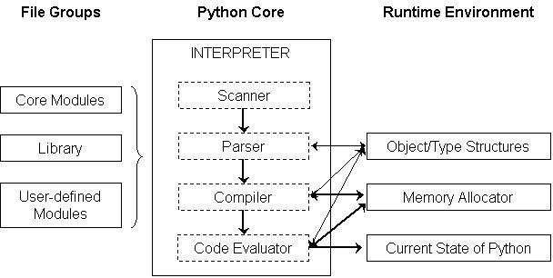

右边，是Python的运行时环境，包括对象/类型系统（Object/Type structures）、内存分配器（Memory Allocator）和运行时状态信息（Current State of Python）。运行时状态维护了解释器在执行字节码时不同的状态（比如正常状态和异常状态）之间切换的动作，我们可以将它视为一个巨大而复杂的有穷状态机

### Python源码文件夹的结构 ###

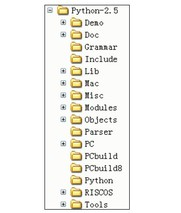

- Include ：该目录下包含了Python提供的所有头文件，如果用户需要自己用C或C++来编写自定义模块扩展Python，那么就需要用到这里提供的头文件。
- Lib ：该目录包含了Python自带的所有标准库，Lib中的库都是用Python语言编写的。
- Modules ：该目录中包含了所有用C语言编写的模块，比如random、cStringIO等。
- Parser: 该目录中包含了Python解释器中的Scanner和Parser部分
- Objects: Python的内建对象
- Python该目录下包含了Python解释器中的Compiler和执行引擎部分，是Python运行的核心所在。

## 1. Python中的对象 ##

### 1.1 Python内的对象 ###

在Python中，对象就是为C中的结构体在堆上申请的一块内存，一般来说，对象是不能被静态初始化的，并且也不能在栈空间上生存。唯一的例外就是类型对象，Python中所有的内建的类型对象（如整数类型对象，字符串类型对象）都是被静态初始化的。

#### 1.1.1 PyObject ####

先看 `PyObject` 的定义，是一个结构体。

其中一些字段的定义由 `PyObject_HEAD` 宏指出

```c
typedef struct _object {
     int ob_refcnt; 
     struct _typeobject *ob_type;
} PyObject;
```

1, ob_refcnt 与内存管理相关的引用计数

2, ob_type 一个指向结构体的指针，_typeobject 是指定一个对象类型的类型对象，引用方式 `typedef struct`

#### 1.1.2 定长对象和变长对象 ####

变长对象的结构体:

```c
#define PyObject_VAR_HEAD		\
	PyObject_HEAD			\
	Py_ssize_t ob_size; /* Number of items in variable part */

typedef struct {
	PyObject_VAR_HEAD
} PyVarObject;
```

通过对比可以得出 `PyObject_VAR_HEAD` 的定义中比定长的多了一个 `ob_size`

ob_size 对应到 `len()` 方法。

从`PyObject_VAR_HEAD`的定义可以看出，PyVarObject实际上只是对PyObject的一个扩展而已。因此，对于任何一个`PyVarObject`，其所占用的内存，开始部分的字节的意义和PyObject是一样的。换句话说，在Python内部，每一个对象都拥有相同的对象头部。这就使得在Python中，对对象的引用变得非常的统一，我们只需要用一个`PyObject*`指针就可以引用任意的一个对象。而不论该对象实际是一个什么对象。


### 1.2 类型对象 ###

实际上，占用内存空间的大小是对象的一种元信息，这样的元信息是与对象所属类型密切相关的，因此它一定会出现在与对象所对应的类型对象中。现在我们可以来详细考察一下类型对象`_typeobject`：

```c
typedef struct _typeobject {
	PyObject_VAR_HEAD
	const char *tp_name; /* For printing, in format "<module>.<name>" */
	Py_ssize_t tp_basicsize, tp_itemsize; /* For allocation */

	/* Methods to implement standard operations */

	destructor tp_dealloc;
	printfunc tp_print;
	getattrfunc tp_getattr;
	setattrfunc tp_setattr;
	cmpfunc tp_compare;
	reprfunc tp_repr;

	/* Method suites for standard classes */

	PyNumberMethods *tp_as_number;
	PySequenceMethods *tp_as_sequence;
	PyMappingMethods *tp_as_mapping;

	/* More standard operations (here for binary compatibility) */

	hashfunc tp_hash;
	ternaryfunc tp_call;
	reprfunc tp_str;
	getattrofunc tp_getattro;
	setattrofunc tp_setattro;

	/* Functions to access object as input/output buffer */
	PyBufferProcs *tp_as_buffer;

	/* Flags to define presence of optional/expanded features */
	long tp_flags;

	const char *tp_doc; /* Documentation string */

	/* Assigned meaning in release 2.0 */
	/* call function for all accessible objects */
	traverseproc tp_traverse;

	/* delete references to contained objects */
	inquiry tp_clear;

	/* Assigned meaning in release 2.1 */
	/* rich comparisons */
	richcmpfunc tp_richcompare;

	/* weak reference enabler */
	Py_ssize_t tp_weaklistoffset;

	/* Added in release 2.2 */
	/* Iterators */
	getiterfunc tp_iter;
	iternextfunc tp_iternext;

	/* Attribute descriptor and subclassing stuff */
	struct PyMethodDef *tp_methods;
	struct PyMemberDef *tp_members;
	struct PyGetSetDef *tp_getset;
	struct _typeobject *tp_base;
	PyObject *tp_dict;
	descrgetfunc tp_descr_get;
	descrsetfunc tp_descr_set;
	Py_ssize_t tp_dictoffset;
	initproc tp_init;
	allocfunc tp_alloc;
	newfunc tp_new;
	freefunc tp_free; /* Low-level free-memory routine */
	inquiry tp_is_gc; /* For PyObject_IS_GC */
	PyObject *tp_bases;
	PyObject *tp_mro; /* method resolution order */
	PyObject *tp_cache;
	PyObject *tp_subclasses;
	PyObject *tp_weaklist;
	destructor tp_del;

#ifdef COUNT_ALLOCS
	/* these must be last and never explicitly initialized */
	Py_ssize_t tp_allocs;
	Py_ssize_t tp_frees;
	Py_ssize_t tp_maxalloc;
	struct _typeobject *tp_prev;
	struct _typeobject *tp_next;
#endif
} PyTypeObject;
```

以上信息中可以分为四类:

- 类型名称: tp_name
- 创建该类型对象时分配内存的信息 tp_basicsize tp_itemsize
- 与该类型对象相关的操作信息
- 类型的类型信息。

#### 1.2.1 对象的创建 ####

一般来说，Python会有两种方法。第一种是通过Python C API来创建，第二种是通过类型对象`PyInt_Type`。

Python对外提供了C API，让用户可以从C环境中与Python交互，实际上，因为Python本身也是C写成的，所以Python内部也大量使用了这些API。C API 分为两类: 泛型的API 或者称为 AOL (Abstract Object Layer) 这些API都具有 `PyObject_***` 的形式。对于创建一个整数对象，我们可以采用如下的表达式：`PyObject* intObj = PyObject_New(PyObject, &PyInt_Type)`。 

 另一种是和类型相关的API或者称为 COL(Concrete Object Layer)。比如对于整数对象，我们可以利用如下的API来创建，`PyObject *intObj = PyInt_FromLong(10)`，这样就创建了一个值为10的整数对象。

实际上，在Python完成运行环境的初始化之后，符号"int"就对应着一个表示为`<type ‘int’>`的对象，这个对象其实就是Python内部的`PyInt_Type`。当我们执行“`int(10)`”这样的表达式时，就是通过`PyInt_Type`创建了一个整数对象。

object在Python内部则对应着`PyBaseObject_Type`。

#### 1.2.2 对象的行为 ####

在PyTypeObject中定义了大量的函数指针，这些函数指针最终都会指向某个函数，或者指向NULL。这些函数指针可以视为类型对象中所定义的操作，而这些操作直接决定着一个对象在运行时所表现出的行为。

在这些操作信息中，有三组非常重要的操作族，在PyTypeObject中，它们是`tp_ as_number`、`tp_as_sequence`、`tp_as_mapping`。

这里可以看一下 PyNumberMethods这个函数族：

```c
[object.h]
typedef PyObject * (*binaryfunc)(PyObject *, PyObject *);

typedef struct {
    binaryfunc nb_add;
    binaryfunc nb_subtract;
    // ……
} PyNumberMethods;
```

#### 1.2.3 类型的类型 ####

类型对象的类型是什么呢？这个问题听上去很绕口，实际上却非常重要，对于其他的对象，可以通过与其关联的类型对象确定其类型，那么通过什么来确定一个对象是类型对象呢？答案就是`PyType_Type`：

```c
// 初始化一个结构体
PyTypeObject PyType_Type = {
	PyObject_HEAD_INIT(&PyType_Type)
	0,					/* ob_size */
	"type",					/* tp_name */
	sizeof(PyHeapTypeObject),		/* tp_basicsize */
	sizeof(PyMemberDef),			/* tp_itemsize */
	(destructor)type_dealloc,		/* tp_dealloc */
	0,					/* tp_print */
	0,			 		/* tp_getattr */
	0,					/* tp_setattr */
	type_compare,				/* tp_compare */
	(reprfunc)type_repr,			/* tp_repr */
	0,					/* tp_as_number */
	0,					/* tp_as_sequence */
	0,					/* tp_as_mapping */
	(hashfunc)_Py_HashPointer,		/* tp_hash */
	(ternaryfunc)type_call,			/* tp_call */
	0,					/* tp_str */
	(getattrofunc)type_getattro,		/* tp_getattro */
	(setattrofunc)type_setattro,		/* tp_setattro */
	0,					/* tp_as_buffer */
	Py_TPFLAGS_DEFAULT | Py_TPFLAGS_HAVE_GC |
		Py_TPFLAGS_BASETYPE,		/* tp_flags */
	type_doc,				/* tp_doc */
	(traverseproc)type_traverse,		/* tp_traverse */
	(inquiry)type_clear,			/* tp_clear */
	0,					/* tp_richcompare */
	offsetof(PyTypeObject, tp_weaklist),	/* tp_weaklistoffset */
	0,					/* tp_iter */
	0,					/* tp_iternext */
	type_methods,				/* tp_methods */
	type_members,				/* tp_members */
	type_getsets,				/* tp_getset */
	0,					/* tp_base */
	0,					/* tp_dict */
	0,					/* tp_descr_get */
	0,					/* tp_descr_set */
	offsetof(PyTypeObject, tp_dict),	/* tp_dictoffset */
	0,					/* tp_init */
	0,					/* tp_alloc */
	type_new,				/* tp_new */
	PyObject_GC_Del,        		/* tp_free */
	(inquiry)type_is_gc,			/* tp_is_gc */
}; // typeobject.c
```

`PyType_Type`在Python的类型机制中是一个至关重要的对象，所有用户自定义class所对应的`PyTypeObject`对象都是通过这个对象创建的。

```
print(int.__class__)
>>> <class 'type'>
```

<type ‘type’>就是Python内部的`PyType_Type`，它是所有class的class，所以它在Python中被称为`metaclass`。

`PyInt_Type`是怎么和`PyType_Type`建立关系的,前面提到，在Python中，每一个对象都将自己的引用计数、类型信息保存在开始的部分中。为了方便对这部分内存的初始化，Python中提供了几个有用的宏：

`PyObject_HEAD_INIT` 如果有节点的指针，则先初始化指针。将 refcnt初始化为1，将 ob_type 指向 `PyTypeObject`

```c
#ifdef Py_TRACE_REFS
/* Define pointers to support a doubly-linked list of all live heap objects. */
#define _PyObject_HEAD_EXTRA		\
	struct _object *_ob_next;	\
	struct _object *_ob_prev;

#define _PyObject_EXTRA_INIT 0, 0,

#else
#define _PyObject_HEAD_EXTRA
#define _PyObject_EXTRA_INIT
#endif

/* PyObject_HEAD defines the initial segment of every PyObject. */
#define PyObject_HEAD			\
	_PyObject_HEAD_EXTRA		\
	Py_ssize_t ob_refcnt;		\
	struct _typeobject *ob_type;

#define PyObject_HEAD_INIT(type)	\
	_PyObject_EXTRA_INIT		\
	1, type,
```

以`PyInt_Type`为例，可以更清晰地看到一般的类型对象和这个特立独行的`PyType_ Type`对象之间的关系：

```c
PyTypeObject PyInt_Type = {
	PyObject_HEAD_INIT(&PyType_Type)
	0,
	"int",
	sizeof(PyIntObject),
	0,
	(destructor)int_dealloc,		/* tp_dealloc */
	(printfunc)int_print,			/* tp_print */
	0,					/* tp_getattr */
	0,					/* tp_setattr */
	(cmpfunc)int_compare,			/* tp_compare */
	(reprfunc)int_repr,			/* tp_repr */
	&int_as_number,				/* tp_as_number */
	0,					/* tp_as_sequence */
	0,					/* tp_as_mapping */
	(hashfunc)int_hash,			/* tp_hash */
        0,					/* tp_call */
        (reprfunc)int_repr,			/* tp_str */
	PyObject_GenericGetAttr,		/* tp_getattro */
	0,					/* tp_setattro */
	0,					/* tp_as_buffer */
	Py_TPFLAGS_DEFAULT | Py_TPFLAGS_CHECKTYPES |
		Py_TPFLAGS_BASETYPE,		/* tp_flags */
	int_doc,				/* tp_doc */
	0,					/* tp_traverse */
	0,					/* tp_clear */
	0,					/* tp_richcompare */
	0,					/* tp_weaklistoffset */
	0,					/* tp_iter */
	0,					/* tp_iternext */
	int_methods,				/* tp_methods */
	0,					/* tp_members */
	0,					/* tp_getset */
	0,					/* tp_base */
	0,					/* tp_dict */
	0,					/* tp_descr_get */
	0,					/* tp_descr_set */
	0,					/* tp_dictoffset */
	0,					/* tp_init */
	0,					/* tp_alloc */
	int_new,				/* tp_new */
	(freefunc)int_free,           		/* tp_free */
};
```

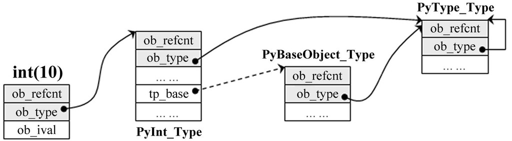

### 1.3 python对象的多态性 ###

所以在Python内部各个函数之间传递的都是一种范型指针——`PyObject*`。这个指针所指的对象究竟是什么类型的，我们不知道，只能从指针所指对象的ob_type域动态进行判断，而正是通过这个域，Python实现了多态机制。

### 1.4 引用计数 ###

在Python中，主要是通过`Py_INCREF(op)`和`Py_DECREF(op)`两个宏来增加和减少一个对象的引用计数。当一个对象的引用计数减少到0之后，Py_DECREF将调用该对象的析构函数来释放该对象所占有的内存和系统资源。实际上这个析构动作是通过在对象对应的类型对象中定义的一个函数指针来指定的，就是那个`tp_dealloc`。

在每一个对象创建的时候，Python提供了一个`_Py_NewReference(op)`宏来将对象的引用计数初始化为1。

```c
void
_Py_NewReference(PyObject *op)
{
	_Py_INC_REFTOTAL;
	op->ob_refcnt = 1;
	_Py_AddToAllObjects(op, 1);
	_Py_INC_TPALLOCS(op);
}
```

### 1.5 python 对象的分类 ###

- Fundamental对象：类型对象
- Numeric对象：数值对象
- Sequence对象：容纳其他对象的序列集合对象
- Mapping对象：类似于C++中map的关联对象
- Internal对象：Python虚拟机在运行时内部使用的对象

## 2. Python中的整数对象 ##

### 2.1 PyIntObject ---- Int对象 ###

PyIntObject :

```c
[intobject.h]
typedef struct {
    PyObject_HEAD
    long ob_ival;
} PyIntObject;
```

int对象的类型对象：

```c
PyTypeObject PyInt_Type = {
	PyObject_HEAD_INIT(&PyType_Type)
	0,
	"int",
	sizeof(PyIntObject),
	0,
	(destructor)int_dealloc,		/* tp_dealloc */
	(printfunc)int_print,			/* tp_print */
	0,					/* tp_getattr */
	0,					/* tp_setattr */
	(cmpfunc)int_compare,			/* tp_compare */
	(reprfunc)int_repr,			/* tp_repr */
	&int_as_number,				/* tp_as_number */
	0,					/* tp_as_sequence */
	0,					/* tp_as_mapping */
	(hashfunc)int_hash,			/* tp_hash */
        0,					/* tp_call */
        (reprfunc)int_repr,			/* tp_str */
	PyObject_GenericGetAttr,		/* tp_getattro */
	0,					/* tp_setattro */
	0,					/* tp_as_buffer */
	Py_TPFLAGS_DEFAULT | Py_TPFLAGS_CHECKTYPES |
		Py_TPFLAGS_BASETYPE,		/* tp_flags */
	int_doc,				/* tp_doc */
	0,					/* tp_traverse */
	0,					/* tp_clear */
	0,					/* tp_richcompare */
	0,					/* tp_weaklistoffset */
	0,					/* tp_iter */
	0,					/* tp_iternext */
	int_methods,				/* tp_methods */
	0,					/* tp_members */
	0,					/* tp_getset */
	0,					/* tp_base */
	0,					/* tp_dict */
	0,					/* tp_descr_get */
	0,					/* tp_descr_set */
	0,					/* tp_dictoffset */
	0,					/* tp_init */
	0,					/* tp_alloc */
	int_new,				/* tp_new */
	(freefunc)int_free,           		/* tp_free */
};
```

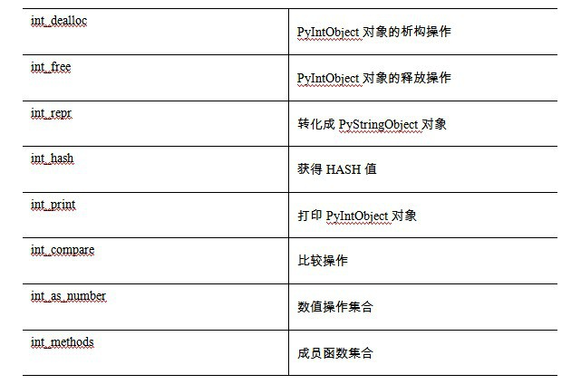

两个整数比较大小：

```c
static int
int_compare(PyIntObject *v, PyIntObject *w)
{
	register long i = v->ob_ival;
	register long j = w->ob_ival;
	return (i < j) ? -1 : (i > j) ? 1 : 0;
}
```

看一下PyIntObject中加法操作是如何实现的

```c
[intobject.h]
//宏，牺牲类型安全，换取执行效率
#define PyInt_AS_LONG(op) (((PyIntObject *)(op))->ob_ival)

[intobject.c]
#define CONVERT_TO_LONG(obj, lng)       \
    if (PyInt_Check(obj)) {         \
        lng = PyInt_AS_LONG(obj);   \
    }                   \
    else {                  \
        Py_INCREF(Py_NotImplemented);   \
        return Py_NotImplemented;   \
    }

static PyObject* int_add(PyIntObject *v, PyIntObject *w)
{
    register long a, b, x;
    CONVERT_TO_LONG(v, a);
    CONVERT_TO_LONG(w, b);
    x = a + b;
    //[1] : 检查加法结果是否溢出
    if ((x^a) >= 0 || (x^b) >= 0)
        return PyInt_FromLong(x); // 返回了一个新的int对象
    return PyLong_Type.tp_as_number->nb_add((PyObject *)v, (PyObject *)w);
}
```

其中有 `PyInt_AS_LONG` 宏版本和 `Pynt_Aslong` 函数版本，一般来说宏版本在 h文件中，而函数版本在 c文件中。

### 2.2 PyIntObject对象的创建和维护 ###

#### 2.2.1 对象创建的3种途径 ####

```c
　PyObject *PyInt_FromLong(long ival)
　　PyObject*　PyInt_FromString(char *s, char **pend, int base)
#ifdef Py_USING_UNICODE 
　　PyObject*PyInt_FromUnicode(Py_UNICODE *s, int length, int base)
#endif
```

#### 2.2.2 小整数对象 ####

```c
[intobject.c]
#ifndef NSMALLPOSINTS
     #define NSMALLPOSINTS       257 
#endif
#ifndef NSMALLNEGINTS
     #define NSMALLNEGINTS       5
#endif
#if NSMALLNEGINTS + NSMALLPOSINTS > 0
     static PyIntObject *small_ints[NSMALLNEGINTS + NSMALLPOSINTS];
#endif
```

#### 2.2.3 大整数对象 ####

对于小整数，在小整数对象池中完全地缓存其PyIntObject对象。而对其他整数，Python运行环境将提供一块内存空间，这些内存空间由这些大整数轮流使用。

在Python中，有一个`PyIntBlock`结构，在这个结构的基础上，实现了的一个单向列表。

```c
[intobject.c]
#define BLOCK_SIZE  1000    /* 1K less typical malloc overhead */
#define BHEAD_SIZE  8   /* Enough for a 64-bit pointer */
#define N_INTOBJECTS    ((BLOCK_SIZE - BHEAD_SIZE) / sizeof(PyIntObject))

struct _intblock {
    struct _intblock *next;
    PyIntObject objects[N_INTOBJECTS];
};

typedef struct _intblock PyIntBlock;

static PyIntBlock *block_list = NULL;
static PyIntObject *free_list = NULL;
```

PyIntBlock的单向链表通过 `block_list` 维护，Python使用一个单向链表来管理全部block的objects中所有的空闲内存，这个自由内存链表的表头就是free_ list。

#### 2.2.4 添加和删除 ####

```c
PyObject *
PyInt_FromLong(long ival)
{
	register PyIntObject *v;
#if NSMALLNEGINTS + NSMALLPOSINTS > 0
    // 尝试从小整数对象池种获取
	if (-NSMALLNEGINTS <= ival && ival < NSMALLPOSINTS) {
		v = small_ints[ival + NSMALLNEGINTS];
		Py_INCREF(v);
#ifdef COUNT_ALLOCS
		if (ival >= 0)
			quick_int_allocs++;
		else
			quick_neg_int_allocs++;
#endif
		return (PyObject *) v;
	}
#endif
    // 为PyIntBlock 申请空间
	if (free_list == NULL) {
		if ((free_list = fill_free_list()) == NULL)
			return NULL;
	}
	/* Inline PyObject_New */
	v = free_list;
	free_list = (PyIntObject *)v->ob_type;
	PyObject_INIT(v, &PyInt_Type);
	v->ob_ival = ival;
	return (PyObject *) v;
}
```

**创建通用整数对象池 PyIntBlock**

```c
static PyIntObject *
fill_free_list(void)
{
	PyIntObject *p, *q;
	/* Python's object allocator isn't appropriate for large blocks. */
	p = (PyIntObject *) PyMem_MALLOC(sizeof(PyIntBlock));
	if (p == NULL)
		return (PyIntObject *) PyErr_NoMemory();
	((PyIntBlock *)p)->next = block_list;
	block_list = (PyIntBlock *)p;
	/* Link the int objects together, from rear to front, then return
	   the address of the last int object in the block. */
	p = &((PyIntBlock *)p)->objects[0];
	q = p + N_INTOBJECTS;
	while (--q > p)
		q->ob_type = (struct _typeobject *)(q-1);
	q->ob_type = NULL;
	return p + N_INTOBJECTS - 1;
}
```

一个block的next指向下一个block。

```c
static void
int_dealloc(PyIntObject *v)
{	
    // 派生自内建的对象内存管理是不同于内建的对象的,int_dealloc中的PyInt_CheckExact()函数即是做这个判断的.
	if (PyInt_CheckExact(v)) {
		v->ob_type = (struct _typeobject *)free_list;
		free_list = v;
	}
	else
		v->ob_type->tp_free((PyObject *)v);
}
```

#### 2.2.5 小整数对象池的初始化 ####

```c
int
_PyInt_Init(void)
{
	PyIntObject *v;
	int ival;
#if NSMALLNEGINTS + NSMALLPOSINTS > 0
	for (ival = -NSMALLNEGINTS; ival < NSMALLPOSINTS; ival++) {
              if (!free_list && (free_list = fill_free_list()) == NULL)
			return 0;
		/* PyObject_New is inlined */
		v = free_list;
		free_list = (PyIntObject *)v->ob_type;
		PyObject_INIT(v, &PyInt_Type);
		v->ob_ival = ival;
		small_ints[ival + NSMALLNEGINTS] = v;
	}
#endif
	return 1;
}
```

小整数对象也是生存在由`block_list`所维护的内存上的。在Python初始化的时候，_PyInt_Init被调用，内存被申请，小整数对象被创建。

对于PyIntObject来说，`free_list` 和 `block_list` 两个指针很关键。

## 3. Python中的字符串对象 ##

需要区分 变长对象和定长对象，可变对象不可变对象。

### 3.1 PyStringObject 和 PyString_Type ###

```c
typedef struct {
    PyObject_VAR_HEAD
    long ob_shash;  // 该字符串的hash值
    int ob_sstate;
    char ob_sval[1];

    /* Invariants:
     *     ob_sval contains space for 'ob_size+1' elements.
     *     ob_sval[ob_size] == 0.
     *     ob_shash is the hash of the string or -1 if not computed yet.
     *     ob_sstate != 0 iff the string object is in stringobject.c's
     *       'interned' dictionary; in this case the two references
     *       from 'interned' to this object are *not counted* in ob_refcnt.
     */
} PyStringObject;
```

在`PyStringObject`的头部实际上是一个`PyObject_VAR_HEAD`，其中有一个`ob_size`变量保存着对象中维护的可变长度内存的大小。

`ob_sval`实际上是作为一个字符指针指向一段内存的，这段内存保存着这个字符串对象所维护的实际字符串。

ob_sval 指向开始长度，ob_size 确认变长对象的长度。

实际上，`ob_sval`指向的是一段长度为`ob_size+1`个字节的内存，而且必须满足`ob_sval[ob_size] == '\0'`。

ob_shash 的计算方法:

```c
static long
string_hash(PyStringObject *a)
{
	register Py_ssize_t len;
	register unsigned char *p;
	register long x;

	if (a->ob_shash != -1)
		return a->ob_shash;
	len = a->ob_size;
	p = (unsigned char *) a->ob_sval;
	x = *p << 7;
	while (--len >= 0)
		x = (1000003*x) ^ *p++;
	x ^= a->ob_size;
	if (x == -1)
		x = -2;
	a->ob_shash = x;
	return x;
}
```

下面列出了PyStringObject对应的类型对象——`PyString_Type`

```c
PyTypeObject PyString_Type = {
	PyObject_HEAD_INIT(&PyType_Type)
	0,
	"str",
	sizeof(PyStringObject),
	sizeof(char),
 	string_dealloc, 			/* tp_dealloc */
	(printfunc)string_print, 		/* tp_print */
	0,					/* tp_getattr */
	0,					/* tp_setattr */
	0,					/* tp_compare */
	string_repr, 				/* tp_repr */
	&string_as_number,			/* tp_as_number */
	&string_as_sequence,			/* tp_as_sequence */
	&string_as_mapping,			/* tp_as_mapping */
	(hashfunc)string_hash, 			/* tp_hash */
	0,					/* tp_call */
	string_str,				/* tp_str */
	PyObject_GenericGetAttr,		/* tp_getattro */
	0,					/* tp_setattro */
	&string_as_buffer,			/* tp_as_buffer */
	Py_TPFLAGS_DEFAULT | Py_TPFLAGS_CHECKTYPES |
		Py_TPFLAGS_BASETYPE,		/* tp_flags */
	string_doc,				/* tp_doc */
	0,					/* tp_traverse */
	0,					/* tp_clear */
	(richcmpfunc)string_richcompare,	/* tp_richcompare */
	0,					/* tp_weaklistoffset */
	0,					/* tp_iter */
	0,					/* tp_iternext */
	string_methods,				/* tp_methods */
	0,					/* tp_members */
	0,					/* tp_getset */
	&PyBaseString_Type,			/* tp_base */
	0,					/* tp_dict */
	0,					/* tp_descr_get */
	0,					/* tp_descr_set */
	0,					/* tp_dictoffset */
	0,					/* tp_init */
	0,					/* tp_alloc */
	string_new,				/* tp_new */
	PyObject_Del,	                	/* tp_free */
};
```

可以看到，在PyStringObject的类型对象中，tp_itemsize被设置为sizeof(char)，即一个字节。对于Python中的任何一种变长对象，tp_itemsize这个域是必须设置的，tp_itemsize指明了由变长对象保存的元素（item）的单位长度，所谓单位长度即是指一个元素在内存中的长度。这个tp_itemsize和ob_size共同决定了应该额外申请的内存之总大小是多少。

### 3.2 创建 PyStringObject ###

```c
PyObject *
PyString_FromString(const char *str)
{
	register size_t size;
	register PyStringObject *op;

	assert(str != NULL);
	size = strlen(str);
	if (size > PY_SSIZE_T_MAX) {
		PyErr_SetString(PyExc_OverflowError,
			"string is too long for a Python string");
		return NULL;
	}
	if (size == 0 && (op = nullstring) != NULL) {
#ifdef COUNT_ALLOCS
		null_strings++;
#endif
		Py_INCREF(op);
		return (PyObject *)op;
	}
	if (size == 1 && (op = characters[*str & UCHAR_MAX]) != NULL) {
#ifdef COUNT_ALLOCS
		one_strings++;
#endif
		Py_INCREF(op);
		return (PyObject *)op;
	}

	/* Inline PyObject_NewVar */
	op = (PyStringObject *)PyObject_MALLOC(sizeof(PyStringObject) + size);
	if (op == NULL)
		return PyErr_NoMemory();
	PyObject_INIT_VAR(op, &PyString_Type, size);
	op->ob_shash = -1;
	op->ob_sstate = SSTATE_NOT_INTERNED;
	Py_MEMCPY(op->ob_sval, str, size+1);
	/* share short strings */
	if (size == 0) {
		PyObject *t = (PyObject *)op;
		PyString_InternInPlace(&t);
		op = (PyStringObject *)t;
		nullstring = op;
		Py_INCREF(op);
	} else if (size == 1) {
		PyObject *t = (PyObject *)op;
		PyString_InternInPlace(&t);
		op = (PyStringObject *)t;
		characters[*str & UCHAR_MAX] = op;
		Py_INCREF(op);
	}
	return (PyObject *) op;
}
```

如果不是创建空字符串对象，那么接下来需要进行的动作就是申请内存，创建PyStringObject对象。可以看到，申请的内存除了PyStringObject的内存，还有为字符数组内的元素申请的额外内存。然后，将`hash`缓存值设为-1，将`intern`标志设为`SSTATE_NOT_INTERNED`。最后将参数str指向的字符数组内的字符拷贝到PyStringObject所维护的空间中。

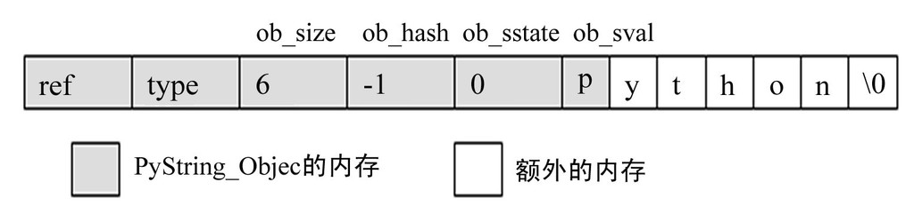

### 3.3 字符串对象的intern机制 ###

PyStringObject对象的intern机制之目的是：对于被intern之后的字符串，比如“Ruby”，在整个Python的运行期间，系统中都只有唯一的一个与字符串“Ruby”对应的PyStringObject对象。

`PyString_InternInPlace`正是负责完成对一个对象进行intern操作的函数。

```c
void
PyString_InternInPlace(PyObject **p)
{
	register PyStringObject *s = (PyStringObject *)(*p);
	PyObject *t;
	if (s == NULL || !PyString_Check(s))
		Py_FatalError("PyString_InternInPlace: strings only please!");
	/* If it's a string subclass, we don't really know what putting
	   it in the interned dict might do. */
	if (!PyString_CheckExact(s))
		return;
	if (PyString_CHECK_INTERNED(s))
		return;
	if (interned == NULL) {
		interned = PyDict_New();
		if (interned == NULL) {
			PyErr_Clear(); /* Don't leave an exception */
			return;
		}
	}
	t = PyDict_GetItem(interned, (PyObject *)s);
	if (t) {
		Py_INCREF(t);
		Py_DECREF(*p);
		*p = t;
		return;
	}

	if (PyDict_SetItem(interned, (PyObject *)s, (PyObject *)s) < 0) {
		PyErr_Clear();
		return;
	}
	/* The two references in interned are not counted by refcnt.
	   The string deallocator will take care of this */
	s->ob_refcnt -= 2;
	PyString_CHECK_INTERNED(s) = SSTATE_INTERNED_MORTAL;
}
```

interned: `static PyObject *interned` 指向的是 `PyDictObject` 对象。

当对一个PyStringObject对象a应用intern机制时，首先会在interned这个dict中检查是否有满足以下条件的对象b：b中维护的原生字符串与a相同。如果确实存在对象b，那么指向a的PyObject指针将会指向b，而a的引用计数减1，这样，其实a只是一个被临时创建的对象。如果interned中还不存在这样的b，那么就将a记录到interned中。

下图展示了如果interned中存在这样的对象b，在对a进行intern操作时，原本指向a的`PyObject*`指针的变化：

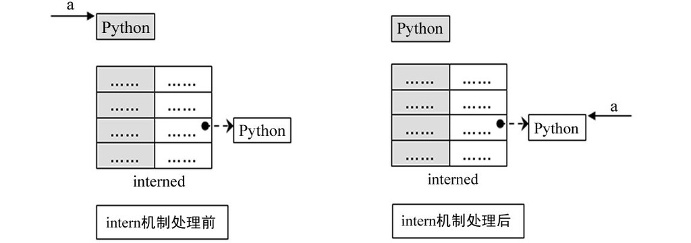

在将一个PyStringObject对象a的PyObject指针作为key和value添加到interned中时，PyDictObject对象会通过这两个指针对a的引用计数进行两次加1的操作。规定在interned中a的指针不能被视为对象a的有效引用。

实际上python会先创建出一个PyStringObject对象，如果在 interned中有一样的(维护的实际值) PyStringObject，那么将新创建出了的对象引用删除，将指向新对象的指针指向interned中的对象。它只是作为一个临时对象昙花一现地在内存中闪现，然后湮灭(主要目的是节省空间)。在PyDictObject对象interned中，因为PyDictObject必须以`PyObject*`指针作为键。

实际上，被intern机制处理后的PyStringObject对象分为两类，一类处于`SSTATE_INTERNED_IMMORTAL`状态，而另一类则处于`SSTATE_INTERNED_MORTAL`状态，这两种状态的区别在string_dealloc中可以清晰地看到，显然，SSTATE_INTERNED_IMMORTAL状态的PyStringObject对象是永远不会被销毁的。

### 3.4 字符缓冲池 ###

Python的设计者为PyStringObject中的一个字节的字符对应的PyStringObject对象也设计了这样一个对象池characters：

```c
static PyStringObject *characters[UCHAR_MAX + 1];
```

当我们在创建一个PyStringObject对象时，无论是通过调用PyString_FromString还是通过调用PyString_FromStringAndSize，如果字符串实际上是一个字符，则会进行如下的操作：

```c
[stringobject.c]
PyObject* PyString_FromStringAndSize(const char *str, int size)
{
    ……
    else if (size == 1 && str != NULL) 
    {
        PyObject *t = (PyObject *)op;
        PyString_InternInPlace(&t);
        op = (PyStringObject *)t;
        characters[*str & UCHAR_MAX] = op;
        Py_INCREF(op);
    }
    return (PyObject *) op;
}
```

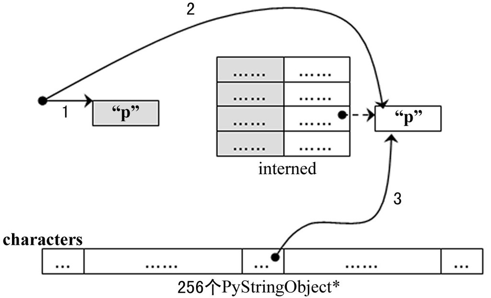

缓存一个字符对应的PyStringObject对象的过程：

（1）	创建PyStringObject对象`<string P>`； 
（2）	对对象`<string P>`进行intern操作；
（3）	将对象`<string P>`缓存至字符缓冲池中。

str + str 实际上在背后调用的是 `string_concat` 函数

## 4. Python中的List对象 ##

### 4.1 PyListObject ###

```c
typedef struct {
    PyObject_VAR_HEAD
    /* Vector of pointers to list elements.  list[0] is ob_item[0], etc. */
    PyObject **ob_item;

    /* ob_item contains space for 'allocated' elements.  The number
     * currently in use is ob_size.
     * Invariants:
     *     0 <= ob_size <= allocated
     *     len(list) == ob_size
     *     ob_item == NULL implies ob_size == allocated == 0
     * list.sort() temporarily sets allocated to -1 to detect mutations.
     *
     * Items must normally not be NULL, except during construction when
     * the list is not yet visible outside the function that builds it.
     */
    Py_ssize_t allocated;
} PyListObject;
```

`PyObject **ob_item` 指向了元素列表所在的内存块的首地址，而allocated中则维护了当前列表中的可容纳的元素的总数。

### 4.2 PyListObject 对象的创建与维护 ###

#### 4.2.1 创建对象 ####

为了创建一个列表，Python只提供了唯一的一条途径 `PyList_New`。这个函数接受一个size参数

```c
PyObject *
PyList_New(Py_ssize_t size)
{
	PyListObject *op;
	size_t nbytes;

	if (size < 0) {
		PyErr_BadInternalCall();
		return NULL;
	}
	nbytes = size * sizeof(PyObject *);
	/* Check for overflow */
	if (nbytes / sizeof(PyObject *) != (size_t)size)
		return PyErr_NoMemory();
	if (num_free_lists) {
		num_free_lists--;
		op = free_lists[num_free_lists];
		_Py_NewReference((PyObject *)op);
	} else {
		op = PyObject_GC_New(PyListObject, &PyList_Type);
		if (op == NULL)
			return NULL;
	}
	if (size <= 0)
		op->ob_item = NULL;
	else {
		op->ob_item = (PyObject **) PyMem_MALLOC(nbytes);
		if (op->ob_item == NULL) {
			Py_DECREF(op);
			return PyErr_NoMemory();
		}
		memset(op->ob_item, 0, nbytes);
	}
	op->ob_size = size;
	op->allocated = size;
	_PyObject_GC_TRACK(op);
	return (PyObject *) op;
}
```

First, Python会检查指定的元素个数是否会大到使所需内存数量产生溢出的程度，如果会产生溢出，那么Python将不会进行任何动作。

Next, Python对列表对象的创建动作。我们可以清晰地看到，Python中的列表对象实际上是分为两部分的，一是PyListObject对象本身，二则是PyListObject对象维护的元素列表。这是两块分离的内存，它们通过ob_item建立了联系。

可以观察到 PyListObject对象也使用了缓冲池的技术。新的列表复用了 `free_lists` 中的可用空间, 在默认情况下， `free_lists` 最多会维护80个PyListObject对象。

```c
/* Empty list reuse scheme to save calls to malloc and free */
#define MAXFREELISTS 80
static PyListObject *free_lists[MAXFREELISTS];
static int num_free_lists = 0;

```

```python
l1 = [1, 2, 3, 4]

print(id(l1))

del l1

l2 = [1, 2, 3]
print(id(l2))

"""
D:\envs\python_envs\project-demo\Scripts\python.exe D:/Projects/Python/project-demo/capriccio/test_string.py
2246183440904
2246183440904
"""
```

当Python创建了新的PyListObject对象之后，会立即根据调用`PyList_New`时传递的size参数创建PyListObject对象所维护的元素列表。在这里创建的`PyListObject*`列表，其中的每一个元素都会被初始化为`NULL`值。完成了PyListObject对象及其维护的列表的创建之后，Python会调整该PyList- Object对象，用于维护元素列表中元素数量的`ob_size`和`allocated`两个变量。

#### 4.2.2 设置元素 ####

当我们用 `PyList_New(6)`来创建PyListObject对象，下面列出其内存情况：

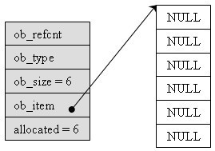

```c
int
PyList_SetItem(register PyObject *op, register Py_ssize_t i,
               register PyObject *newitem)
{
	register PyObject *olditem;
	register PyObject **p;
	if (!PyList_Check(op)) {
		Py_XDECREF(newitem);
		PyErr_BadInternalCall();
		return -1;
	}
	if (i < 0 || i >= ((PyListObject *)op) -> ob_size) {
		Py_XDECREF(newitem);
		PyErr_SetString(PyExc_IndexError,
				"list assignment index out of range");
		return -1;
	}
	p = ((PyListObject *)op) -> ob_item + i;
	olditem = *p;
	*p = newitem;
	Py_XDECREF(olditem);
	return 0;
}
```

`p = ((PyListObject *)op) -> ob_item + i;` 偏移指针地址，指向要设置的地址的位置，取地址获取oiditem, 将地址指向新的item，更新olditem的引用计数。

#### 4.2.3 插入元素 ####

```c
static int
ins1(PyListObject *self, Py_ssize_t where, PyObject *v)
{
	Py_ssize_t i, n = self->ob_size;
	PyObject **items;
	if (v == NULL) {
		PyErr_BadInternalCall();
		return -1;
	}
	if (n == PY_SSIZE_T_MAX) {
		PyErr_SetString(PyExc_OverflowError,
			"cannot add more objects to list");
		return -1;
	}

	if (list_resize(self, n+1) == -1)
		return -1;

	if (where < 0) {
		where += n;
		if (where < 0)
			where = 0;
	}
	if (where > n)
		where = n;
	items = self->ob_item;
	for (i = n; --i >= where; )
		items[i+1] = items[i];
	Py_INCREF(v);
	items[where] = v;
	return 0;
}

static int
list_resize(PyListObject *self, Py_ssize_t newsize)
{
	PyObject **items;
	size_t new_allocated;
	Py_ssize_t allocated = self->allocated;

	/* Bypass realloc() when a previous overallocation is large enough
	   to accommodate the newsize.  If the newsize falls lower than half
	   the allocated size, then proceed with the realloc() to shrink the list.
	*/
	if (allocated >= newsize && newsize >= (allocated >> 1)) {
		assert(self->ob_item != NULL || newsize == 0);
		self->ob_size = newsize;
		return 0;
	}

	/* This over-allocates proportional to the list size, making room
	 * for additional growth.  The over-allocation is mild, but is
	 * enough to give linear-time amortized behavior over a long
	 * sequence of appends() in the presence of a poorly-performing
	 * system realloc().
	 * The growth pattern is:  0, 4, 8, 16, 25, 35, 46, 58, 72, 88, ...
	 */
	new_allocated = (newsize >> 3) + (newsize < 9 ? 3 : 6) + newsize;
	if (newsize == 0)
		new_allocated = 0;
	items = self->ob_item;
	if (new_allocated <= ((~(size_t)0) / sizeof(PyObject *)))
		PyMem_RESIZE(items, PyObject *, new_allocated);
	else
		items = NULL;
	if (items == NULL) {
		PyErr_NoMemory();
		return -1;
	}
	self->ob_item = items;
	self->ob_size = newsize;
	self->allocated = new_allocated;
	return 0;
}

static int
app1(PyListObject *self, PyObject *v)
{
	Py_ssize_t n = PyList_GET_SIZE(self);

	assert (v != NULL);
	if (n == PY_SSIZE_T_MAX) {
		PyErr_SetString(PyExc_OverflowError,
			"cannot add more objects to list");
		return -1;
	}

	if (list_resize(self, n+1) == -1)
		return -1;

	Py_INCREF(v);
	PyList_SET_ITEM(self, n, v);
	return 0;
}
```

在调整PyListObject对象所维护的列表的内存时，Python分两种情况处理：

-  `	newsize < allocated && newsize > allocated/2 ` 简单修改ob_size的值。
- other ：调用 realloc 重新分配空间。

#### 4.2.4 删除元素 ####

调用栈: `list.remove(item) -> listremove -> list_ass_slice`

其中 list_ass_slice 并不是一个专用删除操作函数，它有如下的两个功能:

- a[ilow: ihigh] = v if v!= NULL
- del a[ilow: ihigh] if v == NULL

当调用list的remove操作删除list中的元素时，一定会触发内存搬移的动作。

### 4.3 PyListObject 对象缓冲池 ###

我们想知道的问题是：free_lists中所缓冲的PyListObject对象是从哪里获得的，是在何时创建的？答案就是在一个PyListObject被销毁的过程中。

```c
static void
list_dealloc(PyListObject *op)
{
	Py_ssize_t i;
	PyObject_GC_UnTrack(op);
	Py_TRASHCAN_SAFE_BEGIN(op)
	if (op->ob_item != NULL) {
		/* Do it backwards, for Christian Tismer.
		   There's a simple test case where somehow this reduces
		   thrashing when a *very* large list is created and
		   immediately deleted. */
		i = op->ob_size;
		while (--i >= 0) {
			Py_XDECREF(op->ob_item[i]);
		}
		PyMem_FREE(op->ob_item);
	}
	if (num_free_lists < MAXFREELISTS && PyList_CheckExact(op))
		free_lists[num_free_lists++] = op;
	else
		op->ob_type->tp_free((PyObject *)op);
	Py_TRASHCAN_SAFE_END(op)
}
```

代码清单4-4的[1]处所做的工作无非是为list中的每一个元素改变其引用计数，然后将内存释放，并没有什么特别之处。而到了代码清单4-4的[2]处，有趣的东西出现了，PyListObject对象缓冲池现身了。
在删除PyListObject对象自身时，Python会检查我们开始提到的那个缓冲池 free_lists，查看其中缓存的PyListObject的数量是否已经满了。如果没有，就将该待删除的PyListObject对象放到缓冲池中，以备后用。

## 5. Python中的Dict对象 ##

有很多方法可以用来解决产生的散列冲突问题，比如开链法，这是SGI STL中的hash table所采用的方法，而Python中所采用的是另一种方法，即开放定址法。所以，在采用开放定址的冲突解决策略的散列表中，删除某条探测链上的元素时不能进行真正的删除，而是进行一种“伪删除”操作，必须要让该元素还存在于探测链上，担当承前启后的重任。

### 5.2 PyDictObject ###

#### 5.2.1 关联容器的entry ####

一个entry的定义如下： `PyDictEntry`

```c
typedef struct {
	/* Cached hash code of me_key.  Note that hash codes are C longs.
	 * We have to use Py_ssize_t instead because dict_popitem() abuses
	 * me_hash to hold a search finger.
	 */
	Py_ssize_t me_hash;
	PyObject *me_key;
	PyObject *me_value;
} PyDictEntry;
```

其中 me_hash 是 me_key的hash值。

在Python中，在一个PyDictObject对象生存变化的过程中，其中的entry会在不同的状态间转换。PyDictObject中entry可以在3种状态间转换：Unused态、Active态和Dummy态。

- 当一个entry的me_key和me_value都是NULL时，entry处于Unused态。Unused态表明目前该entry中并没有存储（key，value）对，而且在此之前，也没有存储过它们。每一个entry在初始化的时候都会处于这种状态，而且只有在Unused态下，entry的me_key域才会为NULL。
- 当entry中存储了一个（key，value）对时，entry便转换到了Active态。在Active态下，me_key和me_value都不能为NULL。更进一步地说，me_key不能是dummy对象。
- 当entry中存储的（key，value）对被删除后，entry的状态不能直接从Active态转为Unused态，否则会如我们前面提到的，导致冲突探测链的中断。相反，entry中的me_key将指向dummy对象（这个dummy对象究竟为何方神圣，后面我们会详细考察），entry进入Dummy态，这就是我们前面提到的“伪删除”技术。当Python沿着某条冲突链搜索时，如果发现一个entry处于Dummy态，说明目前该entry虽然是无效的，但是其后的entry可能是有效的，是应该被搜索的。这样，就保证了冲突探测链的连续性。

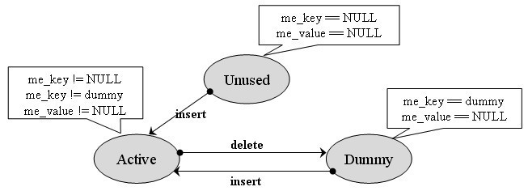

#### 5.2.2 关联容器的实现 PyDictObject ####

```c
typedef struct _dictobject PyDictObject;
struct _dictobject {
	PyObject_HEAD
	Py_ssize_t ma_fill;  /* # Active + # Dummy */
	Py_ssize_t ma_used;  /* # Active */

	/* The table contains ma_mask + 1 slots, and that's a power of 2.
	 * We store the mask instead of the size because the mask is more
	 * frequently needed.
	 */
	Py_ssize_t ma_mask;

	/* ma_table points to ma_smalltable for small tables, else to
	 * additional malloc'ed memory.  ma_table is never NULL!  This rule
	 * saves repeated runtime null-tests in the workhorse getitem and
	 * setitem calls.
	 */
	PyDictEntry *ma_table;
	PyDictEntry *(*ma_lookup)(PyDictObject *mp, PyObject *key, long hash);
	PyDictEntry ma_smalltable[PyDict_MINSIZE];
};
```

`ma_fill`域中维护着从PyDictObject对象创建开始直到现在，曾经及正处于Active态的entry个数，

`ma_used`则维护着当前正处于Active态的entry的数量。

`ma_smalltable`: 这个数组意味着当创建一个PyDictObjec对象时，至少有`PyDict_MINSIZE`个entry被同时创建。

`ma_table`: 这个类型为`PyDictEntry*`的变量将指向一片作为PyDictEntry集合的内存的开始位置。当一个PyDictObject对象是一个比较小的dict时，即entry数量少于8个，ma_table域将指向`ma_smalltable`这与生俱来的8个entry的起始地址。而当PyDictObject中的entry数量超过8个时，Python认为这家伙是一个大dict了，将会申请额外的内存空间，并将ma_table指向这块空间。这样，无论何时，ma_table域都不会为NULL，这带来了一个好处，不用在运行时一次又一次地检查ma_table的有效性，因为ma_table总是有效的。

`ma_mask`: 下标的最大值 (entry的数量-1)

### 5.3 PyDictObect 的创建和维护 ###

#### 5.3.1 创建 ####

```c
PyObject *
PyDict_New(void)
{
	register dictobject *mp;
	if (dummy == NULL) { /* Auto-initialize dummy */
		dummy = PyString_FromString("<dummy key>");
		if (dummy == NULL)
			return NULL;
#ifdef SHOW_CONVERSION_COUNTS
		Py_AtExit(show_counts);
#endif
	}
	if (num_free_dicts) {
		mp = free_dicts[--num_free_dicts];
		assert (mp != NULL);
		assert (mp->ob_type == &PyDict_Type);
		_Py_NewReference((PyObject *)mp);
		if (mp->ma_fill) {
			EMPTY_TO_MINSIZE(mp);
		}
		assert (mp->ma_used == 0);
		assert (mp->ma_table == mp->ma_smalltable);
		assert (mp->ma_mask == PyDict_MINSIZE - 1);
	} else {
		mp = PyObject_GC_New(dictobject, &PyDict_Type);
		if (mp == NULL)
			return NULL;
		EMPTY_TO_MINSIZE(mp);
	}
	mp->ma_lookup = lookdict_string;
#ifdef SHOW_CONVERSION_COUNTS
	++created;
#endif
	_PyObject_GC_TRACK(mp);
	return (PyObject *)mp;
}
```

第一次调用 `PyDict_New` 时，会创建dummy entry，原来dummy竟然是一个PyStringObject对象，实际上，它仅仅是用来作为一种指示标志，表明该entry曾被使用过，且探测序列下一个位置的entry有可能是有效的，从而防止探测序列中断。

同样，PyDictObject 也使用了缓冲池技术，如果PyDictObject对象的缓冲池不可用，那么Python将首先从系统堆中为新的PyDictObject对象申请合适的内存空间，然后会通过两个宏完成对新生的PyDictObject对象的初始化工作：

- `EMPTY_TO_MINSIZE`  将ma_smalltable清零，同时设置ma_size和ma_fill，当然，在一个PyDictObject对象刚被创建的时候，这两个变量都应该是0。
- `INIT_NONZERO_DICT_SLOT`  将ma_table指向ma_smalltable，并设置ma_mask为7。

在创建过程的最后，将`lookdict_string`赋给了`ma_lookup`。正是这个ma_lookup指定了PyDictObject在entry集合中搜索某一特定entry时需要进行的动作，在ma_lookup中，包含了散列函数和发生冲突时二次探测函数的具体实现，众所周知，它是PyDictObject的搜索策略。

#### 5.3.2 元素搜索 ####

Python为PyDictObject对象提供了两种搜索策略，lookdict和lookdict_string。实际上，这两种策略使用的是相同的算法，lookdict_string只是lookdict的一种针对PyStringObject对象的特殊形式。

那么我们首先就来剖析一下dict中的通用搜索策略lookdict，

```c
/*
The basic lookup function used by all operations.
This is based on Algorithm D from Knuth Vol. 3, Sec. 6.4.
Open addressing is preferred over chaining since the link overhead for
chaining would be substantial (100% with typical malloc overhead).

The initial probe index is computed as hash mod the table size. Subsequent
probe indices are computed as explained earlier.

All arithmetic on hash should ignore overflow.

(The details in this version are due to Tim Peters, building on many past
contributions by Reimer Behrends, Jyrki Alakuijala, Vladimir Marangozov and
Christian Tismer).

lookdict() is general-purpose, and may return NULL if (and only if) a
comparison raises an exception (this was new in Python 2.5).
lookdict_string() below is specialized to string keys, comparison of which can
never raise an exception; that function can never return NULL.  For both, when
the key isn't found a dictentry* is returned for which the me_value field is
NULL; this is the slot in the dict at which the key would have been found, and
the caller can (if it wishes) add the <key, value> pair to the returned
dictentry*.
*/
static dictentry *
lookdict(dictobject *mp, PyObject *key, register long hash)
{
	register size_t i;
	register size_t perturb;
	register dictentry *freeslot;
	register size_t mask = (size_t)mp->ma_mask;
	dictentry *ep0 = mp->ma_table;
	register dictentry *ep;
	register int cmp;
	PyObject *startkey;

	i = (size_t)hash & mask;
	ep = &ep0[i];
	if (ep->me_key == NULL || ep->me_key == key)
		return ep;

	if (ep->me_key == dummy)
		freeslot = ep;
	else {
		if (ep->me_hash == hash) {
			startkey = ep->me_key;
			cmp = PyObject_RichCompareBool(startkey, key, Py_EQ);
			if (cmp < 0)
				return NULL;
			if (ep0 == mp->ma_table && ep->me_key == startkey) {
				if (cmp > 0)
					return ep;
			}
			else {
				/* The compare did major nasty stuff to the
				 * dict:  start over.
				 * XXX A clever adversary could prevent this
				 * XXX from terminating.
 				 */
 				return lookdict(mp, key, hash);
 			}
		}
		freeslot = NULL;
	}

	/* In the loop, me_key == dummy is by far (factor of 100s) the
	   least likely outcome, so test for that last. */
	for (perturb = hash; ; perturb >>= PERTURB_SHIFT) {
		i = (i << 2) + i + perturb + 1;
		ep = &ep0[i & mask];
		if (ep->me_key == NULL)
			return freeslot == NULL ? ep : freeslot;
		if (ep->me_key == key)
			return ep;
		if (ep->me_hash == hash && ep->me_key != dummy) {
			startkey = ep->me_key;
			cmp = PyObject_RichCompareBool(startkey, key, Py_EQ);
			if (cmp < 0)
				return NULL;
			if (ep0 == mp->ma_table && ep->me_key == startkey) {
				if (cmp > 0)
					return ep;
			}
			else {
				/* The compare did major nasty stuff to the
				 * dict:  start over.
				 * XXX A clever adversary could prevent this
				 * XXX from terminating.
 				 */
 				return lookdict(mp, key, hash);
 			}
		}
		else if (ep->me_key == dummy && freeslot == NULL)
			freeslot = ep;
	}
}
```

### 5.4 PyDictObject 对象缓冲池 ###

前面我们提到，在PyDictObject的实现机制中，同样使用了缓冲池的技术。现在，我们来看看PyDictObject对象的缓冲池：

```c
[dictobject.c]
#define MAXFREEDICTS 80
static PyDictObject *free_dicts[MAXFREEDICTS];
static int num_free_dicts = 0;
```

PyDictObject中使用的这个缓冲池机制与PyListObject中使用的缓冲池机制是一样的。开始时，这个缓冲池里什么都没有，直到第一个PyDictObject被销毁时，这个缓冲池才开始接纳被缓冲的PyDictObject对象。

```c
[dictobject.c]
static void dict_dealloc(register dictobject *mp)
{
    register dictentry *ep;
    Py_ssize_t fill = mp->ma_fill;
    //[1]：调整dict中对象的引用计数
    for (ep = mp->ma_table; fill > 0; ep++) {
        if (ep->me_key) {
            --fill;
            Py_DECREF(ep->me_key);
            Py_XDECREF(ep->me_value);
        }
    }
    //[2] ：释放从系统堆中申请的内存空间
    if (mp->ma_table != mp->ma_smalltable)
        PyMem_DEL(mp->ma_table);
    //[3] ：将被销毁的PyDictObject对象放入缓冲池
    if (num_free_dicts < MAXFREEDICTS && mp->ob_type == &PyDict_Type)
        free_dicts[num_free_dicts++] = mp;
    else 
        mp->ob_type->tp_free((PyObject *)mp);
}
```

## 7. Python的编译 ##

### 7.1 Python 执行过程 ###

Python程序的执行原理和Java程序、C#程序的执行原理都可以用两个词囊括——虚拟机、字节码。

### 7.2 PyCodeObject对象 ###

编译的结果是一个pyc文件，但是在pyc文件中，正襟危坐的其实是一个PyCodeObject对象，对于Python编译器来说，PyCodeObject对象才是其真正的编译结果，而pyc文件只是这个对象在硬盘上的表现形式，它们实际上是Python对源文件编译的结果的两种不同存在方式。

#### 7.2.2 PyCodeObject ####

```c
/* Bytecode object */
typedef struct {
    PyObject_HEAD
    int co_argcount;		/* #arguments, except *args */
    int co_nlocals;		/* #local variables */
    int co_stacksize;		/* #entries needed for evaluation stack */
    int co_flags;		/* CO_..., see below */
    PyObject *co_code;		/* instruction opcodes */
    PyObject *co_consts;	/* list (constants used) */
    PyObject *co_names;		/* list of strings (names used) */
    PyObject *co_varnames;	/* tuple of strings (local variable names) */
    PyObject *co_freevars;	/* tuple of strings (free variable names) */
    PyObject *co_cellvars;      /* tuple of strings (cell variable names) */
    /* The rest doesn't count for hash/cmp */
    PyObject *co_filename;	/* string (where it was loaded from) */
    PyObject *co_name;		/* string (name, for reference) */
    int co_firstlineno;		/* first source line number */
    PyObject *co_lnotab;	/* string (encoding addr<->lineno mapping) */
    void *co_zombieframe;     /* for optimization only (see frameobject.c) */
} PyCodeObject;
```

`co_code` : 存放的就是编译所生成的字节码指令序列。

Python编译器在对Python源代码进行编译的时候，对于代码中的一个Code Block，会创建一个PyCodeObject对象与这段代码对应。那么如何确定多少代码算是一个Code Block呢？事实上，Python有一个简单而清晰的规则：当进入一个新的名字空间，或者说作用域时，我们就算是进入了一个新的Code Block了。

在这里，我们开始提及Python中一个至关重要的概念——名字空间。名字空间是符号的上下文环境，符号的含义取决于名字空间。更具体地说，一个变量名对应的变量值是什么，在Python中，这并不是确定的，而是需要通过名字空间来决定。

一个我们前面所说的Code Block，就对应着一个名字空间。

#### 7.2.3 pyc file ####

要了解pyc文件的格式，首先我们必须要清楚PyCodeObject中每一个域都表示什么含义，

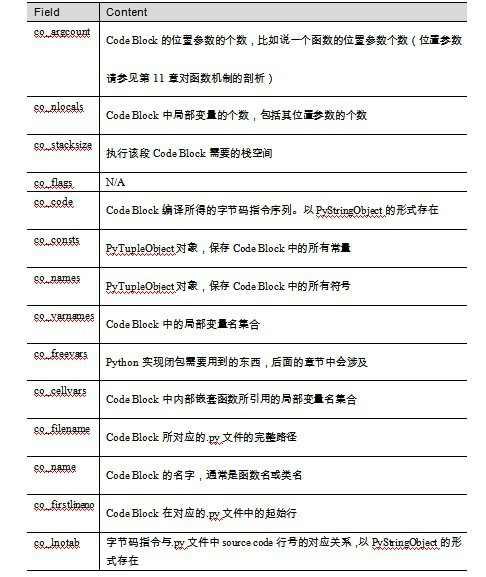

`co_lnotab` : 就是行号和代码中常量等的一些映射关系，以数组形式存放，但是存放的是相对的偏移量，

`co_lnotab`中的字节码和相应source code行号的对应信息是以unsigned bytes的数组形式存在的，数组的形式可以看作（字节码指令在co_code中位置，source code行号）形式的一个list。

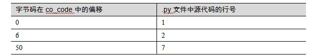

依次是第一行的字节码和对应的行号，其次是第二行字节码和对应行号增量值，例如:0-1，6-1，44-5

#### 7.2.4 访问PyCodeObject ####

```console
(python27-demo) D:\Projects\Python\python27-demo\demo>python
Python 2.7.18 (v2.7.18:8d21aa21f2, Apr 20 2020, 13:25:05) [MSC v.1500 64 bit (AMD64)] on win32
Type "help", "copyright", "credits" or "license" for more information.
>>> source = open('demo.py').read()
>>> source
'class A:\n    pass\n\n\ndef Fun():\n    pass\n\n\na = A()\nFun()\n'
>>> co = compile(source, 'demo.py', 'exec')
>>> type(co)
<type 'code'>
>>> dir(co)
['__class__', '__cmp__', '__delattr__', '__doc__', '__eq__', '__format__', '__ge__', '__getattribute__', '__gt__', '__hash__', '__init__', '__le__', '__lt__', '__n
e__', '__new__', '__reduce__', '__reduce_ex__', '__repr__', '__setattr__', '__sizeof__', '__str__', '__subclasshook__', 'co_argcount', 'co_cellvars', 'co_code', 'c
o_consts', 'co_filename', 'co_firstlineno', 'co_flags', 'co_freevars', 'co_lnotab', 'co_name', 'co_names', 'co_nlocals', 'co_stacksize', 'co_varnames']
>>> print co.co_names
('A', 'Fun', 'a')
>>> print co.co_name
<module>
>>> print co.co_filename
demo.py
```

### 7.3 pyc文件的生成 ###

#### 7.3.1 创建pyc文件的具体过程 ####

```c
static void
write_compiled_module(PyCodeObject *co, char *cpathname, time_t mtime)
{
	FILE *fp;

	fp = open_exclusive(cpathname); // 排他性地打开文件
	if (fp == NULL) {
		if (Py_VerboseFlag)
			PySys_WriteStderr(
				"# can't create %s\n", cpathname);
		return;
	}
	PyMarshal_WriteLongToFile(pyc_magic, fp, Py_MARSHAL_VERSION);
	/* First write a 0 for mtime */
	PyMarshal_WriteLongToFile(0L, fp, Py_MARSHAL_VERSION);
	PyMarshal_WriteObjectToFile((PyObject *)co, fp, Py_MARSHAL_VERSION);
	if (fflush(fp) != 0 || ferror(fp)) {
		if (Py_VerboseFlag)
			PySys_WriteStderr("# can't write %s\n", cpathname);
		/* Don't keep partial file */
		fclose(fp);
		(void) unlink(cpathname);
		return;
	}
	/* Now write the true mtime */
	fseek(fp, 4L, 0);
	assert(mtime < LONG_MAX);
	PyMarshal_WriteLongToFile((long)mtime, fp, Py_MARSHAL_VERSION);
	fflush(fp);
	fclose(fp);
	if (Py_VerboseFlag)
		PySys_WriteStderr("# wrote %s\n", cpathname);
}
```

一个pyc文件中实际上包含了三部分独立的信息：Python的`magic number`、pyc文件创建的时间信息，以及PyCodeObject对象。

在调用`PyMarshal_WriteLongToFile`时，会直接调用`w_long`，`w_long`会将需要写入的数据一个字节一个字节地写入到文件中。

`w_object`毫无例外地都会在写入对象之前，先写入一个TYPE_LIST、TYPE_CODE，或者是TYPE_INT这样的标识。这些标志对于pyc文件的再次加载具有至关重要的作用。这些标识同样也是在import.c中定义的：

```c
[import.c]
#define TYPE_NULL   '0'
#define TYPE_NONE   'N'
……
#define TYPE_INT    'i'
#define TYPE_STRING 's'
#define TYPE_INTERNED   't'
#define TYPE_STRINGREF  'R'
#define TYPE_TUPLE  '('
#define TYPE_LIST   '['
#define TYPE_DICT   '{'
#define TYPE_CODE   'c'
```

实际上在write的动作中，不论面临PyCodeObject还是PyListObject这些复杂对象，最后都会归结为简单的两种形式，一个是对数值的写入，一个是对字符串的写入。

#### 7.3.2 向pyc文件写入字符串 ####

首先需要介绍一个在写入过程中关键的结构体WFILE：

```c
typedef struct {
	FILE *fp;
	int error;
	int depth;
	/* If fp == NULL, the following are valid: */
	PyObject *str;
	char *ptr;
	char *end;
	PyObject *strings; /* dict on marshal, list on unmarshal */
	int version;
} WFILE;
```

这时，WFILE可以看作是一个对`FILE*`的简单包装，但是在WFILE里，出现了一个奇特的strings域。这个域是Python向pyc文件中写入字符串或从其中读出字符串的关键所在，当向pyc中写入时，strings会指向一个PyDictObject对象；而从pyc中读出时，strings则会指向一个PyListObject对象。

```c
void
PyMarshal_WriteObjectToFile(PyObject *x, FILE *fp, int version)
{
	WFILE wf;
	wf.fp = fp;
	wf.error = 0;
	wf.depth = 0;
	wf.strings = (version > 0) ? PyDict_New() : NULL;
	wf.version = version;
	w_object(x, &wf);
	Py_XDECREF(wf.strings);
}
```

```c
else if (PyString_Check(v)) {
    if (p->strings && PyString_CHECK_INTERNED(v)) {
        PyObject *o = PyDict_GetItem(p->strings, v);
        if (o) {
            long w = PyInt_AsLong(o);
            w_byte(TYPE_STRINGREF, p);
            w_long(w, p);
            goto exit;
        }
        else {
            o = PyInt_FromSsize_t(PyDict_Size(p->strings));
            PyDict_SetItem(p->strings, v, o);
            Py_DECREF(o);
            w_byte(TYPE_INTERNED, p);
        }
    }
    else {
        w_byte(TYPE_STRING, p);
    }
    n = PyString_GET_SIZE(v);
    if (n > INT_MAX) {
        /* huge strings are not supported */
        p->depth--;
        p->error = 1;
        return;
    }
    w_long((long)n, p);
    w_string(PyString_AS_STRING(v), (int)n, p);
}
```

第一种情况是写入一个普通的字符串，这时的处理就非常简单了，先是写入字符串的类型标识TYPE_STRING，然后调用w_long写入字符串的长度，最后通过w_string写入字符串本身。

Python在写入字符串时会遇到的另外两种情况：intern字符串的首次写入和intern字符串的非首次写入。

在strings所指向的这个PyDictObject对象中，实际上维护着（PyStringObject，PyIntObject）这样的映射关系。那么这个PyIntObject对象的值是什么呢？这个值表示的是对应的PyStringObject对象是第几个被加入到`WFILE.strings`中的字符串。更准确地说，是第几个被写入到pyc文件中的intern字符串。

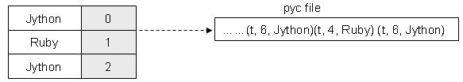

在有多个string重复出现时，实际上会使用 `TYPE_STRINGREF` 这样的类型。

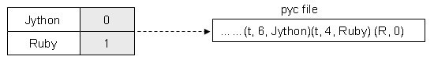

对于一个intern字符串，Python会首先查找其中是否已经记录了该字符串，这个查找动作会导致两个结果。

1. 查找失败，Python进入intern字符串的首次写入，在首次写入时，Python会进行两个独立的动作：
   1. 将 (字符串, 序号) 添加到strings中
   2. 将类型标识 `TYPE_INTERND` 和字符串本身写入到pyc文件中。
2. 查找成功，Python进入intern字符串的非首次写入，这时，Python仅仅只是将类型标识TYPE_STRINGREF和查找得到的序号写入到pyc文件中。

**加载时的情况**

在加载时，strings 为 PyListObject对象，当Python读到了TYPE_INTERND后，会将其后的字符串读入，将这个字符串进行intern操作，同时将intern操作的结果添加到strings这个PyListObject中。
随后，当Python从pyc文件中读到TYPE_STRINGREF时，会根据其后跟随的序号值访问strings，从而就获得了已经进行了intern操作的PyStringObject对象。

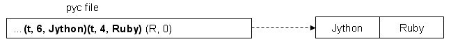

在加载紧接着的（R，0）时，因为解析到是一个TYPE_STRINGREF标志，所以直接以标志后面的数值0位索引访问WFILE.strings，立刻可得到字符串“Jython”。

#### 7.3.3 一个PyCodeObject 多个PyCodeObject ####

在 `co_consts` 中会有对子 PyCodeObject对象的引用。


这种嵌套的关系意味着pyc文件中的二进制数据实际是一种有结构的数据，这种结构化性质预示着我们能够以XML的形式来将pyc文件进行可视化。马上，你就可以看到这一激动人心的结果。

### 7.4 Python字节码 ###

Python源代码在执行前会被编译为Python的字节码指令序列，Python虚拟机就是根据这些字节码来进行一系列的操作，从而完成对Python程序的执行。

字节码可以在 `opcode.h` 中找到：

```c
[opcode.h]
#define STOP_CODE   0
#define POP_TOP     1
#define ROT_TWO     2
……
#define CALL_FUNCTION_KW           141 
#define CALL_FUNCTION_VAR_KW       142 
#define EXTENDED_ARG  143
```

对字节码的详细描述: https://docs.python.org/2.5/lib/bytecodes.html

有一部分是需要参数的，另一部分是没有参数的。所有需要参数的字节码指令的编码都大于或等于90。Python中提供了专门的宏来判断一条字节码指令是否需要参数：

```c
[opcode.h]
#define HAVE_ARGUMENT 90
#define HAS_ARG(op) ((op) >= HAVE_ARGUMENT)
```

### 7.5 解析pyc文件 ###

## 8. Python 虚拟机 ##

### 8.1 Python虚拟机的执行环境 ###

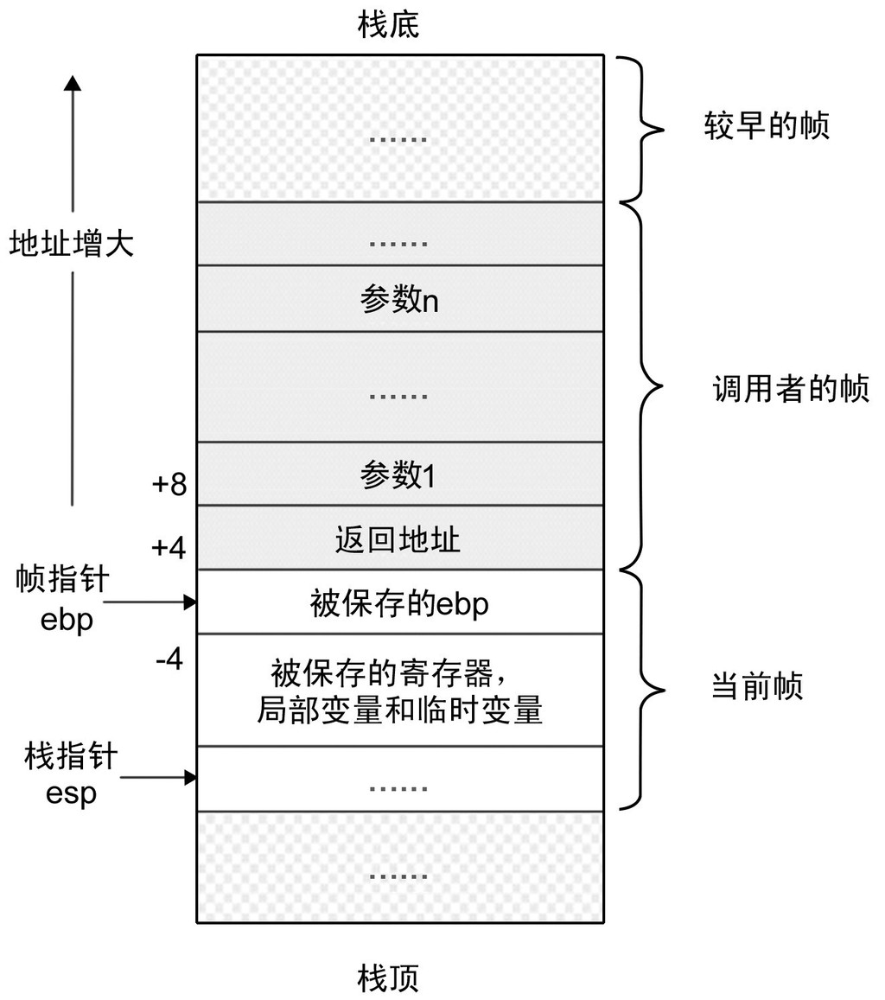

调用者的帧，当前帧，

对于一个函数而言，其所有对局部变量的操作都在自己的栈帧中完成，而函数之间的调用则通过创建新的栈帧完成。运行时栈是从地址空间的高地址向低地址延伸的。当然，在函数调用发生时，系统会保存上一个栈帧的栈指针esp和帧指针ebp。

对于python来说，执行环境的确认也很关键。

实际上，名字空间仅仅是执行环境的一部分，除了名字空间，在执行环境中，还包含了其他的一些信息。

#### 8.1.1 PyFrameObject ####

pyFrame 中会保存待执行的 PyObject 对象，以及 local、global、builtin 三个空间，用于查找对象。

```c
typedef struct _frame {
    PyObject_VAR_HEAD
    struct _frame *f_back;	/* previous frame, or NULL */
    PyCodeObject *f_code;	/* code segment */
    PyObject *f_builtins;	/* builtin symbol table (PyDictObject) */
    PyObject *f_globals;	/* global symbol table (PyDictObject) */
    PyObject *f_locals;		/* local symbol table (any mapping) */
    PyObject **f_valuestack;	/* points after the last local */
    /* Next free slot in f_valuestack.  Frame creation sets to f_valuestack.
       Frame evaluation usually NULLs it, but a frame that yields sets it
       to the current stack top. */
    PyObject **f_stacktop;
    PyObject *f_trace;		/* Trace function */

    /* If an exception is raised in this frame, the next three are used to
     * record the exception info (if any) originally in the thread state.  See
     * comments before set_exc_info() -- it's not obvious.
     * Invariant:  if _type is NULL, then so are _value and _traceback.
     * Desired invariant:  all three are NULL, or all three are non-NULL.  That
     * one isn't currently true, but "should be".
     */
    PyObject *f_exc_type, *f_exc_value, *f_exc_traceback;

    PyThreadState *f_tstate;
    int f_lasti;		/* Last instruction if called */
    /* As of 2.3 f_lineno is only valid when tracing is active (i.e. when
       f_trace is set) -- at other times use PyCode_Addr2Line instead. */
    int f_lineno;		/* Current line number */
    int f_iblock;		/* index in f_blockstack */
    PyTryBlock f_blockstack[CO_MAXBLOCKS]; /* for try and loop blocks */
    PyObject *f_localsplus[1];	/* locals+stack, dynamically sized */
} PyFrameObject;
```

`f_back` ：在Python实际的执行中，会产生很多PyFrameObject对象，而这些对象会被链接起来，形成一条执行环境链表。

PyFrameObject 是一个变长对象，实际上，每一个PyFrameObject对象都维护了一个PyCodeObject对象。而在编译一段Code Block时，会计算出这段Code Block执行过程中所需要的栈空间的大小。因为不同的Code Block在执行时所需的栈空间的大小是不同的，所以决定了PyFrameObject的开头一定有一个PyObject_VAR_HEAD。

我们这里所谓的“运行时栈”单指运算时所需要的内存空间。

#### 8.1.2 PyFrameObject中的动态内存空间 ####

这个栈的起始位置是从f_localsplus开始的。其实不完全正确，f_localsplus确实维护了一段变动长度的内存，但是这段内存不只是给栈使用的，还有别的对象也会使用:

```c
[frameobject.c](有删节)
PyFrameObject *
PyFrame_New(PyThreadState *tstate, PyCodeObject *code, PyObject *globals, 
        PyObject *locals)
{
    PyFrameObject *f;
    Py_ssize_t extras, ncells, nfrees, i;
    ncells = PyTuple_GET_SIZE(code->co_cellvars);
    nfrees = PyTuple_GET_SIZE(code->co_freevars);
    // 四部分构成了PyFrameObject维护的动态内存区，其大小由extras确定
    extras = code->co_stacksize + code->co_nlocals + ncells + nfrees;
    f = PyObject_GC_NewVar(PyFrameObject, &PyFrame_Type, extras);
    // 计算初始化时运行时栈的栈顶
    extras = code->co_nlocals + ncells + nfrees;
    // f_valuestack维护运行时栈的栈底，f_stacktop维护运行时栈的栈顶
    f->f_valuestack = f->f_localsplus + extras;
    f->f_stacktop = f->f_valuestack;
    return f;
}
```

在创建PyFrameObject对象时，额外申请的那部分内存中有一部分是给PyCodeObject对象中存储的那些局部变量的、`co_freevars`、`co_cellvars`使用的, 而另一部分才是给运行时栈使用的。

`f_valuestack` 维护了栈的起始位置，

`f_stacktop` 维护了当前的栈顶，在初始化刚完成时，指向同一个位置。

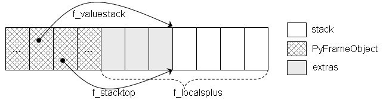

```python
import sys

value = 3


def g():
    frame = sys._getframe()
    print('current function is: ', frame.f_code.co_name)
    caller = frame.f_back
    print('caller function is: ', caller.f_code.co_name)
    print("caller's local namespace : ", caller.f_locals)
    print("caller's global namespace : ", caller.f_globals.keys())


def f():
    a = 1
    b = 2
    g()


def show():
    f()


if __name__ == '__main__':
    show()

"""
current function is:  g
caller function is:  f
caller's local namespace :  {'a': 1, 'b': 2}
caller's global namespace :  dict_keys(['__name__', '__doc__', '__package__', '__loader__', '__spec__', '__annotations__', '__builtins__', '__file__', '__cached__', 'sys', 'value', 'g', 'f', 'show'])


"""
```

### 8.2 名字 作用域和名字空间 ###

一个Python应用程序总是由多个.py文件组成，每一个.py文件中包含了多行Python中的表达式，每一个.py文件被称Python视为一个module。

#### 8.2.1 Python 程序的基础结构 module ####

#### 8.2.2 约束与名字空间 ####

回到我们的A.py，在一个module被加载到Python中之后，它在内存中以一个module对象（参见剖析module实现的章节）的形式存在。在module对象中，维护着一个名字空间（一个dict对象）。而（a, 1）、（f, function object）这些约束就位于module的名字空间中。

在Python中，module之间的名字空间规则是很清晰的，但在module内部，对名字空间的使用有着另一套不同的规则。

#### 8.2.3 作用域与名字空间 ####

在一个module内部，可能存在多个名字空间，每一个名字空间都与一个作用域对应。一个约束起作用的那一段程序正文区域称为这个约束的作用域。而名字空间就是与作用域对应的动态的东西，一个由程序文本定义的作用域在Python程序运行时就会转化为一个名字空间，一个内存中的PyDictObject对象。

为了找到某个给定名字所引用的对象，应该用这个名字在当前的作用域（名字空间）里查找。如果在这里找到了对应的约束，它就是与这个名字相关的活动约束。否则，就应该到直接的外围作用域（名字空间）去查找，并继续向外顺序地检查外围作用域（名字空间），直到到达程序的最外嵌套层次。这个最外嵌套层次就是module自身所定义的那个作用域。

**LGB规则**

`Local => Global => Builtin`

```python
[B.py]
1：a = 1 # [1]
2：def f():
3：    a = 2 # [2]
4：    print a # [3]：输出结果为2
5：print a  # [4]：输出结果为1

```

LGB有一些变化的情况，比如对于B.py中的[4]（见代码清单8-1），其实也会遵循LGB规则，只不过这时的local作用域和global作用域就是同一个作用域了。对应到名字空间上，就是同一个名字空间。更进一步，对应到PyFrameObject中，f_local和f_global就是指向同一个PyDictObject对象了。

**LEGB规则**

LEGB : local,enclosing, global,buildin .闭包是实现手段，而最内嵌套作用域规则是指导方法

**属性引用与名字引用**

属性引用实质上也是一种名字引用，其本质都是到名字空间中去查找一个名字所引用的对象。在属性引用时，一定会有对象存在，而属性引用就是到对象的名字空间中去查找名字。

module为Python应用程序划分了名字空间，通过属性引用，我们就可以访问各个独立名字空间中的名字；而通过名字引用，我们可以访问本module内部定义的多个嵌套的名字空间（作用域）。这两种方式的结合使我们能访问任何一个名字空间。

```python
# [module1.py]
import module2

owner = ‘module1’
module2.show_owner() # [1]

# [module2.py]
owner = 'module2'

def show_owner():
  print owner # [2]
```

在代码清单8-3的[1]处，发生了两次引用：首先，Python通过名字引用获得了名字module2对应的module对象；然后，Python通过属性引用获得了module2对应的module对象中的名字show_owner对应的函数对象。在调用函数的过程中，Python的执行流程到达代码清单8-3的[2]时，发生了一次名字引用，寻找名字owner，由于名字引用是不能访问自身mudule之外的名字空间，所以按照LEGB规则，[2]处输出的结果是 `module2`。尽管module1中在调用show_owner函数之前，在module1的名字空间中引入了名字owner，但是这对module2中的函数一点影响都没有，因为函数是在module2中，而名字引用遵循的LEGB的规则不会越过module的边界。

```python
# [module1.py]
import module2

owner = ‘module1’
module2.show_owner(owner)  # [1]

# [module2.py]
owner = 'module2'

def show_owner(owner):
  print owner # [2]
```

函数的参数也创建了一个约束，参数名将作为名字出现在函数的local名字空间中（机理上可以这么理解，实际实现并非如此，参考函数机制一章）

**正是这条规则，决定了Python行为的更多是代码出现的位置，而非代码执行的时间。**

### 8.3 Python虚拟机运行框架 ###

这里假设初始化的动作已经完成，我们已经站在了Python虚拟机的门槛外，只需要轻轻推动一下第一张骨牌，整个执行过程就像多米诺骨牌一样，一环扣一环地展开。

这个推动第一张骨牌的地方在一个名叫`PyEval_EvalFramEx`的函数中，这个函数实际上就是Python的虚拟机的具体实现，它是一个非常巨大的函数

`PyEval_EvalFrameEx`首先会初始化一些变量，其中PyFrameObject对象中的PyCodeObject对象包含的重要信息都被照顾到了。当然，另一个重要的动作就是初始化了堆栈的栈顶指针，使其指向`f->f_stacktop`

```c
# ceval.c 从512 -> 2603行

[PyEval_EvalFrameEx in ceval.c]    
    co = f->f_code;
    names = co->co_names;
    consts = co->co_consts;
    fastlocals = f->f_localsplus;
    freevars = f->f_localsplus + co->co_nlocals;
    first_instr = (unsigned char*)PyString_AS_STRING(co->co_code);
    next_instr = first_instr + f->f_lasti + 1;
    stack_pointer = f->f_stacktop;
    f->f_stacktop = NULL;   /* remains NULL unless yield suspends frame */
```

Python虚拟机执行字节码指令序列的过程就是从头到尾遍历整个`co_code`、依次执行字节码指令的过程。在Python的虚拟机中，利用3个变量来完成整个遍历过程。`co_code`实际上是一个PyStringObject对象，而其中的字符数组才是真正有意义的东西，这也就是说，整个字节码指令序列实际上就是一个在C中普普通通的字符数组。因此，遍历过程中所使用的这3个变量都是`char*`类型的变量：`first_instr`永远指向字节码指令序列的开始位置；`next_instr`永远指向下一条待执行的字节码指令的位置；`f_lasti`指向上一条已经执行过的字节码指令的位置。

```c
[ceval.c]
/* Interpreter main loop */
PyObject* PyEval_EvalFrameEx(PyFrameObject *f, int throwflag)
{
    ……
    why = WHY_NOT;
    ……
    for (;;) {
    ……
    fast_next_opcode:
        f->f_lasti = INSTR_OFFSET();
        //获得字节码指令
        opcode = NEXTOP();
        oparg = 0;
        //如果指令需要参数，获得指令参数
        if (HAS_ARG(opcode))
            oparg = NEXTARG();
   dispatch_opcode:
        switch (opcode) {
        case NOP:
            goto fast_next_opcode;
        case LOAD_FAST:
            ……
        }
}
```

在这个执行架构中，对字节码的一步一步地遍历是通过几个宏来实现的：

```c
[PyEval_EvalFrameEx in ceval.c]
#define INSTR_OFFSET()  (int(next_instr - first_instr))
#define NEXTOP()    (*next_instr++)
#define NEXTARG()   (next_instr += 2, (next_instr[-1]<<8) + next_instr[-2])
```

需要提到的一点是那个名叫“`why`”的神秘变量，它指示了在退出这个巨大的for循环时Python执行引擎的状态。

变量why的取值范围在ceval.c中被定义，其实也就是Python结束字节码执行时的状态：

```c
[ceval.c]
/* Status code for main loop (reason for stack unwind) */
enum why_code {
        WHY_NOT =   0x0001, /* No error */
        WHY_EXCEPTION = 0x0002, /* Exception occurred */
        WHY_RERAISE =   0x0004, /* Exception re-raised by 'finally' */
        WHY_RETURN =    0x0008, /* 'return' statement */
        WHY_BREAK = 0x0010, /* 'break' statement */
        WHY_CONTINUE =  0x0020, /* 'continue' statement */
        WHY_YIELD = 0x0040  /* 'yield' operator */
};
```

### 8.4 Python运行时环境 ###

在Python中，这个关于线程状态信息的抽象是通过PyThreadState对象来实现的，一个线程将拥有一个PyThreadState对象。对于进程这个抽象概念，Python以PyInterpreterState对象来实现。

```c
[pystate.h]
typedef struct _is {
    struct _is *next;
    struct _ts *tstate_head; //模拟进程环境中的线程集合

    PyObject *modules;
    PyObject *sysdict;
    PyObject *builtins;
    ……
} PyInterpreterState;

typedef struct _ts {
    struct _ts *next;
    PyInterpreterState *interp;
    struct _frame *frame; //模拟线程中的函数调用堆栈
    int recursion_depth;
    ……
    PyObject *dict;
    ……
    long thread_id;
} PyThreadState;
```

当Python虚拟机开始执行时，会将当前线程状态对象中的frame设置为当前的执行环境（frame）：

而在建立新的PyFrameObject对象时，则从当前线程的状态对象中取出旧的frame，建立PyFrameObject链表：

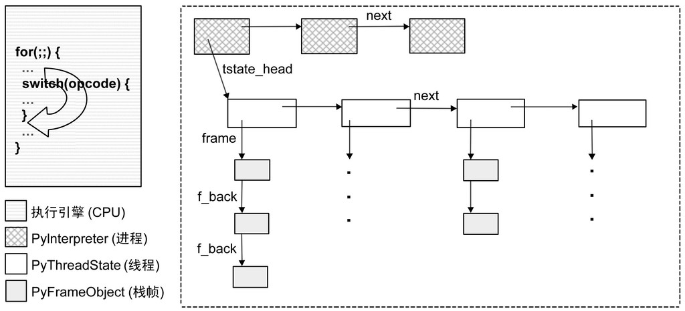

## 9. Python虚拟机中的一般表达式 ##

### 9.1 简单内建对象的创建 ###

```python
# [simple_obj.py]
i = 1
s = "Python"
d = {}
l = []
```

我们来看一看在本章的剖析中需要的一些宏的定义：

```c
// [PyEval_EvalFrameEx in ceval.c]
// 访问tuple中的元素
#define GETITEM(v, i) PyTuple_GET_ITEM((PyTupleObject *)(v), (i))
// 调整栈顶指针
#define BASIC_STACKADJ(n)   (stack_pointer += n)
#define STACKADJ(n) BASIC_STACKADJ(n)
// 入栈操作
#define BASIC_PUSH(v)   (*stack_pointer++ = (v))
#define PUSH(v)     BASIC_PUSH(v)
// 出栈操作
#define BASIC_POP() (*--stack_pointer)
#define POP()       BASIC_POP()
```

这里首先来看一看对第一行Python代码的执行：

```console
i = 1
0   LOAD_CONST   0  (1)
3   STORE_NAME   0  (i)
```

对于第一条字节码指令`LOAD_CONST`——`0 LOAD_CONST 0`，虚拟机的执行动作如下：

只改变了运行时栈，对local名字空间没有任何影响。仅仅只是在栈顶放了一个变量。

```c
[LOAD_CONST]
x = GETITEM(consts, oparg);
Py_INCREF(x);
PUSH(x);
```

Python虚拟机通过执行字节码指令`STORE_NAME`来改变local名字空间，从而完成变量名i到变量值1之间映射关系的创建。

注意，由于在STORE_NAME指令的执行过程中，进行了POP的动作，所以这时运行时栈中已不存在任何对象了。

```c
[STORE_NAME]
//从符号表中获得符号，其中oparg = 0
w = GETITEM(names, oparg);
//从运行时栈中获得值
v = POP();
if ((x = f->f_locals) != NULL) 
{
    //将（符号，值）的映射关系存储到local名字空间中
    if (PyDict_CheckExact(x))
    {
        PyDict_SetItem(x, w, v);
    }
    else
    {
        PyObject_SetItem(x, w, v);
    }
    Py_DECREF(v);
}
```

在四条python赋值语句执行完了之后，还会剩下一些字节码:

原来Python在执行了一段Code Block后，一定要返回一些值，这两条字节码指令就是用来返回某些值的：

```c
24   LOAD_CONST   2 (none)
27   RETURN_VALUE
    
[RETURN_VALUE]
retval = POP();
why = WHY_RETURN;
```

所以RETURN_VALUE前的那条字节码指令`24 LOAD_CONST 2`的作用就很清楚了，它将返回值压入运行时栈中，以供RETURN_VALUE使用。

### 9.2 复杂内建对象的创建 ###

```python
# [adv_obj.py]
i = 1
s = "Python"
d = {"1":1, "2":2}
l = [1, 2]
```

常量表consts（co_consts）应该和simple_obj.py是不同的。图显示了与adv_obj.py对应的co_consts和co_names：

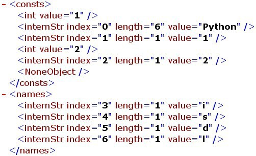

在创建非空的dict时，字节码序列与simple_obj.py中的不同了：

```c
d = {"1":1, "2":2}
12   BUILD_MAP   0
15   DUP_TOP
16   LOAD_CONST   0 (1)    // 读取第一个元素的值
19   ROT_TWO
20   LOAD_CONST   2 (‘1’)  // 读取第一个元素的键
23   STORE_SUBSCR          // 将 键值 插入到dict对象中
24   DUP_TOP
25   LOAD_CONST   3 (2)
28   ROT_TWO
29   LOAD_CONST   4 (‘2’)
32   STORE_SUBSCR
33   STORE_NAME   2 (d)
    
[DUP_TOP]  // 将栈顶的元素再次入栈
v = TOP();
Py_INCREF(v);
PUSH(v);

[ROT_TWO] // 将栈顶的两个元素进行对调
v = TOP();
w = SECOND();
SET_TOP(w);
SET_SECOND(v);

[STORE_SUBSCR]
w = TOP();     //“1”
v = SECOND(); // dict object
u = THIRD();  // 1
STACKADJ(-3);
//v[w] = u，即dict[“1”] = 1
PyObject_SetItem(v, w, u);
Py_DECREF(u);
Py_DECREF(v);
Py_DECREF(w);
```

### 9.3 其他一般表达式 ###

~~~python
# [normal.py]
a = 5
b = a
c = a + b
print c
~~~

在Python编译器对normal.py的编译成功结束之后，其对应的PyCodeObject中的co_consts和co_names如图：

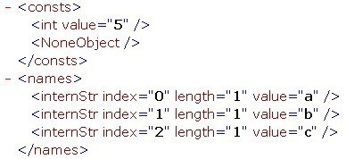

#### 9.3.1 符号搜索 ####

```assembly
# b = a
0   LOAD_NAME    0  (a)
3   STORE_NAME   1  (b)
```

```c
[LOAD_NAME（有删节）]
            //获得变量名
            w = GETITEM(names, oparg);
            //[1] : 在local名字空间中查找变量名对应的变量值
            v = f->f_locals;
            x = PyDict_GetItem(v, w);
            Py_XINCREF(x);
            if (x == NULL) {
                //[2] ：在global名字空间中查找变量名对应的变量值
                x = PyDict_GetItem(f->f_globals, w); 
                if (x == NULL) {
                    //[3] ：在builtin名字空间中查找变量名对应的变量值
                    x = PyDict_GetItem(f->f_builtins, w); 
                    if (x == NULL) {
                        //[4] ：查找变量名失败，抛出异常 
                        format_exc_check_arg(PyExc_NameError,NAME_ERROR_MSG ,w);
                        break;
                    }
                }
                Py_INCREF(x);
            }
            PUSH(x);
```

#### 9.3.2 数值运算 ####

```c
# c = a + b
12   LOAD_NAME   0  (a)
15   LOAD_NAME   1  (b)
18   BINARY_ADD
19   STORE_NAME   2 (c)
```

```c
[BINARY_ADD]
            w = POP();
            v = TOP();
            if (PyInt_CheckExact(v) && PyInt_CheckExact(w)) {
                //[1]：PyIntObject对象相加的快速通道
                register long a, b, i;
                a = PyInt_AS_LONG(v);
                b = PyInt_AS_LONG(w);
                i = a + b;
                //[2]：如果加法运算溢出，转向慢速通道
                if ((i^a) < 0 && (i^b) < 0)
                    goto slow_add;
                x = PyInt_FromLong(i);
            }
            //[3]：PyStringObject对象相加的快速通道
            else if (PyString_CheckExact(v) && PyString_CheckExact(w)) {
                x = string_concatenate(v, w, f, next_instr);
                goto skip_decref_vx;
            }
            else {
    //[4]：一般对象相加的慢速通道
    slow_add:
                x = PyNumber_Add(v, w);
            }
            Py_DECREF(v);
    skip_decref_vx:
            Py_DECREF(w);
            SET_TOP(x);
            break;
```

## 10. Python虚拟机中的控制流 ##

### 10.1 if控制流 ###

```python
# [if_control.py]
a = 1
if a > 10:
    print "a > 10"
elif a <= -2:
    print "a <= -2"
elif a != 1:
    print "a != 1"
elif a == 1:
    print "a == 1"
else:
    print "Unknown a"
```

这个PyCodeObject对象中所包含的与if_control.py所对应的常量表（co_consts）和符号表（co_names）如图:

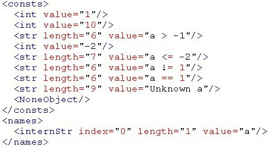

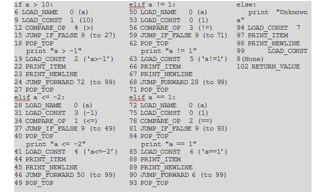

我们发现它们经Python编译器编译后都呈现出同样的字节码指令序列结构：

- 执行LOAD_NAME指令，从local名字空间中获得变量名a所对应的变量值；
- 执行LOAD_CONST指令，从常量表consts中读取参与该分支判断操作的常量对象；
- 执行COMPARE_OP指令，对前面两条指令取得的变量值和常量对象进行比较操作；
- 执行某一条JUMP_*指令，根据COMPARE_OP指令的运行结果进行字节码指令的跳跃。

#### 10.1.2 COMPARE_OP 指令 ####

```c
[COMPARE_OP]
            w = POP();
            v = TOP();
            //[1]：PyIntObject对象的快速通道
            if (PyInt_CheckExact(w) && PyInt_CheckExact(v)) {
                register long a, b;
                register int res;
                a = PyInt_AS_LONG(v);
                b = PyInt_AS_LONG(w);
                //根据字节码指令的指令参数选择不同的比较操作
                switch (oparg) {
                case PyCmp_LT: res = a <  b; break;
                case PyCmp_LE: res = a <= b; break;
                case PyCmp_EQ: res = a == b; break;
                case PyCmp_NE: res = a != b; break;
                case PyCmp_GT: res = a >  b; break;
                case PyCmp_GE: res = a >= b; break;
                case PyCmp_IS: res = v == w; break;
                case PyCmp_IS_NOT: res = v != w; break;
                default: goto slow_compare;
                }
                x = res ? Py_True : Py_False;
                Py_INCREF(x);
            }
            else {
        //[2]：一般对象的慢速通道
        slow_compare:
                x = cmp_outcome(oparg, v, w);
            }
            Py_DECREF(v);
            Py_DECREF(w);
            //将比较结果压入到运行时栈中
            SET_TOP(x);
            if (x == NULL) break;
            PREDICT(JUMP_IF_FALSE);
            PREDICT(JUMP_IF_TRUE);
```

**比较的结果 Python bool 对象**

```c
[boolobject.c]
/* The type object for bool.  Note that this cannot be subclassed! */
PyTypeObject PyBool_Type = {
    PyObject_HEAD_INIT(&PyType_Type)
    0,
    "bool",
    sizeof(PyIntObject),
    ……
};
/* The objects representing bool values False and True */
/* Named Zero for link-level compatibility */
PyIntObject _Py_ZeroStruct = {
    PyObject_HEAD_INIT(&PyBool_Type)
    0
};

PyIntObject _Py_TrueStruct = {
    PyObject_HEAD_INIT(&PyBool_Type)
    1
};
```

通过图看一下从`if a > 10`开始执行，到COMPRE_OP指令完成时这一段时间内运行时栈的变化情况。

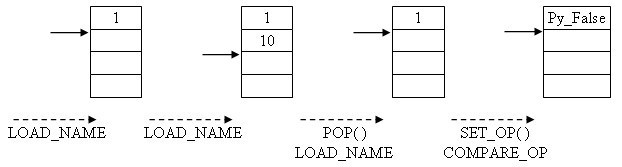

#### 10.1.3 指令跳跃 ####

Python虚拟机中的字节码指令跳跃是如何实现的呢，奥秘就在COMPARE_OP指令的实现中最后的那个PREDICT宏。

```c
[ceval.c]
#define PREDICT(op)     if (*next_instr == op) goto PRED_##op

#define PREDICTED(op)   PRED_##op: next_instr++
#define PREDICTED_WITH_ARG(op)  PRED_##op: oparg = PEEKARG(); next_instr += 3

#define PEEKARG() ((next_instr[2]<<8) + next_instr[1])
```

我们可以看到，`PREDICT(JUMP_IF_FALSE)`，实际就是直接检查下一条待处理的字节码是否是`JUMP_IF_FALSE`。如果是，则程序流程会跳转到`PRED_JUMP_IF_FALSE`标识符对应的代码处。

那么`PRED_JUMP_IF_FALSE`和`PRED_JUMP_IF_TRUE`这些标识符在何处呢？我们知道指令跳跃的目的是为了绕过一些无谓的操作，直接进入`JUMP_IF_FALSE`或`JUMP_IF_TRUE`的指令代码，那么很显然，这些宏应该位于`JUMP_IF_FALSE`指令或`JUMP_IF_TRUE`指令对应的case语句之前。

看看那个PREDICTED_WITH_ARG宏，我们来把它展开：

```c
[ceval.c]
    PRED_JUMP_IF_FALSE： 
        //取指令的参数
        oparg = ((next_instr[2]<<8) + next_instr[1]);
        //调整next_instr
        next_instr += 3;
        case JUMP_IF_FALSE:
            ………
```

值得注意的是，在`PEEKARG`之后，Python将字节码指针向前移动了3个字节的长度。仔细想一下，在COMPARE_OP指令的实现中，`PREDICT(JUMP_IF_FALSE)`处只是判断下一条字节码是否是JUMP_IF_FALSE，并没有移动next_instr。而在接下来的PEEKARG中，我们获得了JUMP_IF_FALSE的指令参数，也没有移动next_instr，所以这时当确认应该执行JUMP_IF_FALSE时，我们必须将字节码指针移动到JUMP_IF_FALSE之后的下一条字节码，因为这时我们已经开始处理JUMP_IF_FALSE了，而next_instr的使命是指出下一条指令是什么。一个字节码长度为1个字节，而字节码的参数都是2个字节，所以这里需要将next_instr向前移动3个字节。

当执行 `JUMP_IF_FLASE` 时，先获取栈顶的 bool 对象。

a, 如果 false 和 false 匹配，那么进行跳跃动作：

`#define JUMPBY(x)   (next_instr += (x))` 跳跃的距离就是`JUMP_IF_FALSE`的指令参数。跳跃的距离是在编译的时候就确定了。

b, 如果 true 和 false 匹配，那么就不会执行跳跃动作:

```c
if (w == Py_True) {
    PREDICT(POP_TOP);
    goto fast_next_opcode;
}

PREDICTED(POP_TOP);
case POP_TOP:
v = POP();
Py_DECREF(v);
goto fast_next_opcode;
```

这实际上意味着判断 a > 10是成立的，所以接下来就会执行print语句。再次利用PREDICT宏，对POP_TOP指令进行预测，快速进行运行时栈的清理工作，并为print的执行做好准备。

请注意 `case POP_TOP` 上面的 PREDICTED 宏, 正如它们的名字所显示出来的区别，这两个宏分别处理有参指令和无参指令两种情况。像这个没有参数的字节码指令往下移直接加一就好了。

在整个指令跳跃的过程中，出现了两次跳跃，可能会令人比较迷惑，实际上这两次跳跃是在不同的层面上的跳跃。第一次是通过PREDICT(JUMP_IF_FALSE)中的goto语句进行跳跃，这次跳跃影响的是Python虚拟机自身，即实现Python的C代码。而在JUMP_IF_FALSE的指令代码中通过JUMPBY完成的跳跃是在Python应用程序层面的跳跃，影响的Python应用程序，是.py源文件中的Python代码。

在print的执行中，同样会有指令跳跃的动作出现。直接跳转到if控制结构的末尾后的第一条字节码指令，这个惊险的飞跃由`JUMP_FORWORD`指令完成。

```c
[JUMP_FORWARD] 
           JUMPBY(oparg);
           goto fast_next_opcode;
```

### 10.2 for 循环控制流 ###

首先给出demo:

```assembly
[for_control.py]
lst = [1, 2]
0   LOAD_CONST   0 (1)
3   LOAD_CONST   1 (2)
6   BUILD_LIST   2
9   STORE_NAME   0 (lst)
for i in lst:
12   SETUP_LOOP   19 (to 34)
15   LOAD_NAME    0  (lst)
18   GET_ITER     
19   FOR_ITER     11 (to 33)
22   STORE_NAME   1 (i)
    print i
25   LOAD_NAME    1 (i)
28   PRINT_ITEM
29   PRINT_NEWLINE
30   JUMP_ABSOLUTE   19
33   POP_BLOCK
34   LOAD_CONST   2 (None)
37   RETURN_VALUE
```

下图显式编译之后得到的PyCodeObject中的常量表:

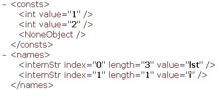

#### 10.2.2 循环控制结构的初始化 ####

其中 `SETUP_LOOP` 字节码对应的逻辑：

```c
case SETUP_LOOP:
case SETUP_EXCEPT:
case SETUP_FINALLY:
/* NOTE: If you add any new block-setup opcodes that are not try/except/finally
			   handlers, you may need to update the PyGen_NeedsFinalizing() function. */
    PyFrame_BlockSetup(f, opcode, INSTR_OFFSET() + oparg,
                       STACK_LEVEL());

// how to run PyFrame_BlockSetup
void PyFrame_BlockSetup(PyFrameObject *f, int type, int handler, int level)
{
	PyTryBlock *b;
	if (f->f_iblock >= CO_MAXBLOCKS)
		Py_FatalError("XXX block stack overflow");
	b = &f->f_blockstack[f->f_iblock++];
	b->b_type = type;
	b->b_level = level;
	b->b_handler = handler;
}

typedef struct {
    int b_type;			/* what kind of block this is */
    int b_handler;		/* where to jump to find handler */
    int b_level;		/* value stack level to pop to */
} PyTryBlock;
```

**PyTryBlock**

`SETUP_LOOP` 指令做的动作是从 `f_blockstack` 数组中获得一块 `PyTryBlock` 结构体，并在其中存放了一些python虚拟机当前的信息。

我们注意到PyTryBlock结构中有一个b_type域，这意味着实际上存在着几种不同用途的PyTryBlock对象。从PyFrame_BlockSetup中可以看到，这个b_type实际上被设置为当前Python虚拟机正在执行的字节码指令，以字节码指令作为区分PyTryBlock的不同用途。

**List迭代器**

在`SETUP_LOOP`指令从PyFrameObject的f_blockstack中申请了一块PyTryBlock结构的空间之后，Python虚拟机通过`15 LOAD_NAME 0`指令，将刚创建的PyListObject对象压入运行时栈。然后再通过执行`18 GET_ITER`指令来获得PyListObject对象的迭代器。

```c
case GET_ITER:
    /* before: [obj]; after [getiter(obj)] */
    v = TOP();
    x = PyObject_GetIter(v);
    Py_DECREF(v);
    if (x != NULL) {
        SET_TOP(x);
        PREDICT(FOR_ITER);
        continue;
    }
    STACKADJ(-1);
    break;

[object.h]
typedef PyObject *(*getiterfunc) (PyObject *);

[abstract.c]
PyObject* PyObject_GetIter(PyObject *o)
{
    PyTypeObject *t = o->ob_type;
    getiterfunc f = NULL;
    if (PyType_HasFeature(t, Py_TPFLAGS_HAVE_ITER))
        //获得类型对象中的tp_iter操作
        f = t->tp_iter;
    if (f == NULL) {
        ……
    }
    else {
        //通过tp_iter操作获得iterator
        PyObject *res = (*f)(o);
        ……
        return res;
    }
}
```

`GET_ITER` 先通过栈顶的name获取一个PyListObject对象的 iterator , 然后通过 `SET_TOP` 把这个迭代器对象设置为运行时栈的栈顶元素。

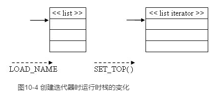

在指令`18 GET_ITER`完成之后，Python虚拟机开始了`FOR_ITER`指令的预测动作，如你所知，这样的预测动作是为了提高执行的效率。

#### 10.2.3 迭代控制 ??? ####

通过 `FOR_ITER` 产出元素，通过 `JUMP_ABSOLUTE` 构造出一个往返于 `FOR_ITER` 之间的循环结构。

通过迭代器保存循环的状态。

通过 `JUMPBY(x)` 宏跳出这个循环。

### 10.3 while 循环控制结构 ??? ###

### 10.4 Python虚拟机中的异常控制流 ###

#### 10.4.1 Python中的异常机制 ####

首先给出一个简单的demo:

```assembly
1/0
#   LOAD_CONST   0
#   LOAD_CONST   1
#   BINARY_DIVIDE

[BINARY_DIVIDE]
    w = POP(); // 1
    v = TOP(); // 0
    x = PyNumber_Divide(v, w);
    Py_DECREF(v);
    Py_DECREF(w);
    SET_TOP(x);
    if (x != NULL) continue;
    break;
```

当PyNumber_Divide执行时，抛出了异常，而它的返回值一定是NULL，所以才能导致Python虚拟机退出当前栈帧。实际上，这个PyErr_ZeroDivisionError很简单，就是一个`PyObject*`，仅仅是一个指针,但是在Python运行环境初始化时，它们会指向Python创建的异常类型对象，从而指明发生了什么异常。

```c
[intobject.c]
static PyObject* int_classic_div(PyIntObject *x, PyIntObject *y)
{
    long xi, yi;
    long d, m;
    //将x，y中维护的整数值转存到xi，yi中
    CONVERT_TO_LONG(x, xi);
    CONVERT_TO_LONG(y, yi);
    switch (i_divmod(xi, yi, &d, &m)) {
    case DIVMOD_OK:
        return PyInt_FromLong(d);
    case DIVMOD_OVERFLOW:
        return PyLong_Type.tp_as_number->nb_divide((PyObject *)x,
                               (PyObject *)y);
    default:
        return NULL;
    }
}

[intobject.c]
/* Return type of i_divmod */
enum divmod_result {
    DIVMOD_OK,      /* Correct result */
    DIVMOD_OVERFLOW,    /* Overflow, try again using longs */
    DIVMOD_ERROR        /* Exception raised */
};

static enum divmod_result
i_divmod(register long x, register long y, long *p_xdivy, long *p_xmody)
{
    long xdivy, xmody;
    //抛出异常的瞬间
    if (y == 0) {
        PyErr_SetString(PyExc_ZeroDivisionError,
                "integer division or modulo by zero");
        return DIVMOD_ERROR;
    }
    ……
}
```

**在线程状态对象中记录异常信息**

在i_divmod之后，Python的执行路径会沿着PyErr_SetString、PyErr_SetObject，一直到达PyErr_Restore。在PyErr_Restore中，Python将这个异常放置到了一个安全的地方：

```c
[errors.c]
void PyErr_Restore(PyObject *type, PyObject *value, PyObject *traceback)
{
    PyThreadState *tstate = PyThreadState_GET();
    PyObject *oldtype, *oldvalue, *oldtraceback;
    //保存以前的异常信息
    oldtype = tstate->curexc_type;
    oldvalue = tstate->curexc_value;
    oldtraceback = tstate->curexc_traceback;
    //设置当前的异常信息
    tstate->curexc_type = type;
    tstate->curexc_value = value;
    tstate->curexc_traceback = traceback;
    //抛弃以前的异常信息
    Py_XDECREF(oldtype);
    Py_XDECREF(oldvalue);
    Py_XDECREF(oldtraceback);
}
```

最后，在PyThreadState的`curexc_type`中存放下了`PyExc_ZeroDivisionError`，而`curexc_value`中存放下了在`i_divmod`中设定的那个跟随`PyExc_ZeroDivisionError`的字符串"`integer division or modulo by zero`"。

当前活动线程对应的PyThreadState对象可以通过PyThreadState_GET获得，

```c
[pystate.h]
#define PyThreadState_GET() (_PyThreadState_Current)

[pystate.c]
PyThreadState *_PyThreadState_Current = NULL;
```

**展开栈帧**

这里还存在一个问题，导致跳出那个巨大的switch块的原因可能是执行完了字节码之后正常的跳出，也可能是发生异常后的跳出。那么Python虚拟机将如何区分呢？

```c
[ceval.c]
PyObject* PyEval_EvalFrameEx(PyFrameObject *f)
{
  ……
  for (;;) {
        //巨大的switch语句
        if (why == WHY_NOT) {
            if (err == 0 && x != NULL) {
                    continue; //没有异常情况发生，执行下一条字节码指令
            }
            //设置why，通知虚拟机，异常发生了
            why = WHY_EXCEPTION;
            x = Py_None;
            err = 0;
        }
        //尝试捕捉异常
        if (why != WHY_NOT)//[1]
            break;
        ……
    } //end of for(;;)
    ……
}
```

在跳出了 switch 之后，首先会通过检查 x 的值来确认是否有异常发生。x的值如果为NULL，那么虚拟机将why设置为 `WHY_EXCEPTION` 。变量why实际上维护的是Python虚拟机中执行字节码指令的那个for循环内的状态。

在Python虚拟机处理异常的流程中，涉及了一个traceback对象，在这个对象中记录栈帧链表的信息，Python虚拟机利用这个对象来将栈帧链表中每一个栈帧的当前状态可视化，在Python虚拟机开始处理异常时，它首先的行为就是创建一个traceback对象，用于记录异常发生时活动栈帧的状态：

```c
[ceval.c]
PyObject* PyEval_EvalFrameEx(PyFrameObject *f)
{
    ……
    for (;;) {
        //巨大的switch语句
        if (why == WHY_EXCEPTION) {
            //创建traceback对象
            PyTraceBack_Here(f);
            if (tstate->c_tracefunc != NULL)
                call_exc_trace(tstate->c_tracefunc, tstate->c_traceobj, f);
        }
        ……
    } //end of for(;;)
……
}

[traceback.c]
int PyTraceBack_Here(PyFrameObject *frame)
{
    //获得线程状态对象
    PyThreadState *tstate = frame->f_tstate;
    //保存线程状态对象中现在维护的traceback对象
    PyTracebackObject *oldtb = (PyTracebackObject *)
    tstate->curexc_traceback;
    //创建新的traceback对象
    PyTracebackObject *tb = newtracebackobject(oldtb, frame);
    //将新的traceback对象交给线程状态对象
    tstate->curexc_traceback = (PyObject *)tb;
    Py_XDECREF(oldtb);
    return 0;
}
```

原来traceback对象也跟PyFrameObject对象一样，是一个链表结构。我们进一步猜测，这个PyTracebackObject对象的链表结构应该跟PyFrameObject对象的链表结构是同构的，即一个PyFrameObject对象应该对应一个PyTracebackObject对象。

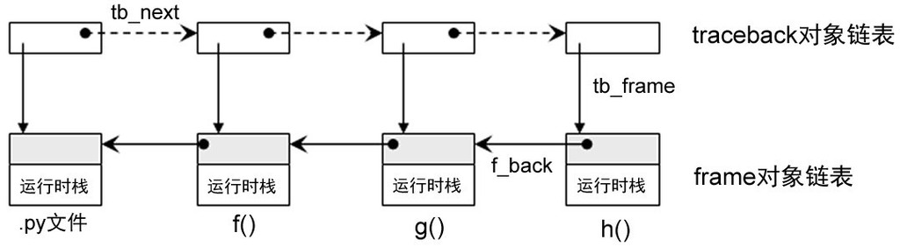

#### 10.4.2 异常控制语句 ####

Python的异常机制的实现中，最重要的就是why所表示的虚拟机状态及PyFrameObject对象中f_blockstack里存放的PyTryBlock对象了。变量why将指示Python虚拟机当前是否发生了异常，而PyTryBlock对象则指示Python虚拟机程序员是否为异常设置了except代码块和finally代码块。Python虚拟机处理异常的过程就是在why和PyTryBlock的共同作用下完成的。

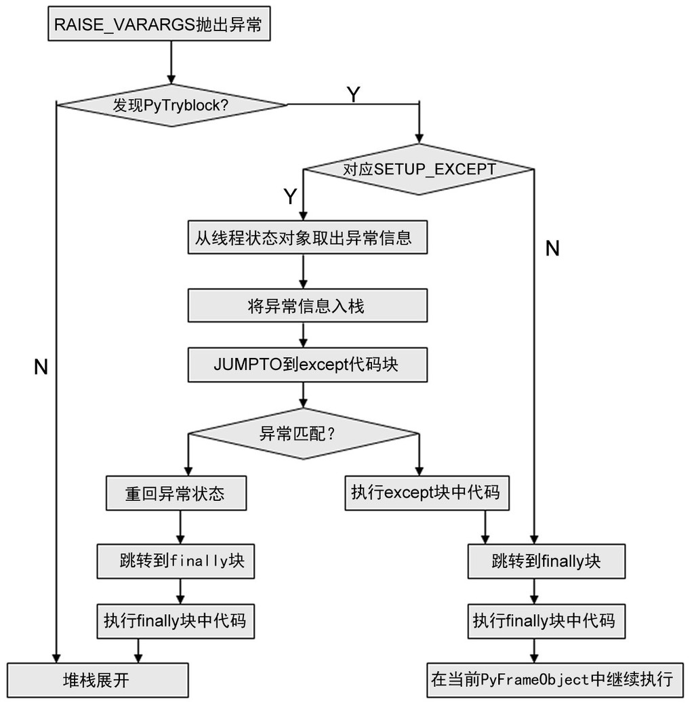

## 11. 函数机制 ##

### 11.1 PyFunctionObject ###

```c
[funcobject.h]
typedef struct {
    PyObject_HEAD
    PyObject *func_code;       //对应函数编译后的PyCodeObject对象
    PyObject *func_globals;   //函数运行时的global名字空间
    PyObject *func_defaults;  //默认参数（tuple或NULL）
    PyObject *func_closure;   //NULL or a tuple of cell objects，用于实现closure 
    PyObject *func_doc;        //函数的文档(PyStringObject)
    PyObject *func_name;       //函数名称，函数的__name__属性,(PyStringObject)
    PyObject *func_dict;       //函数的__dict__属性(PyDictObject或NULL
    PyObject *func_weakreflist;
    PyObject *func_module;      //函数的__module__,可以是任何对象
} PyFunctionObject;
```

对于一段Python代码，其对应的PyCodeObject对象只有一个，而代码所对应的PyFunctionObject对象却可能有很多个，比如一个函数多次调用，则Python会在运行时创建多个PyFunctionObject对象，

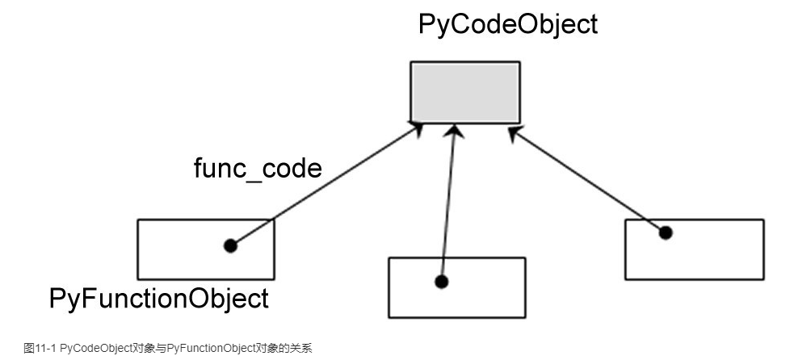

### 11.2 无参函数调用 ###

这里也是一样，给出一个无参函数的demo:

```assembly
def f():
	print "Function"
	
f()


[func_0.py]
def f():
0 LOAD_CONST     0 (code object f)
3 MAKE_FUNCTION 0
6 STORE_NAME     0 (f)
    print "Function"
    0   LOAD_CONST   1 (“Function”)
    3   PRINT_ITEM   
    4   PRINT_NEWLINE   
    5   LOAD_CONST   0 (None)
    8   RETURN_VALUE   

f()
9  LOAD_NAME 0 (f)
12 CALL_FUNCTION 0
15 POP_TOP
16 LOAD_CONST    1 (None)
19 RETURN_VALUE
```

函数的声明与函数的实现是分离的，甚至是分离在了不同的PyCodeObject对象中(存在于外层的co_consts)。第1行代码虽然和第2行代码确实在逻辑上是一个整体，但是在Python实现这个函数时，却在物理上将它们分离开了。

#### 11.2.1 函数对象的创建 MAKE_FUNCTION ####

Python虚拟机在执行def语句时，会动态地创建一个函数，即一个PyFunctionObject对象。在MAKE_FUNCTION之前，Python虚拟机会执行`LOAD_CONST 0`。这条指令将函数f对应的PyCodeObject对象压入到了运行时栈中

在执行MAKE_FUNCTION时，首先就是将这个PyCodeObject对象弹出运行时栈，然后以该对象和当前PyFrameObject对象中维护的global名字空间f_globals对象为参数，通过PyFunction_New创建一个新的PyFunctionObject对象，而这个f_globals，将成为函数f在运行时的global名字空间。

#### 11.2.2 函数调用 CALL_FUNCTION ####

从`12 CALL_FUNCTION 0`指令开始，在获得了当前的运行时栈栈顶指针之后，就杀入了call_function

```c
[CALL_FUNCTION]
    PyObject **sp;
    sp = stack_pointer;
    x = call_function(&sp, oparg);
    stack_pointer = sp;
    PUSH(x);
    if (x != NULL)
        continue;
    break;

[ceval.c]
static PyObject* call_function(PyObject ***pp_stack, int oparg)
{
    // [1]：处理函数参数信息
    int na = oparg & 0xff;
    int nk = (oparg>>8) & 0xff;
    int n = na + 2 * nk;
    // [2]：获得PyFunctionObject对象
    PyObject **pfunc = (*pp_stack) - n - 1;
    PyObject *func = *pfunc;
    PyObject *x, *w;

    if (PyCFunction_Check(func) && nk == 0) {
        ……
    } else {
        if (PyMethod_Check(func) && PyMethod_GET_SELF(func) != NULL) {
            ……
}
        // [3]：对PyFunctionObject对象进行调用
        if (PyFunction_Check(func))
            x = fast_function(func, pp_stack, n, na, nk);
        else
            x = do_call(func, pp_stack, na, nk);
        ……
    }
    ……
    return x;
}
```

在这里 CFunction 和 Method 的调用也会进入这个 call_function 中。

在注释 3 的位置，通过了PyFunction_Check的检查之后，就会进入fast_function。在call_function开始的代码的[1]处，有一些处理函数参数信息的动作，现在我们不深入阐述，只需要记住，其中计算得到的n指明了在运行时栈中，栈顶的多少个元素是与参数相关的。

```c
[ceval.c]
static PyObject *
fast_function(PyObject *func, PyObject ***pp_stack, int n, int na, int nk)
{
    PyCodeObject *co = (PyCodeObject *)PyFunction_GET_CODE(func);
    PyObject *globals = PyFunction_GET_GLOBALS(func);
    PyObject *argdefs = PyFunction_GET_DEFAULTS(func);
    PyObject **d = NULL;
    int nd = 0;

    //[1]：一般函数的快速通道
    if (argdefs == NULL && co->co_argcount == n && nk==0 &&
        co->co_flags == (CO_OPTIMIZED | CO_NEWLOCALS | CO_NOFREE)) { 
        PyFrameObject *f;
        PyObject *retval = NULL;
        PyThreadState *tstate = PyThreadState_GET();
        PyObject **fastlocals, **stack;
        int i;
        f = PyFrame_New(tstate, co, globals, NULL);
        ……
        retval = PyEval_EvalFrameEx(f, 0);
        ……
        return retval;
    }
    if (argdefs != NULL) {
        d = &PyTuple_GET_ITEM(argdefs, 0);
        nd = ((PyTupleObject *)argdefs)->ob_size;
    }
    return PyEval_EvalCodeEx(co, globals,
                 (PyObject *)NULL, (*pp_stack)-n, na,
                 (*pp_stack)-2*nk, nk, d, nd,
                 PyFunction_GET_CLOSURE(func));
}
```

进入了fast_function之后，首先会抽取出PyFunctionObject对象中保存的PyCodeObject对象及函数运行时的global名字空间等信息。fast_ function中实际上是包含了两条执行路径，无参函数会在代码[1]处作出判断，并进入一般函数的通道，所谓一般函数，我们会在后面介绍。在一般函数的通道中，Python虚拟机会创建新的PyFrameObject对象，进而调用PyEval_EvalFrameEx；在另一条分支上，会调用 `PyEval_EvalCodeEx`

这个过程实际上就是对x86平台上函数调用过程的模拟：创建新的栈帧，在新的栈帧中执行代码。有一点需要注意，在最终通过PyEval_EvalFrameEx时，PyFunction- Object对象的影响已经消失了，真正对新栈帧产生影响的是在PyFunctionObject中存储的PyCodeObject对象和global名字空间。

### 11.3 函数执行时的名字空间 ###

在执行LOAD_NAME指令时，Python虚拟机会依次从三个PyDictObject对象中进行搜索，搜索的顺序是：f_locals、f_globals、f_builtins。

在执行func_0.py的字节码指令序列时的global名字空间和执行函数f的字节码指令序列时的global名字空间实际上是同一个名字空间。实际上这个名字空间是通过PyFunctionObject的携带，和字节码指令序列对应的PyCodeObject对象一起被传入到新的栈帧中的。

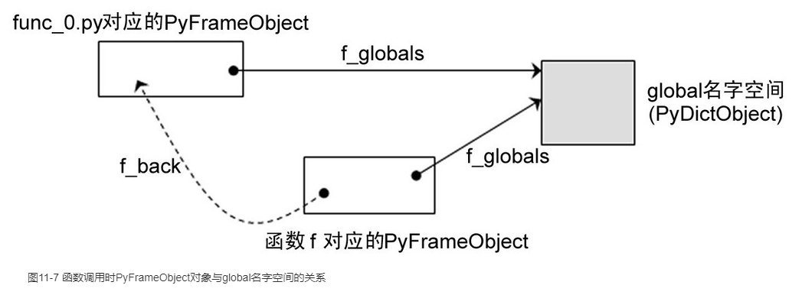

**globals 怎么把函数的名字放入到其中的？**

函数f的name会通过STORE_NAME字节码指令，将其绑定到其所在PyFrameObject 1的local作用域中, CALL_FUNCTION时又会将当前PyFrameObject的globals传递给新建的PyFrameObject 2的作为globals, 而函数定义时的func.py所在的PyFrameObject 1传递给了函数对应的PyFrameObject 1的locals 与 globals 指向的同一个dict对象，因此PyFrameObject 2中的f->globals 的dict中有了f的name。因而可以实现递归和交叉调用。

### 11.4 函数参数的实现 ###

#### 11.4.1 参数类别 ####

位置参数（positional argument）：f(a, b)、a和b被称为位置参数；
键参数（key argument）：f(a, b, name=’Python’)，其中的name=’Python’被称为键参数；
扩展位置参数（excess positional argument）：def f(a, b, *list)，其中的*list被称为扩展位置参数；
扩展键参数（excess key argument）：`def (a, b, **keys)`，其中的**key被称为扩展键参数。

`CALL_FUNCTION` 指令的参数记录的是函数参数的个数信息，包括位置参数的个数和键参数的个数。参数的长度是两个字节，前八位记录位置参数，后八位记录关键字参数。从call_function中我们可以看到na实际上就是位置参数的个数，而nk则是键参数的个数。

函数对应的PyCodeObject对象中维护的两个与参数有关的信息：co_argcount和co_nlocals。argcount 包含普通参数的个数（值传递&参数传递，不包含扩展传递），nlocals 包含函数内局地变量的个数（包括参数数量）。

**1. 位置参数和关键字参数**

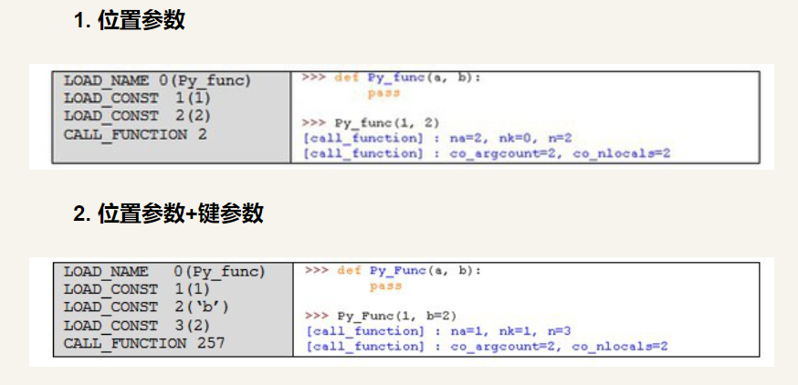

函数参数中一个参数是位置参数还是键参数实际上仅仅是由函数实参的形式所决定的，而与函数定义时的形参没有任何关系。**na**和**nk**确实忠实地反映着位置参数和键参数的个数。那么 **n** (n=na+2*nk) 的意义是什么呢?

在获取指向func的指针之前有条语句: `pfunc = (*pp_stack)-n-1 ,其中pp_stack是当前运行时栈的栈顶指针。所以pfunc就是栈顶指针回退(n+1)后的结果。Python虚拟机首先将PyFunctionObject对象压入到运行时栈，接着会将所有的与“参数有关的信息”也压入到运行时栈中，如果我们想成功地回退到运行时栈中PyFunctionObject的位置处，必须获得参数有关的信息的个数，这个个数正是n。(**应该是不同的参数传递对于同一个函数来说，会使编译产生不同的字节码指令**)

**2. 扩展位置参数+扩展关键字参数**

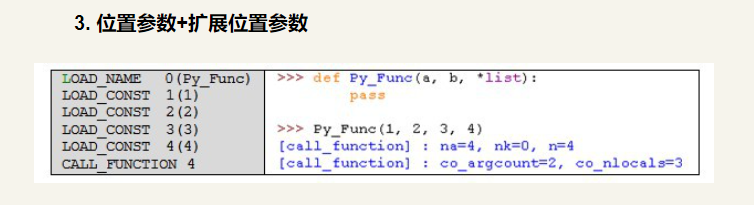


不论扩展位置参数还是扩展关键字参数，所有的扩展参数都会被当成局部变量来对待。

#### 11.4.2 位置参数的传递与访问 ####

在函数调用的时候会创建新的 PyFrameObject 对象，在这个过程中，对应函数的 PyCodeObject 被传递给了新的PyFrame. 随后, Python虚拟机将参数逐个拷贝到新建的PyFrameObject对象的f_localsplus中。那么实际上函数的参数都被放置到了 PyFrame 的 extra 区域了，也就是 f_stacktop 位置之前。那么我们通过什么指令来访问不属于栈帧中的对象呢？ `LOAD FAST`  原来，LOAD_FAST和STORE_FAST这一对指令是以f_localplus这片内存为操作目标的。指令`0 LOAD_FAST 1`的结果是将f_localsplus[1]中的对象压入到运行时栈中，

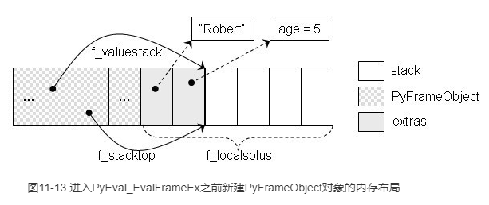

**两句话总结: 通过f_localplus传递，通过LOAD FAST 访问**

#### 11.4.4 位置参数的默认值 ####

在创建function object时，如果有默认参数需要处理，那么把默认参数放到 PyFunction的 f_defaults。

在判断是否使用了默认参数时，在进入PyEval_EvalCodeEx之前，将PyFunctionObject对象中的参数默认值信息提取了出来，并作为参数，传递给了PyEval_EvalCodeEx。

### 11.5 函数中局部变量的访问 ###

### 11.6 闭包 ###

#### 11.6.1 base of closure ####

闭包的创建通常是利用嵌套函数来完成的。在PyCodeObject中，与嵌套函数相关的属性是co_cellvars和co_freevars。两者的具体含义如下：

co_cellvars：通常是一个tuple，保存嵌套的作用域中使用的变量名集合；
co_freevars：通常也是一个tuple，保存使用了的外层作用域中的变量名集合。

在PyFrameObject对象中，也有一个属性与闭包的实现相关，这个属性就是f_localsplus，

`extras = code->co_stacksize + code->co_nlocals + ncells + nfrees;`

## 12. Python虚拟机中的类机制 ##

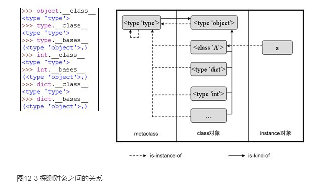

在Python中，任何一个对象都有一个type，可以通过对象的`__class__`属性获得。任何一个instance对象的type都是一个class对象，而任何一个class对象的type都是metaclass 对象。

### 12.2 从type对象到class对象 ###

`tp_dict`  ： PyTypeObject 对象中关于操作的集合

`_Py_ReadyTypes` 对class对象进行初始化。

#### 12.2.1 处理基类和type信息 ####

```c
[typeobject.c]
int PyType_Ready(PyTypeObject *type)
{
  PyObject *dict, *bases;
  PyTypeObject *base;
  Py_ssize_t i, n;

  //[1]: 尝试获得type的tp_base中指定基类(super type)
  base = type->tp_base;
  if (base == NULL && type != &PyBaseObject_Type) {
    base = type->tp_base = &PyBaseObject_Type;
  }

  //[2]: 如果基类没有初始化，先初始化基类
  if (base && base->tp_dict == NULL) {
    PyType_Ready(base)
  }

  //[3]: 设置type信息
  if (type->ob_type == NULL && base != NULL)
    type->ob_type = base->ob_type;
   ……
}
```

对于指定了tp_base的内置class对象，当然就使用指定的基类；而对于没有指定tp_base的内置class对象，Python将为其指定一个默认的基类：PyBaseObject_Type。我们正在考察的PyType_Type很倒霉，它没有指定基类，所以它的基类就成了`<type object>`。 

接着检查基类是否已经被初始化了，并对基类进行初始化。判断初始化的条件是tp_dict 是否为NULL。

随后设置了class对象的ob_type信息，实际上这个ob_type信息也就是对象的`__class__`将返回的信息。更进一步地说，这里设置的ob_type就是metaclass。

#### 12.2.2 处理基类列表 ####

对于我们现在考察的PyBaseObject_Type来说，其tp_bases为空，而其base也为NULL，所以它的基类列表就是一个空的tuple对象。这也符合在图12-1中显示的`object. __bases__`的结果。
而对于PyType_Type和其他类型，比如PyInt_Type来说，虽然tp_bases为空，但是base不为NULL，而是&PyBaseObject_Type，所以它们的基类列表不为空，都包含一个PyBaseObject_Type

对于object，它是所有类的基类所有他自己是没有基类的，其他的类都会有一个基类是 object。

#### 12.2.3 填充tp_dict ####

```c
[typeobject.c]
int PyType_Ready(PyTypeObject *type)
{
    PyObject *dict, *bases; 
    PyTypeObject *base;
    Py_ssize_t i, n;
    ……
    //设定tp_dict
    dict = type->tp_dict;
    if (dict == NULL) {
    dict = PyDict_New();
    type->tp_dict = dict;
    }

    //将与type相关的descriptor加入到tp_dict中
    add_operators(type);
    if (type->tp_methods != NULL) {
    add_methods(type, type->tp_methods);
    }
    if (type->tp_members != NULL) {
    add_members(type, type->tp_members);
    }
    if (type->tp_getset != NULL) {
    add_getset(type, type->tp_getset);
    }
}
```

**那么，Python虚拟机是如何知道 `__add__` 和 nb_add 的关联性的呢？**

这种关联是在Python源代码中预先就确定好了的，存放在一个名为slotdefs的全局数组中。

**slot与操作排序**

在Python内部，slot可以视为表示PyTypeObject中定义的操作，在一个操作对应一个slot

```c
[typeobject.c]
typedef struct wrapperbase slotdef;

[descrobject.h]
struct wrapperbase {
    char *name; 
    int offset;
    void *function;
    wrapperfunc wrapper;
    char *doc;
    int flags;
    PyObject *name_strobj;
};
```

name: 对应着操作的名字，比如 `__add__`

offset: 则是操作的函数地址在 PyHeapTypeObject 中的偏移量

function: 指向一种称为slot function的函数。

python提供了通过宏来定义slot的方式，比如 TPSLOT , ETSLOT：

```c
[typeobject.c]
#define TPSLOT(NAME, SLOT, FUNCTION, WRAPPER, DOC) \
     {NAME, offsetof(PyTypeObject, SLOT), (void *)(FUNCTION), WRAPPER, \
     PyDoc_STR(DOC)}
#define ETSLOT(NAME, SLOT, FUNCTION, WRAPPER, DOC) \
     {NAME, offsetof(PyHeapTypeObject, SLOT), (void *)(FUNCTION), WRAPPER, \
     PyDoc_STR(DOC)}

[structmember.h]
#define offsetof(type, member) ( (int) & ((type*)0) -> member )
```

**为什么要计算一个方法在PyTypeObject中的偏移量?**

python预先定义了一个slot集合 `slotdefs`

```c
[typeobject.c]
……
#define SQSLOT(NAME, SLOT, FUNCTION, WRAPPER, DOC) \
ETSLOT(NAME, as_sequence.SLOT, FUNCTION, WRAPPER, DOC)
……

static slotdef slotdefs[] = {
    ……
    //[不同操作名对应相同操作]
    BINSLOT("__add__", nb_add, slot_nb_add, "+"),
    RBINSLOT("__radd__", nb_add, slot_nb_add, "+"),
    //[相同操作名对应不同操作]
    SQSLOT("__getitem__", sq_item, slot_sq_item, wrap_sq_item, 
              "x.__getitem__(y) <==> x[y]"),
    MPSLOT("__getitem__", mp_subscript, slot_mp_subscript, wrap_binaryfunc,
              "x.__getitem__(y) <==> x[y]"),
    ……
}
```

对于相同操作名对应不同操作的情况，在填充tp_dict时，就会出现选取用哪一个方法的问题?

需要利用slot中的offset信息对slot（也就是对操作）进行排序。整个对slotdefs的排序在 init_slotdefs 中完成。

**从slot到descriptor**

在tp_dict中，与`__getitem__`关联在一起的，一定不会是一个slot。因为slot是一个结构体 并没有tp_call 这个东西。

Python虚拟机在tp_dict找到`__getitem__`对应的“操作”后，会调用该“操作”，所以在tp_dict中与`__getitem__`对应的只能是另一个包装了slot的PyObject，在Python中，这是一个我们称之为descriptor的东西。

与PyTypeObject中的操作对应的是PyWrapperDescrObject , 一个descriptor包含一个slot，其创建方式是通过 `PyDescr_NewWrapper` 函数完成的。

python内部的各种descriptor都将包含 `PyDescr_COMMON` 其中 d_type 被设置为 对应包装类的 type信息， 而d_wrapped 是真正的函数指针。而 slot 则被存放在 d_base 中，d_base 就是那个slot的结构体。

**建立联系**

是在 `add_operators` 中完成。(在 PyType_Ready 中)

先用 `init_slotdefs` 对操作排序，然后对 slotdefs数组中的每个slot，通过 slotptr 获得对应的操作在PyTypeObject 中的函数指针，创建descriptor，在 tp_dict 中建立从操作名 到操作的关联。在创建descriptor之前，Python虚拟机会检查在tp_dict中操作名是否已经存在，如果已经存在，则不会再次建立从操作名到操作的关联。

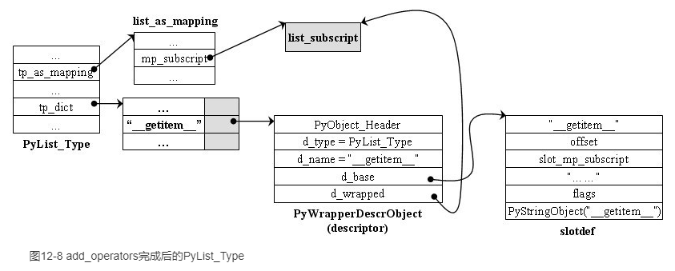

而且不仅仅只有 `add_operators` , 还会通过add_methods、add_members和add_getsets添加在PyTypeObject中定义的tp_methods、tp_members和tp_getset函数集。对应的 descriptor 是PyMethodDescrObject、PyMemberDescrObject、PyGetSetDescrObject。

观察如下类的定义：这里s打印了 Python。

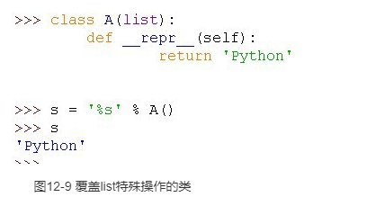

在slotdefs中，有一条slot为TPSLOT(`__repr__`, tp_repr, slot_tp_repr,……)，Python虚拟机在初始化A时，会检查 `<class A>` 的tp_dict中是否存在`__repr__`。

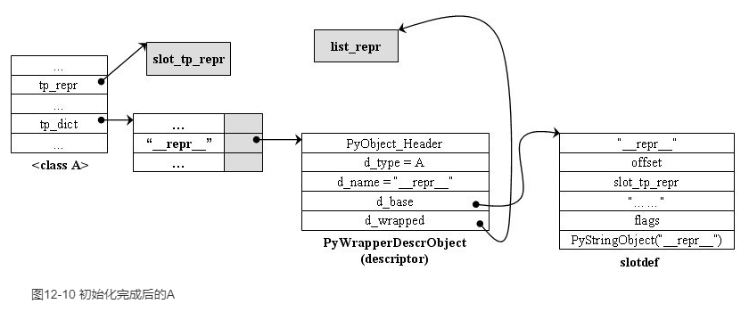

**继承基类操作**

Python虚拟机确定了mro列表之后，就会遍历mro列表，Python虚拟机会将class对象自身没有设置而基类中设置了的操作拷贝到class对象中，从而完成对基类操作的继承动作。

```c
// segment of PyType_Ready
bases = type->tp_mro;
assert(bases != NULL);
assert(PyTuple_Check(bases));
n = PyTuple_GET_SIZE(bases);
for (i = 1; i < n; i++) {
    PyObject *b = PyTuple_GET_ITEM(bases, i);
    if (PyType_Check(b))
        inherit_slots(type, (PyTypeObject *)b);
}
```

**填充基类中的子类列表**

设置基类中的子类列表。在每一个PyTypeObject中，有一个tp_subclasses，这个东西在PyType_Ready完成后将是一个list对象。在其中存放着所有直接继承自该类型的class对象。PyType_Ready通过调用add_subclass完成向这个tp_subclasses中填充子类对象的动作。

### 12.3 自定义class ###

python源文件和 class 以及class中的方法之间与 PyCodeObject 对应的关系。

#### 12.3.1 创建class对象 ####

首先先看看py文件中的常量表:

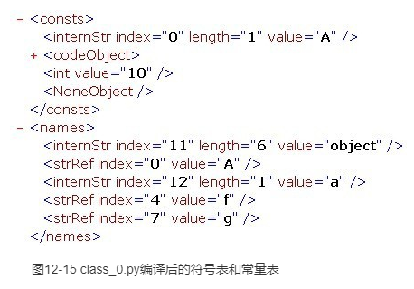

接下来再看一看 `class A(object)` 对应的字节码:

```assembly
[PyCodeObject for class_0.py]
class A(object):
0   LOAD_CONST    0 (A) # 入栈
3   LOAD_NAME     0 (object) # 从名字表中载入 object
6   BUILD_TUPLE   1  # 构建基类列表
9   LOAD_CONST    1 (code object for A) # 加载A的字节码
12  MAKE_FUNCTION   0  
15  CALL_FUNCTION   0
18  BUILD_CLASS
19  STORE_NAME    1 (A)
```

MAKE_FUNCTION 使用了 class A的字节码进行一些操作，返回了一个 function object 到栈中，那么这个时间栈里面包含了 "A" `<<tuple>>` `<<function object>>` ，对CALL_FUNCTION的执行最终将创建一个新的PyFrameObject对象，并开始执行这个PyFrameObject对象中所包含的字节码序列。那么A的字节码如下：

```assembly
[PyCodeObject for class A]
0   LOAD_NAME  0 (__name__)
3   STORE_NAME   1 (__module__)
name = 'Python'
6   LOAD_CONST   0 (‘Python’)
9   STORE_NAME   2 (name)
def __init__(self):
12   LOAD_CONST   1 (code object for function __init__)
15   MAKE_FUNCTION   0
18   STORE_NAME   3 (__init__)
def f(self):
21   LOAD_CONST   2 (code object for function f)
24   MAKE_FUNCTION   0
27   STORE_NAME   4 (f)
def g(self, aValue):
30   LOAD_CONST   3 (code object for function g)
33   MAKE_FUNCTION   0
36   STORE_NAME   5 (g)

39   LOAD_LOCALS   
40   RETURN_VALUE   
```

我们先看一看，与class A对应的PyCodeObject对象中的常量表和符号表：

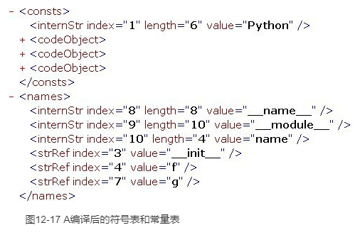

首先 LOAD_NAME STORE_NAME 将 `__module__` 和全局 `__name__` 的实际值 `__main__` 关联了起来，并放入到了 当前 PyFrame的f_locals中。

在所有的信息(动态元信息) 都加载完了之后，使用了 `LOAD_LOCALS` / `RETURN_VALUE` 将f_locals 压入了运行时栈中。所以从这里可以看出 class A(object) 在加载源码的时候，内部的变量都会被执行。

在有了 f_locals 即class A的动态元信息之后，开始执行 `BUILD_CLASS` 创建类的动作：

```c
[BUILD_CLASS]
    u = TOP();     //class的动态元信息f_locals
    v = SECOND(); //class的基类列表
    w = THIRD();  //class的名“A”
    STACKADJ(-2);
    x = build_class(u, v, w);
    SET_TOP(x);
    Py_DECREF(u);
    Py_DECREF(v);
    Py_DECREF(w);
```

使用 `STACKADJ` 将栈指针向上移到 类名 A 之前，然后 用 SET_TOP 为名字A赋予意义。

**build_class 的详细过程**

```c
[ceval.c]
PyObject * build_class(PyObject *methods, PyObject *bases, PyObject *name)
{
    PyObject *metaclass = NULL, *result, *base;

    //[1] ：检查属性表中是否有指定的__metaclass__
    if (PyDict_Check(methods))
        metaclass = PyDict_GetItemString(methods, "__metaclass__");
    if (metaclass != NULL)
        Py_INCREF(metaclass);
    else if (PyTuple_Check(bases) && PyTuple_GET_SIZE(bases) > 0) {
        //[2] ：获得A的第一基类，object
        base = PyTuple_GET_ITEM(bases, 0);
        //[3] ：获得object.__class__
        metaclass = PyObject_GetAttrString(base, "__class__"); 
    }
    else {
        ……
    }
    result = PyObject_CallFunctionObjArgs(metaclass, name, bases, methods, NULL);
    ……
    return result;
}

[object.h]
typedef PyObject * (*ternaryfunc)(PyObject *, PyObject *, PyObject *);

[abstract.c]
PyObject* PyObject_Call(PyObject *func, PyObject *arg, PyObject *kw)
{
    //arg即是PyObject_CallFunctionObjArgs中打包得到的tuple对象
    ternaryfunc call = func->ob_type->tp_call;
    PyObject *result = (*call)(func, arg, kw);
    return result;
}

[typeobject.c]
type_call(PyTypeObject *type, PyObject *args, PyObject *kwds)
{
    PyObject *obj;

    obj = type->tp_new(type, args, kwds);
    ……//如果创建的是实例对象，则调用“__init__”进行初始化
    return obj;
}
```

First, python虚拟机会检查在定义 class 时是否指定了 `__metaclass__` 。如果用户没有指定，那么Python虚拟机会选择class的第一基类的type作为该class的metaclass。获得了metaclass之后，build_class通过`PyObject_CallFunctionObjArgs`函数完成“调用metaclass”的动作，从而完成class对象的创建。现在我们观察该函数的参数：`metaclass, name, bases, methods`

随后，参数最终会进入 PyObject_Call 函数。那么这个函数的第一个 call 会指向 type.ob_type.tp_call。

在 type_call 中会使用type的 tp_new 真正的创建出一个 class对象。

**所以在我们重写metaclass时，有两个方法涉及到了 class的创建 `__call__` `__new__`, metaclass 有一个方法涉及到了 instance的创建: `__init__`**

```c
[typeobject.c]
static PyObject * type_new(PyTypeObject *metatype, PyObject *args, PyObject *kwds)
{
    //metatype是PyType_Type(<type 'type'>)，args中包含了（类名，基类列表，属性表）
       PyObject *name, *bases, *dict;
       static char *kwlist[] = {"name", "bases", "dict", 0};
       PyTypeObject *type, *base, *tmptype, *winner;
       PyHeapTypeObject *et;
       Py_ssize_t slotoffset;

    //将args中的（类名，基类列表，属性表）分别解析到name, bases, dict三个变量中
    PyArg_ParseTupleAndKeywords(args, kwds, "SO!O!:type", kwlist,
           &name,
           &PyTuple_Type, &bases,
           &PyDict_Type, &dict))

    ......//确定最佳metaclass，存储在PyObect *metatype中
    ......//确定最佳base，存储在PyObject *base中

    //为class对象申请内存
    //尽管PyType_Type为0，但PyBaseObject_Type的为PyType_GenericAlloc，
    //在PyType_Ready中被继承了
    //创建的内存大小为tp_basicsize + tp_itemsize
       type = (PyTypeObject *)metatype->tp_alloc(metatype, nslots);
       et = (PyHeapTypeObject *)type;
       et->ht_name = name;

    //设置PyTypeObject中的各个域
       type->tp_as_number = &et->as_number;
       type->tp_as_sequence = &et->as_sequence;
       type->tp_as_mapping = &et->as_mapping;
       type->tp_as_buffer = &et->as_buffer;
       type->tp_name = PyString_AS_STRING(name);

    //设置基类和基类列表
    type->tp_bases = bases;
    type->tp_base = base;

    //设置属性表
    type->tp_dict = dict = PyDict_Copy(dict);

    //如果自定义class中重写了__new__，将__new__对应的函数改造为static函数
    tmp = PyDict_GetItemString(dict, "__new__");
    tmp = PyStaticMethod_New(tmp);
    PyDict_SetItemString(dict, "__new__", tmp);

    //[1]：为class对象对应的instance对象设置内存大小信息
    slotoffset = base->basicsize
    type->tp_dictoffset = slotoffset;
    slotoffset += sizeof(PyObject *);
    type->tp_weaklistoffset = slotoffset;
    slotoffset += sizeof(PyObject *);
    type->tp_basicsize = slotoffset;
    type->tp_itemsize = base->tp_itemsize;
    ......

    //调用PyType_Ready(type)对class对象进行初始化
    PyType_Ready(type);
    return (PyObject *)type;
}
```

由于`type.__bases__`中的第一基类是 <type ‘object’>，所以 <type ‘type’>会继承 <type ‘object’>的tp_alloc操作，即PyType_ GenericAlloc。对于我们的A（或者说，对于任何继承自object的class对象来说）PyType_GenericAlloc最终将申请`metatype->tp_basicsize + metatype->tp_itemsize`大小的内存空间。从PyType_Type的定义中我们可以看到，这个大小实际上就是`sizeof（PyHeapTypeObject）+sizeof（PyMemberDef）`，原来PyHeapTypeObject是为用户自定义的class对象准备的。

### 12.4 从class对象到instance对象 ###

在class_0.py中，创建instance的动作如下

```assembly
[PyCodeObject for class_0.py]
a = A()
22   LOAD_NAME    1 (A) 
25   CALL_FUNCTION   0
28   STORE_NAME   2 (a)
```

在CALL_FUNCTION中，Python同样会沿着call_function->do_call->PyObject_ Call的调用路径进入到PyObject_Call中。前面说过，所谓“调用”，就是执行对象的type所对应的class对象的tp_call操作。

所以，在PyObject_Call，Python执行引擎会寻找class对象`<class A>`的type中定义的tp_call操作。`<class A>`的type为<type ‘type’>，所以最终将调用tp_call，在PyType_Type.tp_call中又调用了A.tp_new是用来创建instance对象的。由于 PyType_Ready的原因，A.tp_new实际上也就是object.tp_new，在PyBaseObject_Type中，这个操作被定义为`object_ new`。

在申请内存的过程中 (tp_alloc) , 这个操作也是从object继承而来的，是`PyType_GenericAlloc`。最终将申请`A.tp_basicsize + A.tp_itemsize`大小的内存空间。

在申请了24字节的内存空间，回到type_call之后，由于创建的不是class对象，而是instance对象，type_call会尝试进行初始化的动作。

```c
[typeobject.c]
static PyObject * type_call(PyTypeObject *type, PyObject *args, PyObject
  *kwds) 
{
    PyObject *obj;
    obj = type->tp_new(type, args, kwds);
    type = obj->ob_type;
    type->tp_init(obj, args, kwds);
    return obj;
}
```

### 12.5 访问instance对象中的属性 ###

```c
[PyCodeObject for class_0.py]
a.f()
31   LOAD_NAME   2 (a)
34   LOAD_ATTR   3 (f)
37   CALL_FUNCTION   0
40   POP_TOP 

case LOAD_ATTR:
    w = GETITEM(names, oparg);
    v = TOP();
    x = PyObject_GetAttr(v, w);
    Py_DECREF(v);
    SET_TOP(x);
    if (x != NULL) continue;
    break;
```

Python虚拟机通过指令`31 LOAD_NAME 1`，会将local名字空间中符号“a”对应的instance对象压入到运行时栈中。

`LOAD ATTR 2` 从 a 中获取对应的符号 f 。

```c
[object.c]
PyObject* PyObject_GetAttr(PyObject *v, PyObject *name)
{
    PyTypeObject *tp = v->ob_type;
    //[1]：通过tp_getattro获得属性对应对象
    if (tp->tp_getattro != NULL)
        return (*tp->tp_getattro)(v, name);

    //[2]：通过tp_getattr获得属性对应对象
    if (tp->tp_getattr != NULL)
        return (*tp->tp_getattr)(v, PyString_AS_STRING(name));
    //[3]：属性不存在，抛出异常
    PyErr_Format(PyExc_AttributeError,"'%.50s' object has no attribute
             '%.400s'",tp->tp_name, PyString_AS_STRING(name));
    return NULL;
}
```

有两个相关的操作： `tp_getattro` `tp_getattr` 。在python虚拟机创建 classA 时，会从 PyBaseObjectType 中继承 `tp_getattro`  PyObject_GenericGetAttr。在PyObject_GenericGetAttr中，有一套复杂地确定访问的属性的算法 ：

```console
#首先寻找'f'对应的descriptor (descriptor在之后会细致剖析)
#注意：hasattr会在<class A>的mro列表中寻找符号'f'
if hasattr(A, 'f'):
    descriptor = A.f 

type = descriptor.__class__
if hasattr(type, '__get__') and (hasattr(type, '__set__') or 'f' not in
  a.__dict__):
    return type.__get__(descriptor, a, A)

#通过descriptor访问失败，在instance对象自身__dict__中寻找属性
if ‘f’ in a.__dict__:
    return a.__dict__['f']

#instance对象的__dict__中找不到属性，返回a的基类列表中某个基类里定义的函数
#注意：这里的descriptor实际上指向了一个普通函数
if descriptor:
    return descriptor.__get__(descriptor, a, A)
```

**instance 对象中的 `__dict__`**

tp_dictoffset 这个就是instance对象中`__dict__`的偏移位置。

**descriptor**

如果一个class对象中存在 `__get__` `__set__` 和 `__delete__` 三种操作，它们对应的class对象中分别为`tp_descr_get`设置了`wrapperdescr_get`、`method_get`等函数，那么obj就可以称为 descriptor，而且属性描述法可以分为两种:

- data descriptor : type中定义了`__get__`和`__set__`的descriptor；
- non data descriptor : type中只定义了`__get__`的descriptor。

Python虚拟机按照instance属性、class属性的顺序选择属性，即instance属性优先于class属性
如果在class属性中发现同名的data descriptor，那么该descriptor会优先于instance属性被Python虚拟机选择。
如果待访问的属性是一个descriptor，若它存在于class对象的tp_dict中，会调用其`__get__`方法；若它存在于instance对象的tp_dict中，则不会调用其`__get__`方法。

`tp_descr_get` 在 `__get__` 之前被访问。

#### 12.5.3 函数变身 PyMethodObject ####

实际上在 `a.f()` 这样的语句中，使用的是属性描述符。

PyFunction_Type: 观察PyFunctino_Type，我们会发现与`__get__`对应的`tp_descr_get`被设置成了`&func_descr_get`。 由于PyFunction_Type中并没有设置tp_ descr_set，所以A.f是一个non data descriptor。此外，由于在`a.__dict__`中没有符号“f”存在，所以根据伪代码中的算法，a.f的返回值将被descriptor改变，其结果将是`A.f.__get__` 。

```c
[funcobject.c]
/* Bind a function to an object */
static PyObject* func_descr_get(PyObject *func, PyObject *obj, PyObject *type)
{
    if (obj == Py_None)
        obj = NULL;
    return PyMethod_New(func, obj, type);
}

[classobject.h]
typedef struct {
    PyObject_HEAD
    PyObject *im_func;   //可调用的PyFunctionObject对象
    PyObject *im_self;   //用于成员函数调用的self参数，instance对象(a)
    PyObject *im_class;  //class对象(A)
    PyObject *im_weakreflist; 
} PyMethodObject;
```

**Bound Method / Unbound Method**

在实例中如果方法需要多次调用的话，可以考虑将方法先暂存。

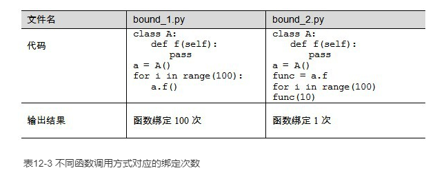

当我们调用instance对象的函数时，最关键的一个动作就是从PyFunctionObject对象向PyMethodObject对象的转变，而这个关键的转变被Python中的descriptor概念很自然地融入到Python的类机制中。

## 13. Python运行时环境初始化 ##

### 13.1 线程环境初始化 ###

真正有意义的初始化动作是从`Py_Initialize`开始的。在Py_ Initialize中，仅有一个函数被调用，即函数`Py_InitializeEx`。仅列出两个关键的数据结果以及对Python运行模型的图示：

```c
[pystate.h]
typedef struct _is {
    struct _is *next;
    struct _ts *tstate_head; //模拟进程环境中的线程集合

    PyObject *modules;
    PyObject *sysdict;
    PyObject *builtins;
    ……
} PyInterpreterState;

typedef struct _ts {
    struct _ts *next;
    PyInterpreterState *interp;
    struct _frame *frame; //模拟线程中的函数调用堆栈
    int recursion_depth;
    ……
    PyObject *dict;
    ……
    long thread_id;
} PyThreadState;
```

展示了Python虚拟机运行期间某个时刻整个的运行环境：

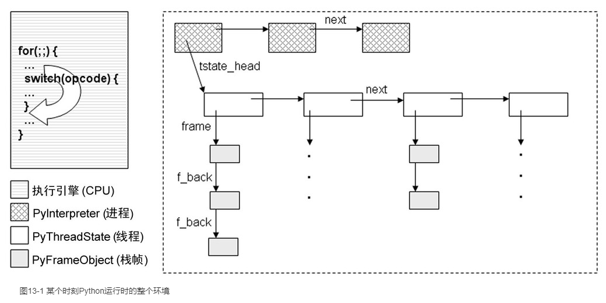

#### 13.1.2 初始化线程环境 ####

在Py_InitializeEx的开始处，Python会首先调用PyInterpreterState_New创建一个崭新的PyInterpreterState对象。

```c
// [pystate.c]
static PyInterpreterState *interp_head = NULL;

PyInterpreterState* PyInterpreterState_New(void)
{
    PyInterpreterState *interp = malloc(sizeof(PyInterpreterState));
    if (interp != NULL) {
        HEAD_INIT();
        interp->modules = NULL;
        interp->sysdict = NULL;
        interp->builtins = NULL;
        interp->tstate_head = NULL;
        interp->codec_search_path = NULL;
        interp->codec_search_cache = NULL;
        interp->codec_error_registry = NULL;
        HEAD_LOCK();
        interp->next = interp_head;
        interp_head = interp;
        HEAD_UNLOCK();
    }

    return interp;
}
```

在python的运行时环境中，有一个全局的管理PyInterpreterState对象链表的东西：`interp_head`。在创建了 PyInterpreterState 之后，Python会立即再接再厉，调用PyThreadState_New创建一个全新的PyThreadState

```c
// [pystate.c]
PyThreadState* PyThreadState_New(PyInterpreterState *interp)
{
    PyThreadState *tstate = (PyThreadState *)malloc(sizeof(PyThreadState));
    //[1]：设置获得线程中函数调用栈的操作
    if (_PyThreadState_GetFrame == NULL)
        _PyThreadState_GetFrame = threadstate_getframe;

    if (tstate != NULL) {
    //[2]：在PyThreadState对象中关联PyInterpreterState对象
        tstate->interp = interp;
        tstate->frame = NULL;
        tstate->thread_id = PyThread_get_thread_ident();
        ……
        HEAD_LOCK();
        tstate->next = interp->tstate_head;
        //[3]：在PyInterpreterState对象中关联PyThreadState对象
        interp->tstate_head = tstate;
        HEAD_UNLOCK();
    }
    return tstate;
}
```

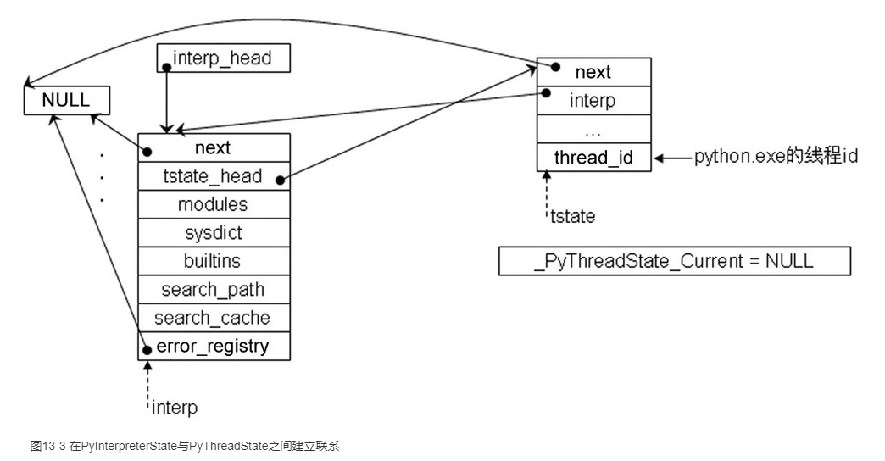

在Python的运行时环境中，有一个全局变量_PyThreadState_Current，这个变量维护着当前活动的线程，更准确地说是当前活动线程对应的PyThreadState对象，在创建了Python启动后的第一个PyThreadState对象之后，会以该PyThreadState对象调用PyThreadState_Swap函数来设置这个全局变量：

```c
// [pystate.c]
PyThreadState* PyThreadState_Swap(PyThreadState *new)
{
    PyThreadState *old = _PyThreadState_Current;
    _PyThreadState_Current = new;
    return old;
}
```

在进程状态和线程状态初始化之后，会初始化系统的内置类型。接下来的动作是调用 `_PyFrame_Init` 来设置全局变量 builtion_object：

```c
// [frameobject.c]
static PyObject *builtin_object;

int _PyFrame_Init()
{
    builtin_object = PyString_InternFromString("__builtins__");
    return (builtin_object != NULL);
}
```

### 13.2 系统module初始化 ###

#### 13.2.1 创建 `__builtin__ module` ####

在调用`_PyBuiltin_Init`之前，Python最终会将interp->modules创建为一个PyDictObject对象，这个对象将维护系统所有的module.

`_PyBuiltin_Init` 主要的动作是：创建并设置 `__builtin__` module 然后将python内置类型加入到 该module中。

`Py_InitModule4` 完成了创建module的动作：

```c
// [modsupport.c]
PyObject* Py_InitModule4(const char *name, PyMethodDef *methods, char *doc,
           PyObject *passthrough, int module_api_version)
{
    PyObject *m, *d, *v, *n;
    PyMethodDef *ml;
    ……
    //[2]: 创建module对象
    if ((m = PyImport_AddModule(name)) == NULL)
        return NULL;
    
	//[3]：设置module中的（符号，值）对应关系
    d = PyModule_GetDict(m);
    if (methods != NULL) {
        n = PyString_FromString(name);
        //遍历methods指定的module对象中应包含的操作集合
        for (ml = methods; ml->ml_name != NULL; ml++) {
            if ((ml->ml_flags & METH_CLASS) || (ml->ml_flags & METH_STATIC)) {
                PyErr_SetString(PyExc_ValueError,
                        "module functions cannot set"
                        " METH_CLASS or METH_STATIC");
                return NULL;
            }
            v = PyCFunction_NewEx(ml, passthrough, n);
            PyDict_SetItemString(d, ml->ml_name, v)
        }
    }
    if (doc != NULL) {
        v = PyString_FromString(doc);
        PyDict_SetItemString(d, "__doc__", v);
    }
    return m;
}
```

在这里列出函数参数的意思：

name: module 的name

methods: 该module中所包含的函数的集合

doc: module的文档

passthrough: NULL

module_api_version: Python内部使用的version值，用于比较

**创建module对象**

使用 `PyImport_AddModule` 创建了 module对象本身

```c
// [import.c]
PyObject *
PyImport_AddModule(char *name)
{
    //[1]：获得Python维护的module集合
    PyObject *modules = PyImport_GetModuleDict();
    PyObject *m;

    //[2]：若module集合中没有名为name的module对象，则创建之；否则，直接返回module对象
    if ((m = PyDict_GetItemString(modules, name)) != NULL &&
        PyModule_Check(m))
        return m;
    m = PyModule_New(name);

    //[3]：将新创建的module对象放入Python的全局module集合中
    PyDict_SetItemString(modules, name, m);
    return m;
}
```

Python内部维护了一个存放所有加载到内存中的module的集合，在这个集合中，存放着所有的（module名，module对象）这样的对应关系，这个集合其实就是我们在之前看到的Py_InitializeEx中出现的interp->modules，这个集合可以在 `sys.modules` 查看。所以modules的概念是进程级别的。

在这里，自然可以想到 module 也是python中的对象:

```c
// [moduleobject.c]
typedef struct {
    PyObject_HEAD
    PyObject *md_dict;
} PyModuleObject;
```

**设置module对象**

会对 builtin 几乎所有的属性进行设置，来源于 builtin_methods 数组。对于builtin_methods中的每一个PyMethodDef结构，Py_InitModule4都会基于它创建一个PyCFunctionObjet对象。

在_PyBuiltin_Init之后，Python将把PyModuleObject对象中维护的那个PyDictObject对象抽取出来，将其赋给interp->builtins。

#### 13.2.2 创建 sys module ####

```c
[pythonrun.c]
void Py_InitializeEx(int install_sigs)
{
    //[1]：创建sys module
    sysmod = _PySys_Init();
    interp->sysdict = PyModule_GetDict(sysmod);

    //[2]：备份sys module
    _PyImport_FixupExtension("sys", "sys");
}
```

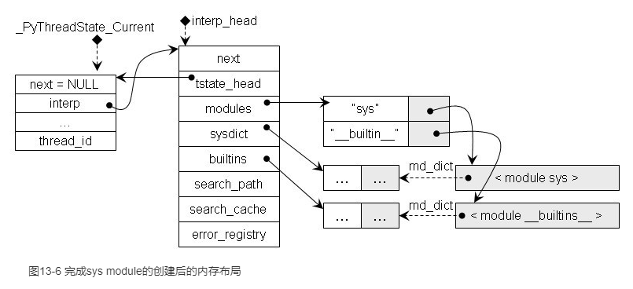

可以总结 进程状态中的 modules 指向的是 name - module 的dict ，而 sysdict 和 builtins 指向的是dict，这个dict来源于 pymoduleobject的md_dict。

**设置module的搜索路径**

Python在创建了sys module之后，会在此module中设置Python搜索一个module时的默认搜索路径集合。

`PySys_SetPath(Py_GetPath());`

实际上就是把 path -- path_list 放到的sysdict中。对应于 sys.path

#### 13.2.3 创建 `__main__` module ####

在`_PyImportHooks_Init()`之后，Python将创建一个非常特殊的module：一个名为`__main__`的module 。使用了 initmain 创建了一个 `__main__` Module.

```c
[pythonrun.c]
static void initmain(void)
{
    PyObject *m, *d;
    //[1]：创建__main__ module，并将其插入interp->modules中
    m = PyImport_AddModule("__main__");
    //[2]：获得__main__ module中的dict
    d = PyModule_GetDict(m);
    if (PyDict_GetItemString(d, "__builtins__") == NULL) {
           //[3]：获得interp->modules中的__builtin__ module
           PyObject *bimod = PyImport_ImportModule("__builtin__");
           //[4]：将(“__builtins__”, __builtin__ module)插入到__main__ module的dict中
           PyDict_SetItemString(d, "__builtins__", bimod);
    }
}
```

所有的module都会有 `__name__` 这种东西。

#### 13.2.4 设置 site module ####

相关的标准库: `site.py`

在python虚拟机内有一个 initsite() 函数。调用了 `PyImport_ImportModule("site");`

在site.py中，Python进行了两个动作。

- 将site-pakcages路径加入到sys.path中
- 处理site-packages目录下的所有.pth文件中的所有路径加入到sys.path中。

### 13.3 激活python虚拟机 ###

Python有两种运行的方式，一种是在命令行下的交互式环境；另一种则是以python abc.py的方式运行脚本文件。

Python在Py_Initialize成功完成之后，最终将调用PyRun_AnyFileExFlags：

```c
// [main.c]
int Py_Main(int argc, char **argv)
{
    Py_Initialize();
    PyRun_AnyFileExFlags(
        fp,
        filename == NULL ? "<stdin>" : filename,
        filename != NULL, &cf);
}

int PyRun_AnyFileExFlags(FILE *fp, const char *filename, int closeit,
  PyCompilerFlags *flags)
{
    //根据fp是否代表交互环境，对程序流程进行分流
    if (Py_FdIsInteractive(fp, filename)) {
        int err = PyRun_InteractiveLoopFlags(fp, filename, flags);
        if (closeit)
            fclose(fp);
        return err;
    }
    else
        return PyRun_SimpleFileExFlags(fp, filename, closeit, flags);
}
```

#### 13.3.1 交互式运行方式 ####

```c
[pythonrun.c]
int PyRun_InteractiveLoopFlags(FILE *fp, const char *filename, PyCompilerFlags *flags)
{
    PyObject *v;
    int ret;
    //[1]：创建交互式环境提示符“>>> ”
    v = PySys_GetObject("ps1");
    if (v == NULL) {
        PySys_SetObject("ps1", v = PyString_FromString(">>> "));
    }
    //[2]：创建交互式环境提示符“... ”
    v = PySys_GetObject("ps2");
    if (v == NULL) {
        PySys_SetObject("ps2", v = PyString_FromString("... "));
    }
    //[3]：进入交互式环境
    for (;;) {
        ret = PyRun_InteractiveOneFlags(fp, filename, flags);
        if (ret == E_EOF)
            return 0;
    }
}

int PyRun_InteractiveOneFlags(FILE *fp, char *filename, PyCompilerFlags *flags)
{
    PyObject *m, *d, *v, *w;
    mod_ty mod;
    PyArena *arena;
    char *ps1 = "", *ps2 = "";

    v = PySys_GetObject("ps1");
    if (v != NULL) {
        ps1 = PyString_AsString(v);
    }
    w = PySys_GetObject("ps2");
    if (w != NULL) {
        ps2 = PyString_AsString(w);
    }
    //[4]：编译用户在交互式环境下输入的Python语句
    arena = PyArena_New();
    mod = PyParser_ASTFromFile(fp, filename,
           Py_single_input, ps1, ps2,
           flags, &errcode, arena);
    
    //获得<module __main__>中维护的dict
    m = PyImport_AddModule("__main__");
    d = PyModule_GetDict(m);
    //[5]：执行用户输入的Python语句
    v = run_mod(mod, filename, d, d, flags, arena);
    PyArena_Free(arena);
    return 0;
}
```

PyParser_ASTFromFile: 对输入的语句编译，获取AST抽象语法树。

#### 13.3.2 脚本文件运行方式 ####

```c
[python.h]
#define Py_file_input 257

[pythonrun.c]
int PyRun_SimpleFileExFlags(FILE *fp, const char *filename, int closeit,
            PyCompilerFlags *flags)
{
    PyObject *m, *d, *v;
    const char *ext;
    //[1]：在__main__ module中设置“__file__”属性
    m = PyImport_AddModule("__main__");
    d = PyModule_GetDict(m);
    if (PyDict_GetItemString(d, "__file__") == NULL) {
        PyObject *f = PyString_FromString(filename);
        PyDict_SetItemString(d, "__file__", f);
    }
    //[2]：执行脚本文件
    v = PyRun_FileExFlags(fp, filename, Py_file_input, d, d, closeit, flags);
}

PyObject *
PyRun_FileExFlags(FILE *fp, const char *filename, int start, PyObject *globals,PyObject *locals, int closeit, PyCompilerFlags *flags)
{
    PyObject *ret;
    mod_ty mod;
    PyArena *arena = PyArena_New();
    //编译
    mod = PyParser_ASTFromFile(fp, filename, start, 0, 0, flags, NULL, arena);
    if (closeit)
    fclose(fp);
    //执行
    ret = run_mod(mod, filename, globals, locals, flags, arena);
    PyArena_Free(arena);
    return ret;
}
```

所有可以看出最终都是通过：run_mode 来运行。

#### 13.3.3 启动虚拟机 ####

首先创建 PyCodeObject 对象。接着通过 `PyEval_EvalCode` 唤醒字节码。

所以dir()实际显示的就是对应local名字空间的dict的键的集合。

## 14. Python模块的动态加载机制 ##

#### 14.1 import ####

先来观察一下 import sys 的字节码:

```assembly
0  LOAD_CONST   0 (-1)
3  LOAD_CONST   1 (None)
6  IMPORT_NAME    0 (sys)
9  STORE_NAME   0 (sys)
```

import的结果最终将导致Python虚拟机通过指令`9 STORE_NAME 0`将sys module存储在当前PyFrameObject的local名字空间中。当在import之后使用sys module，比如执行“print sys.path”时，Python虚拟机就能很轻松地找到“sys”这个符号了。

接下来展示 `IMPORT_NAME` 的实现:

```c
// [IMPORT_NAME]
      w = GETITEM(names, oparg);  // str "sys"
      x = PyDict_GetItemString(f->f_builtins, "__import__");
      v = POP();  // None
      u = TOP();  // -1
      //[1]：将Python的import动作需要使用的信息打包到tuple中
      if (PyInt_AsLong(u) != -1 || PyErr_Occurred()) {
        w = PyTuple_Pack(5,
              w,
              f->f_globals,
              f->f_locals == NULL ? Py_None : f->f_locals,
              v,
              u);
            } else {
        w = PyTuple_Pack(4,
              w,
              f->f_globals,
              f->f_locals == NULL ? Py_None : f->f_locals,
              v);
            }
      x = PyEval_CallObject(x, w);
      SET_TOP(x);
```

然后通过 PyEval_CallObject --> PyObject_Call --> PyCFuntion_Call

```c
// [methodobject.c]
PyObject* PyCFunction_Call(PyObject *func, PyObject *arg, PyObject *kw)
{
    PyCFunctionObject* f = (PyCFunctionObject*)func;
    PyCFunction meth = PyCFunction_GET_FUNCTION(func);
    PyObject *self = PyCFunction_GET_SELF(func);
    int size;

    switch (PyCFunction_GET_FLAGS(func) & ~(METH_CLASS | METH_STATIC |
    METH_COEXIST)) {
    case METH_VARARGS:
        if (kw == NULL || PyDict_Size(kw) == 0)
            return (*meth)(self, arg);
        break;
    case METH_VARARGS | METH_KEYWORDS:
    case METH_OLDARGS | METH_KEYWORDS:
        //[1]：函数调用
        return (*(PyCFunctionWithKeywords)meth)(self, arg, kw);
    }
    PyErr_Format(PyExc_TypeError, "%.200s() takes no keyword arguments",
             f->m_ml->ml_name);
    return NULL;
}
```

meth: 真正的函数指针 指向 `builtin__import__`

### 14.2 Python中 import 机制的黑盒探测 ###

#### 14.2.1 标准import ####

**python内建module**

这些预先被加载进内存的module存放在sys.modules中。

**用户自定义module**

Python对自定义module进行import操作的结果不仅将自定义 module引入到了当前的local名字空间中，而且这个被动态加载的module也在sys.modules中拥有了一席容身之地。

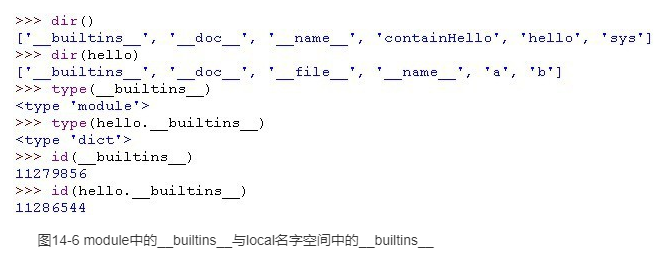

从图中可以看出 local 名字空间的 `__builtin__` 是一个module ，而 hello module的 `__builtin__` 是一个dict对象。但是实际上不同的module里面不同的 `__builtin__` 的md_dict 是同一个东西。

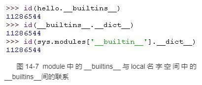

#### 14.2.2 嵌套import ####

实际上，所有的import动作，不论是发生在什么时间、发生在什么地方，都会影响到全局module集合，这样做有一个好处，即如果程序的另一点再次import这个module，Python虚拟机只需要将全局module集合中缓存的那个module对象返回即可。

#### 14.2.3 import package ####

package是众多的module的集合。package 也可以是 package的集合。

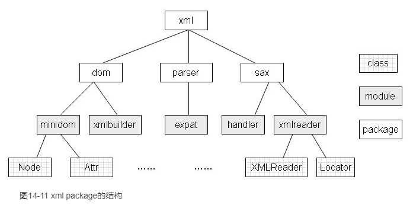

`import A.tank ` 这种机制，限制了 tank的搜索范围，在 搜索 tank时，仅仅只会在 A module 的 `__path__` 中查找是否有tank模块，值得一提， `import A.test` 其中 test 和 tank的名字空间都是在 A 之内的。

#### 14.2.4 from & import ####

通过from关键字与import的结合，我们可以只将我们期望的module，甚至是module中的某个符号，动态加载到内存中。

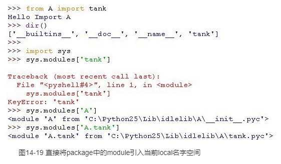

在import A.tank中，Python虚拟机引入了符号“A”，并将其映射到module A；而在from A import tank中，Python虚拟机则引入了符号“tank”，并将其映射到了module A.tank。

#### 14.2.5 as机制 ####

#### 14.2.6 符号的销毁与重载 ####

### 14.3 import 机制实现 ###

最终通过 `import_module_level` 函数

#### 14.3.1 解析module / package 树状结构 ####

Python中的import动作都是发生在某一个package的环境中。

## 15. Python 多线程机制 ##

### 15.1 GIL与线程调度 ###

GIL: Global Interpreter Lock :也就是说，在一个线程拥有了解释器的访问权之后，其他的所有线程都必须等待它释放解释器的访问权，即使这些线程的下一条指令并不会互相影响。

对于线程调度机制而言，同操作系统的进程调度一样，最关键的是要解决两个问题：
在何时挂起当前线程，选择处于等待状态的下一个线程？
在众多的处于等待状态的候选线程中，选择激活哪一个线程？

python通过模拟的始终中断进行线程调度。`sys.getcheckinterval()` 执行这么多条字节码之后进行线程切换。Python借用了底层操作系统所提供的线程调度机制来决定下一个进入Python解释器的线程究竟是谁。

### 15.2 Python Thread ###

在 threadmodule.c 中提供的多线程API:

```c
// [threadmodule.c]
static PyMethodDef thread_methods[] = {
    {"start_new_thread", (PyCFunction)thread_PyThread_start_new_thread,…},
    {"start_new",   (PyCFunction)thread_PyThread_start_new_thread, …},
    {"allocate_lock",   (PyCFunction)thread_PyThread_allocate_lock, …},
    {"allocate",  (PyCFunction)thread_PyThread_allocate_lock, …},
    {"exit_thread",   (PyCFunction)thread_PyThread_exit_thread, …},
    {"exit",          (PyCFunction)thread_PyThread_exit_thread, …},
    {"interrupt_main", (PyCFunction)thread_PyThread_interrupt_main,…},
    {"get_ident",       (PyCFunction)thread_get_ident, …},
    {"stack_size",      (PyCFunction)thread_stack_size, …},
    {NULL,          NULL}       /* sentinel */
};
```

### 15.3 线程的创建 ###

```c
// [threadmodule.c]
static PyObject* thread_PyThread_start_new_thread(PyObject *self, PyObject *fargs)
{
    PyObject *func, *args, *keyw = NULL;
    struct bootstate *boot;
    long ident;

    PyArg_UnpackTuple(fargs, "start_new_thread", 2, 3, &func, &args,
      &keyw);
    //[1]：创建bootstate结构
    boot = PyMem_NEW(struct bootstate, 1);
    boot->interp = PyThreadState_GET()->interp;
    boot->func = func;
    boot->args = args;
    boot->keyw = keyw;
    //[2]：初始化多线程环境
    PyEval_InitThreads(); /* Start the interpreter's thread-awareness */
    //[3]：创建线程
    ident = PyThread_start_new_thread(t_bootstrap, (void*) boot);
    return PyInt_FromLong(ident);
}
```

Python虚拟机通过三个主要的动作，完成一个线程的创建。

1. 创建并初始化bootstate结构boot，在boot中，将保存关于线程的一切信息
2. 初始化python的多线程环境
3. 以boot为参数，创建操作系统的原生线程

在通常情况下，python虚拟机启动时，多线程机制并没有被激活，只有在明确调用了 thread.start_new_thread 时，python才会开启多线程机制。

#### 15.3.1 建立多线程环境 ####

实际上 GIL 是一个 void * 指针。

```c
// [pythread.h]
typedef void *PyThread_type_lock;

// [ceval.c]
static PyThread_type_lock interpreter_lock = 0; /* This is the GIL */
static long main_thread = 0;

void PyEval_InitThreads(void)
{
    if (interpreter_lock)
        return;
    interpreter_lock = PyThread_allocate_lock();
    PyThread_acquire_lock(interpreter_lock, 1);
    main_thread = PyThread_get_thread_ident();
}

// [thread_nt.h]
// 在 win32 中, GIL 是这个结构体
typedef struct NRMUTEX {
	LONG   owned ;
	DWORD  thread_id ;
	HANDLE hevent ;  // win32 中的event内核对象 WaitForSingleObject
} NRMUTEX, *PNRMUTEX ;
```

在PyEval_InitThreads通过PyThread_allocate_lock成功地创建了GIL之后，当前线程就开始遵循Python的多线程机制的规则：在调用任何Python C API之前，必须首先获得GIL。因此PyEval_InitThreads紧接着通过PyThread_acquire_lock尝试获得GIL。

PyThread_acquire_lock有两种工作方式，通过函数参数waitflag来区分。这个waitflag指示当GIL当前不可获得时，是否进行等待，更直接地说，就是当前线程是否通过WaitForSingleObject将自身挂起，直到别的线程释放GIL，然后由操作系统将自己唤醒。

如果waitflag为0，Python会检查当前GIL是否可用，GIL中的`owned`是指示GIL是否可用的变量，我们看到这个值被初始化为-1，Python会检查这个值是否为-1，如果是，则意味着GIL可用，必须将其置为0，当owned为0后，表示该GIL已经被一个线程占用，不再可用。

检查和更新owned的操作是通过一个Win32的系统API `InterlockedCompareExchange(PLONG dest, long exchange, long compared)` 来完成的。还有一个win32 API ：`InterlockedIncrement` 其功能是将owned的值加1 ，最终，一个线程在释放GIL时，会通过SetEvent通知所有在等待GIL的hevent这个Event内核对象的线程。

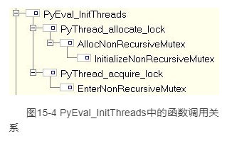

#### 15.3.2 创建线程 ####

**创建子线程**

`PyEval_InitThreads()` 初始化了多线程环境，并且创建了一个主线程。

主线程通过调用 `PyThread_start_new_thread` 创建子线程。这个方法需要两个参数 第一个参数是一个方法指针： `t_bootstrap` 第二个参数是一个 bootstate 结果体 (线程定义的结构体)

```c
// [thread_nt.h]
long PyThread_start_new_thread(void (*func)(void *), void *arg)
{
    unsigned long rv;
    callobj obj;

    obj.id = -1;    /* guilty until proved innocent */
    obj.func = func;
    obj.arg = arg;
    obj.done = CreateSemaphore(NULL, 0, 1, NULL);

    rv = _beginthread(bootstrap, _pythread_stacksize, &obj); /* use default stack size */
    if (rv == (unsigned long)-1) {
        //创建raw thread失败
        obj.id = -1;
    }
    else {
        WaitForSingleObject(obj.done, INFINITE);
    }
    CloseHandle((HANDLE)obj.done);
    return obj.id;
}

typedef struct {
    void (*func)(void*);
    void *arg;
    long id;
    HANDLE done;
} callobj;
```

查看变量 callobj 是个结构体，其中成员 done 是win32的Semaphore内核对象。完成打包之后，调用Win32下创建thread的API：`_beginthread`来完成线程的创建。

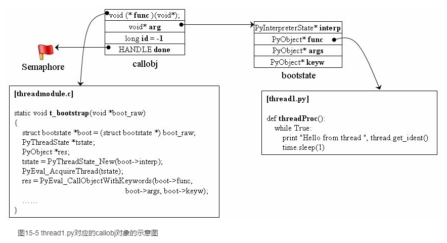

继续向前执行，_beginthread 将最终成功地创建win32下的原生线程，并返回。在返回之后，主线程开始将自己挂起，等待obj.done (callobj)。

Python当前实际上由两个Win32下的原生thread构成，一个是执行python程序（python.exe）时操作系统创建的主线程，另一个是我们通过thread.start_new_thread创建的子线程。

主线程在执行PyEval_InitThread的过程中，获得了GIL，但是目前已经被挂起，这是为了等待子线程中控制着的
obj.done。
子线程为了访问Python解释器，必须首先获得GIL。所以，为了避免死锁，子线程一定会在申请GIL之前通知obj.done。

```c
// [thread_nt.h]
static int
bootstrap(void *call)
{
    callobj *obj = (callobj*)call;
    /* copy callobj since other thread might free it before we're done */
    //这里将得到函数t_bootstrap
    void (*func)(void*) = obj->func;
    void *arg = obj->arg;

    obj->id = PyThread_get_thread_ident();
    ReleaseSemaphore(obj->done, 1, NULL);
    func(arg);
    return 0;
}
```

现在，是时候开始进入子线程，也就是那个bootstrap函数,在 bootstrap 函数中，子线程完成了以下动作：

1. 获得线程id
2. 通知 obj.done 内核对象
3. 调用 t_bootsratp

那么，Python为什么需要让主线程等待子线程的通知呢? 主线程所调用的PyThread_start_new_thread需要返回所创建的子线程的线程id，然而子线程的线程id只有在子线程被激活后才能在子线程中获取。在此之后，主线程获得了GIL 继续执行字节码，而子线程将等待 GIL。

**线程状态保护机制**

首先有个 PyThreadState 对象保存着线程id和当前PyFrameObject 等信息。

同时，在Python内部，维护着一个全局变量： PyThreadState * _PyThreadState_Current 保存当前活动的线程状态对象。

### 15.4 python线程的调度 ###

**标准调度**

通过变量 `__Py_Tikcer`  来跟踪字节码执行数量，如果执行数量到达spec，那么将 _PyThreadState_Current 设置为NULL，然后释放GIL，释放了之后其他的线程已经开始执行了，这里有会再次申请 GIL，但是这里GIL已经被其他的线程获取了，所以会等待下一次被调度。

**阻塞调度**

与阻塞调度相关的有两个 宏: Py_BEGIN_ALLOW_THREADS Py_END_ALLOW_THREADS

### 15.5 子线程的销毁 ###

```c
// [threadmodule.c]
static void t_bootstrap(void *boot_raw)
{
    struct bootstate *boot = (struct bootstate *) boot_raw;
    PyThreadState *tstate;
    PyObject *res;

    tstate = PyThreadState_New(boot->interp);
    PyEval_AcquireThread(tstate);
    res = PyEval_CallObjectWithKeywords(boot->func, boot->args, boot->keyw);
    PyMem_DEL(boot_raw);
    PyThreadState_Clear(tstate);
    PyThreadState_DeleteCurrent();
    PyThread_exit_thread();
}
```

PyThreadState_Clear: 对线程状态中维护的东西进行引用计数的维护。

PyThreadState_DeleteCurrent：释放GIL，删除当前线程的线程状态对象。

### 15.6 线程用户级互斥与同步 ###

用户级别的同步访问通过 lock 实现

#### 15.6.2 lock对象 ####

python级别lock的所有方法：

```c
// [threadmodule.c]
static PyMethodDef lock_methods[] = {
    {"acquire_lock",  (PyCFunction)lock_PyThread_acquire_lock, … }
    {"acquire",       (PyCFunction)lock_PyThread_acquire_lock, … }
    {"release_lock",  (PyCFunction)lock_PyThread_release_lock, … }
    {"release",       (PyCFunction)lock_PyThread_release_lock, … }
    {"locked_lock",   (PyCFunction)lock_locked_lock, … }
    {"locked",        (PyCFunction)lock_locked_lock, … }
    {NULL,           NULL}      /* sentinel */
};

```

获取一个锁的call stack: thread.allocate() --> thread_PyThread_allocate_lock() --> newlockobject(void)

```c
static lockobject* newlockobject(void)
{
    lockobject *self;
    self = PyObject_New(lockobject, &Locktype);
    self->lock_lock = PyThread_allocate_lock();
    return self;
}

typedef struct {
    PyObject_HEAD
    PyThread_type_lock lock_lock;
} lockobject;
```

如上，在lock结构体中有个 void * 指针，所以这个 lock_lock 和 GIL 在 win32 API下是同一种Event对象。一个Python线程在内核级需要访问Python解释器之前，需要先申请GIL；同样地，线程在用户级需要访问共享资源之前也需要先申请用户级的lock，这个申请动作在lock.acquire中完成，其对应的C函数为`lock_PyThread_acquire_lock`。

```c
[threadmodule.c]
static PyObject *
lock_PyThread_acquire_lock(lockobject *self, PyObject *args)
{
    //i中保存用户传入的参数，表示是否在lock资源不可用时将自身挂起
    //进行等待
    int i = 1;
    PyArg_ParseTuple(args, "|i:acquire", &i);

    Py_BEGIN_ALLOW_THREADS
    i = PyThread_acquire_lock(self->lock_lock, i);
    Py_END_ALLOW_THREADS
}
```

由于线程需要等待另一个lock资源，为了避免死锁，需要将GIL转交给其他的等待GIL的Python线程，调用lock.acquire的线程使用了我们之前提到的Py_BEGIN_ ALLOW_THREADS来释放GIL，唤醒其他线程，然后调用PyThread_acquire_lock开始尝试申请用户级lock。在获得了用户级lock之后，通过Py_BEGIN_ALLOW_THREADS再次获得内核级lock——GIL。

### 15.7 threading 模块 ###

```python
# Active thread administration
_active_limbo_lock = _allocate_lock()
_active = {}    # maps thread id to Thread object
_limbo = {}
```

在threading中，有一套记录当前所有通过继承`threading.Thread`而创建的Python线程的机制。这个机制通过两个dict和一个lock完成。

有两个阶段，第一阶段是调用threading.Thread.start，而第二阶段是在threading.Thread.start中调用threading.Thread.run。当处于第一阶段时，还没有调用thread.start_new_thread创建原生子线程，这时候线程记录在_limbo中。由于没有创建子线程，所以现在没有线程id，记录的方式为_limbo[thread] = thread。

在第二阶段，已经成功地调用thread. start_new_thread创建了原生子线程，这时将从_limbo中删除子线程，而将子线程记录到_active中，记录的方式为_active[thread_id] = thread。

#### 15.7.2 Threading 线程同步工具 ####

**RLock**

RLock对象允许一个线程多次对其进行acquire操作，因为在其内部通过一个counter变量维护着线程acquire的次数。而且每一次的acquire操作必须有一个release操作与之对应，在所有的release操作都完成之后，别的线程才能申请该RLock对象。

**Condition**


