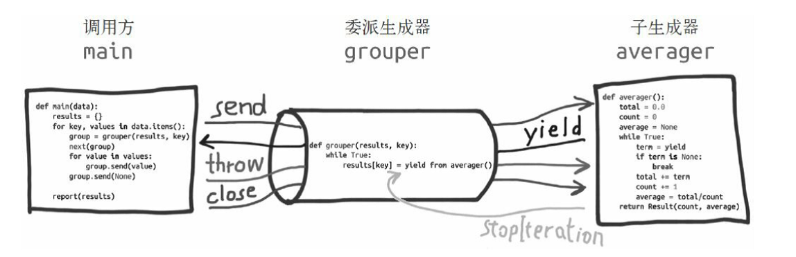

在PEP 380 使用了一些yield from使用的专门术语：

委派生成器：包含 yield from <iterable> 表达式的生成器函数；即上面的wrap_my_generator生成器函数

子生成器：从 yield from 表达式中 <iterable> 部分获取的生成器；即上面的my_generator生成器函数

调用方：调用委派生成器的客户端代码；即上面的main生成器函数

