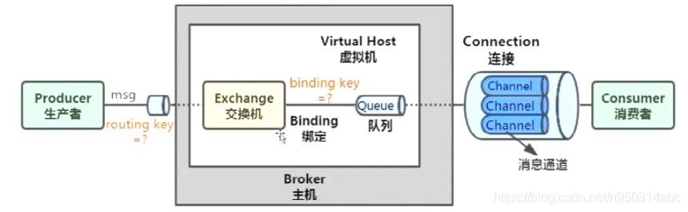
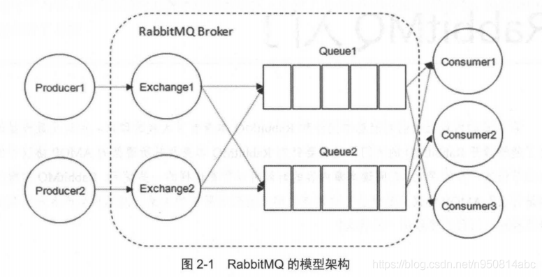

# Use Celery #


> rabbitmq 架构





## First Steps with Celery ##

- Choosing and installing a message transport (broker).
- Installing Celery and creating your first task.
- Starting the worker and calling tasks.
- Keeping track of tasks as they transition through different states, and inspecting return values.

### Choose a Broker ###

- RabbitMQ
- Redis
- Other brokers

### Application ###

```python
from celery import Celery

app = Celery('tasks', broker='pyamqp://guest@localhost//')


@app.task
def add(x, y):
    return x + y
```

第一个参数：name of the current module.

第二个参数 broker: 指定要使用的消息代理的URL

**how to run celery**

```console
$ celery -A tasks worker --loglevel=INFO
```

**how to get help**

```console
$ celery worker --help
$ celery --help
```

### Calling the task ###

To call our task you can use the [`delay()`](https://docs.celeryproject.org/en/latest/reference/celery.app.task.html#celery.app.task.Task.delay) method.

This is a handy shortcut to the [`apply_async()`](https://docs.celeryproject.org/en/latest/reference/celery.app.task.html#celery.app.task.Task.apply_async) method that gives greater control of the task execution (see [Calling Tasks](https://docs.celeryproject.org/en/latest/userguide/calling.html#guide-calling)):

```python
>>> from tasks import add
>>> 
>>> add.delay(4,4)
<AsyncResult: 5ebd82d3-25df-47c1-8ef8-e5483e7fdbb2>
>>> 
```

调用一个任务将返回一个 [`AsyncResult`](https://docs.celeryproject.org/en/latest/reference/celery.result.html#celery.result.AsyncResult) 实例。这可以用来检查任务的状态，等待任务完成，或者获取它的返回值(或者如果任务失败，获取异常和回溯)。

### Keeping Results ###

choose a backend like: Django ORM, MongoDB, Memcached, Redis, RPC(RabbitMQ/AMQP)

```python
app = Celery('tasks', backend='rpc://', broker='pyamqp://')
```

```python
>>> from tasks import add
>>> 
>>> result = add.delay(4,5)
>>> result.ready()
True
>>> result.get(timeout=1)
9
```

The [`ready()`](https://docs.celeryproject.org/en/latest/reference/celery.result.html#celery.result.AsyncResult.ready) method returns whether the task has finished processing or not.

In case the task raised an exception, [`get()`](https://docs.celeryproject.org/en/latest/reference/celery.result.html#celery.result.AsyncResult.get) will re-raise the exception, but you can override this by specifying the `propagate` argument.

### Configuration ###

As an example you can configure the default serializer used for serializing task payloads by changing the [`task_serializer`](https://docs.celeryproject.org/en/latest/userguide/configuration.html#std-setting-task_serializer) setting:

```python
app.conf.task_serializer = 'json'
```

Also, we can use this way to define a app:

```python
app.config_from_object('celeryconfig')
```

For a complete reference of configuration options, see [Configuration and defaults](https://docs.celeryproject.org/en/latest/userguide/configuration.html#configuration).

为了演示配置文件的威力，下面是你如何将一个行为不正常的任务路由到一个专用队列:

```python
# celeryconfig.py

task_routes = {
    'tasks.add': 'low-priority',
}

task_annotations = {
    'tasks.add': {'rate_limit': '10/m'}
}
```

If you’re using RabbitMQ or Redis as the broker then you can also direct the workers to set a new rate limit for the task at runtime:

```python
$ celery -A tasks control rate_limit tasks.add 10/m
worker@example.com: OK
    new rate limit set successfully
```

## Next Steps ##

### Should use modularization  ###

Project layout:

```console
proj/__init__.py
    /celery.py
    /tasks.py
```

```python
# celery.py

from celery import Celery

app = Celery('proj',
             broker='amqp://',
             backend='rpc://',
             include=['proj.tasks'])

# Optional configuration, see the application user guide.
app.conf.update(
    result_expires=3600,
)

if __name__ == '__main__':
    app.start()
```

When the worker starts you should see a banner and some messages:

```console
celery -A part2 worker --loglevel=INFO
(venv) liberty@local1:~/PycharmProjects/start_celery/code$ celery -A part2 worker --loglevel=INFO
 
 -------------- celery@local1 v5.1.2 (sun-harmonics)
--- ***** ----- 
-- ******* ---- Linux-5.8.0-53-generic-x86_64-with-glibc2.29 2021-06-29 22:13:33
- *** --- * --- 
- ** ---------- [config]
- ** ---------- .> app:         part2:0x7f8a9fc277c0
- ** ---------- .> transport:   amqp://guest:**@localhost:5672//
- ** ---------- .> results:     redis://localhost/
- *** --- * --- .> concurrency: 6 (prefork)
-- ******* ---- .> task events: OFF (enable -E to monitor tasks in this worker)
--- ***** ----- 
 -------------- [queues]
                .> celery           exchange=celery(direct) key=celery
                

[tasks]
  . part2.tasks.add
  . part2.tasks.mul
  . part2.tasks.xsum


```

- Event: 一个选项，使Celery发送监视消息(事件)，以监视工作者中发生的操作。
- Queues: worker将从中使用任务的队列列表。可以告诉工作者同时从多个队列中消费，这用于将消息路由到特定的工作者，作为服务质量、关注点分离和优先级划分的手段，所有这些都在Routing Guide中描述了。

### Background ###

In production you’ll want to run the worker in the background, described in detail in the [daemonization tutorial](https://docs.celeryproject.org/en/latest/userguide/daemonizing.html#daemonizing).

The daemonization scripts uses the **celery multi** command to start one or more workers in the background:

```console
$ celery multi start w1 -A proj -l INFO
celery multi v4.0.0 (latentcall)
> Starting nodes...
    > w1.halcyon.local: OK

$ celery  multi restart w1 -A proj -l INFO
celery multi v4.0.0 (latentcall)
> Stopping nodes...
    > w1.halcyon.local: TERM -> 64024
> Waiting for 1 node.....
    > w1.halcyon.local: OK
> Restarting node w1.halcyon.local: OK
celery multi v4.0.0 (latentcall)
> Stopping nodes...
    > w1.halcyon.local: TERM -> 64052

$ celery multi stop w1 -A proj -l INFO
```

默认情况下，它将在当前目录中创建pid和日志文件。为了防止多个worker在一个之上启动，你应该把它们放在一个专用目录中:

```python
$ mkdir -p /var/run/celery
$ mkdir -p /var/log/celery
$ celery multi start w1 -A proj -l INFO --pidfile=/var/run/celery/%n.pid \
                                        --logfile=/var/log/celery/%n%I.log
```

### celery命令的参数-A (--app) ###

定义使用的Celery app: `module.path:attribute`

或者使用这种形式：`--app=proj`

1. an attribute named `proj.app`, or
2. an attribute named `proj.celery`, or
3. any attribute in the module `proj` where the value is a Celery application, or

If none of these are found it’ll try a submodule named `proj.celery`:

1. an attribute named `proj.celery.app`, or
2. an attribute named `proj.celery.celery`, or
3. Any attribute in the module `proj.celery` where the value is a Celery application.

### calling tasks ###

可以使用delay():

```python
>>> from proj.tasks import add

>>> add.delay(2, 2)
```

这个方法实际上是另一个名为apply_async()的方法的星型参数快捷方式:

`>>> add.apply_async((2, 2))`

后者允许您指定执行选项，如运行时间(倒计时)，它应该发送到的队列，等等:

```python
>>> add.apply_async((2, 2), queue='lopri', countdown=10)
```

在上面的示例中，任务将被发送到一个名为lopri的队列，并且任务最早将在消息发送10秒后执行。

直接应用该任务将执行当前进程中的任务，因此不会发送任何消息:

```python
>>> add(2, 2)
4
```

These three methods - `delay()`, `apply_async()`, and applying (`__call__`), make up the Celery calling API, which is also used for signatures.

A more detailed overview of the Calling API can be found in the [Calling User Guide](https://docs.celeryproject.org/en/latest/userguide/calling.html#guide-calling).

每个任务调用都将得到一个惟一的标识符(UUID)——这就是任务id。

```python
>>> res = add.delay(2, 2)
>>> res.get(timeout=1)
4

>>> res.id
d6b3aea2-fb9b-4ebc-8da4-848818db9114
```

那么它如何知道任务是否失败了呢?它可以通过查看任务状态来发现:

```python
>>> res.state
'FAILURE'
```

### Canvas: Designing workflow ###

You just learned how to call a task using the tasks `delay` method, and this is often all you need. But sometimes you may want to pass the signature of a task invocation to another process or as an argument to another function, for which Celery uses something called *signatures*.

A signature wraps the arguments and execution options of a single task invocation in such a way that it can be passed to functions or even serialized and sent across the wire.

```python
>>> from part2.tasks import add
>>> 
>>> add.signature((2,5), countdown=10)
part2.tasks.add(2, 5)
>>> add.s(2,2)
part2.tasks.add(2, 2)
>>> s = add.s(2,4)
>>> res = s.delay()
>>> res.get()
6
```

**signature 可以使用 Primitives**

group
chain
chord
map
starmap
chunks

#### Group ####

A [`group`](https://docs.celeryproject.org/en/latest/reference/celery.html#celery.group) calls a list of tasks in parallel, and it returns a special result instance that lets you inspect the results as a group, and retrieve the return values in order.

```python
>>> from part2.tasks import add
>>> from celery import group
>>> 
>>> group(add.s(i, i) for i in range(10))().get()
[0, 2, 4, 6, 8, 10, 12, 14, 16, 18]

```

#### Chains ####

Tasks can be linked together so that after one task returns the other is called:

```python
>>> from celery import chain
>>> from part2.tasks import add, mul
>>> chain(add.s(4, 4) | mul.s(8))().get()
64

```

### Routing ###

支持AMQP提供的所有路由工具，但它也支持简单路由，将消息发送到指定队列。

The [`task_routes`](https://docs.celeryproject.org/en/latest/userguide/configuration.html#std-setting-task_routes) setting enables you to route tasks by name and keep everything centralized in one location:

```python
app.conf.update(
    task_routes = {
        'proj.tasks.add': {'queue': 'hipri'},
    },
)
```

### Remote Control ###

- celery inspect
- celery control
- celery status

## User Guide ##

### Application ###

celery必须在使用前实例化，这个实例称为应用程序(或简称app)。

该应用程序是线程安全的，因此具有不同配置、组件和任务的多个Celery应用程序可以在同一个进程空间中共存。

#### Main Name ####

其中只有一个是重要的，那就是主模块名。让我们看看为什么会这样。

在Celery中发送任务消息时，该消息不会包含任何源代码，而只包含要执行的任务的名称。这类似于主机名在互联网上的工作方式:每个工作者维护一个任务名到其实际功能的映射，称为任务注册表。

```python
In [2]: from celery import Celery

In [3]: app = Celery()

In [4]: app
Out[4]: <Celery __main__ at 0x7f7a77ddc1f0>

In [5]: @app.task
   ...: def add(x, y):
   ...:     return x + y
   ...: 

In [6]: add
Out[6]: <@task: __main__.add of __main__ at 0x7f7a77ddc1f0>
```

当你定义一个任务时，这个任务也会被添加到本地注册表中:

```python
In [9]: app.tasks
Out[9]: 
{'__main__.add': <@task: __main__.add of __main__ at 0x7f7a77ddc1f0>,
 'celery.chain': <@task: celery.chain of __main__ at 0x7f7a77ddc1f0>,
 'celery.backend_cleanup': <@task: celery.backend_cleanup of __main__ at 0x7f7a77ddc1f0>,
 'celery.starmap': <@task: celery.starmap of __main__ at 0x7f7a77ddc1f0>,
 'celery.chord': <@task: celery.chord of __main__ at 0x7f7a77ddc1f0>,
 'celery.accumulate': <@task: celery.accumulate of __main__ at 0x7f7a77ddc1f0>,
 'celery.chunks': <@task: celery.chunks of __main__ at 0x7f7a77ddc1f0>,
 'celery.chord_unlock': <@task: celery.chord_unlock of __main__ at 0x7f7a77ddc1f0>,
 'celery.group': <@task: celery.group of __main__ at 0x7f7a77ddc1f0>,
 'celery.map': <@task: celery.map of __main__ at 0x7f7a77ddc1f0>}

In [10]: type(app.tasks)
Out[10]: celery.app.registry.TaskRegistry

In [11]: type(add)
Out[11]: celery.local.PromiseProxy

In [12]: app.tasks['__main__.add']
Out[12]: <@task: __main__.add of __main__ at 0x7f7a77ddc1f0>

```

每当celery不能检测到函数属于哪个模块时，它就使用main module来生成任务名的开头。

1. If the module that the task is defined in is run as a program.
1. If the application is created in the Python shell (REPL).

#### Configuration ####

```python
In [14]: type(app.conf)
Out[14]: celery.app.utils.Settings

```

两种方式来更新app的配置：

```python
>>> app.conf.enable_utc = True

>>> app.conf.update(
...     enable_utc=True,
...     timezone='Europe/London',
...)
```

配置对象由多个字典组成，这些字典按顺序被查询:

1. changes made at run-time
2. The configuration module (if any)
3. The default configuration ([`celery.app.defaults`](https://docs.celeryproject.org/en/latest/reference/celery.app.defaults.html#module-celery.app.defaults)).

你甚至可以使用app.add_defaults()方法添加新的默认源。

**config_from_object**

The [`app.config_from_object()`](https://docs.celeryproject.org/en/latest/reference/celery.html#celery.Celery.config_from_object) method loads configuration from a configuration object.

这可以是一个配置模块，或者任何具有配置属性的对象。

请注意，在调用config_from_object()时，之前设置的任何配置都将被重置。如果您想要设置额外的配置，您应该在这之后这样做。

list the examples below:

```python
# 1. The app.config_from_object() method can take the fully qualified name of a Python module, or even the name of a Python attribute, for example: "celeryconfig", "myproj.config.celery", or "myproj.config:CeleryConfig":
from celery import Celery
app = Celery()
app.config_from_object('celeryconfig')

# 2. pass an already imported module object
import celeryconfig
from celery import Celery
app = Celery()
app.config_from_object(celeryconfig)

# 3. Using a configuration class/object
from celery import Celery
app = Celery()
class Config:
    enable_utc = True
    timezone = 'Europe/London'
app.config_from_object(Config)

# 4. from env variables
import os
from celery import Celery
os.environ.setdefault('CELERY_CONFIG_MODULE', 'celeryconfig')
app = Celery()
app.config_from_envvar('CELERY_CONFIG_MODULE')
```

**Censored configuration**

如果您希望打印配置，作为调试信息或类似信息，您可能还希望过滤掉密码和API密钥等敏感信息。

以字符的形式输出：`app.conf.humanize(with_defaults=False, censored=True)`

以字典的形式输出：`app.conf.table(with_defaults=False, censored=True)`

#### Laziness ####

应用程序实例是惰性的，这意味着它在实际需要时才会被执行。

Creating a [`Celery`](https://docs.celeryproject.org/en/latest/reference/celery.html#celery.Celery) instance will only do the following:

- Create a logical clock instance, used for events.
- Create the task registry.
- Set itself as the current app (but not if the `set_as_current` argument was disabled)
- Call the [`app.on_init()`](https://docs.celeryproject.org/en/latest/reference/celery.html#celery.Celery.on_init) callback (does nothing by default).

The [`app.task()`](https://docs.celeryproject.org/en/latest/reference/celery.html#celery.Celery.task) decorators don’t create the tasks at the point when the task is defined, instead it’ll defer the creation of the task to happen either when the task is used, or after the application has been *finalized*,

```python
In [1]: from celery import Celery

In [2]: app = Celery()

In [3]: @app.task
   ...: def add(x, y):
   ...:     return x + y
   ...: 

In [4]: type(add)
Out[4]: celery.local.PromiseProxy

In [5]: add.__evaluated__()
Out[5]: True

```

*Finalization* of the app happens either explicitly by calling [`app.finalize()`](https://docs.celeryproject.org/en/latest/reference/celery.html#celery.Celery.finalize)  or implicitly by accessing the `app.tasks` attribute.

Finalizing the object will:

- Copy tasks that must be shared between apps
- Evaluate all pending task decorators.
- Make sure all tasks are bound to the current app.

#### Breaking the chain ####

虽然它可能依赖于当前正在设置的应用程序，但最佳实践是始终将应用程序实例传递给任何需要它的东西。

我称之为“应用程序链”，因为它根据被传递的应用程序创建了一个实例链。

```python
# The following example is considered bad practice:
from celery import current_app

class Scheduler:

    def run(self):
        app = current_app
        
# Instead it should take the app as an argument:
class Scheduler:

    def __init__(self, app):
        self.app = app
```

Internally Celery uses the [`celery.app.app_or_default()`](https://docs.celeryproject.org/en/latest/reference/celery.app.html#celery.app.app_or_default) function so that everything also works in the module-based compatibility API

```python
from celery.app import app_or_default

class Scheduler:
    def __init__(self, app=None):
        self.app = app_or_default(app)
```

#### Abstract Tasks ####

All tasks created using the [`task()`](https://docs.celeryproject.org/en/latest/reference/celery.html#celery.Celery.task) decorator will inherit from the application’s base [`Task`](https://docs.celeryproject.org/en/latest/reference/celery.app.task.html#celery.app.task.Task) class.

You can specify a different base class using the `base` argument:

```python
@app.task(base=OtherTask):
def add(x, y):
    return x + y
```

To create a custom task class you should inherit from the neutral base class: `celery.Task`

```python
from celery import Task

class DebugTask(Task):

    def __call__(self, *args, **kwargs):
        print('TASK STARTING: {0.name}[{0.request.id}]'.format(self))
        return self.run(*args, **kwargs)
```

It’s even possible to change the default base class for an application by changing its [`app.Task()`](https://docs.celeryproject.org/en/latest/reference/celery.app.task.html#celery.app.task.Task) attribute:

```python
>>> from celery import Celery, Task

>>> app = Celery()

>>> class MyBaseTask(Task):
...    queue = 'hipri'

>>> app.Task = MyBaseTask
>>> app.Task
<unbound MyBaseTask>

>>> @app.task
... def add(x, y):
...     return x + y

>>> add
<@task: __main__.add>

>>> add.__class__.mro()
[<class add of <Celery __main__:0x1012b4410>>,
 <unbound MyBaseTask>,
 <unbound Task>,
 <type 'object'>]
```

### Tasks ###

Tasks are the building blocks of Celery applications.

任务是一个可以从任何可调用对象中创建的类。它执行双重角色，因为它既定义了任务被调用时发生的事情(发送消息)，又定义了工作器接收到该消息时发生的事情。

直到任务消息被worker确认后，任务消息才会从队列中删除。

理想情况下，任务函数应该是幂等的:这意味着即使使用相同的参数多次调用该函数也不会造成意外的影响。由于worker不能检测任务是否幂等，默认行为是在执行之前提前确认消息，这样已经启动的任务调用就不会再次执行。

If your task is idempotent you can set the [`acks_late`](https://docs.celeryproject.org/en/latest/userguide/tasks.html#Task.acks_late) option to have the worker acknowledge the message *after* the task returns instead. 

See also the FAQ entry [Should I use retry or acks_late?](https://docs.celeryproject.org/en/latest/faq.html#faq-acks-late-vs-retry).

Note that the worker will acknowledge the message if the child process executing the task is terminated (either by the task calling [`sys.exit()`](https://docs.python.org/dev/library/sys.html#sys.exit), or by signal) even when [`acks_late`](https://docs.celeryproject.org/en/latest/userguide/tasks.html#Task.acks_late) is enabled.

If you really want a task to be redelivered in these scenarios you should consider enabling the [`task_reject_on_worker_lost`](https://docs.celeryproject.org/en/latest/userguide/configuration.html#std-setting-task_reject_on_worker_lost) setting.

#### Basics ####

You can easily create a task from any callable by using the [`task()`](https://docs.celeryproject.org/en/latest/reference/celery.html#celery.Celery.task) decorator:

```python
from .models import User

@app.task
def create_user(username, password):
    User.objects.create(username=username, password=password)
```

There are also many [options](https://docs.celeryproject.org/en/latest/userguide/tasks.html#task-options) that can be set for the task, these can be specified as arguments to the decorator:

```python
@app.task(serializer='json')
def create_user(username, password):
    User.objects.create(username=username, password=password)
```

#### Bound tasks ####

A task being bound means the first argument to the task will always be the task instance (`self`), just like Python bound methods:

```python
logger = get_task_logger(__name__)

@app.task(bind=True)
def add(self, x, y):
    logger.info(self.request.id)
```

#### Task inheritance ####

The `base` argument to the task decorator specifies the base class of the task:

```python
import celery

class MyTask(celery.Task):

    def on_failure(self, exc, task_id, args, kwargs, einfo):
        print('{0!r} failed: {1!r}'.format(task_id, exc))

@app.task(base=MyTask)
def add(x, y):
    raise KeyError()
```

#### Names ####

Every task must have a unique name.

```python
>>> @app.task(name='sum-of-two-numbers')
>>> def add(x, y):
...     return x + y

>>> add.name
'sum-of-two-numbers'
```

##### Automatic naming and relative imports #####

相对导入和自动名称生成不能很好地结合在一起，因此如果您使用相对导入，您应该明确设置名称。

使用默认的自动命名，每个任务都会有一个生成的名称，如moduleA.tasks.taskA、moduleA.tasks.taskB、moduleB.tasks.test等。你可能想摆脱其的任务，所有任务名称。如上所述，您可以明确地为所有任务命名，或者您可以通过覆盖 [`app.gen_task_name()`](https://docs.celeryproject.org/en/latest/reference/celery.html#celery.Celery.gen_task_name). 继续这个例子，celery.py 可能包含：

```python
from celery import Celery

class MyCelery(Celery):

    def gen_task_name(self, name, module):
        if module.endswith('.tasks'):
            module = module[:-6]
        return super().gen_task_name(name, module)

app = MyCelery('main')
```

#### Task Request ####

[`app.Task.request`](https://docs.celeryproject.org/en/latest/reference/celery.app.task.html#celery.app.task.Task.request) contains information and state related to the currently executing task.

- **id**: unique id of the executing task
- **group**: The unique id of the task’s [group](https://docs.celeryproject.org/en/latest/userguide/canvas.html#canvas-group), if this task is a member.
- **chord**: The unique id of the chord this task belongs to (if the task is part of the header).
- **correlation_id**: Custom ID used for things like de-duplication
- **args**
- **kwargs**
- **origin**: Name of host that sent this task.
- **retries**: How many times the current task has been retried. An integer starting at 0.
- **is_eager**: The original ETA of the task (if any). This is in UTC time (depending on the [`enable_utc`](https://docs.celeryproject.org/en/latest/userguide/configuration.html#std-setting-enable_utc) setting).
- **expires**: The original expiry time of the task (if any). This is in UTC time (depending on the [`enable_utc`](https://docs.celeryproject.org/en/latest/userguide/configuration.html#std-setting-enable_utc) setting).
- **hostname**: Node name of the worker instance executing the task.
- **dilevery_info**: Additional message delivery information. This is a mapping containing the exchange and routing key used to deliver this task.Availability of keys in this dict depends on the message broker used.
- **reply-to**: Name of queue to send replies back to (used with RPC result backend for example).
- **called_directly**: This flag is set to true if the task wasn’t executed by the worker.
- **timelimit**: A tuple of the current `(soft, hard)` time limits active for this task (if any).
- **callbacks**: 
- **errback**
- **utc**
- **headers**
- **root_id**
- **parent_id**
- **chain**

An example task accessing information in the context is:

```python
@app.task(bind=True)
def dump_context(self, x, y):
    print('Executing task id {0.id}, args: {0.args!r} kwargs: {0.kwargs!r}'.format(
            self.request))
```

#### Logging ####

The worker will automatically set up logging for you, or you can configure logging manually.

The best practice is to create a common logger for all of your tasks at the top of your module:

```python
from celery.utils.log import get_task_logger

logger = get_task_logger(__name__)

@app.task
def add(x, y):
    logger.info('Adding {0} + {1}'.format(x, y))
    return x + y
```

#### Argument checking ####

celery会在你调用任务时验证传递的参数，就像Python在调用普通函数时所做的那样:

```python
>>> @app.task
... def add(x, y):
...     return x + y

# Calling the task with two arguments works:
>>> add.delay(8, 8)
<AsyncResult: f59d71ca-1549-43e0-be41-4e8821a83c0c>

# Calling the task with only one argument fails:
>>> add.delay(8)
Traceback (most recent call last):
  File "<stdin>", line 1, in <module>
  File "celery/app/task.py", line 376, in delay
    return self.apply_async(args, kwargs)
  File "celery/app/task.py", line 485, in apply_async
    check_arguments(*(args or ()), **(kwargs or {}))
TypeError: add() takes exactly 2 arguments (1 given)
```

You can disable the argument checking for any task by setting its [`typing`](https://docs.celeryproject.org/en/latest/reference/celery.app.task.html#celery.app.task.Task.typing) attribute to `False`:

```python
>>> @app.task(typing=False)
... def add(x, y):
...     return x + y

# Works locally, but the worker receiving the task will raise an error.
>>> add.delay(8)
<AsyncResult: f59d71ca-1549-43e0-be41-4e8821a83c0c>
```

#### Retrying ####

[`app.Task.retry()`](https://docs.celeryproject.org/en/latest/reference/celery.app.task.html#celery.app.task.Task.retry) can be used to re-execute the task, for example in the event of recoverable errors.

当您调用retry时，它将使用相同的task-id发送一条新消息，并且它会确保将消息传递到与发起任务相同的队列中。

```python
@app.task(bind=True)
def send_twitter_status(self, oauth, tweet):
    try:
        twitter = Twitter(oauth)
        twitter.update_status(tweet)
    except (Twitter.FailWhaleError, Twitter.LoginError) as exc:
        raise self.retry(exc=exc)
```

**using a custom retry delay**

```python
@app.task(bind=True, default_retry_delay=30 * 60)  # retry in 30 minutes.
def add(self, x, y):
    try:
        something_raising()
    except Exception as exc:
        # overrides the default delay to retry after 1 minute
        raise self.retry(exc=exc, countdown=60)
```

**automatic retry for known exceptions**

Fortunately, you can tell Celery to automatically retry a task using autoretry_for argument in the [`task()`](https://docs.celeryproject.org/en/latest/reference/celery.html#celery.Celery.task) decorator:

```python
from twitter.exceptions import FailWhaleError

@app.task(autoretry_for=(FailWhaleError,))
def refresh_timeline(user):
    return twitter.refresh_timeline(user)
```

#### List of Options ####

General:

- name: The name the task is registered as.
- request: 如果任务正在执行，则该任务将包含有关当前请求的信息。使用线程本地存储。
- max_retries
- throws
- default_retry_delay
- rate_limit
- time_limit: 这个任务的严格时限是几秒。如果没有设置，则使用worker默认值。
- soft_time_limit
- ignore_result: Don’t store task state. Note that this means you can’t use [`AsyncResult`](https://docs.celeryproject.org/en/latest/reference/celery.result.html#celery.result.AsyncResult) to check if the task is ready, or get its return value.
- store_errors_even_if_ignored
- serializer
- compression
- backend: The result store backend to use for this task. An instance of one of the backend classes in celery.backends. Defaults to app.backend, defined by the [`result_backend`](https://docs.celeryproject.org/en/latest/userguide/configuration.html#std-setting-result_backend) setting.
- acks_late: 如果设置为True，此任务的消息将在任务执行后确认，而不是在执行之前(默认行为)。
- track_started

#### States ####

**PENDING**: 任务正在等待执行或未知。任何不知道的任务id都表示处于挂起状态。

**STARTED**

**SUCCESS**

**FAILURE**

**RETRY**

**REVOKED**

#### Semipredicates ####

worker将任务包装在跟踪函数中，跟踪函数记录任务的最终状态。可以使用许多异常来通知此函数，以更改其处理任务返回的方式。

##### Ignore #####

该任务可能会引发Ignore以迫使工作者忽略该任务。这意味着不会为任务记录任何状态，但是消息仍然被确认(从队列中删除)。

如果您希望实现自定义类似撤销的功能，或手动存储任务的结果，则可以使用此功能。

```python
from celery.exceptions import Ignore

@app.task(bind=True)
def some_task(self):
    if redis.ismember('tasks.revoked', self.request.id):
        raise Ignore()

from celery import states
from celery.exceptions import Ignore

@app.task(bind=True)
def get_tweets(self, user):
    timeline = twitter.get_timeline(user)
    if not self.request.called_directly:
        self.update_state(state=states.SUCCESS, meta=timeline)
    raise Ignore()
```

##### Reject #####

The task may raise [`Reject`](https://docs.celeryproject.org/en/latest/reference/celery.exceptions.html#celery.exceptions.Reject) to reject the task message using AMQPs `basic_reject` method. This won’t have any effect unless [`Task.acks_late`](https://docs.celeryproject.org/en/latest/userguide/tasks.html#Task.acks_late) is enabled.

```python
import errno
from celery.exceptions import Reject

@app.task(bind=True, acks_late=True)
def render_scene(self, path):
    file = get_file(path)
    try:
        renderer.render_scene(file)

    # if the file is too big to fit in memory
    # we reject it so that it's redelivered to the dead letter exchange
    # and we can manually inspect the situation.
    except MemoryError as exc:
        raise Reject(exc, requeue=False)
    except OSError as exc:
        if exc.errno == errno.ENOMEM:
            raise Reject(exc, requeue=False)

    # For any other error we retry after 10 seconds.
    except Exception as exc:
        raise self.retry(exc, countdown=10)
```

#### Custom task classes ####

All tasks inherit from the [`app.Task`](https://docs.celeryproject.org/en/latest/reference/celery.app.task.html#celery.app.task.Task) class. The [`run()`](https://docs.celeryproject.org/en/latest/reference/celery.app.task.html#celery.app.task.Task.run) method becomes the task body.

```python
@app.task
def add(x, y):
    return x + y

class _AddTask(app.Task):

    def run(self, x, y):
        return x + y
add = app.tasks[_AddTask.name]
```

**Instantiation**

任务不是为每个请求实例化，而是作为全局实例在任务注册表中注册。

这意味着每个进程只调用`__init__`构造函数一次，并且任务类在语义上更接近Actor。

```python
from celery import Task

class NaiveAuthenticateServer(Task):

    def __init__(self):
        self.users = {'george': 'password'}

    def run(self, username, password):
        try:
            return self.users[username] == password
        except KeyError:
            return False
```

This can also be useful to cache resources, For example, a base Task class that caches a database connection:

```python
from celery import Task

class DatabaseTask(Task):
    _db = None

    @property
    def db(self):
        if self._db is None:
            self._db = Database.connect()
        return self._db
```

#### handlers ####

- after_return: Handler called after the task returns.
- on_failure: This is run by the worker when the task fails.
- on_retry: This is run by the worker when the task is to be retried.
- on_success: Run by the worker if the task executes successfully.

#### Requests and custom requests ####

Upon receiving a message to run a task, the [worker](https://docs.celeryproject.org/en/latest/userguide/workers.html#guide-workers) creates a [`request`](https://docs.celeryproject.org/en/latest/reference/celery.worker.request.html#celery.worker.request.Request) to represent such demand.

Custom task classes may override which request class to use by changing the attribute [`celery.app.task.Task.Request`](https://docs.celeryproject.org/en/latest/reference/celery.app.task.html#celery.app.task.Task.Request). You may either assign the custom request class itself, or its fully qualified name.

```python
import logging
from celery import Task
from celery.worker.request import Request

logger = logging.getLogger('my.package')

class MyRequest(Request):
    'A minimal custom request to log failures and hard time limits.'

    def on_timeout(self, soft, timeout):
        super(MyRequest, self).on_timeout(soft, timeout)
        if not soft:
           logger.warning(
               'A hard timeout was enforced for task %s',
               self.task.name
           )

    def on_failure(self, exc_info, send_failed_event=True, return_ok=False):
        super().on_failure(
            exc_info,
            send_failed_event=send_failed_event,
            return_ok=return_ok
        )
        logger.warning(
            'Failure detected for task %s',
            self.task.name
        )

class MyTask(Task):
    Request = MyRequest  # you can use a FQN 'my.package:MyRequest'

@app.task(base=MyTask)
def some_longrunning_task():
    # use your imagination
```

#### Tips and Best Practices ####

- ignore results you don't want

  ```python
  @app.task(ignore_result=True)
  def mytask():
      something()
  
  @app.task
  def mytask(x, y):
      return x + y
  
  # No result will be stored
  result = mytask.apply_async(1, 2, ignore_result=True)
  print result.get() # -> None
  
  # Result will be stored
  result = mytask.apply_async(1, 2, ignore_result=False)
  print result.get() # -> 3
  ```

- Avoid launching synchronous subtasks

  Having a task wait for the result of another task is really inefficient, and may even cause a deadlock if the worker pool is exhausted.

  ```python
  @app.task
  def update_page_info(url):
      page = fetch_page.delay(url).get()
      info = parse_page.delay(url, page).get()
      store_page_info.delay(url, info)
  
  @app.task
  def fetch_page(url):
      return myhttplib.get(url)
  
  @app.task
  def parse_page(page):
      return myparser.parse_document(page)
  
  @app.task
  def store_page_info(url, info):
      return PageInfo.objects.create(url, info)
  
  # ======================================================
  def update_page_info(url):
      # fetch_page -> parse_page -> store_page
      chain = fetch_page.s(url) | parse_page.s() | store_page_info.s(url)
      chain()
  
  @app.task()
  def fetch_page(url):
      return myhttplib.get(url)
  
  @app.task()
  def parse_page(page):
      return myparser.parse_document(page)
  
  @app.task(ignore_result=True)
  def store_page_info(info, url):
      PageInfo.objects.create(url=url, info=info)
  ```

### Calling tasks ###

#### Basics ####

API定义了一组标准的执行选项，以及三个方法:

- `apply_async(args[, kwargs[, …]])` 

  sends a task message

- `delay(*args, **kwargs)`

  Shortcut to send a task message, but doesn’t support execution options.

- `calling(__call__)`

  Applying an object supporting the calling API (e.g., `add(2, 2)`) means that the task will not be executed by a worker, but in the current process instead (a message won’t be sent).

#### Linking (callbacks / errbacks) ####

celery支持将任务连接在一起，以便一个任务接一个任务。回调任务将以父任务的结果作为部分参数应用:

```python
add.apply_async((2, 2), link=add.s(16))
```

Here the result of the first task (4) will be sent to a new task that adds 16 to the previous result, forming the expression 

如果任务引发异常(errback)，还可以导致应用回调。worker实际上不会将errback作为任务调用，而是直接调用errback函数，以便原始请求、异常和回溯对象可以传递给它。

```python
@app.task
def error_handler(request, exc, traceback):
    print('Task {0} raised exception: {1!r}\n{2!r}'.format(
          request.id, exc, traceback))
```

it can be added to the task using the `link_error` execution option:

```python
add.apply_async((2, 2), link_error=error_handler.s())
```

In addition, both the `link` and `link_error` options can be expressed as a list:

```ptyhon
add.apply_async((2, 2), link=[add.s(16), other_task.s()])
```

The callbacks/errbacks will then be called in order, and all callbacks will be called with the return value of the parent task as a partial argument.

#### On message ####

Celery supports catching all states changes by setting on_message callback.

```python
@app.task(bind=True)
def hello(self, a, b):
    time.sleep(1)
    self.update_state(state="PROGRESS", meta={'progress': 50})
    time.sleep(1)
    self.update_state(state="PROGRESS", meta={'progress': 90})
    time.sleep(1)
    return 'hello world: %i' % (a+b)

def on_raw_message(body):
    print(body)

a, b = 1, 1
r = hello.apply_async(args=(a, b))
print(r.get(on_message=on_raw_message, propagate=False))
```

#### ETA and Countdown ####

ETA: estimated time of arrival

ETA(预计到达时间)允许您设置一个具体的日期和时间，这是您的任务将执行的最早时间。倒数是一种以秒为单位设定ETA的快捷方式。

```python
>>> result = add.apply_async((2, 2), countdown=3)
>>> result.get()    # this takes at least 3 seconds to return
20
```

任务保证在指定的日期和时间之后的某个时间执行，但不一定是在那个确切的时间。逾期的原因可能包括队列中等待的许多项，或者严重的网络延迟。为了确保您的任务能够及时执行，您应该监视队列是否存在拥塞。

countdown参数是一个integer。

eta参数必须是一个datetime object。

```python
>>> from datetime import datetime, timedelta

>>> tomorrow = datetime.utcnow() + timedelta(days=1)
>>> add.apply_async((2, 2), eta=tomorrow)
```

#### Expiration ####

expires参数定义了一个可选的过期时间，可以是任务发布后的秒数，也可以是使用datetime指定的日期和时间:

```python
>>> # Task expires after one minute from now.
>>> add.apply_async((10, 10), expires=60)

>>> # Also supports datetime
>>> from datetime import datetime, timedelta
>>> add.apply_async((10, 10), kwargs,
...                 expires=datetime.now() + timedelta(days=1)
```

#### Message Sending Retry ####

在连接失败的情况下，celery将自动重试发送消息，重试行为可以配置-如多久重试一次，或最大重试次数-或一并禁用。

如果要禁用重试，可以将retry选项设置为False:

```python
add.apply_async((2, 2), retry=False)
```

**Retry Policy**

重试策略是一种控制重试行为的映射，可以包含以下keys:

- max_retries: Maximum number of retries before giving up, in this case the exception that caused the retry to fail will be raised. A value of `None` means it will retry forever.
- interval_start：定义重试之间等待的秒数(浮点数或整数)。默认值是0(第一次重试将是瞬时的)。
- interval_step: 在每一次连续重试时，这个数字将被添加到重试延迟(浮动或整数)。默认是0.2。
- interval_max: 重试之间等待的最大秒数(浮点数或整数)。默认是0.2。

```python
add.apply_async((2, 2), retry=True, retry_policy={
    'max_retries': 3,
    'interval_start': 0,
    'interval_step': 0.2,
    'interval_max': 0.2,
})
```

#### Connection Error Handling ####

当发送任务而消息传输连接丢失或无法启动连接时，

```python
>>> from proj.tasks import add
>>> add.delay(2, 2)
Traceback (most recent call last):
  File "<stdin>", line 1, in <module>
  File "celery/app/task.py", line 388, in delay
        return self.apply_async(args, kwargs)
  File "celery/app/task.py", line 503, in apply_async
    **options
  File "celery/app/base.py", line 662, in send_task
    amqp.send_task_message(P, name, message, **options)
  File "celery/backends/rpc.py", line 275, in on_task_call
    maybe_declare(self.binding(producer.channel), retry=True)
  File "/opt/celery/kombu/kombu/messaging.py", line 204, in _get_channel
    channel = self._channel = channel()
  File "/opt/celery/py-amqp/amqp/connection.py", line 272, in connect
    self.transport.connect()
  File "/opt/celery/py-amqp/amqp/transport.py", line 100, in connect
    self._connect(self.host, self.port, self.connect_timeout)
  File "/opt/celery/py-amqp/amqp/transport.py", line 141, in _connect
    self.sock.connect(sa)
  kombu.exceptions.OperationalError: [Errno 61] Connection refused
```

#### Serializers ####

client和worker之间传输的数据需要序列化，因此celery中的每条消息都有一个content_type头，用于描述用于编码它的序列化方法。

默认的序列化器是JSON，但是您可以使用task_serializer设置来更改它，或者针对每个单独的任务，甚至每条消息。

#### Compression ####

#### Connections ####

你可以通过创建一个发布者来手动处理这个连接:

```python
results = []
with add.app.pool.acquire(block=True) as connection:
    with add.get_publisher(connection) as publisher:
        try:
            for args in numbers:
                res = add.apply_async((2, 2), publisher=publisher)
                results.append(res)
print([res.get() for res in results])
```

虽然这个特殊的例子可以更好地expressed as a group:

```python
>>> from celery import group

>>> numbers = [(2, 2), (4, 4), (8, 8), (16, 16)]
>>> res = group(add.s(i, j) for i, j in numbers).apply_async()

>>> res.get()
[4, 8, 16, 32]
```

#### Routing options ####

#### Results options ####

