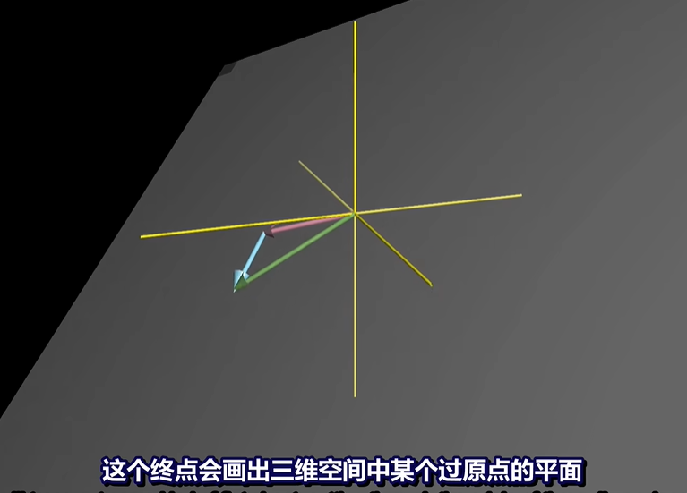

# Linear Algebra

> 线性代数

矩阵乘法

行列式

叉积

特征值

## 2. 向量

不同的人看到向量的视角：

- 物理专业
- 数学家
- 计算机专业

决定一个向量的是它的长度(Length)和它所指的方向(Direction)

在计算机专业的眼中，向量是有序的数字列表。

向量可以是任何东西，只要保证两个向量相加以及数字与向量相乘是有有意义的。

向量：

$$
\begin{bmatrix}
-2 \\
3
\end{bmatrix}
$$

表示以原点为起点，向x轴左边位移2，向Y轴上边位移3

向量的加法：将一个向量的起点与另一个向量的终点重合，该向量指向的位置就是向量加法的结果。

$$
\begin{bmatrix}
-2 \\ 
3
\end{bmatrix} + 
\begin{bmatrix}
3 \\ 
1
\end{bmatrix} = 
\begin{bmatrix}
1 \\
4
\end{bmatrix}
$$

可以将向量看作一种特定的运动，即在空间中朝着某个方向迈出一定的距离.

向量的数乘，缩放：也就是将这个标量的数和向量中的每一个坐标相乘。

## 3. 线性组合、张成的空间与基

单位向量： `i-hat` & `j-hat`

$$
\hat{i} \\ 
\hat{j} 
$$

那么一个向量的两个坐标可以看作为两个标量，将i-hat和j-hat拉伸为原来的多少倍。

缩放向量并相加: 两个经过缩放的向量的和。

i-hat和j-hat是xy坐标系的基向量。

当把坐标当作标量时，基向量实际上就是这些标量缩放的对象。每当我们用数字描述向量时，它都依赖于我们正在使用的基。

两个数乘向量的和被称为这两个向量的线性组合。

所以通过不同的组合我们会有如下几种情况：

- 如果固定其中一个标量，让另一个标量自由变化，所有产生的向量的终点会描述出一条直线。
- 如果两个标量同时自由变化，会有不同的情况出现：
  - 可能可以到达所有二维向量。
  - 当两个初始色向量共线时，所产生的向量的终点被限制在一条过原点的直线上。
  - 两个初始向量都是0向量。那么产生的向量只能在原点

所有可以表示为给定向量的线性组合的向量的集合：给定向量张成的空间 `span`

两个向量张成的空间实际上是问：仅通过向量加法和向量数乘所能获得的结果的集合。

**向量和点**

Vectors and points

看待一个向量时，当作一个箭头

看待多个向量时，当作一个点

 当一个三维空间中，给出两个初始的向量（指向不同的方向），通过这两个初始向量的线性组合我们可以得到一个过原点的平面：

当三个不同方向的初始向量时，可以通过这三个向量的自由变换得到所有的三维平面。当缩放第三个向量时，它将前两个向量张成的平面沿它的方向来回移动，从而扫过整个空间。

有多个向量，并且可以移除其中一个而不减少张成的空间。可以称这两个向量为线性相关的：linearly dependent。

如果所有向量都给张成的空间增加了新的维度，那么这些向量就是线性无关的：Linearly independent.

The basis of a vector space is a set of linearly independent vectoers that span the full space.

## 4. 矩阵与线性变换

